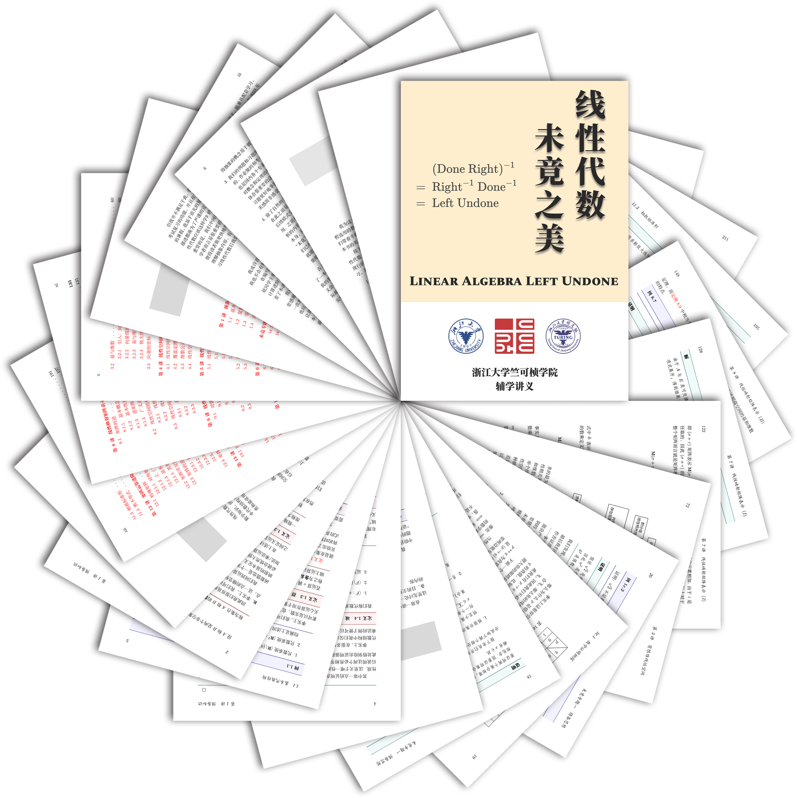

# 线性代数：未竟之美

欢迎来到竺院线性代数辅学精品课程版块 🤗。

## 课程简介

!!! note inline end ""

    { align=right }

线性代数作为很多同学大学接触的第一门数学课，一方面其重要性不言而喻，在很多专业中都是必要的预修知识，另一方面很多同学也是第一次接触如此抽象的数学内容，因此在学习线性代数时会遇到很多困难。特别是浙江大学图灵班同学两学期要面对的《大学数学：代数与几何》和《线性代数应该这样学》两本教材，第一本直接从抽象的线性空间和线性映射引入，抛弃了传统工科线性代数从行列式起步的教授方式，更能让同学了解线性代数的本质，但入门存在一些困难。而第二本教材风格则更偏向于数学专业课，整体比较抽象，以“算子”为核心，避开行列式叙述线性代数中的核心理论，其目的只是为了表明他所讲的内容和传统线性代数是统一的。

我想如果能将这两本教材学好，线性代数的基础将会是非常扎实的。但理念与实际执行有很大的偏差，并非所有同学都能在初学时完全接受抽象的教学方式。除此之外，线性代数（或高等代数）还有很多的参考资料（如丘维声老师，谢启鸿老师的高等代数，或是 Strang 老先生的线性代数，或是 3blue1brown 的线性代数的本质），但同学们如果完全投入时间到这些参考书，很容易陷入迷茫，并且与最终的考试风格也相距较远。因此我们希望有一本讲义能综合这些资料中与这两门课的学习关联的部分，优化内容安排，并安排足量的习题供同学练习，以便同学们能够更好地学习线性代数。

另一方面，线性代数是一个古老而年轻的学科。它发轫于早先对线性方程组的研究，经历了漫长的几何和代数的交错作用，最后又在近世代数的发展过程中被严格化。直到现在，一些相关的内容，例如线性代数群的研究尚且方兴未艾，在现代数学的种种支线当中也有着重要的应用。另外，它的方法论，尤其是其对代数结构的研究在现代数学中也具备着代表性。因此，我们希望呈现一个更广阔的线性代数观，从线性代数出发，对它的现代发展和它在现代数学的各个分支的应用进行一些导论性的介绍，这一方面是为了使得平淡的叙述更加有趣，另一方面也是为了回答一个疑问：线性代数到底有什么用？我们相信，这是许多初学者都有的一个问题，回答这个问题既需要对线性代数的深入学习，也需要有一个现代数学的全局观，这也就带来了本书的另一个部分，未竟专题，也是我们这本书的标题来源。

具体而言，我们的讲义目前分别两个部分：

- 其一为主线章节，我们针对浙江大学图灵班线性代数 Ⅰ 和 Ⅱ 的两本教材，希望更好地引导初学者理解抽象的思想，也力图搭建一个较为完整的线性代数学习体系。当然由于目前编写尚未完整，讲义中仍有大量的内容是与我们的参考教材紧密联系的，因此推荐阅读本讲义时结合教材进行阅读。在这一部分中，我们希望这份讲义是兼容多本教材的特色的。一方面我们希望能从更专业的视角，而非一般的工科线性代数的角度讲述线性代数，又能更加贴合同学对通过考试的需求，找寻更好的切入点介绍知识，并配套大量习题（并提供参考答案）供同学练习，同时也整理往年考试真题供读者参考。总之，我们希望这份讲义是对教材的补充，是融合了很多资料的观点的深入浅出的一份参考。

- 其二为未竟专题，我们希望以线性代数为主线，贯串现代数学的诸方向，目前涵盖分析（Hilbert 空间、线性动力系统）、几何（微分几何、微分形式）、李群和李代数、低维拓扑（扭结理论）、组合学（图论与线性代数）、范畴论等领域。这一些内容主要回答的是线性代数有什么用和从线性代数出发我们能走多远的问题，力求呈现一些看上去复杂的东西的初等形式，为读者提供更进一步的阅读资源。

## 课程讲义

=== "讲义（v0.6）"

    <embed src="./LALU_v0.6.pdf" style="width:100%; height:80vh;" type="application/pdf">     

=== "答案（v0.6）"

    <embed src="./LALU_v0.6_answer.pdf" style="width:100%; height:80vh;" type="application/pdf"> 

LALU 课程的讲义存放在下面的仓库中，你可以**点击图片**跳转到仓库页面。欢迎提出 issue 和 pull request。

点击下面的链接可以下载讲义的最新 Release 版本：

- [点击下载讲义](https://github.com/yhwu-is/Linear-Algebra-Left-Undone/releases/latest/download/LALU.pdf)
- [点击下载讲义答案](https://github.com/yhwu-is/Linear-Algebra-Left-Undone/releases/latest/download/LALU-answer.pdf)
