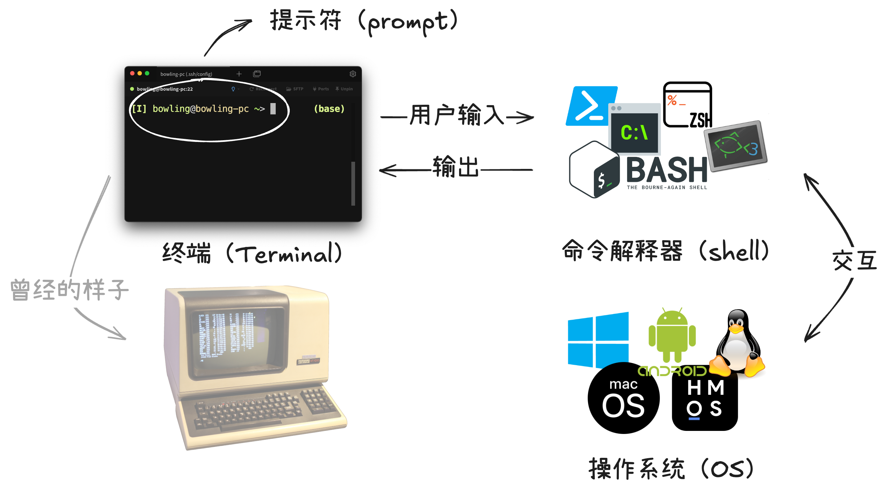
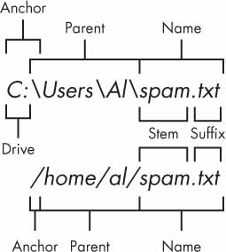
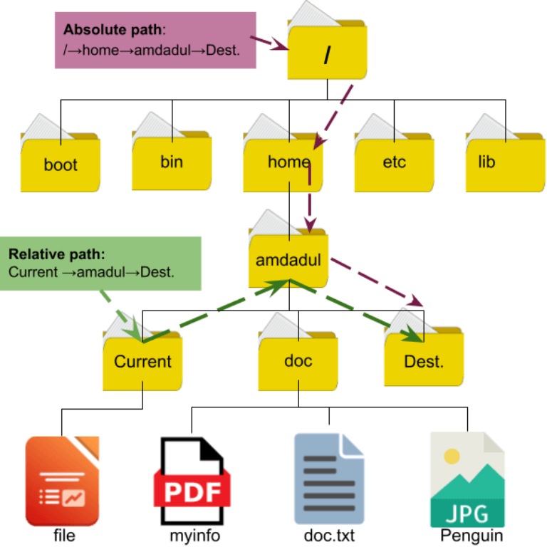

# 第二讲：通往 Pro 的第一步

!!! danger

    本文档尚未完成。

!!! tip

    本节课建议同学们携带笔记本电脑，以便实践。

## 实用技能拾遗课程前瞻

为什么要学习 Linux 和 AI 工具？更广泛地说，为什么要学习各类实用技能？

计算机是一个日新月异的学科，新的工具和技能层出不穷。这些工具和技能对于计算机学科的学习和科研有着重要的意义。

- **不学就挂**：
    - 本学期可能用不上，但下学期数据结构开始就有老师要求使用 Git 等工具，信安和图灵班的系统贯通课程更是直接以 Linux 为实验平台。如果熟悉 Linux 环境，可以少走很多弯路。
    - 以后进老师实验室打工，要登 Linux 服务器，怎么用？从大一开始打好基础，免得到研究生了还要麻烦学弟解决问题（x。
- 对于学计算机的同学来说，应该具有对自己系统的控制能力。Linux 可以锻炼你这一点。与 Windows 相比。
- 与他人合作的事实标准：大家都是 UNIX 环境，如果你不学习，FDS 怎么把别人的作业跑起来？
- 展示一下 AI 工具的方便之处：解释和生成代码、修正错误

## 初识命令行界面

接下来进入本节课的前半部分，初识命令行界面。或许同学们现在接触命令行还比较少，但如果学习计算机科学专业，你的接下来的一生或许都离不开命令行界面。

### 打开终端

当我们使用文本命令与计算机交互时，就是在使用**命令行交互界面（Command Line Interface，CLI）**。这与我们日常生活中使用的**图形交互界面（Graphical User Interface，GUI）**不同。动动手，在你的设备上打开一个终端看一看。

!!! question "动手做：在本地打开终端"

    === "Windows"
        
        按下 ++win++ 键，输入 `cmd` 或 `powershell`，回车。
    
    === "macOS"

        按下 ++command+space++，输入 `Terminal`，回车。
    
    === "Linux"

        你应该知道怎么做😉。

CLI 的几个组成部分之间的关系如下图所示：



- **终端（Terminal）**：就是现在你打开的这个窗口。它曾经的样子是一个物理设备（可以理解为显示器），现在是一个软件。
- **命令解释器（Shell）**：终端连接到命令解释器，它负责解释你输入的命令并执行，与操作系统交互。
- **命令提示符（Prompt）**：在终端中，你看到的 `$` 或者 `>` 就是命令提示符。它表示 Shell 已经准备好接受你的命令了。命令提示符也会显示当前用户、主机名、当前目录等信息。

### 连接到远程服务器

操作系统之间有显著的差别，不同 Shell 的命令语法也不同。大家今后接触最多的应该是 **Linux 系统的 Bash 命令解释器**，所以我们为大家准备了一个远程服务器，提供一个统一的环境来学习命令行。

!!! question "动手做：连接到远程服务器"

    在终端中输入以下命令，并按提示输入密码，连接到远程服务器：
    
    ```command
    ssh 你的学号@clusters.zju.edu.cn -p 16145
    ```

    初次连接时一般会出现

    ```text
    Are you sure you want to continue connecting (yes/no/[fingerprint])?
    ```

    的提示，请输入 `yes` 并o回车。

### Bash 命令语法

```bash
command [OPTIONS] arguments
```

今后当你阅读各类资料时，经常会遇见上面这种格式的语法。其中几种括号的含义如下：

- `[]`：表示可选项，可以省略。
- `<>`：表示必选项，不可省略。
- `|`：表示或，可以选择其中一个。
- `...`：表示可以重复多次。

让我们来看一看 `ls` 和 `cat` 命令🐱。

!!! example ""

    ```bash
    ls [OPTION]... [FILE]...
    ```

    `ls` 命令用于列出目录中的文件和子目录。它的名称来源于 **l**i**s**t（列出）。

    看一看当前目录下有哪些文件和目录吧。

!!! example ""

    ```bash
    cat [OPTION]... [FILE]...
    ```

    `cat` 命令用于查看文件内容。它的名称来源于 con**cat**enate（连接）。

    尝试 `cat` 的几种用法：

    - 不带参数
    - 带一个参数
    - 带两个参数
    - 带通配符

### Linux 文件路径

与大家熟悉的 Windows 不同，Linux 文件系统没有盘符的概念。你可以想象 Windows 的文件系统是一片森林，而 Linux 的文件系统是一棵树。

<figure markdown="span">
    <center>
    
    </center>
    <figcaption>Windows 与 Linux 文件路径的对比
    <br><small>图片来源：[Automate the Boring Stuff with Python](https://automatetheboringstuff.com/2e/chapter9/)</small>
    </figcaption>
</figure>

- **根目录（Root Directory）**：Linux 文件系统的根目录是 `/`，所有文件和目录都是从根目录开始的。
- **家目录（Home Directory）**：每个用户都有一个家目录，一般是 `/home/用户名`。你可以在家目录下存放个人文件和目录。**家目录可以用 `~` 表示。**

在 Linux 系统中路径有两种表示方法：

- **绝对路径**：从根目录 `/` 开始，一直到目标文件或目录的路径。
- **相对路径**：相对于当前工作目录的路径。其中 `.` 表示当前目录，`..` 表示上一级目录。

<figure markdown="span">
    <center>
    { width=50% }
    </center>
    <figcaption>绝对路径与相对路径
    <br><small>图片来源：[An Overview of Absolute Path in Linux - The Complete Guide](https://linuxsimply.com/absolute-path-in-linux/)</small>
    </figcaption>
</figure>

!!! question

    上图中，你在 `Current` 目录。写出 `Dest` 目录的相对路径和绝对路径。

让我们熟悉几个在 Linux 文件系统中常用的命令：

<div class="grid" markdown>

!!! example ""

    ```bash
    pwd
    ```

    `pwd` 命令用于显示当前工作目录的路径。它的名称来源于 **p**rint **w**orking **d**irectory（打印工作目录）。

    看一看你现在在哪个目录。

!!! example ""

    ```bash
    cd [DIRECTORY]
    ```

    `cd` 命令用于切换工作目录。它的名称来源于 **c**hange **d**irectory（改变目录）。

    尝试：

    - 不带参数
    - 带一个参数

!!! example ""

    ```bash
    mkdir [OPTION]... DIRECTORY...
    ```

    `mkdir` 命令用于创建目录。它的名称来源于 **m**a**k**e **dir**ectory（创建目录）。

    尝试创建一个目录 `hello`。

!!! example ""

    ```bash
    touch [OPTION]... FILE...
    ```

    `touch` 命令用于创建空文件。它的名称来源于触摸（touch）文件的时间戳。

    尝试在 `hello` 目录下创建一个空文件 `world`。

!!! example ""

    ```bash
    rm [OPTION]... FILE...
    ```

    `rm` 命令用于删除文件或目录。它的名称来源于 **r**e**m**ove（删除）。

    尝试删除 `world` 文件。

!!! example ""

    ```bash
    rmdir [OPTION]... DIRECTORY...
    ```

    `rmdir` 命令用于删除空目录。它的名称来源于 **r**e**m**ove **dir**ectory（删除目录）。

    尝试删除 `hello` 目录。

!!! example ""

    ```bash
    cp [OPTION]... SOURCE DEST
    ```

    `cp` 命令用于复制文件或目录。它的名称来源于 **c**o**p**y（复制）。

    尝试复制 `/public/lec2/hello.c` 文件到家目录。

</div>

### 环境变量

在命令行中输入命令时，Shell 是如何找到这个命令的呢？

1. **内建命令（Built-in Command）**：Shell 内置了一些命令，如 `cd`、`pwd` 等。
2. **别名（Alias）**：用户可以为命令设置别名，如 `alias ll='ls -l'`。
3. **环境变量（Environment Variable）**：Shell 会在环境变量 `PATH` 中列出的目录中查找命令。`PATH` 是一个包含目录路径的字符串，用冒号 `:` 分隔。

!!! note "环境变量"

    我们已经在 C 语言课上学习过变量的概念。而环境变量由操作系统维护，用于存储进程运行时所需的一些信息。程序可以使用操作系统提供的函数来访问环境变量。比如在 Linux 系统中，可以使用 `getenv` 函数获取环境变量的值。

    ```c
    #include <stdlib.h>

    char *getenv(const char *name);
    ```

    在 Bash 中，可以使用 `env` 或 `printenv` 命令查看当前环境变量。

命令解释器通常支持环境变量的替换。在 Bash 中，可以使用 `$` 符号引用环境变量的值。比如 `$HOME` 将被替换为家目录，`$PATH` 将被替换为命令搜索路径。这一替换发生在命令行被解释之前。

!!! example ""

    ```bash
    echo [OPTIONS] [STRING]
    ```

    `echo` 命令用于打印字符串。它的名称来源于回声（echo）。

    尝试：

    - 打印字符串 `helloworld`。
    - 通过替换打印环境变量 `HOME` 和 `PATH` 的值。

!!! example ""

    ```bash
    type [COMMAND]
    ```

    `type` 命令用于显示命令的类型。它会告诉你命令是内建命令、别名、还是外部命令。

    尝试查看 `ls` 和 `echo` 命令的类型。

### 使用 `gcc` 编译 C 程序

接下来终于到了和课内知识有一点关联的部分了，让我们学习如何使用 `gcc` 编译 C 程序。

### Bash 历史记录

## 使用 VSCode 和 AI 工具

我们的命令行之旅到此告一段落。现在，让我们回到熟悉的图形界面，学习如何使用 VSCode 和 AI 工具。

### 尽早放弃 Dev-C++，使用 VSCode

### 使用 VSCode 连接到远程服务器

- 安装插件：
    - Remote - SSH
    - C/C++
- 点击左下角的 `><`，选择 `Remote-SSH: Connect to Host...`。
- 输入 `ssh 你的学号@clusters.zju.edu.cn -p 16145`，按提示输入密码。
- 连接成功。点击 Open，打开自己的家目录。
- 修改程序。
- 打开命令行终端，再次编译运行 C 程序。

### 简易 Makefile

### 使用 AI 工具


