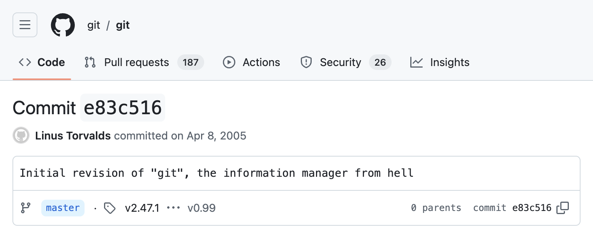
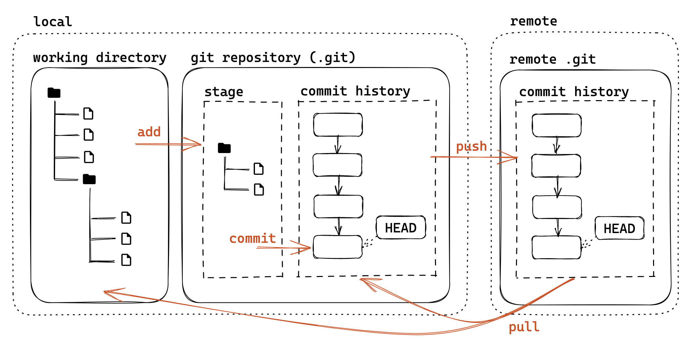
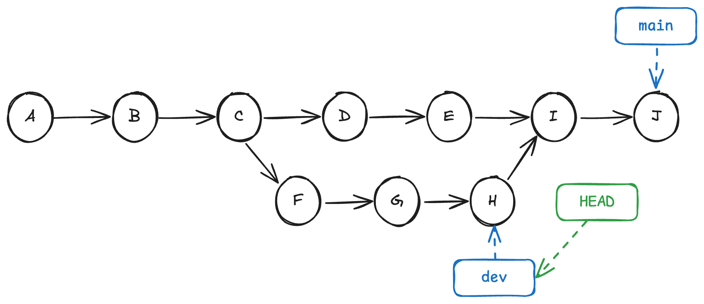
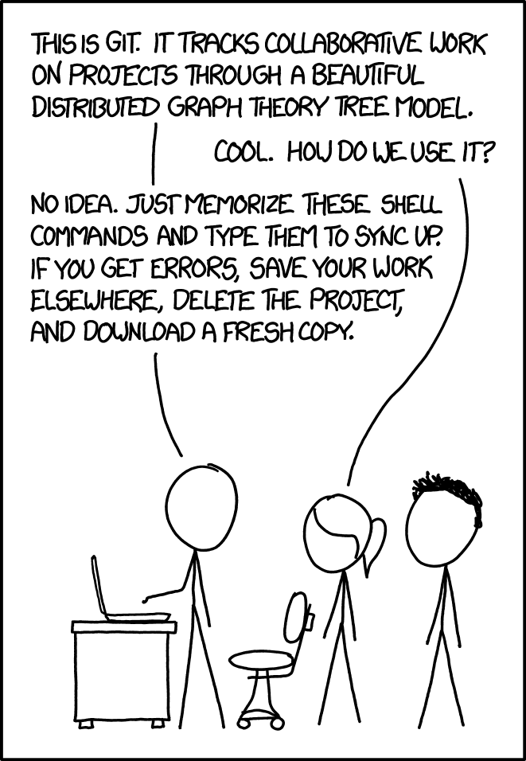
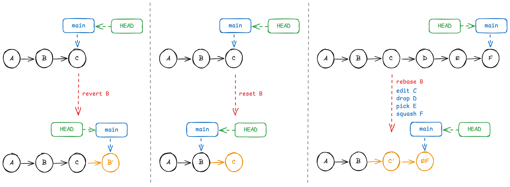
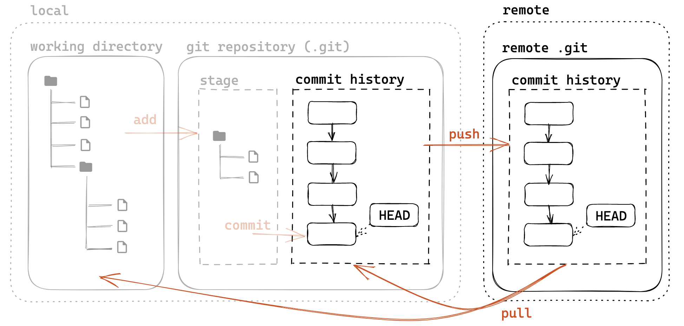

# 第三讲：开源世界生存基础

!!! danger

    本文档尚未完成。

!!! tip

    建议同学们携带笔记本电脑，并在课前按照[第 2.2 节](#git_1)在自己的电脑上安装好 Git，以便课上实践。

## What & Why

**开源**（Open Source），顾名思义，就是把源代码公开到网上，在**开源许可证**（License）的约束下，任何人都可以查看、修改、甚至是重新发布。

为了方便管理和协作，通常使用**版本控制系统**（Version Control Systems，VCSs）来管理代码，其中最流行的是 **Git**。同时，既然要把代码公开，那么就需要一个**代码托管平台**，最流行的是 [**GitHub**](https://github.com/)。考虑到国内网络环境，本节课中将以浙江大学超算队提供的 [**ZJU Git**](https://git.zju.edu.cn/) 为例。

!!! example

     - 本节课的讲义其实就是开源的，你可以在 GitHub 的 [ckc-agc/study-assist](https://github.com/ckc-agc/study-assist) 仓库中找到本课程的所有源代码。
     - 大家使用的大部分浏览器，例如 Chrome、Edge、Arc、~~360 极速浏览器~~，都是基于开源项目 Chromium 开发的。后者的源代码托管在谷歌自己的代码托管平台 Google Git 上，你可以在[这里](https://chromium.googlesource.com/chromium/src)查看 Chromium 的源代码（因为众所周知的原因你可能需要魔法才能访问）。以及[这里](https://github.com/chromium/chromium)还有它的 GitHub 镜像。
     - 著名的操作系统 Linux 也是开源的，它托管于 Linus Torvalds 的 [GitHub 仓库](https://github.com/torvalds/linux)中。

很好，开源看上去很酷，**但我为什么要学它呢？**

 - 最现实的原因：**~~你躲不掉的~~**。朱 🎳 学长在上节课提到过，早在大一下学期**《数据结构基础》**课程开始，就有老师要求使用 Git 等工具来管理你的代码。
 - 因为**确实好用**，掌握 Git 后你会觉得相见恨晚，它和其他版本控制方法相比简直是**降维打击**。
 - 因为**开源世界超好玩的～**如果某个项目你觉得有问题，你可以直接向开发者提出修改建议；如果你觉得某个项目很棒，你可以直接参与进去。这种**自由**和**开放**的氛围是无法比拟的，~~你甚至可以~~[~~在 GitHub 上吃瓜~~](https://github.com/torvalds/linux/pull/988)。
  
很棒！那我们开始吧！

## Git: 最优秀的版本控制工具

你是否遇到过这样的情景？

<center>
{ width=50% }
</center>

更进一步，当你高高兴兴地写完了报告，刚把各种备份文件删除，回收站清空，然后导师突发奇想，**告诉你他觉得以前的版本更好**，叫你回退以前的版本，这时你的心情是什么样的？

Git 就是为了解决这种问题而生的。通过高效的数据结构，它可以帮你**记录文件的自创建以来的每一个版本**，甚至允许你**在不同版本之间自由切换**。

!!! example "远古时期的 Linux 代码"

    你甚至可以找到 Linux 内核在 GitHub 上的[**第一次提交**](https://github.com/torvalds/linux/commit/1da177e4c)！（实际上，因为年代过于久远，这个提交在 GitHub 提交列表上是隐藏的，感兴趣的同学可以自己试试看看能不能把它找出来😉）

    <figure markdown="span">
        <center>
        
        </center>
        <figcaption>梦开始的地方
        </figcaption>
    </figure>

### 历史

Linus Torvalds 在开发 Linux 内核时，原本使用的版本管理系统叫 BitKeeper。但是由于当时 BitKeeper 的免费版本加入了限制，他决定开发一款**自由**、**免费**的版本管理系统，顺带**解决一下历代 VCS 的缺陷**，于是 Git 诞生了。

 - 2005 年 4 月 8 日，[Git 实现**自托管**](https://github.com/git/git/commit/e83c51633)。

    <figure markdown="span">
        <center>
        
        </center>
        <figcaption>梦开始的地方开始的地方
        </figcaption>
    </figure>

 - 10 天后，Linux 内核的开发就转向了 Git。（Fig. 梦开始的地方）

### Git 安装及配置

 - **Linux / macOS**：大部分 Linux 发行版和 macOS 都自带 Git。如果没有，可以通过包管理器直接安装：`apt install git` / `brew install git` / ...
 - **Windows**：访问 [git-scm.com/downloads/win](https://git-scm.com/downloads/win)，下载 64 位版本（64-bit Git for Windows Setup），以默认选项安装即可。

打开终端，输入 `git --version`，如果正常输出版本号，则说明安装成功。

接下来，我们需要配置 Git 的一些基本信息，例如用户名和邮箱。

```bash
git config --global user.name "<你的用户名>"
git config --global user.email "<你的邮箱>"
```

### Git 的数据模型

从 Git 的交互指令出发很容易让人听得一头雾水，所以我们从底层出发，自下而上地学习 Git。

<figure markdown="span">
    <center>
    
    </center>
    <figcaption>
    <small>图片来源：[TonyCrane 的讲义](https://slides.tonycrane.cc/PracticalSkillsTutorial/2023-fall-ckc/lec2/#/1/3)</small>
    </figcaption>
</figure>

Git 启动时，会在当前目录下创建一个名为 `.git` 的**隐藏文件夹**，这个文件夹就是 Git 的**版本库**（Repository）。

版本库中，保存着所有文件的**历史**（History），以及一个叫**暂存区**（Stage）的东西。

#### 快照

为了记录文件的历史，Git 会给每一个版本创建一个**快照**（Snapshot，又称 Commit、**提交**），不同的快照之间通过一种叫做**有向无环图**（Directed Acyclic Graph，DAG）的数据结构（大家会在大一下《数据结构基础》的课程中学到）联系起来。

<figure markdown="span">
    <center>
    
    </center>
    <figcaption>一种可能的历史<br>
    <small>若未特殊说明，本讲义中手绘风格示意图均为原创，转载请注明出处</small>
    </figcaption>
</figure>

在上面的例子中，历史在 C 快照处产生了两个**分支**（Branch），并在 I 快照处**合并**（Merge）。这种分支和合并的操作是 Git 的强大之处，我们会在后面详细讲解。

在 Git 中，每一个快照都由一个**十六进制数**唯一标识，它相当于快照的 ID。通常只需要前几位就可以唯一确定一个快照，例如之前图片中的 `1da177e`。但很显然，这种十六进制数不适合人类记忆。因此 Git 允许给快照创建**引用**（Reference），它是一个指向快照的**指针**，例如人们通常使用 `master`、`main` 等名字来表示最新的快照。

Git 有一个特殊的指针叫做 **`HEAD`**，它指向**当前所在的分支或者快照**，也就是当前正在工作的版本。

<figure markdown="span">
    <center>
    
    </center>
    <figcaption>指向快照的指针
    </figcaption>
</figure>

通过这种方式，你可以很方便地**在不同快照之间切换**。

#### 暂存区

你可能会想象，每次提交都会对当前***工作目录***（Working Directory）打一个快照，然后保存到版本库中，但实际上并非如此。

设想这样一个场景：你同时修改了两个文件，但只想提交其中一个，这时候就需要一个**中间状态**来保存你的修改。这个中间状态就是所谓的**暂存区**。

<figure markdown="span">
    <center>
    
    </center>
    <figcaption>
    <small>图片来源：[TonyCrane 的讲义](https://slides.tonycrane.cc/PracticalSkillsTutorial/2023-fall-ckc/lec2/#/2/1)</small>
    </figcaption>
</figure>

### 基础用法

Let's get our hands dirty!

<figure markdown="span">
    <center>
    { width=40% }
    </center>
    <figcaption>
    <small>图片来源：[XKCD GIT](https://xkcd.com/1597/)</small>
    </figcaption>
</figure>

#### 初始化版本库

!!! tip "快速回顾"

    在 Linux / macOS 系统中，你可以使用 `ls` 命令查看当前目录下的文件和文件夹，使用 `cd` 命令切换目录。

    对于 Windows 系统，这里推荐大家使用系统自带的 **Windows Terminal** 进行实验，其运行的默认终端是 Powershell，使用习惯更接近 Linux（相较于 cmd 而言）。

     - 按下 ++win+r++，输入 `wt`，回车即可打开 Windows Terminal。
     - Linux 系统中查看当前目录隐藏文件的命令是 `ls -a`，在 Powershell 中是 `ls -Hidden`（简写 `ls -h`）。

要使用 Git，首先需要创建一个 Git 版本库，这个过程是通过 `git init` 命令完成的。

!!! question "动手做：初始化版本库"

    在自己的电脑上打开终端，创建一个新的文件夹（`mkdir` 命令），然后进入这个文件夹（`cd` 命令），并使用 **`git init`** 初始化一个 Git 版本库。

    ```bash
    mkdir my-repo
    cd my-repo
    git init
    ```

    尝试使用 `ls` 命令查看当前目录的内容，能找到 `.git` 文件夹吗？为什么？

#### 年轻人的第一个 Commit！

现在我们已经有了一个空的 Git 版本库，接下来我们尝试往里面添加一些文件。

!!! question "动手做：一些准备工作"

    用 VSCode 打开这个文件夹，创建一个 `hello.c` 文件，内容如下：

    ```c
    #include <stdio.h>

    int main() {
        printf("Hello World");
        return 0;
    }
    ```

    这是一个简单的 Hello World 程序，实际使用中的场景可能是你的实验报告、项目代码等，这里只是为了演示。

现在的工作目录中有了一个 `hello.c` 文件，我们可以使用 `git status` 命令查看当前版本库的状态。

<div class="grid" markdown>

!!! note ""

    ```bash
    git status
    ```

    查看**当前工作区和暂存库的状态**。
    
    文件有三个类别：**未跟踪**（Untracked）、**已追踪**（Tracked）、**被忽略**（Ignored）。

!!! question "动手做 2.4.1"

    运行 `git status` 命令，你看到了什么？你能够解释这些信息吗？

!!! note ""

    ```bash
    git add <FILE>
    ```

    将所选的文件或文件夹**添加到暂存区**。

!!! question "动手做 2.4.2"

    把 `hello.c` 添加到暂存区。这个时候再次运行 `git status`，看看有什么变化。

    **思考**：如果我想一次性添加多个文件，或者说添加所有文件，应该怎么做呢？

!!! note ""

    ```bash
    git commit -m "<MESSAGE>"
    ```

    将暂存区的文件**提交到版本库**，`-m` 参数后面是提交的信息，用于描述这次提交的内容。

    ```bash
    git log
    ```

    查看**版本库的历史**。

!!! question "动手做 2.4.3"

    提交 `hello.c` 文件到版本库，提交信息可以是任意的，例如 `Add hello.c`。

    ```bash
    git commit -m "Add hello.c"
    ```

    试一试 `git log` 命令，你能解释这些信息吗？

</div>

🎉 恭喜你完成了自己的第一个 Commit！下面让我们多添加一些文件。

!!! question "动手做：年轻人的第 i 个 Commit（i = 2, 3, ...）"

    一个优秀的项目只有代码怎么行？让我们添加一个介绍文档吧！创建 `README.txt`，内容如下：

    ```plaintext
    hello.c：一个简单的 Hello World 程序（真的很简单！）。
    ```

    然后提交这个文件。再次运行 `git log`，你看到了什么？

    试着**修改**、**创建**、**删除**，看看 `git status`，用 `git diff` 查看**当前工作区和暂存区的差异**，然后提交这些修改。

除此之外，还有一些其他常用的命令：

 - `git rm`：同时删除**本地**和**版本库**中的文件。（等价于 `rm` + `git add`）
 - `git rm --cached`：将一个已暂存的文件**取消暂存**。
 - `git mv`：**重命名**文件。（等价于 `mv` + `git rm` + `git add`）
 - `git log` 的一些参数：
     - `--oneline`：在**一行**中显示。
     - `--graph`：显示**分支结构**。
     - `--stat`：显示文件的**删改信息**。
     - `--all`：显示**所有分支**的历史。（默认只显示当前分支）
     - 参数可以组合使用，例如 `git log --all --graph --oneline`。
 - `git diff <A> <B>`：**比较两个快照**之间的差异，`<A>` 和 `<B>` 可以是 Commit ID、ID 简写、引用、`HEAD`、文件名等。
 - `git show <COMMIT>`：查看**某次提交的详细信息**，`<COMMIT>` 同上。
 - `git revert <COMMIT>`：创建一个新的提交，**撤销**某次提交的修改。

!!! question "动手做：玩一玩"

    试着使用上面提到的命令，玩一玩 Git 吧！如果有什么问题，欢迎随时提问。

#### 分支

**分支**（Branch）是一个非常重要的概念。它允许你在不影响主线的情况下进行开发，然后再将你的工作合并到主线上。

 - **创建分支**
     - `git branch <BRANCH>`：基于当前的 `HEAD`。
     - `git branch <BRANCH> <COMMIT>`：基于某个快照。
 - **查看分支**
     - `git branch`：查看本地分支。
     - `git show-branch`（更加详细）
 - **切换分支**（**检出**）
     - `git checkout <BRANCH>`：切换到某个分支。    
     - `git checkout -b <BRANCH>`：创建并切换到某个分支。
 - **删除分支**
     - `git branch -d <BRANCH>`：删除本地分支。

!!! question "动手做：分支"

    假如说我想给我们的 `hello.c` 添加一个函数，但是由于这个函数很复杂，可能会断断续续修改很长时间，所以我不想影响到主线的开发。这时候就可以创建一个新的分支，然后在这个分支上与主线**平行开发**。

    试着创建一个 `dev` 分支，切换进去，然后在 `hello.c` 中添加一个 `print_hello()` 函数：

    ```c
    void print_hello() {
        printf("Hello from dev branch!");
    }
    ```

    然后提交这个修改。再运行 `git log`（你可以同时试一试它的各种参数），你看到了什么？在脑海里想一想当前的分支结构。

    切换回主分支（`master` 或者 `main`），`hello.c` 里面有这个函数吗？为什么？

??? note "Answer"

    

#### Detached HEAD 问题

所谓 **Detached HEAD**，指的是 `HEAD` 指向的不是一个分支，而是一个**具体的快照**。

如果在这种情况下进行修改并提交，新的提交**不属于任何分支**，它只能通过 Commit ID 来访问，相当于**丢失**了。

<figure markdown="span">
    <center>
    
    </center>
    <figcaption>
    <small>图片来源：[TonyCrane 的讲义](https://slides.tonycrane.cc/PracticalSkillsTutorial/2023-fall-ckc/lec2/#/2/6)</small>
    </figcaption>
</figure>

!!! example "演示：Detached HEAD"

    使用 `git log` 查看历史，找到一个 Commit ID，然后使用 `git checkout <ID>` 切换到这个快照，你看到了什么？

    试着修改这个快照，提交，然后使用 `checkout` 回到主分支，你还能找到这个修改吗？

    如果我想保留这个修改，应该怎么做？

#### 合并

```bash
git merge <BRANCH1> [<BRANCH2> ...] -m "<MESSAGE>"
```

将一个或多个分支合并到**当前**分支。合并本身也是一次提交，`-m` 参数后面是提交信息。

 - **Already up-to-date**：当前分支只比要合并的分支**新**，不需要合并。
 - **Fast-forward**：要合并的分支只比当前分支**新**，只需要挪动指针即可，不需要新的提交。
 - 如果都有新的提交，Git 会尝试自动合并，如果有**冲突**（Merge Conflict），需要手动解决（解决冲突后需要再次 `add` + `commit`）。

<figure markdown="span">
    <center>
    
    </center>
    <figcaption>
    <small>图片来源：[TonyCrane 的讲义](https://slides.tonycrane.cc/PracticalSkillsTutorial/2023-fall-ckc/lec2/#/2/9)</small>
    </figcaption>
</figure>

!!! question "动手做：合并冲突"

    在主分支的 `hello.c` 中也添加一个 `print_hello()` 函数（真实情况下，可能是你在 `dev` 和 `main` 中同时修改了某个配置文件，或者两个人不经意间同时修改了同一个文件）：

    ```c
    void print_hello() {
        printf("Hello from main branch!");
    }
    ```

    提交这个修改，然后尝试合并 `dev` 分支。你成功了吗？如果没有，你应该怎么做？

    试着解决这个冲突，然后提交 merge。

实际上，Merge 还有很多其他的策略。

 - **Squash Merge**：将多个 Commit 合并为一个。
 - **Rebase**：**变基**，将当前分支的历史平移到目标分支，可以使得历史更加**线性**。（会篡改历史，不推荐多人协作时使用）
 - **GitHub Rebase**，GitHub 提供的一种 Rebase 方式，将目标分支在当前分支上重放。

<figure markdown="span">
    <center>
    
    </center>
    <figcaption>
    <small>图片来源：[TonyCrane 的讲义](https://slides.tonycrane.cc/PracticalSkillsTutorial/2023-fall-ckc/lec2/#/2/10)</small>
    </figcaption>
</figure>

#### 篡改历史

~~成为历史的罪人~~

Git 的历史一般**不可修改**，但还是有一些修改历史的方法：

 - `git commit --amend`：修改**最新**的提交 message。
 - `git reset <COMMIT>`：**回退**到某个快照。（你可能更应该使用更加温和的 `git revert`）
 - `git rebase -i <COMMIT>`：交互式 Rebase，功能非常强大，**不到万不得已不要使用！**



### 在 VSCode 中使用 Git

[Visual Studio Code](https://code.visualstudio.com/) 默认集成了 Git，点击左侧**源代码管理**（Source Control）按钮即可打开图形化的 Git 界面。

!!! question "动手做：玩一玩"

    用 VSCode 打开看看你刚刚创建的 Git 项目吧～

### .gitignore 文件

在实际开发中，有一些文件是**不需要**纳入版本库的，例如编译生成的文件、日志文件、缓存文件等。这时候就需要在根目录下创建一个 `.gitignore` 文件。

`.gitignore` 文件是一个文本文件，每一行是一个**匹配规则**，例如：

```
# Logs
logs
*.log
npm-debug.log*
yarn-debug.log*
yarn-error.log*
pnpm-debug.log*
lerna-debug.log*

node_modules
.DS_Store
dist
dist-ssr
coverage
*.local
cache

/cypress/videos/
/cypress/screenshots/

# Editor directories and files
.vscode/*
!.vscode/extensions.json
.idea
*.suo
*.ntvs*
*.njsproj
*.sln
*.sw?

*.tsbuildinfo
.vercel
```

语法：

 - `#` 开头的行是**注释**。
 - `*` 代表**通配符**，匹配多个字符。例如 `*.c` 匹配所有 `.c` 结尾的文件。
 - `**` 通配多个目录。例如 `a/**/b` 匹配 `a/b`、`a/x/b`、`a/x/y/b` 等。
 - `/` 开头只匹配**根目录**，否则匹配**任意目录**。
 - `!` 开头是**取消忽略**。

官方文档：[git-scm.com/docs/gitignore](https://git-scm.com/docs/gitignore)，GitHub 也提供了一个[模板](https://github.com/github/gitignore)。

## GitHub / ZJU Git 基础

设想多人协作的场景，每个人都有自己的版本库，那如何实现**同步**呢？

答案是每个人都使用一个“权威”的**远程版本库**（Remote Repository）。

### 远程版本库

<figure markdown="span">
    <center>
    
    </center>
    <figcaption>
    <small>图片来源：[TonyCrane 的讲义](https://slides.tonycrane.cc/PracticalSkillsTutorial/2023-fall-ckc/lec2/#/3/1)</small>
    </figcaption>
</figure>

远程版本库也是一个普通的 Git 版本库，只不过由于不需要工作目录和暂存区，所以一般使用**裸版本库**。

 - `git clone <SRC> <DEST>`：**克隆**一个远程版本库到本地，会自动添加一个名为 `origin` 的远程版本库，可以通过 `git remote` 管理。
 - `git push`：将本地的提交**推送**到远程版本库。
 - `git pull`：将远程版本库的提交**拉取**到本地，等价于 `git fetch` + `git merge`。

### GitHub 简介

### ZJU Git

### Git 远程操作

## 开源项目基础

### 什么是开源

### 许可证

### 开源协作
