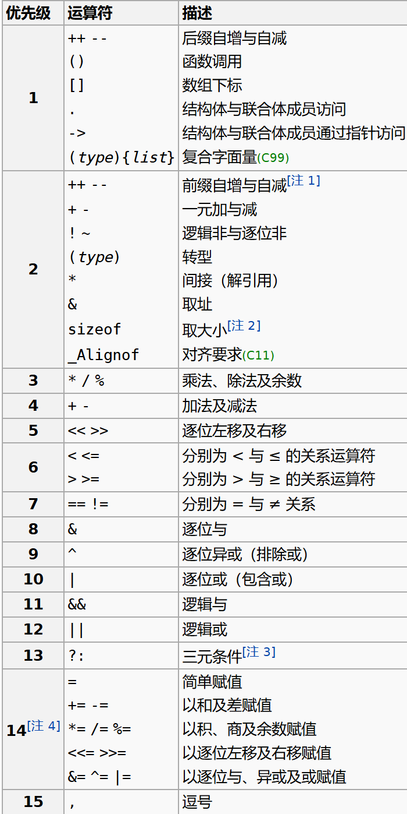

# 第五讲：期末复习（上）

## 变量与计算

### 变量
```c
类型名 变量名;
int x;
```
- 类型名:`long int`与`long`等价,`short int`与`short`等价,`unsigned int`与`unsigned`等价,**没有**`string`,`bool`

- 变量名是一种**标识符**,标识符的命名规则是:由字母、数字和下划线、**美元符号**组成,且**不能以数字开头**,**区分大小写**,不能使用**关键字**

关键字如下:


例1.1-1:
Which one below is NOT a valid identifier in the C programming language?
A. printf
B. _m$
C. 114514
D. define

未初始化的变量的值是**不确定**的

### 数据类型和字面量
#### 数据类型
不同的数据类型占据不同的大小,有不同的取值范围
```C
unsigned short sht = 0;
sht--;
```

例1.2-1: 0.1 + 0.2 == 0.3 ?

```C
int n=1;
char ch='\012'; 
printf("%d", ch*n++);
// printf("%d", ch*++n);
```

`sizeof`可以获得某个类型或变量在内存中所占据的字节数,它的结果在编译时刻就决定了,是一个**运算符**而不是函数

```C
int a = 1;
printf("%d\n", sizeof(a++));
printf("%d\n", a);
```

#### 字面量
字面量即一个值的**表示方法**,同一个值可能有很多种表示方法

```C
char a = 65;        // 十进制
char b = 0101;      // 0开头表示八进制
char c = 0x41;      // 0x开头表示十六进制

char d = 'A';       // 单引号,字符常量

char e = '\101';    // 单引号里面反斜杠转义最多三个数字,表示八进制,遇到0-7之外的就会结束
char e0 = '\08';    // 错误,这是两个字符放到了一个单引号里

char f = '\x41';    // 十六进制,没有长度限制,遇到非十六进制字符就会结束
char f0 = '\x00041';// 和上面的是一样的
```

### 计算

带运算符的式子是表达式,表达式有值和副作用

#### 运算符
`% & <<` 运算符不能用在 `double` 上

运算顺序问题,简单来说:赋值运算符和位运算符较低,略高的是算术运算,再高的是自增/减


例1.3-1:
若定义 `int a=1,b=2,c=3,d=4` 那么表达式 `(a>b?c>a?c-3:c-1:b==c?d-a:d-c)` 的值为

#### 表达式的结果
例1.3-2: 
表达式 `(3<x<5)` 的值恒为`1`?
表达式 `(1<=n<=10)`能正确地表示`n`属于`[1, 10]`?
表达式 `(3==x==3)` 的值恒为`0`?
表达式 `(x=4,y=3)`的值恒为`3`?

## 分支和循环

### 分支
`else`总是与最近的一个没有被匹配的`if`配对

```C
if (x > -2){
    if (x > 0) {
        // do something
        if (x > 2){
            // do something
        }
    } else{
        // do something
        else {
            // do something
        }
    }
}
```

分支语句如包括有一个以上的语句,则必须用一对大括号`{}`括起来,组成复合语句,复合语句在语法上被认为是一条语句

`if`语句执行的时候会先执行`()`里的表达式,如果该表达式的值非零,则执行`{}`里的语句

```C
int x = 10;
if (x--) {
    printf("x is %d\n", x);
}
```

设计测试用例来验证分支语句的正确性

```C
if (x < 0) {
    y = 0;
} else if (x <= 15) {
    y = 4 * x / 3;
} else { 
    y = 2.5 * x - 10.5;
}   
```

对于`switch`语句,`case` 只规定了起点,而何时退出 `switch` 块则由 `break` 决定,只要没有遇到 `break`,则一直向下执行(即使碰到了下一个 `case`且不满足)

```C
int i, b; i = b = 1;
switch (i) {
    case 0: b += 1;
    case 1: b += 2;
    case '1': b += 3;
    case 2 : switch (b) {
        case 1: b += 4;
        case 3: i++;
        default: break;
    }
    i += 1;
}
printf("%d#%d#", i, b);
```

### 循环
循环体如包括有一个以上的语句,则必须用一对大括号`{}`括起来,组成复合语句,复合语句在语法上被认为是一条语句。

```C
int a,i;
for (a=1,i=-1;-1<=i<1;i++) {
    a++;
    printf("%2d", a);
}
printf("%2d", i);
```

## 数组
数组的定义
```C
类型名 数组名[数组长度];
int a[10];
```

数组的初始化
```C
类型名 数组名[数组长度(可省略)] = {元素1, 元素2, ...};
int a[5] = {1, 2, 3, 4, 5};
int b[ ] = {1, 2, 3, 4, 5};
int c[5] = {1, 2, 3}; // 其余元素为0
```

**元素类型为数组**的数组被称为**高维数组**

```C
int a[][];

int b[3][];

int c[][4];

int d[3][4];

int e[][] = {
    {1, 2, 3, 4},
    {5, 6, 7, 8},
    {9, 10, 11, 12}
};

int f[][4] = {
    {1, 2, 3, 4},
    {5, 6, 7, 8},
    {9, 10, 11, 12}
};
```

## 函数
- 类型:决定函数的**返回值**。若对函数类型未加显式说明,则函数的隐含类型为`int`
例4-1:
C语言中,通过函数调用只能获得一个返回值?

- 函数名:用于标识函数
例4-2:
函数可以嵌套调用但不能嵌套定义?

- 参数表:用逗号分隔的参数类型和参数名,声明时参数名可以省略

例4-3:
若函数调用时的实参为变量,下列关于函数形参和实参的叙述中正确的是()。
A.函数的实参和其对应的形参共占同一存储单元
B.形参只是形式上的存在, 不占用具体存储单元
C.同名的实参和形参占同一存储单元
D.函数的形参和实参分别占用不同的存储单元

```C
#include <stdio.h>

int x = 5, y = 7;
void swap(int,int); // 函数声明
int main() {
    int x = 3, y = 8;
    swap(x,y);
    printf("%d,%d\n", x, y);

    return 0 ;
}

void swap(int x,int y) { // 函数定义
    int temp = x;
    x = y;
    y = temp;
}
```

例4-4:
函数调用语句`function((a,b),c)`中含有的实参个数为?

## 排序
|算法|平均时间复杂度|最好情况|最坏情况|稳定性|
|:--:|:--:|:--:|:--:|:--:|
|冒泡排序|O(n^2)|O(n)|O(n^2)|稳定|
|选择排序|O(n^2)|O(n^2)|O(n^2)|不稳定|
|插入排序|O(n^2)|O(n)|O(n^2)|稳定|

## 指针

### 定义
指针变量的值是变量的地址,指针变量本身也有自己的内存地址

```C
int a = 1;
int *p = &a; // &是取地址运算符
```

指针变量`p`的值是`a`的地址,`*p`表示`p`指向的变量,即`a`,`*p`的值是`a`的值,即`1`

声明中 `*` 只对**直接结合的标识符**生效

例6.1-1:
变量定义:`int *p, q;`中,`p`和`q`都是指针?

**指针允许指向一个不完整类型**:

```C
int *a[3];  // a是一个数组,数组元素是指针
int (*b)[3];// b是一个指针,指向一个数组,数组元素是int,数组长度为3
int *c[];   // ?
int (*d)[]; // d是一个指针,指向一个长度未知的数组,数组元素是int
```
例6.1-2:
Among the following statements, __  is equivalent to the declaration: `int *p[4];`
A.`int  p[4];`
B.`int  **p;`
C.`int  *(p[4]);`
D.`int  (*p)[4];`

`void *`是合法的指针类型,指向一个类型未知的对象,可被隐式转换为任意其他类型的指针

### 用法

#### 指针的运算
- 指针与整数可以加减,`p+n`的值是`p`的值加上`n`乘以**指针所指向的类型的字节数**,同样地,指针的**减法结果并不是地址的差值**

```C
int a[] = {1, 2, 3, 4, 5};
int *p = a, *q = &a[2];
printf("%lu", q-p);
printf("%d", (int)q - (int)p);
```
- 指针与整数之间不可相互转换、比较,`0`除外,可以直接把`0`赋给指针,此时`0`被视为空指针`NULL`

- 互相兼容的指针之间可以赋值、比较、加减

```C
int a = 1;
int b = 2;
int *p = &a;
printf("%x\n", p);
printf("%x\n", (p + 4));
printf("%d\n", *p);
printf("%d\n", *(p + 4)); // 64位机器
*(p + 4) = 0xdeadc0de;
printf("%d#%d", a, b);
```

#### 指针与数组
指针和数组关系紧密:
- 数组在很多情况下会进行到指针的**隐式转换**
- `p[n]`和`*(p+n)`是**完全等价**的(你甚至可以写`1[a]`来访问数组的第一个元素)

例6.2-1:
Given the declaration: `int a[3][3]={1,2,3,4,5,6,7,8,9};`, the value of `a[-1][5]` is ?

例6.2-2:
Given the declaration: `int a[3][2]={1,2,3,4,5,6};` what is the value of expression `(a[1]+1)[0]`?


隐式转换:C语言规定任何数组类型的左值表达式,当用于异于

- 作为取地址运算符的操作数
- 作为 `sizeof` 的操作数
- 作为用于数组初始化的字符串字面量

的语境时,会经历到指向其**首元素的指针**的隐式转换,典型场景:

1. 作为函数的参数时,数组名被转换成指向其首元素的指针
2. 更改数组元素时

例6.2-3:
According to the declaration: `int p[5], *a[5];` the expression ______ is correct.
A.`p=a`
B.`p[0]=a`
C.`*(a+1)=p`
D.`a[0]=2`

二维数组不能隐式转换为二级指针

例6.2-4:
For the function declaration `void f(char** p)`,the definition __ of var makes the function call `f(var)` incorrect。
A.`char var[10][10];`
B.`char *var[10];`
C.`void *var = NULL;`
D.`char *v=NULL, **var=&v;`
E.`char var[10][10], **p=var;`

#### 指针与字符串
字符串常量在内存中是连续存储的,字符串常量在内存中的存储形式是字符数组的形式,字符串常量在内存中是连续存储的,字符串常量在内存中的存储形式是字符数组的形式

```C
char *p = "hello";
char a[] = "hello";
char b[] = {'h', 'e', 'l', 'l', 'o', '\0'};
```
