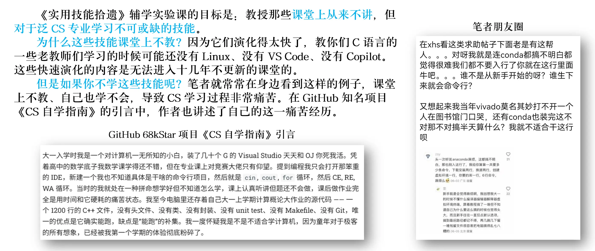
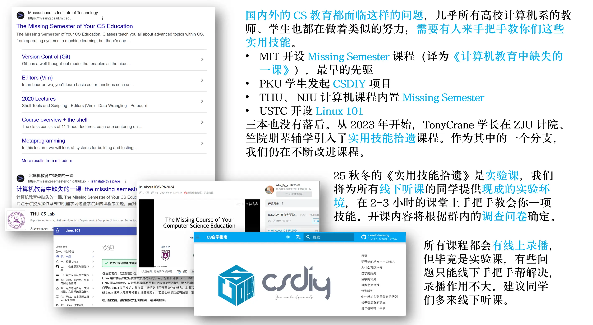
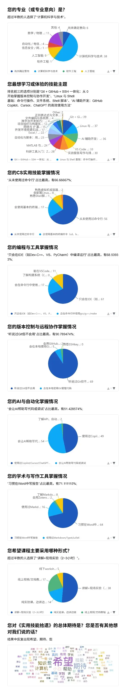

# 25 秋冬 程序设计辅学

欢迎来到 25 秋冬程设辅学课程页面！本学期竺院程设辅学分为分为《课内复习课》 （期中、期末上/下）和《实用技能拾遗》两个系列，课表如下：

| 时间 | 地点 | 课程内容 | 授课人 | 回放链接 |
|------|----------|----------|----------|----------|
| 秋六周 10 月 25 日 10:00-12:00 | 北 3-210 | 初识命令行与 VSCode | 混合 2205 朱宝林 | [Bilibili](https://www.bilibili.com/video/BV1Ess6zREuG/) |
| 秋七周 11 月 1 日 14:00-16:00 | 北 1-216 | 期中复习 | 混合 2401 何广一 | [Bilibili](https://www.bilibili.com/video/BV1qA2uBNErW) |
| 冬一周 11 月 16 日 14:00-16:30 | 北 1-303 | Git + GitHub + SSH 一体化：从 0 开始掌握版本控制与协作开发 | 图灵 2303 李文耀 |  |
| 冬三周 11 月 29 日 14:00-16:00 | 北 1-216 | MATLAB 与科学计算入门：基础语法、绘图、矩阵计算              | 混合 2408 王睿   | |
| 冬四周 12 月 7 日 14:00-16:00 | 钉钉直播 | 网络基础知识与配置：IP、DNS、HTTP 等 | 图灵 2201 李英琦 | [Bilibili](https://www.bilibili.com/video/BV1LJmcBLE96) |
| 冬五周 12 月 14 日 | 北 3-317 | 科研文献管理、实验报告写作与排版：Markdown、LaTeX、Typst、Zotero | 图灵 2401 王赞赫 | [Bilibili](https://www.bilibili.com/video/BV1eZmkB8E8c) |
| 冬六周 12 月 20 日 | 钉钉直播 | 期末复习（上） | 混合 2402 鲁亦智 | [Bilibili](https://www.bilibili.com/video/BV184vCB4Eti) |
| 冬七周 12 月 27 日 | 北 1-216 | 期末复习（下） | 混合 2404 杨景雅 | [Bilibili](https://www.bilibili.com/video/BV1NqBrBXE4L) |

《实用技能拾遗》课程介绍见下：

课前问卷的调查结果如下：

