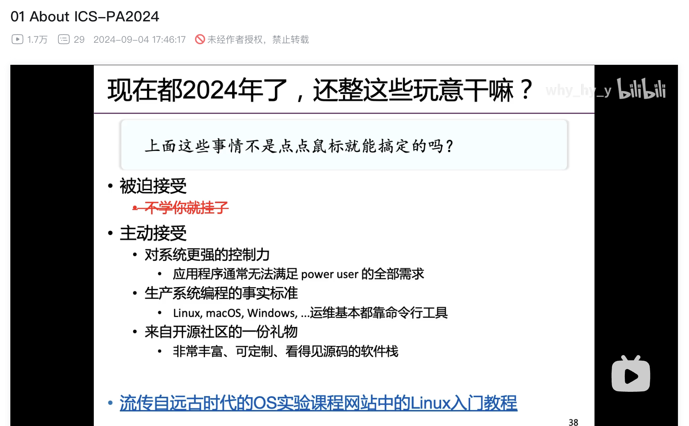

# Linux 与 Shell 基础和 VS Code 实战

- 时间：秋六周 10 月 25 日 10:00-12:00
- 地点：北 3-210
- 授课人：混合 2205 朱宝林
- 难度：基础，面向未使用过命令行、VSCode 等工具的同学

## 实验环境

请听课同学携带笔记本电脑，并在课前完成以下任务：

- 提前安装好 [Visual Studio Code](https://code.visualstudio.com/)。
- 打开命令行，输入 `ssh -V`，能看到版本号输出。

    - Windows：按 ++win+r++，输入 `cmd` 或 `powershell`，回车打开终端。示例：

        ```console
        C:\Users\user>ssh -V
        OpenSSH_for_Windows_9.5p2, LibreSSL 3.8.2
        ```

    - macOS：按 ++command+space++，输入 `Terminal`，回车打开终端。示例：

        ```console
        user@MacBook-Pro ~ % ssh -V
        OpenSSH_10.0p2, LibreSSL 3.3.6
        ```

    - Linux：{--（Linux 用户不需要上本次课）--}打开终端，输入 `ssh -V`。示例：

        ```console
        user@linux:~$ ssh -V
        OpenSSH_10.0p2 Debian-7, OpenSSL 3.5.1 1 Jul 2025
        ```

## Part 1：为什么要学习实用技能？

为什么程序设计辅学不严格按照课内内容，而是扩展学习课外的命令行和 AI 工具？为什么要学习各类实用技能？我想，用下面这句话来回答这个问题最为合适：

!!! quote ""

    <center style="font-size: 1.5em;">
        工欲善其事，必先利其器。
    </center>

对于数学、物理等学科来说，纸笔就是工具，同学们都能用得很好。而对于计算机，如果只使用纸笔，那就只能做计算机**科学**，做不了计算机**技术**，但这两者又紧密关联。计算机软硬件对大部分同学来说**相对陌生**，而且**没有专门的课程**来教授这些知识。缺乏实用技能已经成为太多计算机系学生在学习、工作和科研路上的绊脚石。我们希望通过《实用技能拾遗》辅学课程，**让更多同学在刚开始接触计算机专业时就掌握这些技能，这将为你们之后的学习和科研打下坚实的基础**。

- **不学就挂**：事实上你很快就会开始运用这些实用技能。大一下学期**《数据结构基础》**开始就有老师要求使用 Git 等工具，信安和图灵班的**计算机系统贯通课程**更是直接以 Linux 为实验平台。

    <figure markdown="span">
        <center>
        
        </center>
        <figcaption>南京大学计算机实验课
        </figcaption>
    </figure>

- **与他人合作的事实标准**：你会看到身边越来越多的同学开始使用 UNIX 环境。如果你不掌握相关工具，则无法与他人合作，在遇到问题时也**难以得到帮助**。
- **提高效率**：对于计算机学科中的大多数任务，**命令行界面的效率远远高于图形界面**。**AI 工具极大地提高了生产力**，这已经是一个不争的事实。请尽快抛弃 Dev-C++ 等严重过时的工具，积极拥抱 AI 赋能的新工具，让它们帮助你更高效地学习和工作。

!!! info "实用技能拾遗课程"

    最早由 21 级图灵王鹤翔学长开设，先后在计算机学院和竺可桢学院作为辅学课程。课程内容非常优质，你可以在 [这里](https://slides.tonycrane.cc/PracticalSkillsTutorial/) 找到往年的课程资料。

    但由于难度较高，我们计划在下学期再复刻这门课程。如果你期待深入了解 Docker、Shell、Git 等内容，欢迎关注后续的辅学活动。

    在此，我们要向王鹤翔学长表示最诚挚的感谢🙏。

!!! example

    说了这么多可能没有什么实感，让我们简单举几个例子。

    - 为了测试程序，我要随机生成 1000 个随机数：

        ```bash
        seq 1000 | shuf > /tmp/random.txt
        ```

    - 我需要分割一个数据集（以刚刚生成的文件为例），每个文件 10 行：

        ```bash
        split -l 10 /tmp/random.txt /tmp/random-
        ```

    - VSCode 的自动代码补全、AI 解释不比 Dev-C++ 香多了吗？

## Part 2：初识命令行界面

接下来进入本节课的前半部分，初识命令行界面。或许同学们现在接触命令行还比较少，但如果学习计算机科学专业，你的接下来的一生或许都离不开命令行界面。

### 打开终端

当我们使用文本命令与计算机交互时，就是在使用**命令行交互界面（Command Line Interface，CLI）**。这与我们日常生活中使用的**图形交互界面（Graphical User Interface，GUI）**不同。

!!! question "动手做：在本地打开终端"

    === "Windows"

        按下 ++win++ 键，输入 `cmd` 或 `powershell`，回车。

    === "macOS"

        按下 ++command+space++，输入 `Terminal`，回车。

    === "Linux"

        你应该知道怎么做😉。

CLI 的几个组成部分之间的关系如下图所示：


- **终端（Terminal）**：就是现在你打开的这个窗口。它曾经的样子是一个物理设备（可以理解为显示器），现在是一个软件。
- **命令解释器（Shell）**：终端连接到命令解释器，它负责解释你输入的命令并执行，与操作系统交互。
- **命令提示符（Prompt）**：在终端中，你看到的 `$` 或者 `>` 就是命令提示符。它表示 Shell 已经准备好接受你的命令了。命令提示符也会显示当前用户、主机名、当前目录等信息。

### 连接到远程服务器

操作系统之间有显著的差别，不同 Shell 的命令语法也不同。大家今后接触最多的应该是 **Linux 系统的 Bash 命令解释器**，所以我们为大家准备了一个远程服务器，提供一个统一的环境来学习命令行。

!!! question "动手做：连接到远程服务器"

    在终端中输入以下命令，并按提示输入密码，连接到远程服务器：

    ```command
    ssh 你的学号@clusters.zju.edu.cn -p 16145
    ```

    初次连接时一般会出现

    { width=70% }

    的提示，请输入 `yes` 并回车。

### Bash 命令语法

```bash
command [OPTIONS] arguments
```

今后当你阅读各类资料时，经常会遇见上面这种格式的语法。其中几种括号的含义如下：

- `[]`：表示可选项，可以省略。
- `<>`：表示必选项，不可省略。
- `|`：表示或，可以选择其中一个。
- `...`：表示可以重复多次。

让我们来看一看 `ls` 和 `cat` 命令🐱。

<div class="grid" markdown>

!!! note ""

    ```bash
    touch [OPTION]... FILE...
    ```

    `touch` 命令用于创建空文件。它的名称来源于触摸（touch）文件的时间戳。

!!! question "动手做 2.3.1"

    在当前目录 `~/` 下创建一个空文件 `2.3.1`。

    **接下来的每个动手做，请同学们完成后 `touch` 对应的文件，以便我们同步进度😉。**

!!! note ""

    ```bash
    ls [OPTION]... [FILE]...
    ```

    `ls` 命令用于列出目录中的文件和子目录。它的名称来源于 **l**i**s**t（列出）。

!!! question "动手做 2.3.2"

    使用 `ls` 命令看一看当前目录下有哪些文件和目录吧。

!!! note ""

    ```bash
    cat [OPTION]... [FILE]...
    ```

    `cat` 命令用于查看文件内容。它的名称来源于 con**cat**enate（连接）。

!!! question "动手做 2.3.3：尝试 `cat` 的几种用法"

    - 不带参数
    - 带一个参数
    - 带两个参数
    - 带通配符

</div>

### Linux 文件路径

与大家熟悉的 Windows 不同，Linux 文件系统没有盘符的概念。你可以想象 Windows 的文件系统是一片森林，而 Linux 的文件系统是一棵树。

<figure markdown="span">
    <center>
    
    </center>
    <figcaption>Windows 与 Linux 文件路径的对比
    <br><small>图片来源：[Automate the Boring Stuff with Python](https://automatetheboringstuff.com/2e/chapter9/)</small>
    </figcaption>
</figure>

- **根目录（Root Directory）**：Linux 文件系统的根目录是 `/`，所有文件和目录都是从根目录开始的。
- **家目录（Home Directory）**：每个用户都有一个家目录，一般是 `/home/用户名`。你可以在家目录下存放个人文件和目录。**家目录可以用 `~` 表示。**

在 Linux 系统中路径有两种表示方法：

- **绝对路径**：从根目录 `/` 开始，一直到目标文件或目录的路径。
- **相对路径**：相对于当前工作目录的路径。其中 `.` 表示当前目录，`..` 表示上一级目录。

<figure markdown="span">
    <center>
    { width=50% }
    </center>
    <figcaption>绝对路径与相对路径
    <br><small>图片来源：[An Overview of Absolute Path in Linux - The Complete Guide](https://linuxsimply.com/absolute-path-in-linux/)</small>
    </figcaption>
</figure>

!!! question

    上图中，你在 `Current` 目录。写出 `Dest` 目录的相对路径和绝对路径。

让我们熟悉几个在 Linux 文件系统中常用的命令：

<div class="grid" markdown>

!!! note ""

    ```bash
    pwd
    ```

    `pwd` 命令用于显示当前工作目录的路径。它的名称来源于 **p**rint **w**orking **d**irectory（打印工作目录）。

!!! question "动手做 2.4.1"

    看一看你现在在哪个目录。

!!! note ""

    ```bash
    cd [DIRECTORY]
    ```

    `cd` 命令用于切换工作目录。它的名称来源于 **c**hange **d**irectory（改变目录）。

!!! question "动手做 2.4.2"

    尝试 `cd` 的几种用法

    - 不带参数
    - 带一个参数

!!! note ""

    ```bash
    mkdir [OPTION]... DIRECTORY...
    ```

    `mkdir` 命令用于创建目录。它的名称来源于 **m**a**k**e **dir**ectory（创建目录）。

!!! question "动手做 2.4.3"

    尝试创建一个目录 `hello`。

!!! note ""

    ```bash
    touch [OPTION]... FILE...
    ```

    `touch` 命令用于创建空文件。它的名称来源于触摸（touch）文件的时间戳。

!!! question "动手做 2.4.4"

    尝试在 `hello` 目录下创建一个空文件 `world`。

!!! note ""

    ```bash
    rm [OPTION]... FILE...
    ```

    `rm` 命令用于删除文件或目录。它的名称来源于 **r**e**m**ove（删除）。

!!! question "动手做 2.4.5"

    尝试删除 `world` 文件。

!!! note ""

    ```bash
    rmdir [OPTION]... DIRECTORY...
    ```

    `rmdir` 命令用于删除空目录。它的名称来源于 **r**e**m**ove **dir**ectory（删除目录）。

!!! question "动手做 2.4.6"

    尝试删除 `hello` 目录。

!!! note ""

    ```bash
    cp [OPTION]... SOURCE DEST
    ```

    `cp` 命令用于复制文件或目录。它的名称来源于 **c**o**p**y（复制）。

!!! question "动手做 2.4.7"

    尝试复制 `/share/hello.c` 文件到家目录。

</div>

### 环境变量

在命令行中输入命令时，Shell 是如何找到这个命令的呢？

1. **内建命令（Built-in Command）**：Shell 内置了一些命令，如 `cd`、`pwd` 等。
2. **别名（Alias）**：用户可以为命令设置别名，如 `alias ll='ls -l'`。
3. **环境变量（Environment Variable）**：Shell 会在环境变量 `PATH` 中列出的目录中查找命令。`PATH` 是一个包含目录路径的字符串，用冒号 `:` 分隔。

!!! note "环境变量"

    我们已经在 C 语言课上学习过变量的概念。而环境变量由操作系统维护，用于存储进程运行时所需的一些信息。程序可以使用操作系统提供的函数来访问环境变量。比如在 Linux 系统中，可以使用 `getenv` 函数获取环境变量的值。

    ```c
    #include <stdlib.h>

    char *getenv(const char *name);
    ```

    在 Bash 中，可以使用 `env` 或 `printenv` 命令查看当前环境变量。

命令解释器通常支持环境变量的替换。在 Bash 中，可以使用 `$` 符号引用环境变量的值。比如 `$HOME` 将被替换为家目录，`$PATH` 将被替换为命令搜索路径。这一替换发生在命令行被解释之前。

<div class="grid" markdown>

!!! note ""

    ```bash
    echo [OPTIONS] [STRING]
    ```

    `echo` 命令用于打印字符串。它的名称来源于回声（echo）。

!!! question "动手做 2.5.1"

    - 打印字符串 `helloworld`。
    - 通过替换打印环境变量 `HOME` 和 `PATH` 的值。

!!! note ""

    ```bash
    type [COMMAND]
    ```

    `type` 命令用于显示命令的类型。它会告诉你命令是内建命令、别名、还是外部命令。

!!! question "动手做 2.5.2"

    尝试查看 `ls` 和 `echo` 命令的类型。

</div>

### 获取帮助

在命令行中可以方便地获取帮助，不要再去网上查 CSDN 等劣质资料了。或许帮助主要有 3 中方式：

- 几乎所有命令都支持 `--help` 或 `-h` 选项，用于显示命令的帮助信息。

    !!! question "动手做 2.6.1"

        尝试查看 `ls` 和 `echo` 命令的帮助信息。

- `man` 命令用于显示命令的手册页（**Man**ual Page）。如果命令具有手册页，那么这几乎就是最权威最详细的帮助信息了。

    !!! question "动手做 2.6.2"

        尝试查看 `ls` 和 `echo` 命令的手册页。

- `tldr`、`cht.sh` 等第三方工具，提供了更加简洁易懂的帮助信息。

    <div class="grid" markdown>

    !!! note ""

        ```bash
        curl [options / URLs]
        ```

        `curl` 命令用于传输数据。它的名称来源于 **c**lient for **URL**（URL 客户端）。

    !!! question "动手做 2.6.3"

        试一试 `curl baidu.com`。

    !!! note ""

        [`cht.sh`](https://cht.sh/)（**Ch**ea**t** **Sh**eet 的简写）是一个在线的命令行帮助工具，由社区维护，提供了大量命令的简洁帮助信息。

    !!! question "动手做 2.6.4"

        试一试 `curl cht.sh`。

    !!! question "动手做 2.6.5"

        尝试使用 `cht.sh` 查看 `ls` 和 `echo` 命令的帮助信息。

    </div>

### 使用 `gcc` 编译 C 程序

接下来终于到了和课内知识有一点关联的部分了，让我们学习如何使用 `gcc` 编译 C 程序。

<div class="grid" markdown>

!!! note ""

    ```bash
    gcc [-c|-S|-E] [-std=standard]
        [-g] [-pg] [-Olevel]
        [-Wwarn...] [-Wpedantic]
        [-Idir...] [-Ldir...]
        [-Dmacro[=defn]...] [-Umacro]
        [-foption...] [-mmachine-option...]
        [-o outfile] [@file] infile...
    ```

    `gcc` 命令用于编译 C 程序。它的名称来源于 GNU Compiler Collection（GNU 编译器套件）。

!!! question "动手做 2.7.1"

    `-o outfile` 选项用于指定输出文件名。

    刚才我们已经把 `hello.c` 文件复制到家目录了，尝试使用下面的命令编译 `~/hello.c` 程序：

    ```bash
    gcc -o hello ~/hello.c
    ```

    接下来再复制 `/share/error.c` 文件到家目录，尝试编译 `~/error.c` 程序。

</div>

如果没出意外，`error.c` 程序爆了。你需要逐渐学会从错误信息中找到问题所在。以后遇到的错误信息只会越来越复杂，但也会为你提供更多的信息。

!!! tip "不要懒得读错误信息！"

    很多人喜欢一遇到错误就把错误信息丢到中文搜索引擎然后对着各种网上的办法一通乱调。在这之前，至少应当认真读一读错误信息，尝试理解发生了什么，而不是**盲从**。常常错误信息本身给出的的信息就足以解决问题。

我们来看看错误信息：

```text
error.c: In function ‘main’:
error.c:6:18: error: subscripted value is neither array nor pointer nor vector
    6 |     printf(num[2][1]);
      |
```

- **问题的位置**：`error.c` 文件的第 6 行第 18 列。
- **问题的类型**：`error`，错误。错误会导致编译失败，而警告（`warning`）一般不会。
- **问题的描述**：`subscripted value is neither array nor pointer nor vector`，下标的值既不是数组也不是指针也不是向量。

!!! note "课后：Vim"

    本节课我们不教大家使用命令行文本编辑器。有兴趣的同学可以学习 Vim，它的键位设计成为各类编辑器的黄金准则，能大幅提高你在各种地方的编辑效率。

    举例：VSCode、命令行、Overleaf 等都支持 Vim 模式。

## 使用 VSCode 和 AI 工具

我们的命令行之旅到此告一段落。现在，让我们回到熟悉的图形界面，学习如何使用 VSCode 和 AI 工具。

### 尽快放弃 Dev-C++，拥抱 VSCode

2010 年的文章：[請不要用 Dev-C++ | Smaller Things](https://uranusjr.com/blog/post/14/do-not-use-dev-cpp/)。

> - 上次版本更新是 2005 年，而且已經完全沒有繼續活動的跡象。
> - Dev-C++ 附帶的編譯器版本也過時非常非常久。編譯器也同樣會有 bug，而更重要的是，程式語言標準會更新，因此舊的編譯器與新的程式標準不見得相容。
> - Dev-C++ 的功能比起更新的 IDE 而言較弱。現在的 IDE 功能，不論是自動完成、自動縮排、以及格式檢查等等，都已經進步非常多。對於初學者而言這可能不太明顯，但使用功能較佳的編輯器，在建立良好程式設計習慣上有很大幫助，也可以在撰寫較複雜程式時省掉很多時間。當然另一方面來講，Dev-C++ 的環境是很簡單（因為功能少），但為了這個理由在初學時選擇它根本沒有意義，只是把問題放到以後煩惱而已。
> - Dev-C++ 的 debugger 和現在的 IDE 根本是 LP 比雞腿…。這可能對初學者更不明顯，但選擇好的 debugger 對程式設計會有重要影響。
>
> 如果這樣還不能說服你，嗯，事實上這四點已經完全充分構成理由，如果你完全不關心，那麼你的程式設計學習大概也不是很認真，所以或許繼續用 Dev-C++ 也沒差吧。

### 使用 VSCode 连接到远程服务器

!!! question "动手做 3.2.1"

    - 安装插件：
        - Remote - SSH
        - C/C++
    - 点击左下角的 `><`，选择 `Remote-SSH: Connect to Host...`。
    - 输入 `你的学号@clusters.zju.edu.cn:16145`，按提示输入密码。

        { width=60% }

    - 连接成功。点击 Open，打开自己的家目录。
    - 修改程序。
    - 打开命令行终端，再次编译运行 C 程序。

### 自动补全、代码格式化

VSCode 本身是一个简单的文本编辑器，但是通过插件可以实现强大的功能：

- 语言插件，比如 C/C++ 插件。提供语法高亮、自动补全、代码格式化等功能。
- AI 插件，比如 Copilot。提供自动补全、代码解释和修复建议等功能。

### 使用 AI 工具

!!! tip "正确使用 AI 工具的态度"

    - 处理重复性的工作，比如相似的代码段自动补全。
    - **慎重让 AI 帮你完成原创性的工作**，首先它常常表现得不好，其次这会导致你的学习效果大打折扣。你需要了解它生成的代码（做 Code Reviewer），而不是盲目使用。

#### VSCode 插件

对于写代码，最好的 AI 工具应该是 [GitHub Copilot](https://github.com/features/copilot)，但是获取条件对于新手可能有些困难：

- 有一个梯子（不会有大学生不知道怎么用梯子吧）
- 注册 GitHub 账号
- 申请 GitHub 学生认证

然后就可以使用 Copilot 了。

!!! example "课后：尝试获取 Copilot。可以让身边注册成功的同学帮忙。"

国内有很多类似的工具，效果不比 Copilot 差，比如：

- [Fitten code](https://marketplace.visualstudio.com/items?itemName=FittenTech.Fitten-Code)
- [marscode](https://marketplace.visualstudio.com/items?itemName=MarsCode.marscode-extension)

!!! example "课后：自己选择一个 AI 插件尝试一下"

#### 其他

- [ChatGPT](https://chatgpt.com/)：不支持中国手机号、邮箱等。需要梯子。
- [AIchatOS2](https://chat1.yqcloud.top/)：好心人提供的 ChatGPT 无门槛服务。需要梯子，低调使用。

??? quote "一些参考"

    就在开课的前一天，南大 C 程课助教恰好也发出了关于 AI 工具的视频：[:simple-bilibili: 【同学，你的代码又又又……哦，你失业了】20241114-Part 3-熊丘桓-LLM和算法竞赛](https://www.bilibili.com/video/BV15VmRYzE7E)，或许讲的更详细一些。

    

### 简单 Makefile

`make` 是一个管理程序构建的工具，它通过读取一个叫做 `Makefile` 的文件来执行构建任务。`Makefile` 文件中包含了一系列规则，每个规则描述了一个构建任务的依赖关系和构建步骤。

```makefile
target: dependencies
    command
```

对于上面的 `hello.c`，可以创建一个简单的 `Makefile`：

!!! question "动手做 3.5.1"

    创建一个 `Makefile` 文件，内容如下：

    ```makefile
    hello: hello.c
        gcc -o hello hello.c
    ```

    然后在终端中执行 `make` 命令：

    ```bash
    make
    ```

使用 Makefile 的好处：

- 不用重复输入冗长的编译命令。
- 自动检查目标和依赖的时间戳，只编译需要更新的文件。

### 使用 VSCode 可视化 GDB 调试

要使用 VSCode 管理程序构建和调试，需要配置任务（task）和调试任务（launch）。我们让 VSCode 自动为我们生成模板。

配置 Task：

- 打开 `.c` 文件。
- ++ctrl+shift+p++，输入 `Task`，选中 `Configure Default Build Task`，再输入 `gcc`，选中列表中的第一个选项。

{ width=50% }{ width=50% }

然后就可以用 VSCode 一键运行程序了。简单解释一下生成的 `.vscode/tasks.json`：

```json
{
 "version": "2.0.0",
 "tasks": [
  {
   "type": "cppbuild",
   "label": "C/C++: gcc build active file",
   "command": "/usr/bin/gcc",
   "args": [
    "-fdiagnostics-color=always",
    "-g",
    "${file}",
    "-o",
    "${fileDirname}/${fileBasenameNoExtension}"
   ],
   "options": {
    "cwd": "${fileDirname}"
   },
   "problemMatcher": [
    "$gcc"
   ],
   "group": {
    "kind": "build",
    "isDefault": true
   },
   "detail": "compiler: /usr/bin/gcc"
  }
 ]
}
```

配置 Launch：

- 打开 `.c` 文件。
- ++ctrl+shift+p++，输入 `Debug`，选中 `Add Configuration`，打开 `launch.json`。
- 点击右下角的 `Add Configuration...`，选择 `C/C++: (gdb) Launch`。
- 更改其中的 `program` 为 `${fileDirname}/${fileBasenameNoExtension}`。

然后就可以用 VSCode 调试程序了。简单解释一下生成的 `.vscode/launch.json`：

```json
{
// Use IntelliSense to learn about possible attributes.
// Hover to view descriptions of existing attributes.
// For more information, visit: https://go.microsoft.com/fwlink/?linkid=830387
"version": "0.2.0",
"configurations": [
    {
        "name": "(gdb) Launch",
        "type": "cppdbg",
        "request": "launch",
        "program": "${fileDirname}/${fileBasenameNoExtension}",
        "args": [],
        "stopAtEntry": false,
        "cwd": "${fileDirname}",
        "environment": [],
        "externalConsole": false,
        "MIMode": "gdb",
        "setupCommands": [
            {
                "description": "Enable pretty-printing for gdb",
                "text": "-enable-pretty-printing",
                "ignoreFailures": true
            },
            {
                "description": "Set Disassembly Flavor to Intel",
                "text": "-gdb-set disassembly-flavor intel",
                "ignoreFailures": true
            }
        ]
    }
]
}
```

让我们尝试调试一下下面的命令：

!!! note

    `/dev/zero` 是一个特殊的文件，它会返回无限多个 `0` 字节。

```bash
./gets < /dev/zero
```

- 将 `/share/gets.c` 复制到家目录。
- 尝试编译它，然后运行 `./gets < /dev/zero`。你应该看到段错误。
- 接下来我们需要调试上面的命令，这包括后面的 `< /dev/zero`。需要更改 `launch.json` 中的 `args` 为 `["<", "/dev/zero"]`。
- 可以在左侧调试栏中看到断点、变量等信息。

!!! question "动手做 3.6.1"

    尝试调试 `gets` 程序。

## 结语

通过今天的课程，你应该具备了不输于大佬们的自学资源：

- 你有 AI 工具，遇到不熟的知识、不知道如何解决一个问题，都可以找他获得启发。
- 你已经有了命令行操作经验，不会再惧怕黑框框。你会使用 `cht.sh`、`man` 等工具查找命令的帮助信息，不用担心记不住命令用法。
