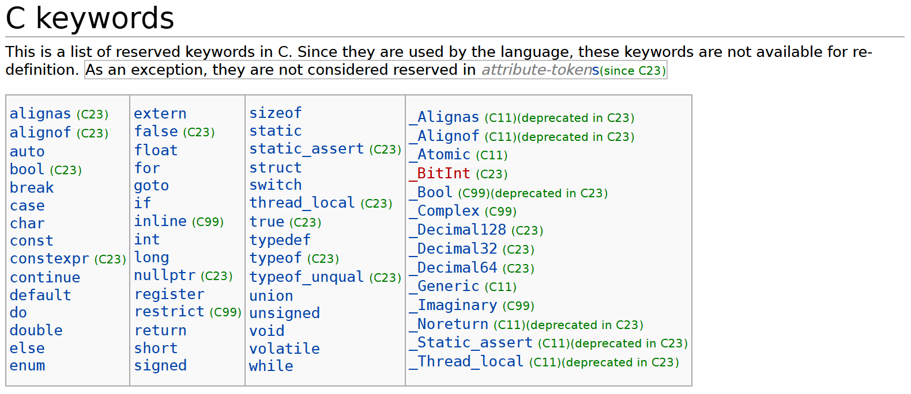
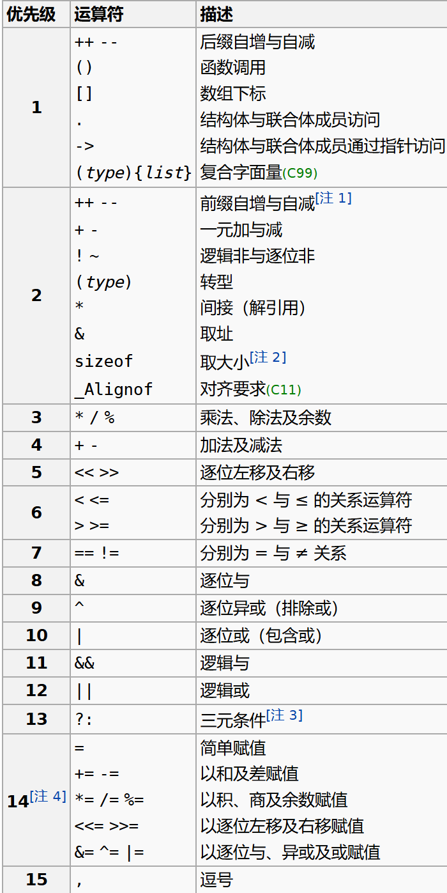
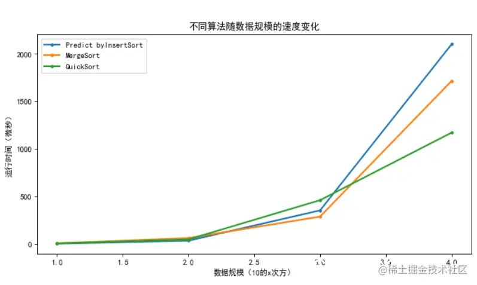

# 第二讲 期中复习

## 概述

希望大家在半个学期之后能够足够明确的知道自己在学习什么。

C语言是一个高效而灵活的语言，支持顺序、分支、循环结构、函数等。

同时，C语言有着严谨的语法，书写代码时需要时刻遵守。

### 基本程序结构

一个基本的C程序包括：
- 预处理指令（#include等）
- 函数、变量等的定义与声明
- 一个main函数

下面是许多人的第一个程序。

```c
#include <stdio.h>

int main() {
    printf("Hello, World!\n");  
    return 0;                   
}
```

!!! Example "例1.1-1"

    Which one is INCORRECT about the `main` function ?

    - A. "return 0" means the program exited successfully.
    - B. the name of it can be customized without any other changes.
    - C. `main` function MUST return an `int`


### 编译过程

1. **预处理**：处理 `#include`、`#define` 等预处理指令
2. **编译**：将C代码翻译成汇编代码
3. **汇编**：将汇编代码转换成机器代码
4. **链接**：将多个目标文件和库文件连接成可执行文件

预处理阶段程序**不会检查语法**，而只是机械替换

### 注释
```c
// 单行注释

/*
 * 多行注释
 * 可以跨越多行
 */
```

在实际程序当中，鼓励写更多的注释来增强可读性。

注释不会影响程序的运行。

## 变量与计算

### 变量
```c
类型名 变量名;
int x;
```

- 类型名：`long int` 与 `long` 等价，`signed int` 与 `int` 等价，`short int` 与 `short` 等价，`unsigned int` 与 `unsigned` 等价，**没有** `string`，`bool`

- 变量名是一种**标识符**，标识符的命名规则是：由字母、数字和下划线、**美元符号$**组成，且**不能以数字开头**，**区分大小写**，不能使用**关键字**

关键字如下：



!!! Example "例2.1-1"

    Which one below is **NOT** a valid identifier in the C programming language?

    - A. printf  
    - B. _m$  
    - C. 1919810aaaaa
    - D. define

未初始化的变量的值是**不确定**的，C语言当中默认变量定义不伴随初始化

### 数据类型

不同的数据类型占据不同的大小，有不同的取值范围。

!!! Example "例2.2-1" 
    
    0.1 + 0.2 == 0.3 ?

!!! Example "例2.2-2" 
    
    unsigned short sht = 0;
    sht--;
    
    what is the value of `sht` now ?


`sizeof` 可以获得某个类型或变量在内存中所占据的字节数，它的结果在编译时刻就决定了，是一个**运算符**而不是函数

```C
int a = 1;
printf("%d\n", sizeof(a++));
printf("%d\n", a);
```

What is the output of the following program on a 64-bit system?

```C
char str[][3] = {'L', 'o', 'v', 'e', 'C', 'K', 'C'};
printf("%d ", (int)sizeof(str));
printf("%d ", (int)sizeof(&str));
printf("%d ", (int)sizeof(*str));
printf("%d ", (int)sizeof(str + 1));
printf("%d ", (int)sizeof(*str + 1));
printf("%d ", (int)sizeof(*(str + 1)));
printf("%d", (int)sizeof(*(*(str + 1) + 1)));
```

### 字面量
字面量即一个值的**表示方法**，同一个值可能有很多种表示方法

```C
char a = 65;            // 十进制
char b = 0101;          // 0开头表示八进制
char c = 0x41;          // 0x开头表示十六进制

char d = 'A';           // 单引号，字符常量

char e = '\101';        // 单引号里面反斜杠转义最多三个数字，表示八进制，遇到0-7之外的就会结束
char e0 = '\08';        // 错误，这是两个字符放到了一个单引号里

char f = '\x41';        // 十六进制，没有长度限制，遇到非十六进制字符就会结束
char f0 = '\x00041';    // 和上面的是一样的
```

### 计算

带运算符的式子是表达式。

表达式都可以直接作为语句，但不是所有语句都是表达式。

如控制语句

#### 运算符

`% & <<` 运算符不能用在 `double` 上

运算顺序问题，简单来说：赋值运算符和位运算符较低，略高的是算术运算，再高的是自增/减



下面程序的输出是什么？

```C
int a=1,b=2,c=2,t;
while(a<b<c) {    t=a; a=b; b=t; c--;    }
printf(“%d,%d,%d”,a,b,c);
```

!!! Example "例2.4-1"

    - 表达式 `(3<x<5)` 的值恒为 `1`？
    - 表达式 `(1<=n<=10)` 能正确地表示 `n` 属于 `[1, 10]`？
    - 表达式 `(3==x==3)` 的值恒为 `0`？
    - 表达式 `(x=4,y=3)` 的值恒为 `3`？


!!! Example "例2.4-2"

    Which statement of the following is equivalent to x * = y + z  ?

    - A.x = y + z
    - B.x = x * y + z
    - C.x = x * (y + z)
    - D.x = x + y * z

## 分支和循环

程序的基本结构包括顺序结构、分支结构和循环结构，三者缺一不可。

这三种结构构成了程序最基本的框架。

### 分支

#### if/else

`else` 总是与最近的一个没有被匹配的 `if` 配对

```C
if (x > -2)
    if (x > 0) {
        // do something
        if (x > 2){
            // do something
        }
    } 
    else{
        // do something
    } 
else {
            // do something
}
```

分支语句如包括有一个以上的语句，则必须用一对大括号 `{}` 括起来，组成复合语句，复合语句在语法上被认为是一条语句

`if` 语句执行的时候会先执行 `()` 里的表达式，如果该表达式的值非零，则执行 `{}` 里的语句

```C
int x = 10;
if (x--) {
    printf("x is %d\n", x);
}
```

如果x的初值为1会如何？0呢？

#### 注意
形如 else if的结构并不是一个整体，你可以写出诸如
```C
else switch(...)
else for(...)
else while(...)
```
等等语句。这些都是合法的。

#### switch

对于 `switch` 语句，`case` 只规定了起点，而何时退出 `switch` 块则由 `break` 决定，只要没有遇到 `break`，则一直向下执行（即使碰到了下一个 `case` 且不满足）

```C
int i, b; i = b = 1;
switch (i) {
    case 0: b += 1;
    case 1: b += 2;
    case '1': b += 3;
    case 2 : switch (b) {
        case 1: b += 4;
        case 3: i++;
        default: break;
    }
    i += 1;
}
printf("%d#%d#", i, b);
```

```C
int grade = 85;
switch (grade / 10) {
    case 10:
    case 9:
        printf("优秀\n");
    case 8:
        printf("良好\n");
    case 7:
        printf("中等\n");
    case 6:
        printf("及格\n");
    default:
        printf("不及格\n");
}
```
这段程序的运行结果是怎样的？

#### 注意

##### 1

switch当中不一定总是需要出现default语句，甚至case语句也是不一定出现的。

switch的唯一功能是按照switch(表达式) 当中的表达式求值并找到对应的分支进入，同时遇到break则跳出。

##### 2

在switch语句的块内不能随意定义变量，因为可能会跳过某个变量的初始化。

在C99及以后的标准中，我们可以在case分支中使用花括号来创建一个新的作用域，从而在该作用域内声明变量。但这种方法仍然需要小心处理变量的初始化和作用域问题。

例如：

```C
switch (x)
{
    case 1:{
        int y;
        scanf("%d",&y);
        ...
        break;
    }
    ...
}
```

switch语句中的case标签本质上是一种跳转语句。

在C语言中，跳转到变量初始化之前的位置是未定义行为（Undefined Behavior, UB）。如果通过跳转语句跳过了这些初始化过程，就可能导致程序状态的不一致。

### 循环

循环体如包括有一个以上的语句，则必须用一对大括号 `{}` 括起来，组成复合语句，复合语句在语法上被认为是一条语句。

```C
int a, i;
for (a=1, i=-1; -1 <= i < 1; i++) {
    a++;
    printf("%2d", a);
}
printf("%2d", i);
```

!!! Example "例3.2-1"

    The following piece of code prints out__.

    ```C
    for (a=1,i=-1; -1<=i<1; i++) {
        a++;
        printf("%2d", a);
    }   
    printf("%2d", i);
    ```

    - A.  2 3 1
    - B.  -1
    - C.  1 2 0
    - D.  3


## 数组

数组的定义

```C
类型名 数组名[数组长度];
int a[10];
```

数组的初始化

```C
类型名 数组名[数组长度(可省略)] = {元素1, 元素2, ...};
int a[5] = {1, 2, 3, 4, 5};
int b[ ] = {1, 2, 3, 4, 5};
int c[5] = {1, 2, 3};        // 其余元素为0
```

**元素类型为数组**的数组被称为**高维数组**

下面哪些定义是合法的？

```C
int a[][];

int b[3][];

int c[][4];

int d[3][4];

int e[][] = {
    {1, 2, 3, 4},
    {5, 6, 7, 8},
    {9, 10, 11, 12}
};

int f[][4] = {
    {1, 2, 3, 4},
    {5, 6, 7, 8},
    {9, 10, 11, 12}
};
```

## 函数

### 定义与声明

- 类型：决定函数的**返回值**。若对函数类型未加显式说明，则函数的隐含类型为 `int`

注意：**强烈不建议**使用隐含类型。这只是历史遗留问题。

!!! Example "例4-1"
    C语言中，通过函数调用只能获得一个返回值？

- 函数名：用于标识函数

!!! Example "例4-2"
    函数可以嵌套调用但不能嵌套定义？

- 参数表：用逗号分隔的参数类型和参数名，声明时参数名可以省略

!!! Example "例4-3"
    若函数调用时的实参为变量，下列关于函数形参和实参的叙述中正确的是( )。
    
    A. 函数的实参和其对应的形参共占同一存储单元  
    B. 形参只是形式上的存在, 不占用具体存储单元  
    C. 同名的实参和形参占同一存储单元  
    D. 函数的形参和实参分别占用不同的存储单元

函数的声明和定义可以分离。（比如说你的函数题的题干）

在调用一个函数前，必须声明或定义过这个函数，否则会有**编译错误**。

如果调用了一个只有声明，没有定义的函数，会产生**链接错误**。

下面的程序运行结果是怎样的？

```C
#include <stdio.h>

int x = 5, y = 7;
void swap(int,int); // 函数声明
int main() {
    int x = 3, y = 8;
    swap(x,y);
    printf("%d,%d\n", x, y);

    return 0 ;
}

void swap(int x,int y) { // 函数定义
    int temp = x;
    x = y;
    y = temp;
}
```

!!! Example "例4-4"

    Which one is an INCORRECT funtion definition?

    - A.void f(int i) { return i+1; }
    - B.void f( ) { }
    - C.void f(int i) { }
    - D.int f( ) { return 0; }


!!! Example "例4-5"

    有以下函数定义:void fun(int n, double x){……}。若以下选项中的变量都已正确定义并赋值,则正确调用函数fun()的语句是()。

    - A.fun(int y, double m);
    - B.k = fun(10, 12.5);
    - C.fun(x, n);
    - D.void fun(n, x);

### 递归

递归是指函数直接或间接调用自身的过程。递归函数包含两个关键部分：
- **终止条件**：递归终止的条件
- **递归步骤**：将问题分解为更小的同类问题

二者缺一不可。

一些示例：

#### 阶乘计算
```c
#include <stdio.h>

// 递归计算阶乘
long factorial(int n) {
    // 基准情况
    if (n == 0 || n == 1) {
        return 1;
    }
    // 递归步骤
    return n * factorial(n - 1);
}

int main() {
    int num = 5;
    printf("%d! = %ld\n", num, factorial(num));
    return 0;
}
```

#### 斐波那契数列
```c
#include <stdio.h>

// 递归计算斐波那契数列
int fibonacci(int n) {
    // 基准情况
    if (n == 0) return 0;
    if (n == 1) return 1;
    // 递归步骤
    return fibonacci(n - 1) + fibonacci(n - 2);
}

int main() {
    for (int i = 0; i < 10; i++) {
        printf("F(%d) = %d\n", i, fibonacci(i));
    }
    return 0;
}
```

递归本身有栈空间的开销，所以如果递归层次过高，会出现栈溢出的**运行错误**。

递归和循环是完全等价，且可以互相转换的，但递归的开销往往较大。

尾递归优化可以减少开销。

```c
// 普通递归 - 效率较低
int factorial(int n) {
    if (n == 0) return 1;
    return n * factorial(n - 1);
}

// 尾递归优化版本
int factorial_tail(int n, int result) {
    if (n == 0) return result;
    return factorial_tail(n - 1, n * result);
}

// 包装函数
int factorial(int n) {
    return factorial_tail(n, 1);
}
```


## 排序

### 总览：

典型的基于比较的排序：

|   算法   | 平均时间复杂度 | 最好情况 | 最坏情况 | 稳定性 |
| :------: | :------------: | :------: | :------: | :----: |
| 冒泡排序 |    $O(n^2)$    |  $O(n)$  | $O(n^2)$ |  稳定  |
| 选择排序 |    $O(n^2)$    | $O(n^2)$ | $O(n^2)$ | 不稳定 |
| 插入排序 |    $O(n^2)$    |  $O(n)$  | $O(n^2)$ |  稳定  |
| 归并排序 |  $O(n\log n)$  | $O(n\log n)$ | $O(n\log n)$ |  稳定  |
| 快速排序 |  $O(n\log n)$  | $O(n\log n)$ | $O(n^2)$ | 不稳定 |

基数排序等非比较排序可以达到 $O(n)$ 的时间复杂度。

排序的稳定性指在排序一些内容时，大小相同的值是否会改变顺序。

在排序整数时可能并不明显，但在排序结构体的时候排序的稳定性会有明显的影响。

#### 注意

基于比较的排序的时间复杂度存在 $O(n\log n)$ 的理论下限。

但不是基于比较的排序可以更低，但无论如何不能低于 $O(n)$ 。

### $O(n^2)$ 的两两比较

一个最简单的想法是两两比较并交换直到有序。

冒泡排序的一个示例如下。

```C
void bubble_sort(int a[], int n) {
    int temp;
    for(int i = n-1; i >= 1; i-- ){
        for(int j = 0; j < i; j++){
            if (a[j]>a[j+1]){ 
                temp=a[j];
                a[j]=a[j+1];
                a[j+1]=temp;
            }
        }
    }
}
```

类似的还有选择排序与插入排序。

选择排序的一个示例如下：
```C
void selection_sort(int a[], int n) {
    for (int i = 0; i < n - 1; i++) {
        int min_idx = i;
        for (int j = i + 1; j < n; j++) {
            if (a[j] < a[min_idx]) min_idx = j;
        }
        if (min_idx != i) {
            int t = a[i];
            a[i] = a[min_idx];
            a[min_idx] = t;
        }
    }
}
```

插入排序的一个示例如下：
```c
void insertion_sort(int a[], int n) {
    for (int i = 1; i < n; i++) {
        int key = a[i];
        int j = i - 1;
        // 将 a[i] 插入到已排序区间 a[0..i-1]
        while (j >= 0 && a[j] > key) {
            a[j + 1] = a[j];
            j--;
        }
        a[j + 1] = key;
    }
}
```

选择排序与插入排序的对比：
- 插入排序在每次迭代中将当前元素插入到左侧已排序部分的正确位置。
- 平均和最坏时间复杂度均为 O(n^2)，最好情况为 O(n)，为稳定排序。
- 选择排序每次从未排序区间选出最小（或最大）元素放到已排序区间末端。
- 平均/最坏时间复杂度：O(n^2)，不稳定。

### 分而治之的 $O(n\log n)$ 算法

分而治之思想：将问题分成若干子问题分别解决，再合并子问题的结果。

排序中常见的两种基于分治的算法是快速排序和归并排序。

快速排序（Quicksort）
- 思想：选择一个pivot，将数组划分为比pivot小和比pivot大的两部分，递归对两部分排序。
- partition是核心：把与pivot比较并交换位置，使pivot落到最终位置。
- 时间复杂度：平均 O(n log n)，最好 O(n log n)，最坏 O(n^2)（当划分极不平衡时）。
- 空间复杂度：原地版本平均 O(log n) 递归栈，最坏 O(n)。
- 稳定性：通常不稳定（因为交换会改变相同元素相对次序）。
- 实践技巧：随机化pivot或“三数取中”可显著降低最坏情况发生概率；小区间可改用插入排序优化。

```c
int partition(int a[], int l, int r) {
    int pivot = a[l]; // 可以随机选取或三数取中
    int i = l - 1, j = r + 1;
    while (1) {
        do { i++; } while (a[i] < pivot);
        do { j--; } while (a[j] > pivot);
        if (i >= j) return j;
        int t = a[i]; a[i] = a[j]; a[j] = t;
    }
}

void quick_sort(int a[], int l, int r) {
    if (l < r) {
        int p = partition(a, l, r);
        quick_sort(a, l, p);
        quick_sort(a, p + 1, r);
    }
}
```

归并排序（Mergesort）
- 思想：将数组分成左右两半，递归排序左右两半，再把两个有序序列合并成一个有序序列。
- 时间复杂度：最好/平均/最坏均为 O(n log n)。
- 空间复杂度：通常需要 O(n) 额外空间用于合并（也有原地归并的复杂实现但复杂度高）。
- 稳定性：稳定（标准实现保持相等元素的相对顺序）。
- 优点：时间界限确定、对最坏情况友好；并行化友好。
- 缺点：额外空间需求，递归/合并开销在小数组上不如插入排序。

自顶向下递归实现示例：
```c
void merge(int a[], int l, int m, int r, int tmp[]) {
    int i = l, j = m + 1, k = l;
    while (i <= m && j <= r) {
        if (a[i] <= a[j]) tmp[k++] = a[i++]; // <= 保持稳定性
        else tmp[k++] = a[j++];
    }
    while (i <= m) tmp[k++] = a[i++];
    while (j <= r) tmp[k++] = a[j++];
    for (i = l; i <= r; i++) a[i] = tmp[i];
}

void merge_sort(int a[], int l, int r, int tmp[]) {
    if (l >= r) return;
    int m = l + (r - l) / 2;
    merge_sort(a, l, m, tmp);
    merge_sort(a, m + 1, r, tmp);
    merge(a, l, m, r, tmp);
}
```

比较与选择
- 若追求最坏情况保证且允许额外 O(n) 空间，选择归并排序（稳定）。
- 若希望原地排序且平均表现最好、代码常更短，选择快速排序；采用随机化或三数取中能避免退化。

### 其他排序算法

#### 其他的一些基于比较的算法

- 堆排序（Heap Sort）  
    - 时间复杂度：平均/最好/最坏均为 O(n log n)  
    - 空间：原地 O(1)（递归实现除外）  
    - 稳定性：不稳定  
    - 特点：基于二叉堆构建最大/最小堆，适合需要最坏情况保证且要求原地排序的场景。

- 希尔排序（Shell Sort）  
    - 时间复杂度：取决于增量序列，常见序列下约为 O(n^1.3−1.5)（非严格界）  
    - 空间：原地 O(1)  
    - 稳定性：通常不稳定  
    - 特点：基于插入排序的间隔分组，适合中等规模数组，常作为实际工程中的简单优化。

#### 非比较性算法

- 计数排序（Counting Sort）  
    - 时间复杂度：O(n + k)，k 为关键字取值范围  
    - 空间：O(n + k) 额外空间（需要计数数组）  
    - 稳定性：稳定（实现上可保持）  
    - 特点：非比较排序，适用于关键字范围相对较小且为整数的情况，可作为基数排序的子步骤。

- 基数排序（Radix Sort）  
    - 时间复杂度：O(d*(n + k))，d 为位数，k 为每位基数大小  
    - 空间：O(n + k) 额外空间（通常使用稳定的计数排序作为子过程）  
    - 稳定性：稳定（使用稳定子排序）  
    - 特点：非比较排序，适合对整数或固定长度字符串排序，大规模数据时效率高于比较排序。

- 桶排序（Bucket Sort）  
    - 时间复杂度：平均 O(n + k)，最坏 O(n^2)（取决于分布）  
    - 空间：O(n + k) 额外空间  
    - 稳定性：视桶内排序算法而定（可保持稳定）  
    - 特点：假设输入均匀分布到桶中，适合浮点数或已知分布场景，常与插入排序结合。

#### 实际的工程算法

工程上常常混合使用一些排序，因为他们在不同情况下有着不同的性能。




- 归并/快速以外的混合排序（例如 Timsort、Introsort）  
    - Timsort：O(n) 最好，O(n log n) 最坏，稳定，O(n) 额外空间。实际库（Python、Java）中用于处理常见数据（利用天然有序性与归并+插入）。  
    - Introsort：平均/最好 O(n log n)，最坏 O(n log n)（通过在快速排序退化时切换到堆排序保证界），原地，不稳定。  
    - 特点：混合多种算法以在实践中兼顾性能和最坏情况保证。

如C++的std::sort使用IntroSort，std::stable_sort使用归并排序等。


#### 标准库

<stdlib.h> 头文件中提供了 `qsort` 函数，qsort 使用的是快速排序算法。

虽然标准库有提供，但是熟悉几种主要排序算法的实现很有必要。

函数声明：
```C
void qsort(void *base, size_t nitems, size_t size, int (*compar)(const void *, const void *));
```

说明：

base: 指向待排序数组的第一个元素的指针。

nitems: 数组中的元素数量。

size: 数组中每个元素的大小（以字节为单位）。

compar: 传入比较函数，该函数用于比较两个元素。比较函数应当返回一个整数，表示比较结果： 小于零：表示第一个元素小于第二个元素。 等于零：表示两个元素相等。 大于零：表示第一个元素大于第二个元素。