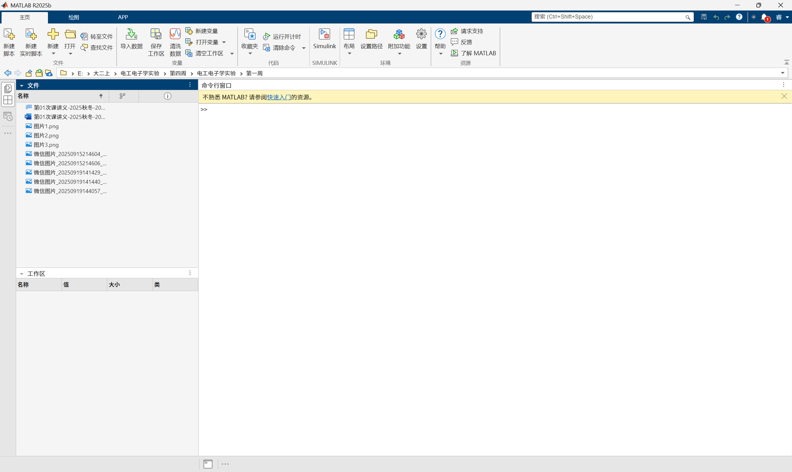
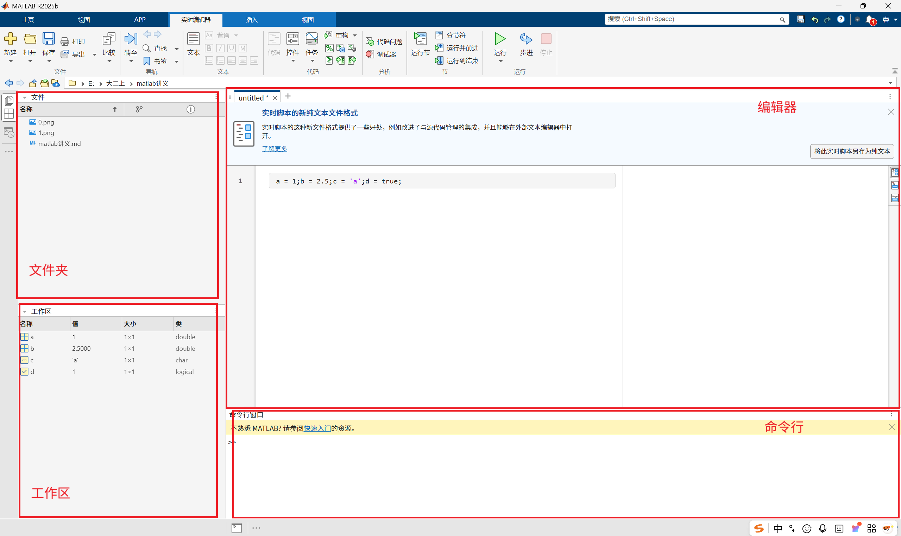

# 面向纯小白的MATLAB编程入门

## 讲在前面
Matlab的[教程在此](https://itc.zju.edu.cn/14742/list.htm)，浙大已经帮我们买好了。本次课程可以使用离线版Matlab（下载较慢），也可以使用[Matlab Online](https://www.mathworks.com/products/matlab-online.html)。

Matlab，全称"Matrix Laboratory"（矩阵实验室），是美国Mathworks公司开发的用于**算法开发、数据分析、数值计算及可视化**的一个软件和编程语言。

和C不一样，C的核心是量和指针，是一门面向过程的编程语言。而Matlab的核心是矩阵，是一个面向数据的语言。因此，Matlab的最重要的功能就是分析各种各样的数据。

学习Matlab语法，我们就能像在写C一样，完美地表达自己的思路和想法。


## 初识Matlab



Matlab有两个重要文件格式：.m（脚本）和.mlx（实时脚本）。其中.m是和.c/.cpp差不多的纯文本文件格式，而.mlx是最近Matlab推荐的文件格式，不仅支持代码的编辑，同时支持富文本注释。本次课使用.mlx，即实时脚本。

!!! question "动手做：1.1新建实时脚本"
    
    单击新建实时脚本，创建mlx文件

Matlab的变量有个特点：定义变量不需要事先声明。这点和C不同，与Python类似

```c
//C语言
a = 1; b = 2.5; c = 'a'; d = true;//该代码段会报错
```
```matlab
%matlab语言
a = 1; b = 2.5; c = 'a'; d = true;%该代码段正常工作
```
```python
#python语言
a = 1; b = 2.5; c = 'a'; d = True;#该代码段正常工作
```

!!! question "动手做：1.2定义变量"
    
    在你的mlx文件中定义变量，并且单击运行

Matlab软件界面由**工作区、编辑器、命令行、文件夹**组成。刚才在定义变量运行后，工作区就出现了变量和值



**实时脚本的实时性在哪呢？**

!!! question "动手做:1.3实时显示变量"
    
    删掉分号并且在原分号处运行，并且另起一行修改a的值


当删去分号时，代码仍然正常运行，并且右侧的输出区显示了输出值。在mlx的编写中，一般都是不加分号的。我们实时观察变量在当前语句的值。因此，Matlab的调试十分方便。

## 矩阵的创建

Matlab 以矩阵为核心，我们一定要练好矩阵的基本功能。

矩阵的定义在Matlab中有一定格式。例如，``[1,2,3;4,5,6]``生成的是两行三列的矩阵，内容为
$$\begin{pmatrix}
1 & 2 & 3\\
4 & 5 & 6
\end{pmatrix}
$$
同一行元素之间使用逗号，换行使用分号。

!!! question "动手做:2.1生成矩阵"
    
    1) ``[1,2,3;4,5,6;7,8,9]``会是什么？验证你的猜想！
    
    2) 如果是``[1,2;3,4,5,6;7,8,9]``呢？

**报错了！错误使用vertcat**。vertcat是什么？我们等会儿再说。

大家在C中一定学过数组。其实数组在Matlab的眼中是一个1 * n的矩阵。当然，列向量同理。

如果我们要快速初始化一个矩阵，我们可以使用``zeros(rows,columns)``,``ones(rows,columns)``,``eye(rows,columns)``分别生成全0矩阵，全1矩阵，单位矩阵。

!!! question "动手做：2.2初始化矩阵"
    
    1.使用上面三个函数各生成三个2\*3和3个3\*2的矩阵
    
    2.如果只给rows，缺省columns（例如``zeros(2)``,``ones(3)``）呢？
    
~~当然，Matlab没有twos,threes。万一哪个用户来了一句one_hundred_and_fourteen_thousand_five_hundred_and_fourteens那Matlab可咋办~~

熟悉了矩阵，方阵的生成，我们肯定希望能够修改矩阵中的值。Matlab中元素的访问方式为
``a( row , column )``。和C不同，Matlab的计数从1开始。因此，第一行第二列大家放心地写``a( 1 , 2 )``，而不用写``a( 0 , 1 )``。~~更不能写a[0][1],\*(\*(a+0)+1)。~~

!!! question "动手做：2.3修改矩阵元素"
    
    将某一个``ones(3)``的中间值改成0

我们在矩阵中学过分块矩阵的概念。同样地，在Matlab中，我们可以对矩阵进行分块和组合。

访问一段连续的元素，Matlab的基本语法为``( begin : step : end )``相当于C中的
```c
 for(int i=begin;i<=end;i+=step)
```
step可缺省默认为1。如果begin和end一起缺省，只打冒号，那么就代表访问所有元素。

!!! question "动手做：2.4访问矩阵连续元素"
    
    1.对于``a=[1,2,3;4,5,6;7,8,9]``，你认为``a( 1:2 , 1:2 )``是什么？验证你的猜想！
    
    2.如果你想获得第二列的元素呢？
    
    3.对于一个矩阵，当你不知道矩阵大小的时候，使用``end``可以获得最后一个元素。当然，``end - 1``就是倒数第二个。那么，``a(end,end-1)``是什么呢？如果要访问矩阵中行标和列标都为奇数的元素呢？

矩阵的组合比较简单。还记得定义矩阵吗，我们用逗号分隔同一行的元素，而用分号分隔不同行的元素。其实这里的元素不一定是量，也可以是矩阵。Matlab中对于一个量，我们将其看作1*1的矩阵肯定没有问题。

!!! question "动手做:2.5矩阵的组合"
    
    1.将``ones(2)``和``eye(2)``水平和竖直组合。
    
    2.如果是``ones(2)``和``eye(3)``呢？

**又报错了！错误使用horzcat；错误使用vertcat**

**很熟悉！在前面定义矩阵的时候就遇到了这样的问题。** 事实上，矩阵的组合必须得满足行数/列数相等。如果2行的矩阵和3行的矩阵，Matlab不知道空余的1行应该放什么。

这样的话，刚才的错误使用vertcat就好解释了。

## 矩阵的运算

Matlab支持矩阵的加、减、乘。当然，要求做相应操作的矩阵符合条件。

!!! question "动手做：3.1矩阵的加、减、乘"
    
    1.定义两个2*3的矩阵，尝试加法和减法
    
    2.对于矩阵A,A'表示其转置矩阵（对复数为共轭转置）。尝试将其中一个矩阵转置并完成乘法。

***
!!! warning
    
    以下部分仅支持方阵。
***

~~各位的猩猩袋鼠学到行列式了没有？如果有，请把0打在公屏上；如果没有，请打出$\sin x$的麦克劳林展开的二次项系数~~

看来大家学过行列式是什么了。对于方阵A，我们使用``det(A)``表示A的行列式。当$\det(A)\neq 0$，也就是A的秩等于行数列数，也就是A的行和列都线性无关，A存在逆矩阵为``inv(A)``。

!!! question "动手做：3.2矩阵的求逆"
    
    求``[1,2,3;4,5,6;7,8,9]``的行列式和逆矩阵

***
!!!
    Warning解除
***

吴爷爷曾经说过，线性代数就是两件事情——解方程和二次型。对于方程
$$Ax=b$$
如果A是满秩的方阵，那么显然有
$$x=A^{-1}b$$
然而，如果A不可逆呢？我们在Matlab中可以使用 **左除(\\)、右除(/)** 进行计算。如果$$AB=C$$
那么$$A=C/B,B=A \backslash C$$

!!! question "动手做：3.3线性方程组的求解"
    
    （题目来源：2022-2023年吴志祥线代期中考试）使用左除命令求解方程：
    $$
    \begin{cases}
    x_1+x_2+x_3+x_4+x_5=1\\
    3x_1+2x_2+x_3+x_4-3x_5=0\\
    x_2+2x_3+2x_4+6x_5=3\\
    5x_1+4x_2+3x_3+3x_4-x_5=2
    \end{cases}
    $$
    尝试将第二个等式右端改成其他数，会发生什么？
当第二个等式的右端改成其他数的时候，这个方程是无解的，但是Matlab仍然会给出一个答案（事实上大家使用``A*x``就会发现问题）。即使a=0，方程也有解组，但Matlab也只能给出一个答案。因此，Matlab目前能给出的只是一个**最接近的数值特解**。

Matlab中矩阵的乘法除了正常的乘法以外，还有点乘。点乘不仅支持乘法的功能，同时支持**矩阵对应位置元素的直接相乘。** 例如，
$$
\begin{pmatrix}
1 & 2 & 3\\
4 & 5 & 6
\end{pmatrix}.*\begin{pmatrix}
1 & 2 & 3\\
4 & 5 & 6
\end{pmatrix}=\begin{pmatrix}
1 & 4 & 9\\
16 & 25 & 36
\end{pmatrix}
$$
当然，点除也就是矩阵对应位置元素的相除。
如果是一个数点乘矩阵，那么结果就是每个元素的这个数的倍数。

!!! question "动手做：3.4点乘和点除"
    
    定义满足要求的矩阵，尝试点乘和点除运算

## 绘图

Matlab对支持两个等长的向量进行绘图。如果定义向量x,y，那么``plot(x,y)``就是以x中元素为横坐标，y中元素为纵坐标画折线图。

!!! question "动手做：4.1基础绘图"
    
    ```
    m = [2:9]
    s = [-1 5.5 11.8 19.0 25.9 32.2 39.0 45.8]
    ```
    
    以m为横坐标，s为纵坐标绘制折线图

如图，图像约等于一条直线。

大家在高中学过**最小二乘法**拟合直线。在Matlab中有对应的求解函数``polyfit(x,y,n)``其中，x,y是对应横坐标、纵坐标的值，而n是拟合的多项式次数，缺省默认为1。得到的多项式记为p。

!!! question "动手做：4.2多项式拟合"
    
    将(m,s)拟合成一个一次多项式。结果是什么？

可以看到，p是一个1*2的向量，分别为一次项系数和常数项。使用``y=polyval(p,x)``即可将x通过该多项式映射到y

!!! question "动手做：4.3拟合图线的绘制"
    
    将m，s拟合成直线，画出拟合图像

两张图长得很像，简直傻傻分不清。那要是把两条曲线放在一张图里面呢？

在绘制完第一条曲线后加入``hold on``语句会使后续曲线都画在一张图里面。如果要解除限制则加入``hold off``。

!!! question "动手做：4.4将两条曲线画在同一张图"
    
    将两条曲线画在同一张图

也许大家仍然看不出区别在哪。那么找到图像右上角，鼠标点击会有“在图窗中打开”，那么图像将会放大，区别就比较明显。
在图窗中，我们也可以添加横轴，纵轴，标题......这些可能需要涉及一点点latex知识。当然，也可以将图窗导出为图片。~~不需要傻傻地将图像截图使用~~

不仅如此，对这个图像我们还可以进行更精细的定制。我们可以规定图线的线型，颜色，线粗，数据点......

简单的参数设置为``颜色+线型+数据点``。颜色有：
| r | g | b | c | m | y | b | w |无|
|--|--|--|--|--|--|--|--|--|
|红|绿|蓝|青|品红|黄|黑|白|默认颜色|

线型有
|-|--|:|-.|无|
|--|--|--|--|--|
|实线|虚线|点|点划线|实线或无|

数据点：
|o|+|*|.|x|s|d|无|
|--|--|--|--|--|--|--|--|
|圆|加号|星号|点|叉号|正方形|菱形|无|

其中线型缺省后的情形取决于数据点是否缺省。数据点缺省时为实现，不缺省为无。
在``plot(x,y,LineSpec)``中LineSpec添加如上参数（如``'r-*'``）就可以改变线型、颜色等

!!! question "动手做：4.5改变线型"
    
    将原始图线设置为蓝色星号无线型，拟合图线设置为红色点线

我们还可以通过``LineWidth``（线宽）``MarkerSize``（数据点大小）``MarkerEdgeColor``（数据点边缘颜色）``MarkerFaceColor``(数据点填充颜色)更深度定制图线。语法为``plot(x,y,LineSpec,'LineWidth',10,'MarkerFaceColor','g'......)``

!!! question "动手做：4.6更深度定制图线"
    
    改变原始数据点大小为8，拟合图线线宽为2

## 结语

以上为Matlab的入门部分。大家移步官网，找到"自动进度课程"，我们差不多把Matlab入门部分过了一遍。

Matlab为我们提供了很多自学课程。跟着他的教程，我们能学到很多好东西。

另外，Matlab为我们提供了很多“APP”，帮我们简化很多分析过程。例如，在函数图线拟合部分，我们可以通过“函数拟合器”或者“Curve Fitting Toolbox”进行。~~这也是Matlab如此臃肿的原因~~

此外，Matlab还有很多功能强大的仿真工具（Simulink，Simscape），基本为行业权威。

具有数据分析的软件还有Python，R等。但Matlab目前应该是功能最强大、集成的软件之一。因此，掌握这个软件会让你的分析更如虎添翼！


