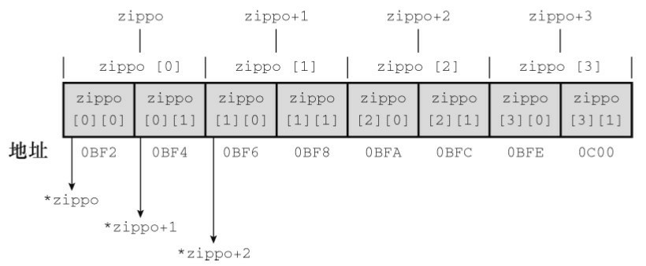
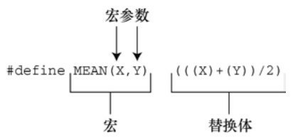

> 程序设计与算法基础 期末复习（上）讲义
>
> 授课：鲁亦智

# C 语言：细节与技巧


## 0 写在前面

> 本讲义使用 C99 标准（C99 standard (ISO/IEC 9899:1999)）
>
> 本讲义参考资料：
>
> - PRATA S. C Primer Plus（第6版）[M]. 姜佑, 译. 北京: 人民邮电出版社, 2016.
> - [C 语言 - API 参考文档](https://www.apiref.com/cpp-zh/c.html)

此外，编写这份讲义时，我假定读者具备下列条件：

- 已搭建好 C 语言开发环境（dev-c++，VSCode+gcc/clang 或者任何能编写并且编译 C 代码的环境）
- 掌握基础 C 语言语法知识（可参阅 [Learn C in Y Minutes](https://learnxinyminutes.com/zh-cn/c/)）

## 1 输入输出技巧

### 1.1 字符（串）读写

#### 1.1.1 `getchar()` 和 `putchar()`

输入/输出**一个**字符

- 定义在 `stdio.h` 内
- `getchar()` 从 `stdin` 读取**一个字符**，不抛弃换行/回车等空白字符

示例程序：

```c
#include <stdio.h>

int main()
{
  char ch;
  ch = getchar();      // 读取一个字符
  while (ch != '\n') { // 可以读取换行符
    if (ch == ' ')
      putchar(ch); // 打印一个字符
    else
      putchar(ch + 1);
    ch = getchar(); // 读取下一个字符
  }
  putchar(ch);

  return 0;
}
```

示例输入：

```
CALL ME HAL.
```

示例输出：

```
DBMM NF IBM/
```

#### 1.1.2 `gets()` 和 `puts()`

输入/输出**一行**字符串

**`gets()`函数：**

- 定义在 `stdio.h` 内，函数原型为 `char *gets( char *str );`
- 从 stdin 读入 `str` 所指向的字符数组，直到发现**换行符**或出现文件尾。在读入数组的最后一个字符后立即写入空字符。换行符被舍弃，但不会存储于缓冲区中。
- `gets()` 函数不进行边界检查，使用时需确保你已经为 `str` 分配了足够的内存。
- 成功时返回 `str` ，失败时返回空指针 `NULL`

**`puts()`函数：**

- 定义在 `stdio.h` 内，函数原型为 `int puts( const char *str );`
- 写入每个来自空终止字符串 `str` 的字符及附加换行符 `'\n'` 到输出流 `stdout` 
- 不写入来自 `str` 的空终止字符
- 成功时返回非负值，失败时返回 `EOF` （负值整型常量）

示例程序：

```c
#include <stdio.h>
#define STLEN 81
int main(void)
{
  char words[STLEN];
  puts("Enter a string, please.");
  gets(words);
  printf("Your string twice:\n");
  printf("%s\n", words);
  puts(words);
  puts("Done.");
}
```

可以看出，一般情况下 `puts(str)` 和 `printf("%s\n", str)` 是等价的。然而，`gets(str)` 和 `scanf("%s", str)` 大多数情况下并不等价。`scanf()` 和 `gets()` 的区别在于它们如何确定字符串的末尾：`scanf()` 更像是“获取单词”函数，而不是“获取字符串”函数：如果预留的存储区装得下输入行，`gets()` 会读取第 1 个换行符之前所有的字符。`scanf()` 函数有两种方法确定输入结束。无论哪种方法，都从第 1 个非空白字符作为字符串的开始。如果使用 `％s` 转换说明，以下一个空白字符（空行、空格、制表符或换行符）作为字符串的结束（字符串不包括空白字符)。如果指定了字段宽度，如 `%10s` , 那么 `scanf()` 将读取 10 个字符或读到第 1 个空白字符停止（先满足的条件即是结束输入的条件）。

### 1.3 读写格式化

| 格式符      | 说明                               | `printf` 示例                            | `scanf` 示例                             |
| ----------- | ---------------------------------- | ---------------------------------------- | ---------------------------------------- |
| `%d`        | 十进制有符号整数（`int`）          | `printf("%d", 123);` → `13`              | `scanf("%d", &x);`                       |
| `%u`        | 十进制无符号整数（`unsigned int`） | `printf("%u", -1);` → 大正数（补码解释） | `scanf("%u", &x);`                       |
| `%c`        | 单个字符（`char`）                 | `printf("%c", 'A');` → `A`               | `scanf(" %c", &ch);`（注意空格跳过空白） |
| `%s`        | 字符串（以 `\0` 结尾的 `char[]`）  | `printf("%s", str);`                     | `scanf("%s", str);`                      |
| `%f`        | 单精度浮点数（`float`）            | `printf("%f", 3.14f);` → `3.140000`      | `scanf("%f", &f);`                       |
| `%lf`       | 双精度浮点数（`double`）           | `printf("%lf", 3.14159);` → `3.141590`   | `scanf("%lf", &d);`                      |
| `%e` / `%E` | 科学计数法（小写/大写 e）          | `printf("%e", 123.4);` → `1.234000e+02`  | —                                        |
| `%x` / `%X` | 十六进制整数（小写/大写）          | `printf("%x", 255);` → `ff`              | `scanf("%x", &x);`                       |
| `%o`        | 八进制整数                         | `printf("%o", 255);` → `377`             | `scanf("%o", &x);`                       |
| `%%`        | 输出字面量 `%`                     | `printf("%%d");` → `%d`                  | —                                        |

**宽度与精度控制（用于 `printf()`）：**

- **宽度**：`%5d` 表示至少占 5 个字符宽度，不足则左补空格。
- **精度**：`%.2f` 表示保留小数点后 2 位；`%.5s` 表示最多输出 5 个字符。
- 组合示例：`%8.2f` → 总宽 8，小数位 2。

**扫描集格式符：`%[...]`（用于 `scanf()`）：**

`%[...]` 是 `scanf()` 中一种强大的格式控制符，用于**读取符合指定字符集合的字符串**。与 `%s` 不同，`%[...]` 可以包含空格、制表符等空白字符，并能精确控制哪些字符被接受或拒绝。

基本语法：

- **`%[abc]`**：只接受字符 `'a'`、`'b'`、`'c'`，遇到其他字符（包括空白）即停止。
- **`%[a-z]`**：接受任意小写字母（支持范围表示）。
- **`%[^abc]`**：`^` 表示“取反”，即读取直到遇到 `'a'`、`'b'` 或 `'c'` 为止（但不包含这些字符）。
- **`%[^\n]`**：读取一整行（包括空格），直到换行符（`\n`）为止（但不包含 `\n`）。

示例程序：

```c
#include <stdio.h>

int main()
{
  int num;
  unsigned int unum;
  char ch;
  char str[20];
  float f;
  double d;

  // 输入示例
  printf("请输入一个整数: ");
  scanf("%d", &num);

  printf("请输入一个无符号整数: ");
  scanf("%u", &unum);

  printf("请输入一个字符: ");
  scanf(" %c", &ch); // 注意前导空格以跳过换行符

  printf("请输入一个单词（无空格）: ");
  scanf("%s", str); // str 是数组名，已是指针，无需 &

  printf("请输入一个 float: ");
  scanf("%f", &f);

  printf("请输入一个 double: ");
  scanf("%lf", &d);

  // 输出示例
  printf("\n=== 输出结果 ===\n");
  printf("整数 (%%d): %d\n", num);
  printf("无符号整数 (%%u): %u\n", unum);
  printf("字符 (%%c): %c\n", ch);
  printf("字符串 (%%s): %s\n", str);
  printf("浮点数 (%%f): %f\n", f);
  printf("双精度 (%%.3lf): %.3lf\n", d); // 保留3位小数
  printf("十六进制 (%%x): %x\n", num);
  printf("科学计数法 (%%e): %e\n", d);
  printf("宽度与对齐: %5d, %8.2f\n", num, f);

  return 0;
}
```

**注意事项：**

- `scanf()` 中除 `%c` 和 `%[...]` 外，会自动跳过前导空白（空格、换行、制表符）。
- 使用 `%c` 时，若前一次输入留有换行符，需在格式串中加空格以跳过。
- `scanf()` 不会自动检查缓冲区溢出，使用 `%s` 时应限制长度，如 `scanf("%19s", str);`
- 对于 `double` 类型，**输入必须用 `%lf`**，而 `printf` 中 `%f` 和 `%lf` 均可（C99 以后 `%lf` 与 `%f` 等价）。
- `scanf()` 返回成功接收的参数个数，`printf()` 返回成功输出的字符数（若失败则返回负值）。

### 1.4 文件操作

> 本节出现的函数均定义在 `stdio.h` 头文件中。

#### 1.4.1 `fopen()` 和 `fclose()`

**`fopen()` 函数：**

- 函数原型：`FILE *fopen( const char *filename, const char *mode );`
- 打开 `filename` 所指示的文件，并返回指向关联到该文件的文件流的指针。 `mode` 用于确定文件访问模式。
- 若成功，则返回指向新文件流的指针。流为完全缓冲，除非 `filename` 表示一个交互设备。错误时，返回空指针。

| 文件访问模式 | 含义     | 解释            | 若文件已存在 | 若文件不存在 |
| ------------ | -------- | --------------- | ------------ | ------------ |
| `"r"`        | 读       | 打开文件以读取  | 从头读       | 打开失败     |
| `"w"`        | 写       | 创建文件以写入  | 销毁内容     | 创建新文件   |
| `"a"`        | 后附     | 后附到文件      | 写到结尾     | 创建新文件   |
| `"r+"`       | 读扩展   | 打开文件以读/写 | 从头读       | 错误         |
| `"w+"`       | 写扩展   | 创建文件以读/写 | 销毁内容     | 创建新文件   |
| `"a+"`       | 后附扩展 | 打开文件以读/写 | 写到结尾     | 创建新文件   |

**`fclose()` 函数：**

- 函数原型：`int fclose( FILE *stream );`
- 关闭给定的文件流。冲入任何未写入的缓冲数据到 OS 。舍弃任何未读取的缓冲数据。
- 若在 `fclose` 返回后使用指针 `stream` 的值则行为未定义。
- 成功时返回值为 `0` ，否则为 `EOF` 。

#### 1.4.2 `getc()` 和 `putc()`

`getc()` 和 `putc()` 函数与 `getchar()` 和 `putchar()` 函数类似。所不同的是，要告诉 `getc()` 和 `putc()` 函数使用哪个文件。下面这条语句的意思是“从标准输入中获取一个字符”：

```c
ch = getchar();
```

然而，下面这条语句的意思是“从 `fp` 指定的文件中获取一个字符”：

```c
ch = getc(fp);
```

与此类似，下面语句的意思是“把字符 `ch` 放入 `FILE` 指针 `fpout` 指定的文件中”：

```c
putc(ch, fpout);
```


在 `putc()` 函数的参数列表中，第 1 个参数是待写入的字符，第 2 个参数是文件指针。

#### 1.4.3 `fgets()` 和 `fputs()`

`fgets()` 函数的第 1 个参数和 `gets()` 函数一样，也是表示储存输入位置的地址（`char *` 类型）；第2个参数是一个整数，表示待输入字符串的大小；最后一个参数是文件指针，指定待读取的文件。下面是一个调用该函数的例子：

```c
fgets(buf, STLEN, fp);
```

这里，`buf` 是 `char` 类型数组的名称，`STLEN` 是字符串的大小，`fp` 是指向 `FILE` 的指针。`fgets()` 函数读取输入直到第 1 个换行符的后面，或读到文件结尾，或者读取 `STLEN-1` 个字符（以上面的 `fgets()` 为例）。然后，`fgets()` 在末尾添加一个空字符使之成为一个字符串。字符串的大小是其字符数加上一个空字符。

如果 `fgets()` 在读到字符上限之前已读完一整行，**它会把表示行结尾的换行符放在空字符前面**。`fgets()` 函数在遇到 `EOF` 时将返回NULL值，可以利用这一机制检查是否到达文件结尾；如果未遇到EOF则之前返回传给它的地址。

`fputs()` 函数接受两个参数：第 1 个是字符串的地址；第 2 个是文件指针。该函数根据传入地址找到的字符串写入指定的文件中。和 `puts()` 函数不同，`fputs()` 在打印字符串时不会在其末尾添加换行符。下面是一个调用该函数的例子：

```c
fputs(buf, fp);
```


这里，`buf` 是字符串的地址，`fp` 用于指定目标文件。由于 `fgets()` 保留了换行符，`fputs()` 就**不会再添加换行符**，它们配合得非常好。

#### 1.4.4 `fscanf()` 和 `fprintf()`

行为和 `scanf()` 与 `printf()` 类似，区别是调用时在格式化字符串前传入文件指针来指定读写的目标文件。

示例程序：

```c
#include <stdio.h>
#include <stdlib.h>
#include <string.h>
#define MAX 41

int main()
{
  FILE* fp;
  char words[MAX];

  if ((fp = fopen("wordy", "a+")) == NULL) {
    fprintf(stdout, "Can't open \"wordy\" file.\n");
    exit(EXIT_FAILURE);
  }

  puts("Enter words to add to the file; press the #");
  puts("key at the beginning of a line to terminate.");

  while ((fscanf(stdin, "%40s", words) == 1) && (words[0] != '#'))
    fprintf(fp, "%s\n", words);
  puts("File contents:");

  rewind(fp); /* 返回到文件开始处 */

  while (fscanf(fp, "%s", words) == 1)
    puts(words);
  puts("Done!");

  if (fclose(fp) != 0)
    fprintf(stderr, "Error closing file\n");

  return 0;
}
```

该程序可以在文件中添加单词。使用 `"a+"` 模式，程序可以对文件进行读写操作。首次使用该程序，它将创建 `wordy` 文件，以便把单词存入其中。随后再使用该程序，可以在 `wordy` 文件后面添加单词。虽然 `"a+"` 模式只允许在文件末尾添加内容，但是该模式下可以读整个文件。`rewind()` 函数让程序回到文件开始处，方便 `while` 循环打印整个文件的内容。注意，`rewind()` 接受一个文件指针作为参数。

#### 1.4.5 `fread()` 和 `fwrite()`

在**二进制模式**下对文件进行读写操作。

> 文件的二进制形式和文本形式的主要区别在于数据的存储和解释方式：
>
> 1. **文本形式**：
>    - 以人类可读的字符编码（如 ASCII、UTF-8）存储数据。
>    - 内容通常由字母、数字、符号和换行符等组成。
>    - 可直接用文本编辑器（如记事本、VS Code）打开并阅读。
>    - 例如：`.txt`、`.csv`、`.py` 等文件。
>
> 2. **二进制形式**：
>    - 以原始字节（0 和 1）形式存储数据，不经过字符编码转换。
>    - 可表示任何类型的数据（如图像、音频、可执行程序、压缩文件等）。
>    - 通常无法直接用普通文本编辑器正确阅读，会显示乱码。
>    - 例如：`.jpg`、`.exe`、`.mp3`、`.zip` 等文件。
>
> 简言之：**文本文件是二进制文件的一个特例**，其内容遵循特定字符编码规则，便于人类阅读；而二进制文件更通用，用于精确保存各种数据结构和非文本信息。

**`fwrite()` 函数：**

`fwrite()` 函数的原型如下：

```c
size_t fwrite(const void * restrict ptr, size_t size, size_t nmemb,FILE * restrict fp);
```

`fwrite()` 函数把二进制数据写入文件。`size_t` 是根据标准C类型定义的类型，它是 `sizeof` 运算符返回的类型，通常是 `unsigned
int` ，但是实现可以选择使用其他类型。指针 `ptr` 是待写入数据块的地址。`size` 表示待写入数据块的大小（以字节为单位），`nmemb` 表示待写入数据块的数量。和其他函数一样，`fp` 指定待写入的文件。例如，要保存一个大小为 256 字节的数据对象（如数组），可以这样做：

```c
char buffer[256];
fwrite(buffer, 256, 1, fp);
```

以上调用把一块 256 字节的数据从 `buffer` 写入文件。另举一例，要保存一个内含 10 个 `double` 类型值的数组，可以这样做：

```c
double earnings[10];
fwrite(earnings, sizeof(double), 10, fp);
```

以上调用把 `earnings` 数组中的数据写入文件，数据被分成 10 块，每块都是 `double` 的大小。

注意 `fwrite()` 原型中的 `const void * restrict ptr` 声明。`fwrite()` 的一个问题是，它的第 1 个参数不是固定的类型。例如，第 1 个例子中使用 `buffer`，其类型是指向 `char` 的指针；而第2个例子中使用 `earnings` ，其类型是指向 `double` 的指针。

`fwrite()` 函数返回成功写入项的数量。正常情况下，该返回值就是 `nmemb`，但如果出现写入错误，返回值会比 `nmemb` 小。

**`fread()` 函数：**

`size_t fread()` 函数的原型如下：

```c
size_t fread(void * restrict ptr, size_t size, size_t nmemb,FILE * restrict fp);
```

`fread()` 函数接受的参数和 `fwrite()` 函数相同。在 `fread()` 函数中，`ptr` 是待读取文件数据在内存中的地址，fp指定待读取的文件。该函数用于读取被 `fwrite()` 写入文件的数据。例如，要恢复上例中保存的内含 10 个 `double` 类型值的数组，可以这样做：

```c
double earnings[10];
fread(earnings, sizeof (double), 10, fp);
```

该调用把 10 个 `double` 大小的值拷贝进 `earnings` 数组中。

`fread()` 函数返回成功读取项的数量。正常情况下，该返回值就是 `nmemb`，但如果出现读取错误或读到文件结尾，该返回值就会比 `nmemb` 小。

#### 1.4.6 `fseek()` 和 `ftell()`

**`fseek()` 函数：**

`fseek()` 的第 1 个参数是 `FILE` 指针，指向待查找的文件，`fopen()` 应该已打开该文件。

`fseek()` 的第 2 个参数是偏移量（offset）。该参数表示从起始点开始要移动的距离。该参数必须是一个 `long` 类型的值，可以为正（前移）、负（后移）或 0（保持不动）。

`fseek()` 的第 3 个参数是模式，该参数确定起始点。

| 模式     | 偏移量的起始点 |
| -------- | -------------- |
| SEEK_SET | 文件开始处     |
| SEEK_CUR | 当前位置       |
| SEEK_END | 文件末尾       |

示例程序：

```c
fseek(fp, 0L, SEEK_SET); // 定位至文件开始处
fseek(fp, 10L, SEEK_SET); // 定位至文件中的第10个字节
fseek(fp, 2L, SEEK_CUR); // 从文件当前位置前移2个字节
fseek(fp, 0L, SEEK_END); // 定位至文件结尾
fseek(fp, -10L, SEEK_END); // 从文件结尾处回退10个字节
```

如果一切正常，`fseek()` 的返回值为 `0`；如果出现错误（如试图移动的距离超出文件的范围），其返回值为 `-1`。

**`ftell()` 函数：**

`ftell()` 函数的返回类型是 `long`，它返回的是当前的位置。

- 若流以二进制模式打开，则由此函数获得的值是从文件开始的字节数。

- 若流以文本模式打开，则由此函数返回的值未指定，且仅若作为 `fseek()` 的输入才有意义。
- 成功时返回值为文件位置指示器，若失败发生则为 `-1L` 。

#### 1.4.7 `fgetpos()` 和 `fsetpos()`

`fseek()` 和 `ftell()` 潜在的问题是，它们都把文件大小限制在 `long` 类型能表示的范围内。也许 20 亿字节看起来相当大，但是随着存储设备的容量迅猛增长，文件也越来越大。鉴于此，ANSI C 新增了两个**处理较大文件**的新定位函数：`fgetpos()` 和 `fsetpos()`。这两个函数不使用 `long` 类型的值表示位置，它们使用一种新类型：`fpos_t`（代表 file position type，文件定位类型）。`fpos_t` 类型不是基本类型，它根据其他类型来定义。`fpos_t` 类型的变量或数据对象可以在文件中指定一个位置，它不能是数组类型，除此之外，没有其
他限制。实现可以提供一个满足特殊平台要求的类型，例如，`fpos_t` 可以实现为结构。

ANSI C 定义了如何使用` fpos_t` 类型。`fgetpos()` 函数的原型如下：

```c
int fgetpos(FILE * restrict stream, fpos_t * restrict pos);
```

调用该函数时，它把 `fpos_t` 类型的值放在 `pos` 指向的位置上，该值描述了文件中的一个位置。如果成功，`fgetpos()` 函数返回 0；如果失败，返回非 0。

`fsetpos()` 函数的原型如下：

```c
int fsetpos(FILE *stream, const fpos_t *pos);
```


调用该函数时，使用 `pos` 指向位置上的 `fpos_t` 类型值来设置文件指针指向该值指定的位置。如果成功，`fsetpos()` 函数返回 0；如果失败，则返回非 0。`fpos_t` 类型的值应通过之前调用 `fgetpos()` 获得。

## 2 内存管理

### 2.1 堆内存和栈内存

**堆内存**（heap）和**栈内存**（stack）是两种不同的内存管理区域，主要区别如下：

| 特性         | 栈内存（Stack）                       | 堆内存（Heap）                                        |
| ------------ | ------------------------------------- | ----------------------------------------------------- |
| **分配方式** | 自动分配和释放（由编译器管理）        | 手动分配和释放（由程序员调用 `malloc`/`free` 等函数） |
| **生命周期** | 作用域结束时自动释放（如函数返回）    | 程序员显式释放，否则会内存泄漏                        |
| **访问速度** | 快（因使用栈指针，结构简单）          | 较慢（需动态查找内存块）                              |
| **内存大小** | 通常较小（受系统栈空间限制，如几 MB） | 较大（受系统可用虚拟内存限制）                        |
| **存储内容** | 局部变量、函数参数、返回地址等        | 动态分配的数据（如数组、结构体、对象等）              |
| **安全性**   | 安全（自动管理，不易泄漏）            | 风险较高（易出现内存泄漏、野指针等）                  |

**举例**：

- 栈：`int x = 10;`（局部变量）
- 堆：`int *p = (int *)malloc(sizeof(int));`（需手动 `free(p);`）

简言之：栈用于临时、自动管理的小数据；堆用于运行时动态分配的、生命周期更长的数据。

### 2.2 作用域

| 作用域类型     | 说明                                       | 示例                          |
| -------------- | ------------------------------------------ | ----------------------------- |
| 文件作用域     | 函数外声明，从声明到文件结束可见           | `int file_var;`               |
| 块作用域       | `{}` 内声明，仅在该块及其内层块可见        | `int x;` 在 `main` 或 `if` 中 |
| 函数原型作用域 | 仅在函数声明的参数列表中有效，用于类型检查 | `void f(int a);` 中的 `a`     |
| 函数作用域     | 仅用于 `goto` 标签，在整个函数内可见       | `skip:` 标签                  |

示例代码：

```c
#include <stdio.h>

// ========== 文件作用域（file scope）==========
// 在函数外部声明的变量具有文件作用域，从声明处到文件末尾都可见
int file_var = 100; // 全局变量，文件作用域
static int static_file_var =
    200; // 静态全局变量，仅在本文件内可见（仍属文件作用域）

// 函数声明（原型）——形参属于函数原型作用域
void demo_function(int a,
                   int b); // a 和 b 的作用域仅限于括号内（函数原型作用域）

// ========== 主函数 ==========
int main()
{
  // ========== 块作用域（block scope）==========
  int main_var = 10; // 块作用域（属于 main 函数块）
  {
    int inner_var = 20; // 内层块作用域，只在 { } 内可见
    printf("main_var = %d, inner_var = %d\n", main_var, inner_var);

    // 重新定义 main_var（遮蔽外部的 main_var）
    int main_var = 30;
    printf("内部块中 main_var = %d\n", main_var);
  }
  // 此处 inner_var 不可见
  printf("外部 main_var = %d\n", main_var);

  // 访问文件作用域变量
  printf("file_var = %d, static_file_var = %d\n", file_var, static_file_var);

  // 调用函数
  demo_function(5, 6);

  // ========== 函数作用域（仅用于 goto 标签）==========
  printf("演示函数作用域（goto 标签）：\n");
  goto skip; // goto 标签在整个函数内可见（函数作用域）

  {
  // 即使在块中，标签依然可见
  skip:
    printf("跳转成功！标签 'skip' 具有函数作用域。\n");
  }

  return 0;
}

// ========== 函数定义 ==========
// 注意：函数定义中的形参作用域是函数块作用域，不是原型作用域
void demo_function(int x, int y)
{
  // x 和 y 在整个函数体中可见（属于块作用域）
  printf("函数中 x = %d, y = %d\n", x, y);

  // 可以访问文件作用域变量
  printf("在函数中访问 file_var = %d\n", file_var);
}

```

> C 语言中没有“函数作用域变量”，“函数作用域”特指 **`goto` 标签** 的可见性。

### 2.3 链接

**链接（linkage）**决定了一个标识符（如变量或函数）是否可以在其他编译单元（即其他源文件）中被访问。根据链接属性，变量可分为以下三类：

1. **外部链接（External Linkage）**
   
   - 含义：该变量在整个程序的多个源文件之间可见，可被其他文件通过 `extern` 声明访问。
   - 如何定义：在文件作用域（即函数外部）声明的非 `static` 全局变量。
   - 示例：
     ```c
     int global_var; // 外部链接，其他文件可用 extern int global_var; 引用
     ```
   
2. **内部链接（Internal Linkage）**
   
   - 含义：该变量仅在当前源文件内可见，其他文件无法访问。
   - 如何定义：在文件作用域使用 `static` 修饰的全局变量。
   - 示例：
     ```c
     static int file_var; // 内部链接，仅本文件可用
     ```
   
3. **无链接（No Linkage）**
   
   - 含义：该变量不能被其他任何作用域访问，仅在其声明的作用域内有效。
   - 适用对象：所有局部变量（包括函数参数），无论是否使用 `auto`、`register`，或在块内声明的变量。
   - 示例：
     ```c
     void func(void) {
         int local_var; // 无链接，仅在 func 内有效
     }
     ```

### 2.4 静态变量的存储期

作用域和链接描述了标识符的可见性。存储期描述了通过这些标识符访问的对象的生存期。

如果对象具有静态存储期，那么它在程序的执行期间一直存在。文件作用域变量具有静态存储期。注意，对于文件作用域变量，关键字 `static` 表明了其链接属性，而非存储期。以 `static` 声明的文件作用域变量具有内部链接。但是无论是内部链接还是外部链接，所有的文件作用域变量都具有静态存储期。

**块作用域静态变量：**

- 在函数或块内用 `static` 声明。
- 无链接，但**生命周期为整个程序**。
- 只初始化一次，函数调用间保持值。

**内部链接静态变量：**

- 在文件作用域用 `static` 声明的全局变量。
- 仅在**本源文件内可见**，其他文件无法访问。

**外部链接静态变量：**

- 在文件作用域定义的非 static 全局变量。
- 可被其他文件通过 `extern` 声明引用。
- 注意：定义时不用 `static`，也不用 `extern`；`extern` 仅用于在其他文件中声明引用。

示例代码：

文件 `main.c`

```c
#include <stdio.h>

// 声明（非定义）一个外部链接的全局变量（在 another.c 中定义）
extern int external_global; // 这是“外部链接变量”的引用声明

// 定义一个内部链接的静态变量
static int internal_static = 100;

void func(void)
{
  // 块作用域静态变量
  static int block_static = 0;
  block_static += 10;
  printf("块静态变量: %d\n", block_static);
}

int main(void)
{
  printf("内部链接静态变量 (main.c): %d\n", internal_static);
  printf("外部链接全局变量 (来自 another.c): %d\n", external_global);

  func(); // 10
  func(); // 20
  func(); // 30

  return 0;
}
```

文件 `another.c`

```c
// 定义具有外部链接的全局变量（无 static，无 extern）
int external_global = 42;  // 可被其他文件通过 extern 引用
```

编译方式（GCC）：

```bash
gcc main.c another.c -o demo
./demo
```

示例输出：

```
内部链接静态变量 (main.c): 100
外部链接全局变量 (来自 another.c): 42
块静态变量: 10
块静态变量: 20
块静态变量: 30
```

### 2.5 动态内存管理

#### 2.5.1 内存分配和释放

`malloc()`、`calloc()` 和 `free()` 是标准库（`<stdlib.h>`）提供的动态内存管理函数，用于在程序运行时从堆（heap）上分配和释放内存。

| 函数                              | 作用                                              | 特点                                 |
| --------------------------------- | ------------------------------------------------- | ------------------------------------ |
| `malloc(size_t size)`             | 分配 `size` 字节的未初始化内存                    | 返回 `void*`，内容为**垃圾值**       |
| `calloc(size_t num, size_t size)` | 分配 `num * size` 字节内存，并**初始化为 0**      | 常用于分配数组                       |
| `free(void *ptr)`                 | 释放之前由 `malloc`/`calloc`/`realloc` 分配的内存 | **必须配对使用**，否则会导致内存问题 |

示例代码：

```c
#include <stdio.h>
#include <stdlib.h> // 包含 malloc, calloc, free

int main()
{
  // 1. 使用 malloc 分配内存（未初始化）
  int* p1 = (int*)malloc(5 * sizeof(int));
  if (p1 == NULL) {
    fprintf(stderr, "malloc failed!\n");
    return 1;
  }
  // 手动初始化
  for (int i = 0; i < 5; i++) {
    p1[i] = i + 1;
  }

  // 2. 使用 calloc 分配并自动清零
  int* p2 = (int*)calloc(5, sizeof(int)); // 相当于分配5个int并全部设为0
  if (p2 == NULL) {
    fprintf(stderr, "calloc failed!\n");
    free(p1); // 释放已分配的 p1
    return 1;
  }
  p2[0] = 10; // 覆盖部分零值

  // 打印结果
  printf("malloc array: ");
  for (int i = 0; i < 5; i++)
    printf("%d ", p1[i]);
  printf("\n");

  printf("calloc array: ");
  for (int i = 0; i < 5; i++)
    printf("%d ", p2[i]);
  printf("\n");

  // 3. 释放内存（关键步骤！）
  free(p1); // 释放 p1 指向的内存
  free(p2); // 释放 p2 指向的内存

  // 建议：将指针置空，防止悬空指针误用
  p1 = NULL;
  p2 = NULL;

  return 0;
}
```

示例输出：
```
malloc array: 1 2 3 4 5 
calloc array: 10 0 0 0 0 
```

#### 2.5.2 `free()` 的重要性

**防止内存泄漏**

- 如果分配的内存不再使用却不调用 `free()`，程序会一直占用这些内存。
- 长时间运行的程序（如服务器、操作系统服务）会因内存泄漏最终耗尽系统内存，导致崩溃或性能严重下降。

**保证资源可重用**

- 被 `free()` 释放的内存可被后续的 `malloc()`/`calloc()` 重新使用，提高内存利用率。

**避免未定义行为**

- 对已释放的内存再次 `free()`（重复释放）或写入（悬空指针），会导致程序崩溃或不可预测行为。
- `free(NULL)` 是安全的（标准允许），但 `free(任意非堆地址)` 是危险的。

#### 2.5.3 常见错误

- 忘记 `free()` → 内存泄漏  
- 重复 `free()` → 程序崩溃  
- `free()` 栈变量或字符串字面量 → 未定义行为  
  
  ```c
  int a = 10;
  free(&a); // 错误！a 在栈上
  
  char *s = "hello";
  free(s);  // 错误！"hello" 在只读数据段
  ```
- 使用已 `free()` 的指针（悬空指针）  
  ```c
  free(p);
  *p = 10; // 危险！
  ```

## 3 指针

### 3.1 指针操作

#### 3.1.1 指针加减法

- 指针加减整数时，不是简单地对地址加减字节数，而是根据指针所指向数据类型的大小进行**缩放**。例如：`int *p; p + 1` 实际上是 `p + sizeof(int)`。
- 只有指向同一数组（或紧邻位置）的两个指针才能安全相减。
- 对指针加减超出数组边界是未定义行为。

示例程序：

```c
#include <stdio.h>

int main()
{
  int arr[] = {10, 20, 30, 40};
  int* p = arr; // p 指向 arr[0]

  printf("p        = %p\n", (void*)p);
  printf("p + 1    = %p (差值: %ld 字节)\n", (void*)(p + 1),
         (char*)(p + 1) - (char*)p);
  printf("*(p + 1) = %d\n", *(p + 1)); // 等价于 arr[1]

  // 指针相减：两个同类型指针相减得到元素个数（不是字节数！）
  int* q = &arr[3];
  printf("q - p = %ld\n", q - p); // 输出 3

  return 0;
}
```

#### 3.1.2 指针常量和常量指针

- **指针常量**：指针本身是常量（地址不能变），但指向的内容可以修改。
- **常量指针**：指针指向的内容是常量（内容不能变），但指针本身可以指向别处。

> 记忆技巧：从右往左读声明，`const` 紧挨着谁，谁就不能被修改。

**指针常量（Pointer is constant）**

定义：指针的值（即地址）**不能被修改**，但可以通过指针修改所指向的数据。

语法：

```c
int * const ptr = &variable;
```

含义：`ptr` 是一个 `const` 指针，指向 `int` 类型。

示例程序：

```c
#include <stdio.h>

int main()
{
  int a = 10, b = 20;
  int* const ptr = &a; // ptr 一旦初始化，就不能再指向其他变量

  *ptr = 100;                  // 合法：可以修改指向的内容
  printf("*ptr = %d\n", *ptr); // 输出 100

  // ptr = &b;      // 错误！不能修改 ptr 本身（编译报错）

  return 0;
}
```

**常量指针（Pointer to constant）**

定义：指针所指向的**数据是只读的**，不能通过该指针修改内容，但指针本身可以重新赋值。

语法：
```c
const int * ptr = &variable;
// 或等价写法：
int const * ptr = &variable;
```

含义：`ptr` 是一个指向 `const int` 的指针。

示例程序：

```c
#include <stdio.h>

int main()
{
  int a = 10, b = 20;
  const int* ptr = &a; // ptr 可以指向别的变量，但不能修改所指内容

  printf("*ptr = %d\n", *ptr); // 可以读取

  // *ptr = 100;   // 错误！不能通过 ptr 修改 a 的值

  ptr = &b;                    // 合法：ptr 可以指向其他变量
  printf("*ptr = %d\n", *ptr); // 输出 20

  return 0;
}
```

**两者结合：指向常量的指针常量**

也可以同时禁止修改指针和其所指内容：

```c
const int * const ptr = &a;
```

- `ptr` 不能指向别的地址（指针是常量）。
- `*ptr` 不能被修改（指向的是常量）。

#### 3.1.3 指针类型转换

指针之间的赋值比数值类型之间的赋值要严格。例如，不用类型转换就可以把 `int` 类型的值赋给 `double` 类型的变量，但是两个类型的指针不能这样做。

```c
int n = 5;
double x;
int * p1 = &n;
double * pd = &x;
x = n; // 隐式类型转换
pd = p1; // 编译时错误
```

更复杂的类型也是如此。假设有如下声明：

```c
int * pt;
int (*pa)[3];
int ar1[2][3];
703
int ar2[3][2];
int **p2; // 一个指向指针的指针
```

有如下的语句：

```c
pt = &ar1[0][0]; // 都是指向int的指针
pt = ar1[0]; // 都是指向int的指针
pt = ar1; // 无效
pa = ar1; // 都是指向内含3个int类型元素数组的指针
pa = ar2; // 无效
p2 = &pt; // both pointer-to-int *
*p2 = ar2[0]; // 都是指向int的指针
p2 = ar2; // 无效
```

注意，以上无效的赋值表达式语句中涉及的两个指针都是指向不同的类型。例如，`pt` 指向一个 `int` 类型值，而 `ar1` 指向一个内含 3 个 `int` 类型元素的数组。类似地，`pa` 指向一个内含 2 个 `int` 类型元素的数组，所以它与 `ar1` 的类型兼容，但是 `ar2` 指向一个内含 2 个 `int` 类型元素的数组，所以 `pa` 与 `ar2` 不兼容。

上面的最后两个例子有些棘手。变量 `p2` 是指向指针的指针，它指向的指针指向 `int`，而 `ar2` 是指向数组的指针，该数组内含 2 个 `int` 类型的元素。所以，`p2` 和 `ar2` 的类型不同，不能把 `ar2` 赋给 `p2`。但是，`*p2` 是指向 `int` 的指针，与 `ar2[0]` 兼容。因为 `ar2[0]` 是指向该数组首元素（ `ar2[0][0]` ）的指针，所以 `ar2[0]` 也是指向 `int` 的指针。

一般而言，多重解引用让人费解。例如，考虑下面的代码：

```c
int x = 20;
const int y = 23;
int * p1 = &x;
const int * p2 = &y;
const int ** pp2;
p1 = p2; // 不安全 -- 把const指针赋给非const指针
p2 = p1; // 有效 -- 把非const指针赋给const指针
pp2 = &p1; // 不安全 –- 嵌套指针类型赋值
```

把 `const` 指针赋给非 `const` 指针不安全，因为这样可以使用新的指针改变 `const` 指针指向的数据。编译器在编译代码时，可能会给出警告，执行这样的代码是未定义的。但是把非 `const` 指针赋给 `const` 指针没问题，前提是只进行一级解引用：

```c
p2 = p1; // 有效 -- 把非const指针赋给const指针
```

但是进行两级解引用时，这样的赋值也不安全，例如，考虑下面的代码：

```c
const int **pp2;
int *p1;
const int n = 13;
pp2 = &p1; // 允许，但是这导致const限定符失效（根据第1行代码，不能通过*pp2修改它所指向的内容）
*pp2 = &n; // 有效，两者都声明为const，但是这将导致p1指向n（*pp2已被修改）
*p1 = 10; // 有效，但是这将改变n的值（但是根据第3行代码，不能修改n的值）
```

### 3.2 指针与数组

数组名是数组首元素的地址。也就是说，如果 `arr` 是一个数组，下面的语句成立：

```c
arr == &arr[0]; // 数组名是该数组首元素的地址
```

`arr` 和 `&arr[0]` 都表示数组首元素的内存地址（`&` 是地址运算符）。两者都是常量，在程序的运行过程中不会改变。但是，可以把它们赋值给指针变量，然后可以修改指针变量的值。

#### 3.2.1 指向（多维）数组的指针

假设有下面的声明：

```c
int zippo[4][2]; /* 内含int数组的数组 */
```

然后数组名 `zippo` 是该数组首元素的地址。在本例中，`zippo` 的首元素是一个内含两个 `int` 值的数组，所以 `zippo` 是这个内含两个 `int` 值的数组的地址。下面，我们从指针的属性进一步分析。

因为 `zippo` 是数组首元素的地址，所以 `zippo` 的值和 `&zippo[0]` 的值相同。而 `zippo[0]` 本身是一个内含两个整数的数组，所以 `zippo[0]` 的值和它首元素（一个整数）的地址（即 `&zippo[0][0]` 的值）相同。简而言之，`zippo[0]` 是一个占用一个 `int` 大小对象的地址，而 `zippo` 是一个占用两个 `int` 大小对象的地址。由于这个整数和内含两个整数的数组都开始于同一个地址，所以 `zippo` 和 `zippo[0]` 的值相同。

给指针或地址加 `1` ，其值会增加对应类型大小的数值。在这方面，`zippo` 和 `zippo[0]` 不同，因为 `zippo` 指向的对象占用了两个 `int` 大小，而 `zippo[0]` 指向的对象只占用一个 `int` 大小。因此， `zippo + 1` 和 `zippo[0] + 1` 的值不同。

解引用一个指针（在指针前使用 `*` 运算符）或在数组名后使用带下标的 `[]` 运算符，得到引用对象代表的值。因为 `zippo[0]` 是该数组首元素（ `zippo[0][0]` ）的地址，所以 `*(zippo[0])` 表示储存在 `zippo[0][0]` 上的值（即一个 `int` 类型的值）。与此类似，`*zippo` 代表该数组首元素（ `zippo[0]` ）的值，但是 `zippo[0]` 本身是一个 `int` 类型值的地址。该值的地址是 `&zippo[0][0]`，所以 `*zippo` 就是 `&zippo[0][0]` 。对两个表达式应用解引用运算符表明，`**zippo` 与 `*&zippo[0][0]` 等价，这相当于 `zippo[0][0]`，即一个 `int` 类型的值。简而言之，`zippo` 是地址的地址，必须解引用两次才能获得原始值。地址的地址或指针的指针是就是双重间接（double indirection）的例子。

示例程序：

```c
#include <stdio.h>
int main()
{
  int zippo[4][2] = {{2, 4}, {6, 8}, {1, 3}, {5, 7}};
  printf("zippo = %p, zippo + 1 = %p\n", zippo, zippo + 1);
  printf("zippo[0] = %p, zippo[0] + 1 = %p\n", zippo[0], zippo[0] + 1);
  printf("*zippo = %p, *zippo + 1 = %p\n", *zippo, *zippo + 1);
  printf("zippo[0][0] = %d\n", zippo[0][0]);
  printf("*zippo[0] = %d\n", *zippo[0]);
  printf("**zippo = %d\n", **zippo);
  printf("zippo[2][1] = %d\n", zippo[2][1]);
  printf("*(*(zippo+2) + 1) = %d\n", *(*(zippo + 2) + 1));
  return 0;
}
```

示例输出：

```
zippo = 0x0064fd38, zippo + 1 = 0x0064fd40
zippo[0]= 0x0064fd38, zippo[0] + 1 = 0x0064fd3c
*zippo = 0x0064fd38, *zippo + 1 = 0x0064fd3c
zippo[0][0] = 2
*zippo[0] = 2
**zippo = 2
zippo[2][1] = 3
*(*(zippo+2) + 1) = 3
```

下图演示了数组地址、数组内容和指针之间的关系。



#### 3.2.2 函数的（多维）数组形参

已知二维数组最后一维的长度时，可以将其作为参数传入函数。假设有如下数组和函数调用：

```c
int junk[3][4] = { {2,4,5,8}, {3,5,6,9}, {12,10,8,6} };
somfunction(junk);
```

通过前面的讨论可知，`junk` 是一个指向数组（内含 4 个 `int` 类型值）的指针。可以这样声明函数的形参：

```c
void somefunction( int (* pt)[4] );
```

另外，如果当且仅当 `pt` 是一个函数的形式参数时，可以这样声明：

```c
void somefunction( int pt[][4] );
```

注意，**第 1 个**方括号是空的。空的方括号表明 `pt` 是一个指针。

#### 3.2.3 C 风格字符串

C 风格字符串是以空字符（ `'\0'` ）结尾的 `char` 类型数组（**注意：**定义字符串的时候要为末尾空字符预留空间）。因此，数组和指针的相关行为在字符串语境下是不变的。

**字符串字面常量**

```c
char *sp = "Hello";
```

- `"Hello"` 是一个字符串字面常量，存储在只读内存段。
- `sp` 是一个指向该字符串首字符的 `char*` 指针。
- **不能通过 `sp` 修改字符串内容**（尝试修改会导致未定义行为，通常程序崩溃）。

示例程序：

```c
#include <stdio.h>

int main()
{
  char* sp = "Hello"; // sp 指向只读内存
  printf("%s\n", sp);

  // sp[0] = 'h';            // 严重错误！试图修改只读内存（运行时可能崩溃）

  sp = "World"; // 合法：可以改变指针指向
  printf("%s\n", sp);

  return 0;
}
```

> 编译器通常不会阻止 `char *sp = "..."` 的写法，但建议写成 `const char *sp = "..."`，以表明该字符串不可修改。

**字符数组（可修改的字符串）**

```c
char sa[] = "Hello";
```

- 编译器在栈上（或全局数据区）分配足够空间（包括结尾的 `'\0'`），并将字符串字面量的内容复制进去。
- 数组内容**可以被修改**。
- 数组名 `sa` 是一个**常量指针**（地址不可变），但内容可变。

示例程序：

```c
#include <stdio.h>
#include <string.h>

int main()
{
  char sa[] = "Hello"; // 在栈上创建可修改副本
  printf("%s\n", sa);

  sa[0] = 'h';        // 合法：修改内容
  printf("%s\n", sa); // 输出 "hello"

  // sa = "World";           // 错误！数组名是常量，不能重新赋值

  strcpy(sa, "World"); // 合法（确保空间足够）
  printf("%s\n", sa);

  return 0;
}
```

> 注意： `"Hello"` 需要 6 个字节（含 `'\0'`），因此不能写为 `char sa[5]` 而应写为 `char sa[6]` 或直接用 `char sa[]` 让编译器自动计算长度。

数组形式和指针形式有何不同？以上面的声明为例，数组形式（`sa[]`）在计算机的内存中分配为一个内含 6 个元素的数组（每个元素对应一个字符，还加上一个末尾的空字符 `'\0'`），每个元素被初始化为字符串字面量对应的字符。通常，字符串都作为可执行文件的一部分储存在数据段中。当把程序载入内存时，也载入了程序中的字符串。字符串储存在静态存储区（static memory）中。但是，程序在开始运行时才会为该数组分配内存。此时，才将字符串拷贝到数组中。注意，此时字符串有两个副本。一个是在静态内存中的字符串字面量，另一个是储存在 `sa` 数组中的字符串。

此后，编译器便把数组名 `sa` 识别为该数组首元素地址（`&sa[0]`）的别名。这里关键要理解，在数组形式中，`sa` 是地址常量。不能更改 `sa`，如果改变了 `sa`，则意味着改变了数组的存储位置（即地址）。可以进行类似 `sa+1` 这样的操作，标识数组的下一个元素。但是不允许进行 `++sa` 这样的操作。递增运算符只能用于变量名前（或概括地说，只能用于可修改的左值），不能用于常量。

指针形式（`*sp`）也使得编译器为字符串在静态存储区预留 6 个元素的空间。另外，一旦开始执行程序，它会为指针变量 `sp` 留出一个储存位置，并把字符串的地址储存在指针变量中。该变量最初指向该字符串的首字符，但是它的值可以改变。因此，可以使用递增运算符。例如，`++sp` 将指向第 2 个字符（`'e'`）。

字符串字面量被视为 `const` 数据。由于 `sp` 指向这个 `const` 数据，所以应该把 `sp` 声明为指向 `const` 数据的指针。这意味着不能用 `sp` 改变它所指向的数据，但是仍然可以改变 `sp` 的值（即，`sp` 指向的位置）。如果把一个字符串字面量拷贝给一个数组，就可以随意改变数据，除非把数组声明为 `const`。

总之，初始化数组把静态存储区的字符串拷贝到数组中，而初始化指针只把字符串的地址拷贝给指针。

### 3.3 结构体指针

#### 3.3.1 内存对齐

**基本对齐规则**

1. 每个成员的**起始地址**必须是其自身大小（或其对齐要求）的整数倍。
2. 结构体总大小必须是结构体中**最大对齐要求**的整数倍（即对齐到最大成员的对齐边界）。
3. 编译器可能会在成员之间插入**填充字节**（padding），以满足对齐要求。

**示例 1：**

```c
struct S1 {
  char a;   // 1 字节
  short b;  // 2 字节
  double c; // 8 字节
};
```

内存布局分析：

- 偏移 0：`a`（1 字节）
- `b` 需要 2 字节对齐 → 下一个 2 的倍数是 2 → 在偏移 2（需在 `a` 后填充 1 字节）
  - 偏移 1：填充 1 字节
  - 偏移 2~3：`b`
- `c` 需要 8 字节对齐 → 下一个 8 的倍数是 8
  - 偏移 4~7：填充 4 字节
  - 偏移 8~15：`c`

总大小：

- 数据 + 填充 = 1 + 1（pad）+ 2 + 4（pad）+ 8 = 16 字节
- 最大对齐要求 = 8（来自 `double`），16 是 8 的倍数 → 合法

`sizeof(struct S1) = 16`

**示例 2：**

```c
struct S2 {
  char a;   // 1 字节
  double b; // 8 字节
  short c;  // 2 字节
};
```

内存布局分析：

- 偏移 0：`a`（1 字节）
- `b` 需要 8 字节对齐 → 下一个 8 的倍数是 8
  - 偏移 1~7：填充 7 字节
  - 偏移 8~15：`b`
- `c` 需要 2 字节对齐 → 偏移 16 是 2 的倍数 → 放在 16~17
- 当前总大小 = 18 字节
- 但结构体总大小必须是 最大对齐要求（8）的整数倍
  - 18 不是 8 的倍数 → 补到 24

总大小：

- 1（a）+ 7（pad）+ 8（b）+ 2（c）+ 6（尾部 pad） = 24 字节

`sizeof(struct S2) = 24`

#### 3.3.2 用指针访问成员

```c
#define LEN 20
struct guy {
  char favfood[LEN];
  char job[LEN];
  float income;
} fellow;
```

假设指针 `him` 指向结构变量 `fellow`，如何通过 `him` 获得 `fellow` 的成员的值？

最常用的方法：使用 `->` 运算符。如果 `him == &fellow`，那么 `him->income` 即是 `fellow.income`。换句话说，`->` 运算符后面的结构指针和 `.` 运算符后面的结构名工作方式相同（不能写成 `him.incone`，因为 `him` 不是结构名）。

另一种方法是，以这样的顺序指定结构成员的值：如果  `him == &fellow`，那么 `*him == fellow`，因为 `&` 和 `*` 是一对互逆运算符。因此，可以做以下替代：

```c
fellow.income == (*him).income
```

必须要使用圆括号，因为 `.` 运算符比 `*` 运算符的优先级高。

总之，如果 `him` 是指向 `guy` 类型结构 `fellow` 的指针，下面的关系恒成立：

```c
fellow.income == (*him).income == him->income // 假设 him == &fellow
```

### 3.4 函数指针

#### 3.4.1 定义和使用

函数指针是指向函数的指针变量。在 C 语言中，函数名本身就是一个指向该函数的指针，因此可以将函数地址赋给函数指针变量，并通过该指针调用函数。

函数指针的语法如下：

```c
返回类型 (*指针名)(参数类型列表);
```

例如，定义一个指向接受两个 `int` 参数并返回 `int` 的函数的指针：

```c
int (*func_ptr)(int, int);
```

> 注意：`*func_ptr` 必须用括号括起来，否则会被解释为返回 `int*` 的函数声明。

示例：定义函数并用函数指针调用

```c
#include <stdio.h>

// 定义两个普通函数
int add(int a, int b) { return a + b; }

int subtract(int a, int b) { return a - b; }

int main()
{
  // 声明函数指针
  int (*operation)(int, int);

  // 将函数地址赋给指针（函数名即地址）
  operation = add;
  printf("5 + 3 = %d\n", operation(5, 3)); // 输出: 8

  operation = subtract;
  printf("5 - 3 = %d\n", operation(5, 3)); // 输出: 2

  return 0;
}
```

函数指针常用于实现**回调机制**，例如：

```c
// 接受一个函数指针作为参数
void calculate(int x, int y, int (*op)(int, int))
{
  int result = op(x, y);
  printf("Result: %d\n", result);
}

// 使用
calculate(10, 4, add);      // 输出: Result: 14
calculate(10, 4, subtract); // 输出: Result: 6
```

以下两种通过函数指针调用函数的方式是等价的：

```c
operation = subtract;

int res1 = operation(5, 3); // res1 = 2
int res2 = (*operation)(5, 3); // res2 = 2
```

这两种方法看上去都合情合理。先分析第 1 种方法：由于 `operation` 指向 `subtract` 函数，那么 `*operation` 就相当于` subtract` 函数，所以表达式 `(*operation)(5, 3)` 和 `subtract(5, 3)` 相同。从 `subtract` 函数和 `operation` 的声明就能看出，`subtract` 和 `(*operation)` 是等价的。第 2 种方法：由于函数名是指针，那么指针和函数名可以互换使用，所以 `operation(5, 3)` 和 `subtract(5, 3)` 相同。从 `operation` 的赋值表达式语句就能看出 `subtract` 和 `operation` 是等价的。

#### 3.4.2 函数式编程风格

> 注意：由于 C 语言并没有提供很好的函数式抽象功能，因此大多数时候实用 C 语言进行函数式编程并不是一个很好的注意。

函数式编程是一个很宏大的话题，这里给出一个例子供读者体会函数指针在 C 语言函数式编程中的作用。

```c
#include <stdio.h>

// Function signature for our operations
typedef int (*Func)(int);

// Structure to represent a closure-like object
int repeat_apply(Func f, int n, int x)
{
  if (n == 1) {
    return f(x);
  } else {
    return f(repeat_apply(f, n - 1, x));
  }
}

// The functions to be repeated
int add(int x) { return x + 1; }

int square(int x) { return x * x; }

int main()
{
  // Test cases
  printf("%d\n", repeat_apply(add, 5, 1));    // Should output 6
  printf("%d\n", repeat_apply(square, 3, 2)); // Should output 256

  return 0;
}
```

`repeat_apply` 的功能是把传入的函数 `F` 在 `x` 上应用 `n` 次。它并不关心 `F` 具体是什么函数，而仅仅关注“重复 `n` 次”这一目标。这体现了函数式编程的一个特点：**关注做什么而不是怎么做**。

## 4 实用标准库函数

### 4.1 字符相关

本节所介绍的函数均定义在 `ctype.h` 头文件中。

#### 4.1.1 检查字符类别

| 函数名    | 功能说明                                         | 返回值（真条件）                    |
| --------- | ------------------------------------------------ | ----------------------------------- |
| `isalnum` | 判断字符是否为字母或数字                         | 字符是字母（a–z, A–Z）或数字（0–9） |
| `isalpha` | 判断字符是否为字母                               | 字符是字母（a–z, A–Z）              |
| `islower` | 判断字符是否为小写字母                           | 字符是小写字母（a–z）               |
| `isupper` | 判断字符是否为大写字母                           | 字符是大写字母（A–Z）               |
| `isdigit` | 判断字符是否为十进制数字                         | 字符是数字（0–9）                   |
| `isspace` | 判断字符是否为空白字符                           | 字符是空格、制表符、换行等空白符    |
| `ispunct` | 判断字符是否为标点符号（非字母、非数字、非空白） | 字符是标点符号（如 !, ?, ., ; 等）  |

> 所有这些函数都接受 `int` 类型参数（通常传入 `unsigned char` 类型的字符），并返回非零值（真）或 0（假）。

#### 4.1.2 大小写转换

| 函数名    | 功能说明                       | 返回值                                                    |
| --------- | ------------------------------ | --------------------------------------------------------- |
| `tolower` | 将大写字母转换为对应的小写字母 | 若参数是大写字母（A–Z），返回对应小写字母；否则返回原字符 |
| `toupper` | 将小写字母转换为对应的大写字母 | 若参数是小写字母（a–z），返回对应大写字母；否则返回原字符 |

> - 两个函数均接受 `int` 类型参数（通常为 `unsigned char` 范围内的字符）。  
> - 如果传入的字符不是可转换的字母，函数直接返回该字符不变。  

### 4.2 字符串相关

#### 4.2.1 字符串操作

本节所介绍的函数均定义在 `string.h` 头文件中。

| 函数名   | 原型                                                      | 功能                                                         | 参数                                                         | 返回值                                                       |
| -------- | --------------------------------------------------------- | ------------------------------------------------------------ | ------------------------------------------------------------ | ------------------------------------------------------------ |
| `strcpy` | `char *strcpy(char *dest, const char *src);`              | 将字符串 `src` 复制到 `dest`，包括结尾的空字符 `'\0'`        | `dest`：目标字符数组（必须足够大以容纳 `src`）<br>`src`：源字符串（以 `'\0'` 结尾） | 返回 `dest` 的指针                                           |
| `strcat` | `char *strcat(char *dest, const char *src);`              | 将字符串 `src` 追加到 `dest` 末尾（覆盖 `dest` 原有结尾的 `'\0'`） | `dest`：目标字符串（必须有足够空间容纳追加后的结果）<br>`src`：要追加的源字符串 | 返回 `dest` 的指针                                           |
| `strlen` | `size_t strlen(const char *s);`                           | 计算字符串 `s` 的长度（不包括结尾的空字符 `'\0'`）           | `s`：要计算长度的字符串                                      | 返回字符串中字符的个数（类型为 `size_t`）                    |
| `strcmp` | `int strcmp(const char *s1, const char *s2);`             | 按字典顺序比较两个字符串 `s1` 和 `s2`                        | `s1`, `s2`：要比较的两个字符串                               | 若 `s1 < s2`，返回负整数；<br>若 `s1 == s2`，返回 0；<br>若 `s1 > s2`，返回正整数 |
| `strchr` | `char *strchr(const char *s, int c);`                     | 在字符串 `s` 中查找字符 `c` 第一次出现的位置                 | `s`：要搜索的字符串<br>`c`：要查找的字符（以 `int` 传入，但实际视为 `unsigned char`） | 若找到，返回指向该字符的指针；<br>若未找到，返回 `NULL`      |
| `strstr` | `char *strstr(const char *haystack, const char *needle);` | 在字符串 `haystack` 中查找子串 `needle` 第一次出现的位置     | `haystack`：被搜索的主字符串<br>`needle`：要查找的子串（若为空字符串，返回 `haystack` 起始位置） | 若找到子串，返回子串在主串中的起始地址；<br>若未找到，返回 `NULL` |

> - 使用 `strcpy` 和 `strcat` 时务必确保目标缓冲区足够大，否则可能导致缓冲区溢出。
> - `strchr` 和 `strstr` 返回的是原字符串中的地址，不可用于修改字符串（除非原字符串本身可修改）。

#### 4.2.2 字符串转数值

本节所介绍的函数均定义在 `stdlib.h` 头文件中。

| 函数名   | 原型                                                         | 功能                                                         | 参数                                                         | 返回值                                                       |
| -------- | ------------------------------------------------------------ | ------------------------------------------------------------ | ------------------------------------------------------------ | ------------------------------------------------------------ |
| `atoi`   | `int atoi(const char *nptr);`                                | 将字符串 `nptr` 转换为 `int` 类型整数                        | `nptr`：指向要转换的字符串（跳过开头空白，按十进制解析）     | 成功时返回对应的 `int` 值；<br>若无法转换，返回 `0`（无错误指示） |
| `atof`   | `double atof(const char *nptr);`                             | 将字符串 `nptr` 转换为 `double` 类型浮点数                   | `nptr`：指向要转换的字符串（支持科学计数法等浮点格式）       | 成功时返回对应的 `double` 值；<br>若无法转换，返回 `0.0`（无错误指示） |
| `strtol` | `long int strtol(const char *nptr, char **endptr, int base);` | 将字符串 `nptr` 转换为 `long int`，支持任意进制（2~36 或 0） | `nptr`：要转换的字符串<br>`endptr`：若非 `NULL`，指向转换结束处的指针（可用于错误检测）<br>`base`：进制（0 表示自动识别） | 成功时返回转换后的 `long int` 值；<br>若溢出，返回 `LONG_MAX` 或 `LONG_MIN` 并设置 `errno`；<br>若无法转换，返回 `0` |
| `strtof` | `float strtof(const char *nptr, char **endptr);`             | 将字符串 `nptr` 转换为 `float` 类型浮点数                    | `nptr`：要转换的字符串<br>`endptr`：若非 `NULL`，指向转换结束处的指针（可用于检测非法字符或是否完全转换） | 成功时返回对应的 `float` 值；<br>若溢出，返回 `±HUGE_VALF` 并设置 `errno`；<br>若无法转换，返回 `0.0f` |

> - `atoi` 和 `atof` 不提供错误检测机制，遇到非法输入会静默返回 0，不推荐用于健壮性要求高的程序。
> - `strtol` 和 `strtof` 是 更安全、功能更强大 的替代方案，支持错误检测（通过 `endptr` 和 `errno`）。
> - 使用 `strtol` 时，若 `base` 为 0，函数会根据字符串前缀自动判断进制：`0x`/`0X` → 十六进制，`0` → 八进制，否则为十进制。

#### 4.2.3 数值转字符串

这里提供两种比较常用的转换方式。

**`itoa()` 函数：**

- 定义在 `stdlib.h` 头文件内。
- 将整数转换为字符串。
- 函数原型：
  ```c
  char *itoa(int value, char *str, int base);
  ```
  - `value`：要转换的整数。
  - `str`：用于存储结果的字符数组。
  - `base`：进制（如 10 表示十进制，2 表示二进制，16 表示十六进制）。
- 注意：
  - 不是 C 标准库函数，在某些编译器（如 GCC）中可能不可用，可移植性差。
  - 常见于 Windows 平台（如 MSVC），但在 Linux/GCC 环境下通常不支持。

**`sprintf()` 函数：**

- 定义在 `stdio.h` 头文件内。

- 将格式化的数据写入字符串，支持多种数据类型（整数、浮点数等）。

- 函数原型：
  ```c
  int sprintf(char *str, const char *format, ...);
  ```
  - `str`：目标字符串缓冲区。
  - `format`：格式控制字符串（如 `"%d"`、`"%x"`）。
  - 后续参数：要格式化的值。
  
- 注意：
  - 不进行缓冲区溢出检查，使用时需确保目标缓冲区足够大。
  - 更安全的替代是 `snprintf()`（可指定最大写入长度）。

### 4.3 数值相关

#### 4.3.1 数学函数

本节所介绍的函数均定义在 `math.h` 头文件中。

| 函数名  | 原型                               | 功能                                   | 参数                                  | 返回值                                                       |
| ------- | ---------------------------------- | -------------------------------------- | ------------------------------------- | ------------------------------------------------------------ |
| `fabs`  | `double fabs(double x);`           | 计算浮点数的绝对值                     | `x`：要取绝对值的浮点数               | 返回 `|x|`（非负 `double`）                                  |
| `fmod`  | `double fmod(double x, double y);` | 计算浮点数除法的余数（`x / y` 的余数） | `x`：被除数<br>`y`：除数（`y ≠ 0`）   | 返回 `x - n*y`，其中 `n` 是 `x/y` 的整数部分（向零取整）；若 `y = 0`，结果未定义或返回 `NaN` |
| `exp`   | `double exp(double x);`            | 计算自然指数函数 \( e^x \)             | `x`：指数                             | 返回 \( e^x \)                                               |
| `exp2`  | `double exp2(double x);`           | 计算以 2 为底的指数函数 \( 2^x \)      | `x`：指数                             | 返回 \( 2^x \)                                               |
| `log`   | `double log(double x);`            | 计算自然对数（以 \( e \) 为底）        | `x`：真数（`x > 0`）                  | 返回 \( \ln(x) \)；若 `x ≤ 0`，返回 `-HUGE_VAL` 或 `NaN` 并可能设置 `errno` |
| `log2`  | `double log2(double x);`           | 计算以 2 为底的对数                    | `x`：真数（`x > 0`）                  | 返回 \( \log_2(x) \)                                         |
| `log10` | `double log10(double x);`          | 计算以 10 为底的对数                   | `x`：真数（`x > 0`）                  | 返回 \( \log_{10}(x) \)                                      |
| `pow`   | `double pow(double x, double y);`  | 计算 \( x^y \)                         | `x`：底数<br>`y`：指数                | 返回 \( x^y \)；若干非法（如 `0^0`、负数开非整数次方），返回 `NaN` 或设置 `errno` |
| `sqrt`  | `double sqrt(double x);`           | 计算平方根 \( \sqrt{x} \)              | `x`：被开方数（`x ≥ 0`）              | 返回 \( \sqrt{x} \)；若 `x < 0`，返回 `NaN`                  |
| `sin`   | `double sin(double x);`            | 计算正弦值（弧度制）                   | `x`：弧度角                           | 返回 \(\sin(x)\)，范围 \([-1, 1]\)                           |
| `cos`   | `double cos(double x);`            | 计算余弦值（弧度制）                   | `x`：弧度角                           | 返回 \(\cos(x)\)，范围 \([-1, 1]\)                           |
| `tan`   | `double tan(double x);`            | 计算正切值（弧度制）                   | `x`：弧度角（避免奇数倍 \( \pi/2 \)） | 返回 \(\tan(x)\)；在奇数倍 \( \pi/2 \) 附近可能溢出          |
| `asin`  | `double asin(double x);`           | 计算反正弦（弧度制）                   | `x`：输入值（`-1 ≤ x ≤ 1`）           | 返回 \(\arcsin(x)\)，范围 \([-\pi/2, \pi/2]\)；若 `|x| > 1`，返回 `NaN` |
| `acos`  | `double acos(double x);`           | 计算反余弦（弧度制）                   | `x`：输入值（`-1 ≤ x ≤ 1`）           | 返回 \(\arccos(x)\)，范围 \([0, \pi]\)；若 `|x| > 1`，返回 `NaN` |
| `atan`  | `double atan(double x);`           | 计算反正切（弧度制）                   | `x`：任意实数                         | 返回 \(\arctan(x)\)，范围 \([-\pi/2, \pi/2]\)                |
| `ceil`  | `double ceil(double x);`           | 向上取整（不小于 `x` 的最小整数）      | `x`：浮点数                           | 返回不小于 `x` 的最小整数值（`double` 类型）                 |
| `floor` | `double floor(double x);`          | 向下取整（不大于 `x` 的最大整数）      | `x`：浮点数                           | 返回不大于 `x` 的最大整数值（`double` 类型）                 |

> - 对于 `float` 和 `long double` 类型，C99 起提供了对应的 `f`/`l` 后缀版本（如 `sinf`, `sqrtl` 等）。
> - 输入非法值（如负数取对数、负数开平方等）通常会导致返回 `NaN` 。
> - 三角函数的参数单位为**弧度**。

#### 4.3.2 伪随机数

本节所介绍的函数均定义在 `stdlib.h` 头文件中。

**`srand()` 函数：**

- 原型为 `void srand( unsigned seed );`
- 以值 `seed` 播种 `rand()` 所用的随机数生成器。

**`rand()` 函数：**

- 原型为 `int rand();`
- 返回 `0` 与 `RAND_MAX` 间的随机整数值（包含 `0` 与 `RAND_MAX` ）。

`srand()` 播种 `rand()` 所用的伪随机数生成器。若在任何对 `srand()` 的调用前使用 `rand()` ，则 `rand()` 表现如同它以 `srand(1)` 播种。每次以 `srand()` 播种 `rand()` 时，它必须产生相同的值数列。

标准保证 `RAND_MAX` 至少为 `32767` 。

### 4.4 排序

> 快速排序的算法内容不在本讲义的内容范围中，具体可以参考 [快速排序 - OI Wiki](https://oi-wiki.org/basic/quick-sort/) 。

快速排序算法在 C 实现中的名称是 `qsort()`，定义在 `stdlib.h` 头文件中。`qsort()` 函数排序数组的数据对象，其原型如下：

```c
void qsort(void *base, size_t nmemb, size_t size, int (*compar)(const void *, const void *));
```

第 1 个参数是指针，指向待排序数组的首元素。ANSI C 允许把指向任何数据类型的指针强制转换成指向 `void` 的指针，因此，`qsort()` 的第 1 个实际参数可以引用任何类型的数组。

第 2 个参数是待排序项的数量。函数原型把该值转换为 `size_t` 类型。`size_t` 定义在标准头文件中，是 `sizeof` 运算符返回的整数类型。

由于 `qsort()` 把第1个参数转换为 `void` 指针，所以 `qsort()` 不知道数组中每个元素的大小。为此，函数原型用第 3 个参数补偿这一信息，显式指明待排序数组中每个元素的大小。例如，如果排序   `double` 类型的数组，那么第 3 个参数应该是 `sizeof(double)`。

最后，`qsort()` 还需要一个指向函数的指针，这个被指针指向的比较函数于确定排序的顺序。该函数应接受两个参数：分别指向待比较两项的指针。如果第 1 项的值大于第 2 项，比较函数则返回正数；如果两项相同，则返回 0；如果第 1 项的值小于第 2 项，则返回负数。`qsort()` 根据给定的其他信息计算出两个指针的值，然后把它们传递给比较函数。

`qsort()` 原型中的第 4 个函数确定了比较函数的形式：

```c
int (*compar)(const void *, const void *)
```

这表明 `qsort()` 最后一个参数是一个指向函数的指针，该函数返回 `int` 类型的值且接受两个指向 `const void` 的指针作为参数，这两个指针指向待比较项。

### 4.5 断言

`assert.h` 头文件支持的断言库是一个用于辅助调试程序的小型库。它由 `assert()` 宏组成，接受一个整型表达式作为参数。如果表达式求值为假（非零），`assert()` 宏就在标准错误流（`stderr`）中写入一条错误信息，并调用 `abort()` 函数终止程序（`abort()` 函数的原型在 `stdlib.h` 头文件中）。`assert()` 宏是为了标识出程序中某些条件为真的关键位置，如果其中的一个具体条件为假，就用 `assert()` 语句终止程序。通常，`assert()` 的参数是一个条件表达式或逻辑表达式。如果 `assert()` 中止了程序，它首先会显示失败的测试、包含测试的文件名和行号。

示例程序：

```c
#include <assert.h>
#include <stdio.h>

int main()
{
  int x = 5;
  assert(x > 0); // 条件为真，程序继续运行
  printf("x is positive.\n");

  x = -1;
  assert(x > 0); // 条件为假，程序终止并输出错误信息

  return 0;
}
```

示例输出：

```
x is positive.
Assertion failed: x > 0, file test.c, line 11
```

使用 `assert()` 有几个好处：它不仅能自动标识文件和出问题的行号，还有一种无需更改代码就能开启或关闭 `assert()` 的机制。如果认为已经排除了程序的 bug，就可以把下面的宏定义写在包含 `assert.h` 的位置前面：

```c
#define NDEBUG
```

并重新编译程序，这样编译器就会禁用文件中的所有 `assert()` 语句。如果程序又出现问题，可以移除这条 `#define` 指令（或者把它注释掉），然后重新编译程序，这样就重新启用了 `assert()` 语句。

## 5 杂项

### 5.1 变量命名规则

**标识符**是数字、下划线、小写及大写拉丁字母和以 `\u` 及 `\U` 转义记号指定的 Unicode 字符 (C99 起)的任意长度序列。合法的标识符必须以非数字字符（拉丁字母、下划线或 Unicode 非数字字符 (C99 起)）开始。标识符大小写有别（小写和大写字母不同）。

```c
char *\U0001f431 = "cat"; // 受支持
char *🐱 = "cat"; // 实现定义（ Clang 可用，但版本 10 前的 GCC 不可）
```

下列标识符被保留，而且不可在程序中声明（这么做会引起未定义行为）：

1) 作为关键词的标识符不能用于其他目的。具体而言，不允许 `#define` 或 `#undef` 等同于关键词的标识符。
2) 所有以一个下划线开始的外部标识符。
3) 所有以一个下划线后随一个大写字母或另一下划线开始的标识符（这些保留标识符允许库使用大量幕后的非外部宏及函数）。
4) 标准库所定义的所有外部标识符（在有宿主环境中）。这表示不允许用户提供的外部名称匹配任何库名称，即使是声明等同于库函数的函数也不允许。
5) 声明为标准库为未来使用保留的标识符。

### 5.2 运算符优先级

| 优先级 | 运算符                              | 名称 / 说明                | 结合方向 |
| ------ | ----------------------------------- | -------------------------- | -------- |
| 1      | `[] () . ->`                        | 下标、函数调用、结构体成员 | 左 → 右  |
| 2      | `! ~ ++ -- + - * & sizeof (type)`   | 一元运算符                 | 右 → 左  |
| 3      | `* / %`                             | 乘、除、取模               | 左 → 右  |
| 4      | `+ -`                               | 加、减                     | 左 → 右  |
| 5      | `<< >>`                             | 位移                       | 左 → 右  |
| 6      | `< <= > >=`                         | 关系运算                   | 左 → 右  |
| 7      | `== !=`                             | 相等 / 不等                | 左 → 右  |
| 8      | `&`                                 | 按位与                     | 左 → 右  |
| 9      | `^`                                 | 按位异或                   | 左 → 右  |
| 10     | `|`                                 | 按位或                     | 左 → 右  |
| 11     | `&&`                                | 逻辑与                     | 左 → 右  |
| 12     | `||`                                | 逻辑或                     | 左 → 右  |
| 13     | `?:`                                | 条件运算符                 | 右 → 左  |
| 14     | `= += -= *= /= %= <<= >>= &= ^= |=` | 赋值运算符                 | 右 → 左  |
| 15     | `,`                                 | 逗号运算符                 | 左 → 右  |

> - 优先级最高：`[] () . ->`
> - 一元运算符：统一右结合
> - 赋值运算符：统一右结合
> - 逗号运算符：优先级最低
> - `sizeof` 是运算符，不是函数

### 5.3 复杂类型声明推断

基本原则（右左法则/螺旋法则）：

1. 从变量名开始。
2. **先向右看**，直到遇到 `)` 或 `;` 或数组/函数符号。
3. **再向左看**，处理指针 `*` 等。
4. 遇到括号 `()` 或 `[]` 时，需注意优先级（括号可改变结合顺序）。
5. 重复上述过程，直到整个声明解析完毕。

示例：

```c
char (*(*x[3])())[5];
```

从变量名 `x` 出发，逐层向外分析：

1. `x[3]` → `x` 是一个包含 3 个元素的数组。  
2. `*x[3]` 结合为 `(*x[i])()` → 每个元素 `x[i]` 是一个指向函数的指针。  
3. `(*x[i])()` → 该函数无参数，调用后返回一个指针。  
4. `(*(...))` → 返回的是一个指针，指向 `char [5]`。  
5. `char (...) [5]` → 该指针类型为 `char (*)[5]`（指向长度为 5 的 `char` 数组）。

最终含义：`x` 是一个包含 3 个元素的数组，每个元素是一个函数指针，该函数返回一个指向 `char[5]` 数组的指针。

等价 `typedef` 写法：

```c
typedef char (*ArrayPtr)[5];   // 指向 char[5] 的指针
typedef ArrayPtr (*FuncPtr)(); // 返回 ArrayPtr 的函数指针
FuncPtr x[3];                  // x 是 FuncPtr 类型的数组
```

### 5.4 函数原型

函数原型是指在调用函数之前对函数的声明，其一般形式为：

```
返回类型 函数名(参数类型列表);
```

例如：

```c
int add(int a, int b);
```

概念：

函数原型告诉编译器某个函数的名称、返回类型以及参数的类型和数量，但不包含函数体（即具体实现）。

作用：

1. 类型检查：使编译器能够在函数调用处检查参数个数和类型是否匹配，提高程序的安全性和可靠性。
2. 支持函数在定义前被调用：C语言要求在使用函数前必须知道其存在，通过函数原型可以在函数定义之前调用它（例如在 `main` 函数中调用后面才定义的函数）。
3. 提高代码可读性和模块化：通常将函数原型放在头文件（`.h`）中，便于其他源文件包含和使用，有利于大型项目的组织和维护。

### 5.5 尾递归

> 本节内容不做重点介绍。关于**递归**，**迭代递归**和 **CPS 递归**的具体内容可以参考笔者的另一篇博客 [Recursion：递归的进一步探讨](https://lonion1124.github.io/posts/52db781ce079/#recursion%E9%80%92%E5%BD%92%E7%9A%84%E8%BF%9B%E4%B8%80%E6%AD%A5%E6%8E%A2%E8%AE%A8)。

递归函数在运行时往往会占用比较多的资源（原因可以暂时理解为 CPU 调用函数时需要存储额外的数据），在可能的情况下应该尽量将递归过程转换为迭代过程。一般来说，**尾递归**函数可以比较简单地使用迭代（循环）过程等价实现。

示例程序：

```c
int factorial(int n)
{
  if (n == 0)
    return 1;
  return n * factorial(n - 1);
}
```

它和下面的程序等价：

```c
int fact_iter(int product, int counter, int max_count)
{
  if (counter > max_count)
    return product;
  return fact_iter(counter * product, counter + 1, max_count);
}

int factorial(int n) { return fact_iter(1, 1, n); }
```

进而可以转换为循环实现：

```c
int factorial(int n)
{
  int product = 1;
  for (int counter = 1; counter <= n; counter++)
    product *= counter;
  return product;
}
```

这就避免了递归调用函数产生的资源浪费。

### 5.6 常见段错误原因

1. 访问空指针
   ```c
   int *p = NULL;
   *p = 10;  // 段错误
   ```

2. 使用未初始化的指针
   ```c
   int *p;
   *p = 5;  // p 指向随机地址，写入会崩溃
   ```

3. 访问已释放的内存
   ```c
   int *p = malloc(sizeof(int));
   free(p);
   *p = 10;  // 危险！可能导致段错误或未定义行为
   ```

4. 数组越界访问
   ```c
   int arr[5];
   arr[10] = 1;  // 越界写入，可能破坏栈或触发保护机制
   ```

5. 栈溢出
   - 递归过深或局部变量过大（如大数组）  
   ```c
   void f() { f(); }  // 无限递归 → 栈溢出 → 可能段错误
   ```

6. 修改字符串字面量（常量区写入）
   ```c
   char *s = "hello";
   s[0] = 'H';  // 尝试修改只读内存 → 段错误
   ```
   正确做法：`char s[] = "hello";`

7. 函数指针错误或调用约定不匹配  
   - 调用非法函数指针（如未赋值或类型错误）

### 5.7 命令行参数处理

假设有名为 `repeat.c` 的如下程序：

```c
#include <stdio.h>

int main(int argc, char* argv[])
{
  int count;
  printf("The command line has %d arguments:\n", argc - 1);
  for (count = 1; count < argc; count++)
    printf("%d: %s\n", count, argv[count]);
  printf("\n");
  return 0;
}
```

把该程序编译为可执行文件 `repeat`。

通过命令行调用可执行文件：

```sh
repeat Resistance is futile
```

程序输出：

```
The command line has 3 arguments:
1: Resistance
2: is
3: futile
```

C 编译器允许 `main()` 没有参数或者有两个参数（一些实现允许 `main()` 有更多参数，属于对标准的扩展）。`main()` 有两个参数时，第 1 个参数是命令行中的字符串数量。过去，这个 `int` 类型的参数被称为 `argc`（表示参数计数（argument count））。系统用空格表示一个字符串的结束和下一个字符串的开始。因此，上面的 `repeat` 示例中包括命令名共有 4 个字符串，其中后 3 个供 `repeat` 使用。该程序把命令行字符串储存在内存中，并把每个字符串的地址储存在指针数组中。而该数组的地址则被储存在 `main()` 的第 2 个参数中。按照惯例，这个指向指针的指针称为 `argv`（表示参数值（argument value））。如果系统允许（一些操作系统不允许这样），就把程序本身的名称赋给 `argv[0]`，然后把随后的第 1 个字符串赋给 `argv[1]`，以此类推。在我们的例子中，有下面的关系：

- `argv[0]` 指向 `repeat`（对大部分系统而言）
- `argv[1]` 指向 `Resistance`
- `argv[2]` 指向 `is`
- `argv[3]` 指向 `futile`

`main()` 中的形参形式与其他带形参的函数相同。可以等价地用以下形式声明 `argv`：

```c
int main(int argc, char **argv)
```

许多环境都允许用双引号把多个单词括起来形成一个参数。例如：

```sh
repeat "I am hungry" now
```

这行命令把字符串 `"I am hungry"` 赋给 `argv[1]`，把 `"now"` 赋给 `argv[2]`。

## 6 小众语法

### 6.1 少用 `switch` 语句

1. 基本结构：
   ```c
   switch (表达式) {
       case 常量1: 语句; break;
       case 常量2: 语句; break;
       default: 语句;
   }
   ```
   - 表达式必须是**整型或字符型**（char 本质是整数）。
   - case 标签必须是**编译时常量**（如字面量、`const` 变量在某些编译器下也不行，标准只允许整型常量表达式）。

2. Fall-through（穿透）：
   - 如果一个 `case` 块末尾没有 `break`，程序会继续执行下一个 `case` 的代码，直到遇到 `break` 或 `switch` 结束。
   - 示例中选项 3 没有 `break`，所以选 3 时也会执行 `case 4` 的内容。

3. 多个 case 共享代码：
   - 如 `'A'` 和 `'a'` 共享同一段处理逻辑，只需在最后一个写 `break`。

4. default 分支：
   - 当所有 `case` 都不匹配时执行，可放在任意位置（但习惯放在最后）。

> 注意：`switch` 不能用浮点数、字符串或变量作为 case 标签。

C 语言的 `switch` 语句本质上是**标签跳转**而非多路分支。因此相较于其他语言（比如 Python），它的语法并不直观，适用的类型十分有限，而且几乎在所有情况下都可以被 `if else` 等价替代。尽管 `switch` 语句在性能上有少许优势，但大多数情况下仍应采用其他分支控制语句。

### 6.2 别用 `goto` 语句

`goto` 语句是 C 语言中的一种无条件跳转语句，其基本形式为：

```c
goto 标号;
...
标号: 语句;
```

例如：

```c
#include <stdio.h>
int main() {
    int i = 0;
    loop:
        printf("%d ", i);
        i++;
        if (i < 5) goto loop;
    return 0;
}
```

这段代码会输出 `0 1 2 3 4`。


**为何应避免使用 `goto`？**

1. `goto` 可以任意跳转到函数内的任何标签处，打破顺序、选择、循环等结构化编程的基本控制流，使代码逻辑混乱。
2. 阅读代码时难以追踪执行路径（“意大利面条式代码”），增加理解和调试难度。
3. 跳过变量初始化、资源分配或清理代码，可能导致未定义行为或内存泄漏。
4. 几乎所有 `goto` 的用途（如跳出多层循环、错误处理）都可用 `break`、`continue`、函数封装、状态变量或异常机制（在支持的语言中）更安全、清晰地实现。

### 6.3 宏与宏编程

#### 6.3.1 参数宏

在 `#define` 中使用参数可以创建外形和作用与函数类似的类函数宏。带有参数的宏看上去很像函数，因为这样的宏也使用圆括号。类函数宏定义的圆括号中可以有一个或多个参数，随后这些参数出现在替换体中，如下图所示。



下面是一个类函数宏的示例：

```c
#include <stdio.h>

#define SQUARE(X) X* X
#define PR(X) printf("The result is %d.\n", X)

int main(void)
{
  int x = 5;
  int z;
  printf("x = %d\n", x);
  z = SQUARE(x);
  printf("Evaluating SQUARE(x): ");
  PR(z);
  z = SQUARE(2);
  printf("Evaluating SQUARE(2): ");
  PR(z);
  printf("Evaluating SQUARE(x+2): ");
  PR(SQUARE(x + 2));
  printf("Evaluating 100/SQUARE(2): ");
  PR(100 / SQUARE(2));
  printf("x is %d.\n", x);
  printf("Evaluating SQUARE(++x): ");
  PR(SQUARE(++x));
  printf("After incrementing, x is %x.\n", x);
  return 0;
}
```

SQUARE宏的定义如下：

```c
#define SQUARE(X) X*X
```

这里，`SQUARE` 是宏标识符，`SQUARE(X)` 中的 `X` 是宏参数，`X*X` 是替换列表。程序出现 `SQUARE(X)` 的地方都会被 `X*X` 替换。使用该宏时，既可以用 `X`，也可以用其他符号。宏定义中的 `X` 由宏调用中的符号代替。因此，`SQUARE(2)` 替换为 `2*2`，`X` 实际上起到参数的作用。

然而，宏参数与函数参数不完全相同。下面是程序的输出，注意有些内容可能与我们的预期不符：

```
x = 5
Evaluating SQUARE(x): The result is 25.
Evaluating SQUARE(2): The result is 4.
Evaluating SQUARE(x+2): The result is 17.
Evaluating 100/SQUARE(2): The result is 100.
x is 5.
Evaluating SQUARE(++x): The result is 49.
After incrementing, x is 7.
```

程序中设置 `x` 的值为 `5`，但 `SQUARE(x+2)` 输出的结果是 `17`。导致这样结果的原因是预处理器不做计算、不求值，只替换字符序列。预处理器把出现x的地方都替换成 `x+2`。因此，`x*x` 变成了 `x+2*x+2`。如果 `x` 为 `5`，那么该表达式的值为 `17`。

该例演示了函数调用和宏调用的重要区别。函数调用在程序运行时把参数的值传递给函数。宏调用在编译之前把参数记号传递给程序。这两个不同的过程发生在不同时期。是否可以修改宏定义让 `SQUARE(x+2)` 得 `49`？当然可以，要多加几个圆括号：

```c
#define SQUARE(x) (x)*(x)
```

但是，这并未解决所有的问题。`100/SQUARE(2)` 被替换为 `100/2*2`，得到 `100`。把 `SQUARE(x)` 定义为下面的形式可以解决这种混乱：

```c
#define SQUARE(x) (x*x)
```

要处理前面的两种情况，要这样定义：

```c
#define SQUARE(x) ((x)*(x))
```

因此，必要时要使用足够多的圆括号来确保运算和结合的正确顺序。

尽管如此，这样做还是无法避免程序中最后一种情况的问题。`SQUARE(++x)` 变成了 `++x*++x`，递增了两次 `x`。由于标准并未对这类运算规定顺序，所以有些编译器得 `7*6`。而有些编译器可能在乘法运算之前已经递增了 `x`，所以 `7*7` 得 `49`。在 C 标准中，对该表达式求值的这种情况称为未定义行为。无论哪种情况，`x` 的开始值都是 `5`，虽然从代码上看只递增了一次，但是 `x` 的最终值是 `7`。

解决这个问题最简单的方法是，避免用 `++x` 作为宏参数。一般而言，不要在宏中使用递增或递减运算符。但是，`++x` 可作为函数参数，因为编译器会对 `++x` 求值得 `6` 后，再把 `6` 传递给函数。

#### 6.3.2 `#` 和 `##` 运算符

**`#`（字符串化运算符）：**

用于将宏参数转换为字符串字面量（即用双引号包围）。

示例：

```c
#define STR(x) #x
printf("%s\n", STR(hello));  // 输出: hello（作为字符串）
```

**`##`（连接运算符 / token paste）：**

用于将两个标记（tokens）连接成一个单一的标记。

示例：

```c
#define CONCAT(a, b) a##b
int CONCAT(var, 123);  // 等价于 int var123;
```

#### 6.3.3 变参数宏

在 C99 及以后的标准中，可以使用变参数宏（variadic macros），通过 `...` 接收可变数量的参数，并用 `__VA_ARGS__` 在宏体中引用这些参数。

示例程序：

```c
#include <stdio.h>

#define LOG(fmt, ...)                                                          \
  printf("[%s:%d] " fmt "\n", __FILE__, __LINE__, ##__VA_ARGS__)

int main()
{
  LOG("Hello, world!");
  LOG("Value: %d, Name: %s", 42, "Alice");
  return 0;
}
```

> - `...` 表示宏接受可变参数。
> - `__VA_ARGS__` 代表传递给 `...` 的所有参数。
> - `##__VA_ARGS__` 是 GCC 扩展，用于在没有额外参数时删除前面多余的逗号。
> - `__FILE__` 和 `__LINE__` 是预定义宏，以字符串形式表示当前文件名和行号。
>

输出示例（假设文件名为 `example.c`）：

```
[example.c:8] Hello, world!
[example.c:9] Value: 42, Name: Alice
```

### 6.4 位字段

C 语言区别于许多高级语言的特性之一是访问整数中单独位的能力。该特性通常是与硬件设备和操作系统交互的关键。位字段（bit field）是一种特殊的结构体成员，它允许以位为单位来指定变量所占用的存储空间。

**基本语法：**

```c
struct {
  unsigned int flag1 : 1; // 占1位
  unsigned int flag2 : 1; // 占1位
  unsigned int value : 6; // 占6位
} my_bits;
```
上述定义中，`my_bits` 是一个结构体变量，总共占用 8 位（即 1 字节），其中：
- `flag1` 和 `flag2` 各占 1 位，通常用于布尔标志；
- `value` 占 6 位，可表示 0~63 的整数值。

**特点：**

- 位字段必须是整型类型（如 `int`、`unsigned int`、`signed int`，有时也支持 `_Bool`）；
- 位宽不能超过该类型的总位数；
- 位字段不能取地址（即不能对位字段使用 `&` 运算符）；
- 位字段的内存布局（如高位在前还是低位在前）与编译器和平台相关，不具有可移植性；
- 可用一个宽度为 0 的位字段（如 `:0`）强制对齐到下一个存储单元边界。

**示例程序：**

```c
#include <stdio.h>

struct Status {
  unsigned int is_ready : 1;
  unsigned int is_valid : 1;
  unsigned int error_code : 4;
};

int main()
{
  struct Status s = {1, 0, 12};
  printf("is_ready: %u\n", s.is_ready);     // 输出 1
  printf("error_code: %u\n", s.error_code); // 输出 12
  return 0;
}
```
