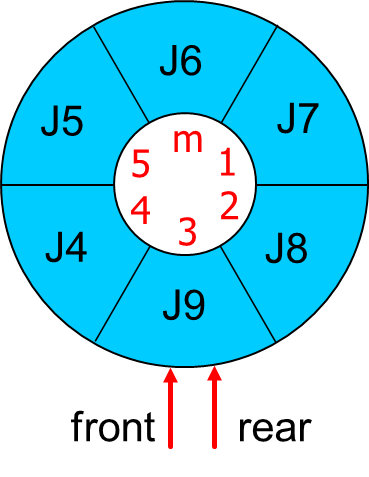
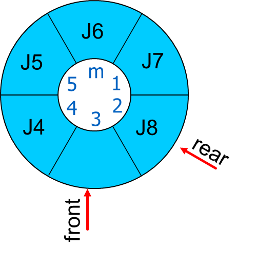
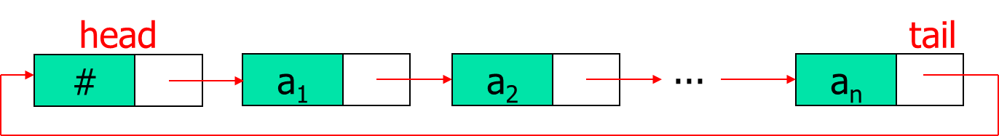

# 期末复习（下）
## 1 数据结构——数组，队列，堆栈
### 1.1 顺序存储结构
#### 1.1.1 数组array
数组的定义
```C
类型名 数组名[数组长度];
int a[10];
```
数组的初始化
```C
类型名 数组名[数组长度(可省略)] = {元素1, 元素2, ...};
int a[5] = {1, 2, 3, 4, 5};
int b[ ] = {1, 2, 3, 4, 5};
int c[5] = {1, 2, 3};        // 其余元素为0
```
**元素类型为数组**的数组被称为**高维数组**
```C
int a[][];

int b[3][];

int c[][4];

int d[3][4];

int e[][] = {
    {1, 2, 3, 4},
    {5, 6, 7, 8},
    {9, 10, 11, 12}
};

int f[][4] = {
    {1, 2, 3, 4},
    {5, 6, 7, 8},
    {9, 10, 11, 12}
};
```
#### 1.1.2 队列queue
**循环队列**
-一般队列存在一个问题？假溢出
-循环队列可以解决这个问题：
其中rear=(rear+1)%m
front=(front+1)%m 
-队空？rear=front;

-队满？rear=front;

-如何区分队空与队满？
方法1-定义1个标志符s，s=0表示队空，s=1表示队非空
方法2-引入队列长度的变量，长度为0表示队空，长度达到存储空间最大值表示队满
方法3-多加1个存储单元（不用来放数据），用front=rear表示队空，front=(rear+1)%m表示队满


**初始化**
```
void initqueue(int **q,int m,int *rear,int *front)
{
    *q=(int *)malloc(m * sizeof(int));  //动态申请容量为m的存储空间
    *front=0;     //队头指针的指针
    *rear=0;      //队尾指针的指针
}
```
**入队**
```
void enqueue(int *q, int m, int *front, int *rear, int *s,int x )
{
    if((*s == 1)&&(*rear == *front))  //*s为flag，判队列满(方法1)
    {
        printf("Queue overflow!");
        return;
    }
    q[*rear]=x; *s=1;       //入队，置队列非空标志
    *rear=(*rear+1)%m; 		  //序号循环        	
}
```
**出队**
```
int dequeue(int *q, int m, int *front, int *rear, int *s ) 
{    
    int y;
    if(*s == 0) 	        //判队列空(方法1)
    {
        printf("Queue underflow!");
        return -11111;
    }
    y=q[*front];		  //退队
	*front=(*front+1)%m ;		  //序号循环
	if(*front == *rear)  *s=0;      //置队列空标志
    return y; 	          	
}
```
**销毁**
```
void destroyqueue(int **q,int *front,int *rear)
{
    free(*q);     // 释放内存
    *q=NULL;    // 将指针置NULL（安全）
    *front=0;
    *rear=0;
}
```
| 操作 | 二级指针？ | 原因 |
|------|----------------|------|
| **初始化** | 需要 | 要为指针分配内存，需要修改指针本身 |
| **入队** | 不需要 | 只需要操作已分配数组的元素 |
| **出队** | 不需要 | 只需要操作已分配数组的元素 |
| **销毁** | 需要 | 要释放内存并将指针置NULL |

#### 1.1.3 堆栈stack
**初始化**
```
void initstack(int **s,int m,int *top)
{
    *s=(int *)malloc(m * sizeof(int));  //动态申请容量为m的存储空间
    *top=0;     //栈顶指针
} 
```
**入栈**
```
void push(int *s,int m,int *top,int x) 
{
    if(*top == m)     //栈满
    {
        printf("Stack overflow!");
        return;
    }
    s[*top]=x;      //入栈	
    *top=*top+1; 	   //序号指针递增
} 	
```
**出栈**
```
int pop(int *s,int m,int *top) 
{
    int y;
    if(*top == 0)      //栈空
    {
        printf("Stack underflow!");
        return;
    }
    y=s[*top-1];       //退栈
    *top=*top-1; 	   //序号指针递减
    return(y); 	       //返回栈顶元素
}
```
**销毁**
```
void destroystack(int **s, int *top) {
    if(*s != NULL)  //检查指针是否有效
    {      
        free(*s);          //释放内存
        *s=NULL;         //将指针置为NULL，防止野指针
    }
    *top=0;              //重置栈顶指针
}
```
#### 1.1.4 例
**中缀表达式求值**
**问题**：计算中缀表达式（如 `3+4*2/(1-5)^2`）的值。
**算法思路（双栈法）**：

运算符比较：

**核心数据结构设计**：
```c
// 操作数栈
typedef struct {
    double *data;     // 存储操作数的数组
    int top;          // 栈顶指针
    int capacity;     // 栈容量
} OperandStack;
// 运算符栈  
typedef struct {
    char *data;       // 存储运算符的数组
    int top;          // 栈顶指针
    int capacity;     // 栈容量
} OperatorStack;
```
**算法核心代码**：
```c
double EvaluateExpression()  //核心函数，参考PPT的内容 
{
    int topTR=0;
    int topND=0;
    char *OPTR;
    double *OPND;
    int n=10000;
    char c;
    char theta,x;
    double a,b,result;
    InitStack(&OPTR,n,&topTR);
    Push(OPTR,&topTR,'\n'); 
    InitDoubleStack(&OPND,n,&topND);
    c=getchar();  //初始化两个栈 
    while(c!='\n' || GetTop(OPTR,&topTR)!='\n')
    {
        if (c>='0' && c<='9')  //如果是数字的话 
        {
            double num=c-'0';  //先将字符转换为double类型，这里只有0-9的整数所以能直接换 
            PushDouble(OPND,&topND,num);  //压入double栈 
            c=getchar();
        }
        else  //如果是其他（错误的输入符号或者是运算符）的话 
        {
            switch(Precede(GetTop(OPTR,&topTR),c))  //判断情况：新拿的运算符和char栈顶的运算符的优先级，通过Precede函数 
            {
                case -1: //如果栈顶元素优先级低，将新运算符入栈 
                    Push(OPTR,&topTR,c);
                    c=getchar();
                    break;
                case 0: //脱'('和')' 
                    Pop(OPTR, &topTR, &x);
                    c=getchar();
                    break;
                case 1: //栈顶元素优先级高，栈顶运算符退栈，double栈也退栈，进行运算，并将运算结果入double栈
                    Pop(OPTR,&topTR,&theta);
                    PopDouble(OPND,&topND,&b);
                    PopDouble(OPND,&topND,&a);
                    result=Operate(a,theta,b);
                    PushDouble(OPND,&topND,result);
                    break;
                default:  //其他情况（相当于case 2:），不是规定的运算符，或表达式有问题使两个没法比较的运算符进行比较 
                    return -100000;
                    break;
            }
        }
    }
    return GetTopDouble(OPND, &topND);
}
```

### 1.2 链式存储结构(链表)
#### 1.2.1 链式存储结构基础
**头结点Header Node**：一个附加在链表第一个元素之前的特殊链结点。

其指针域指向链表中第一个存放实际数据元素的结点（即首元结点）。
**头指针 (Head Pointer)**：指向链表第一个结点的指针。若链表包含头结点，则头指针指向头结点；若不包含，则头指针直接指向首元结点。

#### 1.2.2 链表的基本运算
**结点定义**
```c
//定义链表结点结构
typedef struct Node {
    int data;           //数据域
    struct Node *next;  //指针域，指向下一个结点
}Node, *LinkList;
```
**初始化 - 带头结点的空链表**
```c
//初始化链表：创建头结点
void InitList(LinkList *L){
    *L=(LinkList)malloc(sizeof(Node));  //分配头结点空间
    (*L)->next=NULL;     //头结点指针域置空，表示空链表
    (*L)->data=0;
}
```
**插入**
**(1)按位置i插入**
```c
//在第i个位置插入元素e（头结点算第0个位置）
void ListInsert(LinkList L, int i, int e,int *flag){
    Node *p=L;        // p指向头结点
    int j=0;
    // 寻找第i-1个结点
    while(p!= NULL&&j<i-1){
        p=p->next;
        j++;
    }
    // 判断i是否合法
    if (p == NULL||j>i-1){
        printf("插入位置i不合法！\n");
        *flag=0;       // 插入失败
    }
    // 创建新结点
    Node *s=(Node *)malloc(sizeof(Node));
    // 插入新结点
    s->data=e;        // 设置新结点数据
    s->next=p->next;  // 步骤1：新结点指向原后继
    p->next=s;        // 步骤2：前驱指向新结点
    *flag=1;           // 插入成功
}
```
**(2)头插法（在链表头部插入）**
```c
//在链表头部插入新结点（头插法）
void HeadInsert(LinkList L, int e){
    Node *s=(Node *)malloc(sizeof(Node));
    s->data=e;        // 设置新结点数据
    s->next=L->next;  // 新结点指向原第一个结点
    L->next=s;        // 头结点指向新结点
}
```
**(3)尾插法（在链表尾部插入）**
```c
// 在链表尾部插入新结点（尾插法）
void TailInsert(LinkList L, int e){
    Node *s=(Node *)malloc(sizeof(Node));
    s->data=e;        // 设置新结点数据
    s->next=NULL;     // 新结点是尾结点
    // 找到尾结点
    Node *p=L;
    while(p->next != NULL){
        p=p->next;
    }
    p->next=s;        // 原尾结点指向新结点
}
```
**删除**
**(1)按位置i删除**
```c
// 删除第i个位置的元素，并返回其值
int ListDelete(LinkList L, int i, int *flag){
    int e=0;
    Node *p=L;        // p指向头结点
    int j=0;
    // 寻找第i-1个结点
    while(p->next!=NULL&&j<i-1){
        p=p->next;
        j++;
    }
    // 判断i是否合法
    if (p->next==NULL||j>i-1){
        printf("删除位置i不合法！\n");
        *flag=0;       // 删除失败
        return -1;
    }
    // 删除操作
    Node *q=p->next;  // q指向要删除的结点
    e=q->data;        // 保存被删除结点的值
    p->next=q->next;  // 将q从链中摘除
    free(q);          // 释放结点内存
    *flag=1;
    return e;         // 删除成功
}
```

**(2) 按值删除**
```c
// 删除第一个值为e的结点
void DeleteByValue(LinkList L, int e,int *flag){
    Node *p=L;
    // 寻找值为e的结点的前驱
    while(p->next!=NULL&&p->next->data!=e){
        p=p->next;
    }
    // 判断是否找到
    if (p->next==NULL) {
        printf("未找到值为%d的结点\n", e);
        *flag=0;
    }
    // 删除操作
    Node *q=p->next;  // q指向要删除的结点
    p->next=q->next;  // 将q从链中摘除
    free(q);            // 释放结点内存
    *flag=1;
}
```

#### 1.2.3 特殊链表
**循环链表Circular Linked List**

结构：在单链表的基础上，将最后一个结点的指针域指向头结点（或首元结点），形成一个环。
特点：
* 从表中任一结点出发，均可访问到链表中所有其他结点。
* 判断链表遍历结束的条件不再是`p->next == NULL`，而是`p->next == head`（指向头结点）。

**双向链表Doubly Linked List**

结构：链结点updated,包含三个域：数据域(`data`)、指向直接前驱的指针域(`prior`)、指向直接后继的指针域(`next`)。
优势：
* 可以双向遍历链表。
* 插入和删除操作时，能更方便地定位前驱结点
但相对的，指针的修改也更为复杂，需要修改两个方向的指针：
* **插入操作示例**
    `s->next = p->next;`
    `p->next->prior = s;`
    `s->prior = p;`
    `p->next = s;`
* **删除操作示例**
    `p->prior->next = p->next;`
    `p->next->prior = p->prior;`
    `delete p;`

#### 1.2.4 应用示例：一元多项式的加法
**问题**：实现一元多项式$P(x) = p_0 + p_1x + p_2x^2 + ... + p_nx^n$的加法运算。
**链表的结点设计**：
```c
typedef struct node
{
    double coef;  // 系数 (coefficient)
    int exp;      // 指数 (exponent)
    node* next;   // 指向下一个项的指针
} PolyNode;
```
**算法思路**：
1.初始化：`pa`和`pb`分别指向A和B链表的第一个结点（非头结点）。新建结果多项式C（带头结点），`pc`指向C的头结点。
2.遍历与比较：当`pa`和`pb`均未到达链表尾时，循环比较`pa`和`pb`所指结点的指数：
    * 若 `pa->exp < pb->exp`：将`pa`所指结点复制（或链接）到`pc`之后，`pa`和`pc`后移。
    * 若 `pa->exp > pb->exp`：将`pb`所指结点复制（或链接）到`pc`之后，`pb`和`pc`后移。
    * 若 `pa->exp == pb->exp`：计算系数和 `sum_coef = pa->coef + pb->coef`。
        * 若`sum_coef != 0`：生成新结点（`sum_coef, pa->exp`）并链接到`pc`之后，`pc`后移。
        * 无论和是否为0，`pa`和`pb`均后移。
3.处理剩余项：将`pa`或`pb`中剩余未处理的结点依次复制（或链接）到结果链表的尾部。
4.结束：将结果链表的尾结点指针置为`NULL`。

**算法核心代码**：
```c
while(pa!=NULL&&pb!=NULL){
    if(pa->exp<pb->exp){
        //将pa结点插入C
        pc->next=new PolyNode(pa->coef, pa->exp, NULL);
        pc=pc->next;
        pa = pa->next;
    }
    else if(pa->exp>pb->exp){
        //将pb结点插入C
        pc->next=new PolyNode{pb->coef, pb->exp, NULL};
        pc=pc->next;
        pb=pb->next;
    } else{ //指数相等
        double sum=pa->coef+pb->coef;
        if (fabs(sum)>1e-6){ // 判断系数和不为0
            pc->next=new PolyNode(sum, pa->exp, NULL);
            pc=pc->next;
        }
        pa=pa->next;
        pb=pb->next;
    }
}
// 将A或B的剩余部分链接到C
pc->next=(pa!=NULL)?pa:pb;
```

## 2 排序、查找
### 2.1 排序sort
**冒泡排序Bubble Sort**
重复遍历数组，依次比较相邻元素，将较大元素"冒泡"到数组末尾
核心操作：相邻元素比较交换
优化：可设置标志位记录是否发生交换，提前结束排序
**选择排序Selection Sort**
每次从未排序部分选择最小（或最大）元素，放到已排序部分的末尾
核心操作：选择最小元素并交换
**归并排序Merge Sort**
采用分治法，将数组递归地分成两半分别排序，然后合并两个有序数组
核心操作：合并两个有序序列
**插入排序Insertion Sort**
将数组分为已排序和未排序两部分，每次将未排序部分的第一个元素插入到已排序部分的适当位置
核心操作：在已排序序列中查找插入位置
**快速排序Quick Sort**
选取基准元素，将数组分为比基准小和比基准大的两部分，递归地对两部分排序
核心操作：分区操作
**性能比较**
|   算法   | 平均时间复杂度 | 最好情况 | 最坏情况 | 空间复杂度 | 稳定性 | 
| :------: | :------------: | :------: | :------: | :--------: | :----: | 
| 归并排序 |   $O(n\log n)$  | $O(n\log n)$ | $O(n\log n)$ |  $O(n)$   |  稳定  | 
| 快速排序 |   $O(n\log n)$  | $O(n\log n)$ |  $O(n^2)$  | $O(\log n)$ | 不稳定 | 
| 冒泡排序 |    $O(n^2)$    |  $O(n)$  | $O(n^2)$ |  $O(1)$   |  稳定  |
| 选择排序 |    $O(n^2)$    | $O(n^2)$ | $O(n^2)$ |  $O(1)$   | 不稳定 | 
| 插入排序 |    $O(n^2)$    |  $O(n)$  | $O(n^2)$ |  $O(1)$   |  稳定  | 

### 2.2 查找search
**顺序查找Sequential Search**
从数据结构的一端开始，逐个检查每个元素，直到找到目标元素或遍历完所有元素
核心操作：逐个比较
**二分查找Binary Search**
在有序数组中，每次与中间元素比较，根据比较结果缩小一半搜索范围
核心操作：与中间元素比较并缩小范围
前提条件：数据必须有序
**性能对比**
|   算法   | 平均时间复杂度 | 最好情况 | 最坏情况 | 空间复杂度 | 适用条件 | 主要特点 |
| :------: | :------------: | :------: | :------: | :--------: | :------: | :------ |
| 顺序查找 |    $O(n)$     |  $O(1)$  |  $O(n)$  |  $O(1)$   | 任意数据 | 简单通用，效率低 |
| 二分查找 |  $O(\log n)$  | $O(1)$ | $O(\log n)$ | $O(1)$ | 有序数据 | 效率高，要求数据有序 |

## 3 应试部分——编程题部分的复习与做题技巧
**编程题常见题型与考点**
通常考查：
- **经典问题**
- **链表操作**（建立、插入、删除、遍历）
- **递归与函数调用**
- **基本算法**（排序、查找）

**考前复习重点**
1. **熟悉数据结构操作**
   - 数组：遍历、查找、排序
   - 链表：掌握插入、删除、遍历的代码
   - 字符串：常用函数strlen、strcpy、strcmp等或手写实现
2. **递归与函数调用**
   - 掌握递归边界条件与递归公式
   - 理解局部变量、静态变量、全局变量的作用域与生命周期
   - 熟悉经典例子：Hanoi Towel
3. **熟练基本算法**
   - 二分查找（有序数组）
   - 简单排序（冒泡、选择、插入）
   - 其他经典算法

**编程题做题技巧**
   - 明确输入输出格式(空格、换行、标点符号要与题目要求完全一致，可先复制输出样例到调试框进行对比，可以看空格)
   - 判断是否需要处理边界条件（如空输入、最大/最小值）
   - 添加临时输出语句检查变量值（写一个比较易错的函数时）
   - 注意常见语法与逻辑错误（数组越界、指针初始化、循环条件）

**祝大家考试顺利！**
