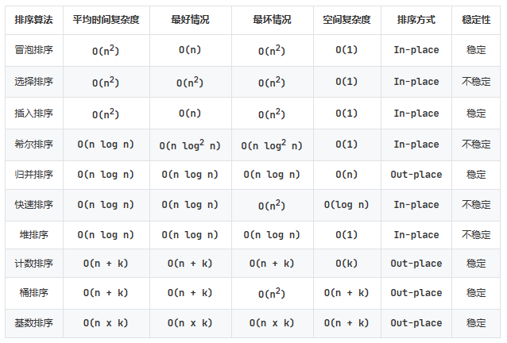

# 历年卷经典题目解析

## 程序设计基础常问题目集及解析

这里是作为 2022 年竺院团委学研部程序设计辅学答疑学长时整合的群里经常问到的一些问题，包括解析，也有一些相关知识点的整理。大部分题目是 13-18 的期末真题，小部分中文题目是群里我不清楚来源的 PTA 上的题目或者我自己编的小题。一共五十道题，已经按照考点/易错点分开了。

### 标识符/关键字

这类题目一般是问哪些是合法的标识符、哪些是关键字。对于标识符，只需要考虑 `int <identifier>;` 是否合法，如果合法，那 `<identifier>` 就是合法的标识符（或者考虑是不是关键字，如果是关键字，那肯定不是合法的标识符）。至于关键字，可以看 [cppreference](https://en.cppreference.com/w/c/keyword)。 

1. (C13A) Which one below is NOT a keyword of the C programming language? _____
    <div style="display: flex">
    <div style="width: 100%">A. define</div>
    <div style="width: 100%">B. if</div>
    <div style="width: 100%">C. typedef</div>
    <div style="width: 100%">D. while</div>
    </div>

    !!! success ""
        `define` 不是关键字，是预处理指令，你甚至可以 `int define;` 而 `if`、`typedef`、`while` 显然都是关键字。

2. (C14A) Which one below is NOT a valid identifier in the C programming language? _____
    <div style="display: flex">
    <div style="width: 100%">A. printf</div>
    <div style="width: 100%">B. _ever</div>
    <div style="width: 100%">C. "char"</div>
    <div style="width: 100%">D. true</div>
    </div>  

    !!! success ""
        显然选择 C，因为 `int "char";` 肯定是非法的，标识符**必须以字母或下划线开头**。对于 A，printf 只是一个函数名，不是关键字，所以是合法的。对于 D，C 语言中 true 并不是关键字，也可以使用。

### "加括号"问题
即指表达式中运算符优先级等问题，例如给一个复杂的没有括号的表达式，这时严格按照优先级规则给表达式各个部分加上括号，结果就清晰了。

关于优先级的题目这里就不列了，可以去查阅[修佬的 note](https://note.isshikih.top/cour_note/D1QD_CXiaoCheng/#%E8%BF%90%E7%AE%97%E7%AC%A6%E4%BC%98%E5%85%88%E7%BA%A7%E5%90%8C%E7%BA%A7%E9%81%B5%E5%BE%AA%E7%BB%93%E5%90%88%E6%96%B9%E5%90%91%E8%A7%84%E5%BE%8B)，里面写的很清晰了。

这里给出两道和三目运算符 ?: 有关的题目。

3. (C18A) Given: `int a=1,b=2,c=3,d=4;`, the value of the expression `a<b?a:c<d?c:d` is _____.

    !!! success ""
        对于三目运算符，你需要知道**一个 ? 肯定要和后面的一个 : 进行配对**  
        那么 `c<d?c:d` 这部分一定是一体的，可以给它左右加上括号，就变成了 `a<b?a:(c<d?c:d)`，就已经很清晰了。  
        所以这个表达式的值：a<b 成立，选择第一个结果也就是 a，答案是 1

4. 若定义 `int a=1,b=2,c=3,d=4` 那么表达式 `(a>b?c>a?c-3:c-1:b==c?d-a:d-c)` 的值为 _____.

    !!! success ""
        和上面同理，不过有些复杂。但是这个三目运算符的配对过程我们可以类比为括号匹配。将 ? 视为左括号 (，: 视为右括号 )，那么一个 ? 应该和哪个 : 配对就清晰了。
        ```text
        (a>b?c>a?c-3:c-1:b==c?d-a:d-c)
            (   (   )   )    (   )
            |   +---+   |    +---+
            +-----------+
        ```
        知道了 ? 和 : 配对关系之后就能正确划分结构了：
        ```c 
        a>b? (c>a?c-3:c-1) : (b==c?d-a:d-c)
        ```
        所以 a>b 不成立，选择后者，b==c 不成立，再选择后者，答案是 d-c=1

### 数据类型及字面量
几个常见的数据类型一定要知道它们占几个字节的大小。并且在表达式中也要时刻注意常量的类型（如第九题）。

字面量即一个值的表示方法：

- 整型：123 表示十进制 123；0123 是八进制的表示方法（开头一定加 0，0123 等价于 83），0x123 是十六进制的表示方法（开头一定加 0x，0x123 等价于 291）
- 字符型：
    - 记住一个字符类型实际上就相当于一个字节的整型，所以可以通过数值来表示：char c = 65; 就相当于 char c = 'A';
    - 同时 \ 在引号里有转义的效果，比如 '\n' '\t' 都代表一个字符，而 '\\\\' 才会表示一个 \ 字符；
    - 再进一步，\ 后面可以接最多三个数字来使用八进制表示一个字节，且遇到 0-7 范围之外的数字会结束当前字节，比如 '\101' 也表示 'A'，而 '\08' 因为 8 超过了八进制范围，所以这是两个字符放到了一个单引号里，不是正确的用法，如果写成字符串，则 "\08" 表示两个字符；
    - \x 后面接 0-9A-F 字符通过十六进制来表示一个字符。不过并不会有长度限制，比如 '\x00000041' 也是一个字符，同样遇到范围外的字符就结束。

5. (C13A) For code below:
    ```c
    unsigned short sht = 0;
    sht--;
    ```
    What will be the value of `sht` after the execution? _____
    <div style="display: flex">
    <div style="width: 100%">A. -1</div>
    <div style="width: 100%">B. 65535</div>
    <div style="width: 100%">C. 32767</div>
    <div style="width: 100%">D. 65536</div>
    </div>

    !!! success ""
        sht 是 unsigned short 类型，是两个字节的，所以范围为 0-65535。  
        无符号整型从 0 减去 1 会**下溢**到最大值，对于此题也就是 65535，选 B

6. (C13A) Which literal below is 124 in decimal(十进制)? _____
    <div style="display: flex">
    <div style="width: 100%">A. 0124</div>
    <div style="width: 100%">B. 124d</div>
    <div style="width: 100%">C. 0x124</div>
    <div style="width: 100%">D. 0174</div>
    </div>

    !!! success ""
        根据前面说到的，A. 0124 是八进制表示法，它等于十进制的 84；B. 124d 没有这种表示方法，是语法错误的；C. 0x124 是十六进制表示法，等于十进制的 292；D. 0174 八进制，等于十进制 124，选 D

7. (C16A) In the following notations, _____ can express a character constant(字符常量) correctly.
    <div style="display: flex">
    <div style="width: 100%">A. '\x100'</div>
    <div style="width: 100%">B. 125</div>
    <div style="width: 100%">C. '\08'</div>
    <div style="width: 100%">D. '\'</div>
    </div>

    !!! success ""
        A. '\x100' 是十六进制表示法，但是超出了一个字节的范围，是语法错误的；B. 125 通过一个整数表示一个字符，而且在 ASCII 码范围内，肯定是合法的（实际上表示的就是字符 '}'）；C. '\08' 前面说过了，\0 8 是两个字符，挤到了一个单引号里，是错误的用法；D. '\\' 中 \ 会将 ' 转义，所以相当于这个单引号没有闭合，是语法错误的。所以选 B。

8. (C17A) In the following notations, _____ can NOT express a single-character constant(单字符常量) correctly. 
    <div style="display: flex">
    <div style="width: 100%">A. '%c'</div>
    <div style="width: 100%">B. 127</div>
    <div style="width: 100%">C. '\077'</div>
    <div style="width: 100%">D. 55</div>
    </div>

    !!! success ""
        A. '%c' 同样是两个字符挤到了一个单引号里，是错误用法；BCD 都可以表示一个字符，所以选 A

9. 以下表达式哪个是不正确的 _____.
    <div style="display: flex">
    <div style="width: 100%">A. 0.5%2</div>
    <div style="width: 100%">B. 3&(0.5+0.5)</div>
    <div style="width: 100%">C. 4.6<<2</div>
    <div style="width: 100%">D. 2==(3/2)</div>
    </div>

    !!! success ""
        要注意运算符两侧的数据类型，只有 D 的 == 两侧都是 int，是合法的。而 ABC 的操作数都出现了 double 类型，% & << 运算符不能用在 double 上，语法错误。


### 数组与指针

指针是 C 语言的灵魂，也是考试常考易错的知识点，特别是和数组一起出现时。

几个需要记住的知识点：**a[b] 和 \*(a+b) 在使用时完全等价**；**二维数组无法退化为二级指针**；**数组名不能被重新赋值**。

<style>
.md-typeset ol {
    padding-left: 0.5em;
}
</style>

10. (C13A) Given the declaration: `int a[10], *p=a;`，the expression _____ is NOT correct.
    <div style="display: flex">
    <div style="width: 100%">A. a[9]</div>
    <div style="width: 100%">B. p[5]</div>
    <div style="width: 100%">C. *p++</div>
    <div style="width: 100%">D. a++</div>
    </div>

    !!! success ""
        a 是一个数组，p 是一个指针，将 a 赋值给 p 时即将 a 的首地址赋值给 p。
        a[9] 肯定是合法的，因为 p[5] 等价于 \*(p+5)，也是合法的，\*p++ 取了当前 p 指向的值，并将 p 指针 ++，是合法的。
        而 D. a++ 中包含了对 a 的重新赋值（将 a+1 赋值给 a），由于数组名不能被赋值，所以是错误的，选 D。

11. (C13A) Given the declaration: `int a[3][3]={1,2,3,4,5,6,7,8,9};`, the value of `a[-1][5]` is _____.

    !!! success ""
        首先来看 a[-1]，即 *(a-1)，a-1 会以三个 int 为单位向左移动，即 *(a-1) 是一个指向如下位置的指针：
        ```text
           0 0 0 1 2 3 4 5 6 7 8 9
           ^
           |
        *(a-1) = p
        ```
        现在我们将 a[-1] 也就是 *(a-1) 视为 p，那我们要找的结果就是 p[5]，此时 p 是一个指向 int 类型的指针，\*(p+5) 就相当于找到它指向的位置右侧第 5 个 int 的值，也就是 3。

12. (C14A) Given the declaration: `int a[3][2]={1,2,3,4,5,6};` what is the value of expression `(a[1]+1)[0]`? _____.

    !!! success ""
        同上题一样分析即可，时刻记得 a[b] 等价于 \*(a+b)。以下是贺老师曾经的图：
        ```text
        a -> {
        a[0] -> {1, 2}
        a[1] -> {3, 4}
                    ^
                    +--- a[1] + 1
        a[2] -> {5, 6}
             }
        ```
        所以 (a[1]+1)[0] 就是 \*(a[1]+1) = 4

13. (C15A/C16A) For the declarations: `char *s, str[10];`, statement _____ is completely correct.
    <div style="display: flex">
    <div style="width: 100%">A. strcpy(s, "hello");</div>
    <div style="width: 100%">B. str="hello"+1</div>
    </div>
    <div style="display: flex">
    <div style="width: 100%">C. s=*&(str+1)</div>
    <div style="width: 100%">D. s=str+1</div>
    </div>

    !!! success ""
        这里涉及到了一个野指针的问题，下面会专门有一个部分

        A. 将 "hello" 拷贝到 s 指向的空间。但是 s 指向什么呢？你并不清楚，也就是说 s 是一个野指针，你不清楚它指向哪里，也就自然不能向它指向的空间中写入数据  
        B. str 是一个数组，数组名不能被赋值，所以是错的  
        C. str+1 不能被取地址，因为这是计算过程中的一个数，而不是实际存在内存中的数，所以是错的  
        D. str+1 表示的就是 str 数组中第二个元素的地址，将其赋值给 s，是正确的

14. (C16A) Given: `double a[]={1, 2, 3, 4, 5};`, the value of expression `(int)&a[3] - (int)&a[0]` is _____
    
    !!! success ""
        由于数组中的元素都是连续存储的，所以 a[3] 的地址减去 a[0] 的地址就是 a[3] 与 a[0] 之间的距离，也就是 3 个 double 类型的大小，即 3 * sizeof(double) = 24

        这里需要和 17 题进行一下对比，17 题里我们再详细说明

15. (C17A) The following code fragment will output _____.
    ```c 
    char *week[]={"Mon", "Tue","Wed","Thu","Fri","Sat","Sun"}, **pw=week;
    char c1, c2;
    c1 = (*++pw)[1];
    c2 = *++pw[1];
    printf("%c#%c#", c1, c2);
    ```
    
    !!! success ""
        首先 c1 = (\*++pw)[1]，++pw 使 pw 指向了 week[1]，然后 (\*++pw) 就是 week[1]，再 [1] 就是 week[1][1] 也就是 'u'  
        然后 c2 = \*++pw[1]，这里的理解方式一定是对 pw[1] 进行 ++，pw[1] 此时是 week[2]，然后将其自增得到指向 week[2][1] 的指针，再解引用得到 'e'

16. (C17A) For the declaration: `int a[3][4]={{0,1,2},{4,5,6},{7,8}};`, the value of the element of `a[1][-2]` is _____. 

    !!! success ""
        和 11、12 题类似分析即可
        ```text
        a -> {
            a[0] -> {0, 1, 2, 0}
                           ^
                           +---- a[1][-2]
            a[1] -> {4, 5, 6, 0}
            a[2] -> {7, 8, 0, 0}
        }
        ```

17. 以下代码的输出为 _____.
    ```c 
    int a[] = {1, 2, 3, 4, 5};
    int *p = a, *q = &a[2];
    printf("%lu", q-p);
    ```
    
    !!! success ""
        首先这道题的输出是 2 而不是 2*sizeof(int)=8，因为 q、p 指针相减的意义实际上是计算两个指针差了几个“单位”的距离，这里一个单位就是一个 int 的长度，它们差了两个 int，所以是 2

        指针相减并不是将其值（也就是地址）相减，如果这是预期行为，那么应该使用以下两种写法：
        ```c 
        printf("%d", (int)q - (int)p); // 即 14 题中写法
        printf("%d", (char*)q - (char*)p); // 转为 char* 类型指针，单位就是一个字节，和地址相减效果相同
        ```

18. 以下哪个定义中 p 不是指针 _____.  
    A. char \*\*p;  
    B. char (\*p)[10];  
    C. char \*p[6];  
    D. 前三项中 p 都是指针

    !!! success ""
        详细分析可以看贺老师《浅谈 C 语言的数据类型》中描述的 Clockwise/Spiral Rule

        A 中 p 显然是一个二级指针，B 中 p 是一个指向长度为 10 的数组的指针，C 中 p 是一个长度为 6 的指针**数组**（即一个数组，内部元素是指针）

        还有一点要注意，**数组和指针是两种类型**

19. 对于函数声明 `void f(char **p)`，以下哪个 var 的定义会使 f(var) 语法错误 _____.  
    A. char var[10][10];  
    B. char \*var[10];  
    C. void \*var = NULL;  
    D. char \*v=NULL, \*\*var=&v;

    !!! success ""
        BD 一般没什么问题，大部分同学不理解 A 和 C

        A. **二维数组不能退化为二级指针**，所以肯定是错的  
        C. 在 C 语言中，void\* 表示「指向任意类型的指针」，而这个「任意类型」也可以是 char\*（即指向 char 的指针），所以它可以代表「指向指向 char 的指针的指针」（char\*\*），所以是对的

20. 对于定义 `char s[2][3] = {"ab", "cd"}, *p=(char*)s`，以下哪个表达式是正确的且值等于 s[1][1] _____.
    <div style="display: flex">
    <div style="width: 100%">A. \*(s+3)</div>
    <div style="width: 100%">B. \*s+2</div>
    <div style="width: 100%">C. p[1][1]</div>
    <div style="width: 100%">D. \*++p+2</div>
    </div>

    !!! success ""
        ```text
        s -> {
            s[0] -> {'a', 'b', '\0'}
            s[1] -> {'c', 'd', '\0'}
        }
        ```
        A. *(s+3) 等价于 s[3]，首先类型上它就不对  
        B. 同样 \*s+2 也是指针，类型上就肯定不对  
        C. p 此时是 char\* 类型，不能进行两次解引用，语法错误  
        D. ++p 将 p 指到了 'b' 头上，解引用得到 'b' 再加二得到 'd' 等于 s[1][1]，选 D


### 字符串相关

字符串也是一个很容易出错的考点，我推荐的理解方式是：C 语言中不存在字符串，只有字符数组，而字符串是一种对于字符数组的人为理解方式，即从开头直到第一个 '\0' 标志了一个字符串。所以 "abc" 和 {'a', 'b', 'c', '\0'} 是等价的。

另一个需要牢记的知识点是，当程序中出现字符串常量的时候，要将其视为**指向该字符串的首字符的指针**来处理。而且在初始化字符数组时除外（char s[] = "abc"; 并不是把 "abc" 首字符地址赋值给了 s）。

对于 char *s = "abc" 和 char s[] = "abc" 我们在第 31 题中再详细进行区分。

21. (C13A) Given: `char format[] = "No.%d%c"`; the statement `printf(format, 3, *("xyz"+2));` will print out _____.

    !!! success ""
        "xyz" 这里当作指向 'x' 的指针，加 2 则指到了 'z'，解引用就得到了 'z' 这个字符。所以输出为 No.3z

22. (C14A/C15A) Given the following code fragment, the loop condition `str[i]!='\0'` could be replaced by
which choice? _____.
    ```c
    char str[20]="hello, world";
    for (i = 0; str[i] != '\0'; i++) putchar(str[i]);
    ```
    <div style="display: flex">
    <div style="width: 100%">A. str[i]</div>
    <div style="width: 100%">B. i < 20</div>
    <div style="width: 100%">C. !(str[i] = '\0')</div>
    <div style="width: 100%">D. i <= 20</div>
    </div>
    
    !!! success ""
        还要记住的一点是，'\0' 就是 0，所以这题里 str[i] != '\0' 和 A 是完全等价的。（C 差了一个等号）  
        B 错误的原因是，'\0' 也是字符，这样就一定会输出 20 个字符来，即使实际上你看不见 '\0' 这个字符，但它们确实被输出了

23. (C14A) The value of expression `!*("2015-01-28"+5)` is _____

    !!! success ""
        **字符串常量出现在程序里当作指向首字符的指针处理**，所以 "2015-01-28"+5 即表示指向 '0' 位置的指针，解引用得到 '0'。所以这题化为了 !'0' 的值。

        一定要区分清楚 '0' 和 '\0'，'0'==48 而 '\0'==0，所以 !'0' 是 !48 即 0

24. (C14A) The output of the code below is _____.
    ```c
    char x[] = "hello,world\012345";
    printf("%d#%d#"，sizeof(x)，strlen(x));
    ```

    !!! success ""
        复习一下前面说过的字符字面量的表示

        这里 x 就相当于 'h', 'e', 'l', 'l', 'o', ',', 'w', 'o', 'r', 'l', 'd', '\012', '3', '4', '5', '\0'，所以 sizeof(x) 计算占了多少空间，一共 16 个字节，结果为 16。而 strlen(x) 计算第一个 '\0' 前有几个字符，这里有 15 个（'\012' 中的 \0 并不算 '\0'）， 结果为 15。

25. (C17A) The value of expression `!"01-21-2018"[7]` is _____

    !!! success ""
        同 23 题，这里 "01-21-2018"[7] 指向了 '0'，!'0' 为 0

26. (C17A) Given: `char s[]="123\029\08";`, then `sizeof(s)` and `strlen(s)` will be _____ respectively.

    !!! success ""
        同 24 题，这里 s 字符数组相当于 '1', '2', '3', '\02', '9', '\0', '8', '\0'，一共 8 个，所以 sizeof(s) 为 8。第一个 '\0' 前有 5 个，所以 strlen(s) 为 5。

27. (C17A) The value of expression `strcmp("abcabc","aabbcc"+1) < 0` is _____.

    !!! success ""
        strcmp(s1, s2) 当 s1 < s2 时返回一个负数，当 s1 > s2 时返回一个正数，当 s1 == s2 时返回 0。所以这题相当于比较 "abcabc" 和 "abbcc"，"abcabc" > "abbcc"，所以返回一个正数，结果为 0

        具体字符串比较大小的方式称为“字典序”，也就是说假设这两个字符串在英文词典中，那么它们的大小关系就是在词典中出现的先后关系（先出现的小）

28. (C18A) The value of expression `!("01/24/2019"+5)[5]` is _____.

    !!! success ""
        同 23 题，这里相当于 !\*("01/24/2019"+10)。其中字符串加 10 后指向了结尾隐藏的 '\0'，而 '\0' 就是 0，所以取反为 1

29. 以下代码段的输出为 _____.
    ```c 
    char c[] = "I\t\r\\\0will\n";
    printf("%d", strlen(c));
    ```

    !!! success ""
        同 24 题，这里 c 字符数组相当于 'I', '\t', '\r', '\\', '\0', 'w', 'i', 'l', 'l', '\n', '\0'，第一个 '\0' 前有 4 个，所以 strlen(c) 为 4。

30. 以下代码段的输出为 _____.
    ```c
    char a[] = "abc";
    char b[] = {'a', 'b', 'c'};
    printf("%d#%d#", sizeof(a), sizeof(b));
    ```

    !!! success ""
        "abc" 可以当作 {'a', 'b', 'c', '\0'}，所以 sizeof(a) 为 4，sizeof(b) 为 3。

31. 以下代码是否存在错误，如果有请指出哪里有问题 _____.
    ```c
    char *a = "hello";
    char b[] = "hello";
    a[0] = 'H';
    b[0] = 'H';
    ```

    !!! success ""
        这里我们要区分的是 a 和 b。a 就是一个字符指针，它指向了 "hello" 的开头，而这个 "hello" 存在于静态存储区中，是只读的，不能进行修改，所以 a[0] = 'H' 会在运行时产生错误（可以通过编译，但是运行会报错）  
        而 b 是一个字符数组，它自带了栈上空间，在初始化赋值的时候 "hello" 会被复制到 b 的空间中，所以 b[0] = 'H' 是合法的。


### 野指针相关

13 题中出现了一个野指针，即没有被赋值，不知道指向什么的指针。这样的指针不能进行解引用（会报错），因为它随机指向的位置大概率是你不可用的空间。

要清楚的是，声明一个指针只会分配一个给指针变量的空间（这部分空间用来存储它指向的位置的地址值），而不会分配指向的空间。使一个指针可用可以将其它变量取地址赋值给它，这样它指向的位置就是有效的。或者通过 malloc 来新分配一块堆上的内存，malloc 的返回值就是这块内存的首地址，也是你可用的。

32. (C13A) In the following code fragments, item _______ is correct.
    <div style="display: flex">
    <div style="width: 100%">A. int \*p; scanf("%d", &p);</div>
    <div style="width: 100%">B. int \*p; scanf("%d", p);</div>
    </div>
    <div style="display: flex">
    <div style="width: 100%">C. int k, \*p=&k; scanf("%d", p);</div>
    <div style="width: 100%">D. int k, \*p; \*p=&k; scanf("%d", p);</div>
    </div>

    !!! success ""
        A. 这里实际上是读入了数据写到了 p 指针的空间上（即通过输入来给指针赋值），是错误的操作；  
        B. 这里读入数据写到了 p 指向的空间中，而 p 是一个野指针，不能向它指向的空间写入数据，是错误的；  
        C. 这里将 k 的地址赋值给了 p，所以读入会写到 k 中，是正确的，选 C；  
        D. 这里 *p=&k 一句实际上是将 k 的地址写入 p 指向的空间中，同理，p 是野指针，这个操作是错误的。  

    !!! note
        这里多说一嘴 scanf 的作用，scanf 要读取数据写到内存中，所以参数为指针。  
        例如 int n; scanf("%d", &n);  
        "%d" 告诉 scanf 我要读取一个整型  
        读到哪里————读到变量 n 的内存空间中  
        n 存在哪里————n 的地址  
        怎么得到 n 的地址————通过 & 取地址  

33. 假设 `scanf` 语句执行时输入 `ABCDE<回车>`，能使 `puts(s)` 语句正确输出 `ABCDE` 的程序段是 _____.  
    A. char s[5] = {"ABCDE"}; puts(s);  
    B. char s[5] = {'A', 'B', 'C', 'D', 'E'}; puts(s);  
    C. char \*s; scanf("%s", s); puts(s);  
    D. char \*s; s="ABCDE"; puts(s);

    !!! success ""
        A. s 的大小只有 5 个字节，放不下最后的 '\0'，所以 puts 可能出错  
        B. 结尾没有 '\0'，puts 可能出错  
        C. 向野指针 s 写入了数据，一定出错  
        D. 将静态存储区中 "ABCDE" 的首地址给了 s，然后输出，完全正确，选 D

### "奇怪"的表达式/语句

一些完全语法正确，但是可能会混淆视听让你理解错误的表达式/语句。

34. (C13A) Given: `char c='@'`;, the value of expression `'A' <= c <= 'Z'` is _____.

    !!! success ""
        一个经典问题，'A' <= c <= 'Z' 并不是判断 c 在不在 A-Z 范围内，而是等价于 ('A' <= c) <= 'Z'。其中 'A' <= c 一定是 0 或 1，无论如何都小于 'Z'，所以结果为 1。

35. (C13A) After executing the code below, the value of y is _____.
    ```c
    int x = 0, y = 0, z = 0;
    z = (x==1) && (y=2);
    ```

    !!! success ""
        这里涉及到了 || 和 && 的“短路”性质：当 && 左边为假时，整体以定位假，则右边不再计算；当 || 左边为真时，整体一定为真，则右边不再计算。

        这里 x==1 已经为假，所以右侧的 y=2 不再执行，y 仍然为 0。 

36. (C17A) After executing the following code fragment, the output is _____.
    ```c 
    int i, b; i = b = 1;
    switch (i) {
        case 0: b += 1;
        case 1: b += 2;
        case 3: switch (b) {
            case 3: i++;
            default: break;
        }
        i += 1;
    }
    printf("%d#%d#", i, b);
    ```

    !!! success ""
        case 只规定了起点，而何时退出 switch 块则由 break 决定，只要没有遇到 break，则一直向下执行（即使碰到了下一个 case）
        
        这题里 i 为 1，进入了 case 1 中，b 变为了 3，紧接着因为没有 break 还会进入到 case 3 中，此时 b 为 3 进入了 case 3 执行了 i++，然后进入 default 执行了 break，退出后又执行了 i+=1，所以最终 i 和 b 都为 3。

37. 下列代码执行后 m 和 n 的值分别为 _____.
    ```c 
    int a=1, b=2, c=3, d=4, m=1, n=2, v;
    v = (m=a>b) && (n=c>d);
    ```

    !!! success ""
        同 35 题，(m=a>b) 已经为假（将 a>b 即 0 赋值给 m，然后判断 m 是否为 0，是 0，那么整体就是假），右侧的 (n=c>d) 不再执行，所以最终 m=0, n=2。

38. 以下代码语法正确的是 _____.
    A. for ( );
    B. do { } while ( );
    C. while ( ) ;
    D. for ( ; ; ) ;

    !!! success ""
        while 后的括号中必须有条件表达式，所以 BC 错误；for 后面的括号中必须有两个分号分割的三个语句，所以 A 错误。  
        D 是正确的，for( ; ; ) 就表示死循环，而后面的 ; 表示循环体为空，语法完全正确，是一个彻底的死循环。

39. 有定义 `int a = 1;`，则表达式 `(a=4*5,a*2),a+6` 的值为 _____.

    !!! success ""
        这里的考点是「逗号表达式」，逗号表达式在执行时从左到右依次执行逗号分割的各个部分，然后表达式最终的值为最右侧的值。  
        这里先执行了 a=4*5，然后执行了 a\*2（没有任何效果），最终的值为 a+6 = 20+6 = 26。

40. 定义 `int a[][3] = {{1, 2, 3}, (4, 5, 6)}` 是否正确 _____，如果正确，那么 `a[1][0]` 的值为 _____.

    !!! success ""
        这里也是一个逗号表达式的应用，不过 (4, 5, 6) 出现在这里很容易混淆让人以为是一个数组。其实这道题的定义相当于 `int a[][3] = {{1, 2, 3}, 6}`，所以 a[1][0] 值为 6。

### sizeof 问题

sizeof 是 C 语言中的一个**运算符**，而不是函数，它的作用是查询占据的空间字节数。例如 sizeof(int) 计算一个 int 占的字节数，也就是 4；int a[2]; sizeof(a) 计算 a 这个数组占的字节数，也就是 2 个 int，即 2\*4=8。

41. (C18A) Given: `short s[][5]={301,302,303,304,305,306,307,308,309,0};`, the values of `sizeof(s)` and `strlen((char *)s)` will be _____ respectively.

    !!! success ""
        一个 short 占两个字节，301 的存储方式是存储 0x2d 0x01 两个字节（小端序），所以 s 数组在内存中为：
        ```text
        2d 01 2e 01 2f 01 30 01 31 01 32 01 33 01 34 01 35 01 00 00 
        ```
        一共 20 个字节，所以 sizeof(s) = 20，而 strlen((char \*)s) = 18（第一个 00 前的字节数）

42. 以下代码的输出为 _____.
    ```c 
    char c[100] = "1234";
    printf("%d#%d#", sizeof(c), strlen(c));
    ```
    
    !!! success ""
        sizeof(c) = 100，strlen(c) = 4，不多解释

43. 以下代码的输出为 _____.
    ```c 
    void func(int a[5]) {
        printf("%d", sizeof(a));
    }
    int main() {
        int a[5] = {0};
        printf("%d\n", sizeof(a));
        func(a);
    }
    ```

    !!! success ""
        这里首先输出数组 a 占的字节数，也就是 4\*5=20。然后将 a 传入 func 函数后，a 退化为了指针（即使函数前面里类型还是 int[5]），在 func 函数中计算 sizeof(a) 的话输出的就是指针占的大小，这个值是不一定的，在 32 位架构中是 4，在 64 位架构中是 8。

### 关于输入输出

格式化输入输出（printf，scanf）还有两种变体：sprintf，sscanf 第一个参数为字符串（char*），会输出到字符串中/从字符串中读取输入；fprintf，fscanf 第一个参数为文件指针（FILE*），会输出到文件中/从文件中读取输入。而 printf scanf 则是输出到标准输出/从标准输入读取输入。stdin stdout 是两个特殊的文件，所以 printf scanf 分别等价于 fprintf(stdout, ...) 和 fscanf(stdin, ...)。

关于 scanf 的返回值，它返回正常读取的变量个数，如果遇到了文件结尾，则返回 EOF 即 -1。

44. (C16A) For the code below:
    ```c
    int a, b; char c;
    scanf("%d%c%d",&a,&c,&b);
    ```
    If let `a=1,b=2,c='+'`, the input _____ is NOT correct.  
    A. 1+2<b><ENTER\></b>  
    B. <b><BLANK\></b><b><ENTER\></b>1+<b><ENTER\></b>2<b><ENTER\></b>  
    C. <b><ENTER\></b>1<b><ENTER\></b>+<b><BLANK\></b>2<b><ENTER\></b>  
    D. <b><BLANK\></b><b><BLANK\></b>1+<b><BLANK\></b><b><BLANK\></b>2<b><ENTER\></b>  

    !!! success ""
        需要注意的是 %d 会忽略数字左边的空白字符（包括空格、换行等），而 %c 会立即读取一个字符。  
        A. 完全正确，没什么好说的  
        B. 1 前面的空白和换行忽略了，%c 读了 '+'，接下来 %d 忽略了换行读了 2  
        C. 1 前面换行忽略了，接下来 %c 立即读到了一个 '\n'，然后出现了 '+' 导致后面 %d 读取失败（如果这时检查 scanf 的返回值，应该是 2 而不是 3）  
        D. 与 B 同理是正确的

45. (C18A) The statement `printf("%%d%d", 012);` will print out _____.

    !!! success ""
        格式化字符串中，%% 表示输出一个 %，接下来 d 字符原样输出，然后 %d 输出 012（八进制，转为十进制为 10），所以输出为 %d10

46. 以下代码的输出为 _____.
    ```c 
    int x = -1;
    printf("%d", (unsigned int)x);
    ```

    !!! success ""
        unsigned int 的转换并不会改变 x 的二进制值（而是以无符号的方式来理解这段数据），而对于 printf 来说，它要输出的是一个 %d，即有符号数（无符号用 %u），所以输出时还是会当作有符号整型来理解，即输出 -1。

47. 以下代码的输出为 _____.
    ```c 
    char str[100] = "ZhejiangU 1 3 5", s[10];
    int n;
    sscanf(str, "%s %*d %d %*d", s, &n);
    printf("%s", &s[n]);
    ```

    !!! success ""
        %\*d 表示读取一个整型，但是直接忽略，不存到变量中。  
        所以 sscanf 读取到的 n 是第二个数字也就是 3，然后输出 s[3] 开始的字符串，即 jiangU。

### 一些怪题

一些没什么意义的怪题，不要深究，选择一个最正确、没有争议的就可以了。

48. (C15A) In the following expressions, _____ is meanless(无意义)
    <div style="display: flex">
    <div style="width: 100%">A. "hello,world"-"hello"</div>
    <div style="width: 100%">B. 'w'-'h'</div>
    </div>
    <div style="display: flex">
    <div style="width: 100%">C. "hello"+10/4</div>
    <div style="width: 100%">D. 'a'+3/2</div>
    </div>
    
    
    !!! success ""
        A 字符串常量相减相当于两个字符串首地址相减，没有意义  
        BCD 都能说出点意义来，所以最优选 A。

49. (C18A) Which of the following expressions is meaningful(有意义的)? _____
    <div style="display: flex">
    <div style="width: 100%">A. "hello"\*2</div>
    <div style="width: 100%">B. 'w'\*'h'</div>
    <div style="width: 100%">C. "hello"[1]</div>
    <div style="width: 100%">D. "hello"-'h'</div>
    </div>

    !!! success ""
        同样，A 字符串首地址乘以 2 没有意义，B 两个字符串 ASCII 码相乘也没啥大意义。D 字符串首地址减 'h' 也就是 104，也没啥意义。  
        C "hello"[1] 表示 *("hello"+1) 即 'e'，还算有点意义，最优选 C

50. (C17A) Which of the following is correct？ _____.
    ```c 
    int main() {
        int n[10];
        ...
        fun(n);
        ...
    }
    int fun(int a[]) {
        ...
    }
    ```
    A. Within the function fun, a is an initial address of an array, whose value cannot be changed.  
    B. Within the function main, the reference such as &n is invalid.  
    C. Because of call-by-value, the elements of the array n cannot be changed within the fun.  
    D. Within the function fun, the reference such as &a is invalid. 

    !!! success ""
        AC 肯定是错的，A. fun 函数里 a 是一个局部指针变量（数组退化了），它的值可以改变；C. main 函数把 n 的地址传给了 fun 函数作为 a 的值，所以可以通过 a 指针来访问 n 数组处的内存，可以改变 n 数组的元素。

        BD 就比较怪了，我的理解方式是 "Within the function" 代表了函数级作用域，而 main 函数里 n 的作用域不是“函数级”的，而是在 int n[10]; 一句以下，main 函数大括号之上。而 fun 中 a 在整个函数内都可以使用。这是二者的最大区别，硬要选一个肯定选 B。

## 程序设计专题历年卷经典题目解析

### 算法复杂度分析

-   记住：排序算法的时间复杂度与两项操作的次数有关：**比较**和**交换**。

    -   你可以这样想：创建一个全局变量作为计数器，在所有涉及比较和交换的地方让它 `++`，运行完的结果就是其时间复杂度。比如：

        ```c
        int count = 0;
        for (int i = 0; i < n; ++i) {
          for (int j = 0; j < n; ++j) {
            for (int k = 0; k < m; ++k) {
                count++;
            }
          }
        }
        ```

        运行完这段代码，`count = n*n*m`，则其时间复杂度为 $O(n^2m)$。

-   记住并理解一些常见的算法的平均时间复杂度、最优、最差情况复杂度：

    来源：[常用排序算法总结对比 | 数据结构与算法 系列教程（笔记） (zq99299.github.io)](https://zq99299.github.io/dsalg-tutorial/dsalg-java-hsp/07/10.html)

### 后缀表达式

这东西前两三年都考了，需要了解一下。关于表达式树的相关内容请参见：

-   [表达式求值 - OI Wiki (oi-wiki.org)](https://oi-wiki.org/misc/expression/)
-   [树基础 - OI Wiki (oi-wiki.org)](https://oi-wiki.org/graph/tree-basic/#树的遍历)

在前缀、中缀、后缀表达式之间进行转换的最好方法是将其想象成一个树状结构。


-   中缀表达式：对这棵树进行中序遍历，即**左、根、右**
    -   a+b\*(c-d)-(e/f)
-   前缀表达式：对这棵树进行先序遍历，即**根、左、右**
    -   -+a\*b-cd/ef
-   后缀表达式：对这棵树进行后序遍历，即**左、右、根**。注意到左右子节点都比根先遍历，所以可以一路往下找到最深的子节点，然后向上解析。
    -   abcd-\*+ef/-

值得一提的是后缀表达式具有几个方便的性质：

-   计算后缀表达式，只需要维护一个数字栈，每次遇到一个运算符，就取出两个栈顶元素，将运算结果重新压入栈中。
-   后缀表达式与表达式树一一对应。后缀表达式不需要括号表示，它的运算顺序是唯一确定的。

### 2020-2021 年卷

-   选择题 1 `typedef`

> 注意这里的 `typedef struct{char * name;} *T;` 把 `T` 定义为 `struct{char * name;}*;` 的别名。下一个语句即声明变量 `t` 为该类型。
>
> -   A：`char *`
> -   B：该表达式实际为 `&(t->name[0])`，即 `char *` 类型。
> -   C：`char *`
> -   D：`*(t.name)` 是一个错误的用法，不能直接对结构的指针使用 `.` 运算符访问其成员。

-   选择题 3 指针类型

> 函数名、数组名都不是指针哦，虽然它们常常退化成指针。
>
> -   A：`p` 是函数名
> -   B：`p` 是函数名
> -   C：`p` 是指向 `int[5]` 的指针
> -   D：`p` 是一个数组

-   选择题 4 存储类别限定符

> C 语言中一共有 5 个存储类别限定符，请回忆它们的作用：
>
> -   `auto`：默认的存储类别限定符，用于局部变量，表示变量的生命周期与函数调用相同。
> -   `register`：用于局部变量，表示变量可能存储在 CPU 寄存器中，以加快访问速度。
> -   `extern`：用于全局变量，表示变量在其他文件中定义。
> -   `static`：
>
>     -   用于局部变量，表示变量的生命周期与程序运行相同。
>     -   用于全局变量，表示变量的作用域仅限于当前文件。
>
> -   `_Thread_local`：不作要求。
>
> 其实 `typedef` 按语法功能也被分在这一类，我们不管它。
>
> 在任何声明中，只能同时存在最多一个**存储类别限定符**。这与 `const`、`volatile`、`restrict` 等**类型限定符**不同，它们可以同时存在。

-   选择题 5 函数指针

> 见 2019 年选择题 6

-   选择题 8 数据结构的使用

> 这种题通用的方法就是每个选项尝试一遍。只要对栈、队列操作熟悉的话，一个个试很快就出来了。

-   简答题 1.1 后缀表达式

> 如果你的答案和参考答案不一样，也是有对的可能的，就像中缀表达式那样，二元运算符的操作数是可以换序的（
>
> 注意这道题中的 `^` 运算符的右结合问题，加上括号后变成 `d^(e^f)` 而不是 `(d^e)^f`，转换成后缀表达式只能是 `def^^`，而 `fed^^` 之类的全是错的。

-   简答题 5 排序算法最优情况

> 见常见问题-算法复杂度
>
> 引用一下 ztgg 的解释：
>
> -   平均情况下，插入元素导致的移动依旧是 $O(n)$ 的，并没有优化，所以总复杂度还是 $O(n^2)$。（批注：交换的复杂度为 $O(n^2)$，比较的复杂度为 $O(n\log n)$，前者较大，占据主导地位）。
> -   最佳情况应该是插入元素时，不需要移动原来的元素，也就是数组已经排好序了。这个情况下，每次插入只有二分查找的代价，即为 $O(n\log n)$。

-   简答题 6 队列操作

> 如果第一个 `while` 循环读不懂一定要找同学/老师问清楚捏，队列的使用是很基本的。请思考这个 `while` 循环为什么需要逐个 `malloc()` 呢？
>
> 中间那个 `while` 循环有点迷惑。它其实只是在将 `eQueue` 中的每个元素放到 `dQueue` 时同时把后面一个元素换到队尾去。理解到这里就能做对啦。

-   程序填空 3

> 这几个空都需要花一会儿时间来推断的：
>
> -   `InitGraphics()` 一定要记得
> -   记住几种回调函数的使用方法，`void registerTimerEvent(TimerEventCallback callback)` 与 `void startTimer(int id,int timeinterval)` 配对使用，它们各自的参数意义。
> -   **计时器回调函数怎么写？**参数 `timerID` 是用来做什么的？
> -   第 14 空可能不容易想到，反正记住在每次画点什么东西之前，都要检查**画笔位置**是否正确，这在绘制分形图形时也很重要。

-   算法设计 1 链表循环检测

> 想象一个解谜场景：如果你和你的朋友走在一条路上，你们要怎么做才能判断有没有遇到鬼打墙（即在原路绕圈） ？
>
> 答案很简单：一个人走快点，一个人走慢点。如果这条路有尽头，先走的人一定会先到达尽头；如果没有到达尽头，那么他一定会重新看见你。
>
> `LoopDetect()` 函数的思路也类似：使用两个指针 `fast` 和 `late`，`fast` 每次步进两个节点，`late` 每次步进一个节点。最后终止时只有两种条件：`fast` 无法继续步进或 `fast` 在前进的路上看见 `late`。前者表明没有循环，后者表明有循环。

-   算法设计 2 有序数组原地去重

> 看到这道题你有没有想起字符串去空格的一个例程？
>
> ```c
> char *a;
> for(int i = 0, j = 0; i < length; i++){
>     if(a[i] != ' ')
>         a[j++] = a[i];
> }
> ```
>
> 有序数组去重与这个算法也有些类似，只是比较条件换成 `a[i]!=a[j]` 了而已。

### 2019-2020 年卷

-   选择题 1 递归函数

> -   D 项 调用栈位于**堆栈段（Stack Segment）**，在运行时创建，也有自己的大小，不能越界访问。越界造成**段错误（Segmentation Fault）**。每次递归调用添加栈帧，造成的越界称为**栈溢出（Stack Overflow）**。堆栈段中保存着**函数调用关系和局部变量**。局部变量过大也可能造成栈溢出。

-   选择题 2 时间复杂度分析
-   选择题 6 函数指针

> 一句话总结：作为函数作为形参，会自动退化成函数指针，就像数组名作为形参自动退化成指针那样。这句话在下面的英文部分提到了。
>
> > The type of a function is determined using the following rules. [...] After determining the type of each parameter, **any parameter** of type “array of T” or **of function type T is adjusted to be “pointer to T”**. [...]

> -   函数指针：指向函数的指针中储存着函数代码的起始处地址，要指明函数的类型，要指明函数的返回类型和形参类型。把函数名替换成 `(*pf)` 的形式是最简单的方法，如 `void ToUpper(char *)` 改为函数指针 `void (*pf)(char *)`。
> -   声明函数指针后，可以将函数的地址赋给它，**这种语境下函数名可以表示函数的地址**。因此我们可以写：`pf = ToUpper`，注意不是 `pf = ToUpper()`。
>
> -   使用函数指针调用函数有两种方法：`(*pf)(mis)` 和 `pf(mis)`，它们看起来矛盾。事实上，K&R C 不允许第二种形式，我也推荐大家始终将函数调用理解为第一种形式。
>     -   第一种形式，先解引用函数指针再调用该函数，这个思路很直接。
>     -   第二种形式，来源是上面的赋值语句，在上面的赋值语境下，指针和函数名可以互换使用。
> -   取函数的地址也有两种方法：`f` 和 `&f`。

> -   C 项 或许通过上面的讲解，你能理解 `(*cmd)` 与 `cmd` 的等价之处。下面是 StackOverflow 中的讨论：[c++ - What does `void f(void())` mean? - Stack Overflow](https://stackoverflow.com/questions/39440970/what-does-void-fvoid-mean)。
>
> > As mentioned in [_dcl.fct_](https://eel.is/c++draft/dcl.fct#5) of the working draft (emphasis mine):
> >
> > > The type of a function is determined using the following rules. [...] After determining the type of each parameter, **any parameter** of type “array of T” or **of function type T is adjusted to be “pointer to T”**. [...]
> >
> > Because of that, the following function:
> >
> > ```cpp
> > void f(void());
> > ```
> >
> > Has the same type of:
> >
> > ```cpp
> > void f(void(*)());
> > ```
> >
> > Thus the definitions below are identical:
> >
> > ```cpp
> > void f(void(g)());
> > void f(void(*g)());
> > ```
>
> > Correct me if I'm wrong, AFAIK function names are pointers just like array names so **in the first example you are passing function object and compiler does implicit conversion**, in the second example you are directly passing function pointer which is explicit conversion.

-   选择题 7 函数指针

> 同样依据上面的讲解能够选出正确答案

-   选择题 8 函数参数

> 我觉得 D 项的表述本来就很混乱。函数参数如果为 `void` 就表示函数不接收参数，这就是 `void` 关键字的作用，而不是选项中说的什么“函数有一个 `void` 类型的参数”。

-   选择题 9 图形库

> 请 WK 班同学一定要去看辅学群里其他老师的图形库课件

-   选择题 10 还是函数指针

> -   第一行：`F` 定义为 `int (int)` 类型的函数。
> -   第二行：声明两个类型为 `F` 的函数 `g` 和 `h`。其实就是 `int g(int a)` 和 `int h(int a)`。
> -   第三行：声明一个数组 `p`，其中每个元素都是 `int (*)(int)` 类型（与 `F` 等价）。并用 `g` 和 `h` 来初始化这个数组。
>     -   让我们从内往外读这个声明：`p` 是标识符的名称，向右 `[]` 表明这是一个数组，向左 `*` 表示其元素是指针，再向右 `(int)` 表示其所指类型是函数，这种函数接受 `int` 类型参数，再向左 `int` 说明这种函数返回 `int` 类型。
>     -   用 `g` 和 `h` 初始化这个数组时，`g` 和 `h` 被转换为函数指针（回顾上面的讨论）。
> -   第四行：声明一个函数 `q` 这个函数返回 `int`，接受一种数组，这种数组的每个元素都是 `F*` 类型，即 `int (*)(int)`。故函数 `q` 的参数类型为 `int (**)(int)`。

> -   A 项：数组名就是首元素指针，为 `int (**)(int)`，匹配。
> -   C 项：显然类型匹配。
> -   D 项：对函数取地址，得到 `int (*)(int)`，与 `int (**)(int)` 类型不匹配。

-   简答题 1

> 如果程序代码有错，就勇敢地写“该段程序可能运行失败”。

-   简答题 3

> 注意，合并数组的时候部分去重了。如果离开了第一个 `while` 循环，则不会去重。

-   简答题 4

> 让我们看 `main()` 函数的第一行的表达式：
>
> -   外层：`((H)内层表达式 )(100);`，它会将内层表达式强制类型转换为 `H` 类型的函数，然后对该函数执行函数调用。
> -   内层：`h(0)`。调用后返回了 `h`，即函数自己，也就是函数自己的指针。作为 `void *` 类型返回，表明它是一个指针，但不知道所指向的类型。
> -   内层调用后，外层就相当于 `h(100)`了，因为 `h` 本来就是 `H` 类型的函数。

-   程序填空 3 `geblib.h`

> WK 班同学应当补充阅读 `libgraphics` 库中的一些内容，我们直接读源码吧：
>
> -   `New()` 宏函数：
>
>     -   Usage: `p = New(pointer-type);`
>
>     -   The New pseudofunction allocates enough space to hold an object of the type to which pointer-type points and returns a pointer to the newly allocated pointer. Note that "New" is different from the "new" operator used in C++; the former takes a **pointer type** and the latter takes the target type.
>
>     -   源码：
>
>         ```C
>         void *GetBlock(size_t nbytes);
>         #define New(type) ((type) GetBlock(sizeof *((type) NULL)))
>         ```
>
>     -   举个例子：调用 `New(char*)`
>
>         -   宏展开为 `((char*) GetBlock(sizeof *((char*) NULL)))`
>         -   `GetBlock()` 函数接收需要分配的字节数，返回分配成功的指针。对于上面的宏展开后的调用参数，`NULL` 被转换为 `char*` 随后解引用仍为 `char` 类型的大小。
>         -   这个调用就返回了一个 `char*` 的指针。
>
> -   `FreeBlock()` 函数：
>
>     -   原型：`void FreeBlock(void *ptr)`
>     -   与 `free()` 功能类似，不加解释。

> 第 15 空有意思，`FreeBlock(PopStack(stack))` 的嵌套写法。

-   算法设计 1 分形

> 这类算法设计题目，怎么简洁怎么来，以 OI 码风去写是最合适的。不要试图弄完善的交互，那是浪费时间。

> 以下是我自己做的时候写的，作为一个不好的参考（
>
> 理解错题意了，原来 `order` 不是方向而是分形次序。
>
> -   基准情形：长度缩小到某值。
> -   递归情形：画一根，随后两次递归调用，绘制下一支的 `length` 和 `order`。每次递归调用后，都应当**返回原位**。
>
>     ```c
>     #include <stdio.h>
>     #include <math.h>
>     #include <stdlib.h>
>     #include "graphics.h"
>     #define MIN_LEN .1
>
>     double toRadius(double deg)
>     {
>         return deg * 3.1415926 / 180;
>     }
>
>     void DrawBranch(double len, double deg)
>     {
>         DrawLine(len * cos(toRadius(deg)), len * sin(toRadius(deg)));
>         if (len * 0.75 < MIN_LEN)
>             return;
>         DrawBranch(len * 0.75, deg - 15);
>         MovePen(GetCurrentX() - len * 0.75 * cos(toRadius(deg - 15)),
>                 GetCurrentY() - len * 0.75 * sin(toRadius(deg - 15)));
>         //也可以用 DrawLine 实现
>         DrawBranch(len * 0.75, deg + 15);
>         MovePen(GetCurrentX() - len * 0.75 * cos(toRadius(deg + 15)),
>                 GetCurrentY() - len * 0.75 * sin(toRadius(deg + 15)));
>     }
>
>     int main(void)
>     {
>     	double length;
>         char order;
>         printf("Please enter initial length: ");
>         scanf("%lf", &length);
>         getchar();
>         printf("Please enter order (u)pper, (d)own, (r)ight, (l)eft: ");
>         scanf("%c", &order);
>         double deg;
>         switch(order)
>         {
>             case 'u': deg = 90; break;
>             case 'd': deg = -90; break;
>             case 'r': deg = 0; break;
>             case 'l': deg = 180; break;
>             default: printf("error.\n"); return 1;
>         }
>         InitGraphics();
>         MovePen(GetWindowWidth()/2, GetWindowHeight()/2);
>     	DrawBranch(length, deg);
>         return 0;
>     }
>     ```

-   算法设计 2 列表变序

> 就用标答的方法，将偶数节点移动到另一个链表，再合并两个链表。

### 2018-2019 年卷

-   选择题 4 递归计算

> 像这种递归计算，就老老实实把函数递归展开吧。展开过程中记得依次记下已经计算完的 `f(0)`、`f(1)` 等值，方便后续计算。

-   选择题 6 算法复杂度分析

> 这道题我的想法挺奇葩的，我是想只要全部排序一遍 $O(N\log N)$，然后用 $O(1)$ 的时间检查一下头、中间、尾部的元素不就好了吗（doge

-   选择题 9 递增运算符

> 前缀递增运算符先递增再使用。

-   简答题 1.2

> 本题英文有点烫嘴，我翻译一下：
>
> > 为了用类似 `T p` 的方式声明一个指针 `p`，请写出复合类型 `T` 的定义。`p` 是一个函数的指针，该函数接收 `(char *, double)` 参数，并返回一个 `int *`。
>
> 读懂题目剩下的就不用说啦。

-   简答题 2 数据与字节

> 注意：**xx-bit system（n 位系统）**指的是这个系统的指针长度有 $n$ 比特，$8$ 比特为一个字节。故本题的所有指针都是 $4$ 字节。
>
> 以下是各类型的大小：
>
> -   `StudentInfo`：两个 `char` 数组 + 一个指针 = $12 + 20 + 4 = 36$
> -   `PtrStudentInfo`：$4$
> -   `pStudent->name`：一个 `char` 数组 $=20$
> -   `pStudent->photo`：一个 `void*` 指针 $=4$
>
> 从上面再次看到，数组名并不能简单被看作指针，它还包含数组的类型信息。

-   简答题 3 链表操作

> 这道题答案感觉有点问题啊。反正只要知道返回的时候 `p` 指向 $2$ 这个节点就算对了，题目说 `node` 那应该不用吧后面的节点都写出来吧。

-   简答题 4 链表操作

> 这个函数合并了两个链表，按升序合并。
>
> `HEAD` 是一个临时使用的哑节点。
>
> 调用后，原来的两个指针指的位置不变，`l1` 仍然指向 $1$ 这个节点。但节点之间的连接变了，这时 `l1` 后面链上了从 `l2` 合并进来的其他节点。所以可以看作“链表” `l1` 发生了改变。

-   简答题 5 双向栈

> 这是一个双向的栈。每次入/出栈时，需要用 `Tag` 参数指定是哪一头。从数组的角度来看，`Top1` 是左边（头部）那头，`Top2` 是右边（尾部）那头。
>
> 读这种题时，我推荐先读 `main()` 中的内容，即观察题目给的数据结构是**怎么被使用的**。然后不明白的地方再去看具体实现的代码，其他部分就一点都不用看。比如这道题：
>
> -   先看 `main()` 中的 `Push()` ，这怎么比平常的 `Push()` 多一个参数呢？
> -   再看类型定义，怎么有两个 `Top`？回想 `main()` 中一个令为 `-1` 一个令为 `MaxSize` 便知道这是一个双向栈了。
> -   `Push()` 和 `Pop()` 的代码就不用看了，想象得到是怎么操作的。最多再多看一眼 `if(Tag == 1)` 知道哪个值对应哪一头，就可以完成这道题了。

-   简答题 6 不知道是什么

> 这个东西，保险起见推荐手工模拟，而且手工模拟几次后你就知道这个函数在干嘛了。
>
> 其实这个函数的作用是：调用后保证数组 `a[k]` 左侧的元素都比 `a[k]` 小，右侧都比 `a[k]` 大。最后返回 `a[k]` 上的元素。**但不会保证其他元素之间的相对顺序**。
>
> 具体的操作就是：每轮循环把第 `a[k]` 位置上的元素提出来作为 `x`，然后用 `i` 和 `j` 分别从左右遍历并交换两侧不符合要求的数。交换完成后，数组中比 `x` 小的数都在相对左边的位置，比 `x` 大的数都在相对右边的位置。
>
> 如果你对快排比较熟悉，那么这就是“如果目标位置不在的一边直接舍弃”的快排。相当于本来快排区间形成一颗树，但是现在就只走一条路，只排 `a[k]` 所在的那些区间套。

-   程序填空 1 分型

> 画个坐标轴，一切都清晰起来了。然后 `Main()` 里最开始对大三角形三个顶点的求值可能会引起困惑，其实可以不用管它，它不影响你分析递归调用过程。它只是在用三角函数计算位置使这个大三角形的中心在屏幕中央罢了。给个很草的草稿示意图：
>
> 画这个分形的步骤就是：先画大三角，然后各边取中点。大三角的每个顶点和相邻两边中点构成两个小三角。
>
> 

-   程序填空 2 循环队列实现

> 本质上还是用数组实现循环队列，只不过本题进行了比较完善的封装。
>
> 如果还不知道循环队列是什么东西，去网上搜一搜。循环队列的要点就是：所有加法操作全部要套上一次取模操作。本题注意一下间接成员运算符 `->` 的使用。
>
> 此外循环队列的 `rear` 也有不同实现方法，在本题中，它标志队列尾部的后一个元素，也就是下一个元素应该插入的地方；在另一些实现中，它直接标志队列尾部的元素。比如如果本题在创建数组的时候 `Q->rear = maxsize - 1`，这些空应该作怎样的改变呢？

-   程序填空 3 图形库

> 参见常见问题-图形库-计时器

-   算法设计 1 寻找第一个公共节点

> 想象这样一个情境：还是想象你和你的朋友站在题目所示的两个链表的起始处。这两个链表有可能相交，你们想要尽快找到会合点，怎么办呢？而且一个有用的信息是，你们都知道自己离终点还有多远。
>
> 如果相交，你们肯定有公共子链表。剩下不同的部分就是你们各自子链表的长度。因此，你们应当先相对终点对齐彼此的位置，使自己剩余的子链表的的长度相等。接下来以相同的速度前进，如果你们在某处会合了，那么这一定是公共子链表的起始处。
>
> 参答中，`lPtr` 指向较长的链表，`sPtr` 指向较短的链表，`numLeftNodes` 就是两链表节点数的差值，`lPtr=lPtr->next` 的 `for` 循环就是在对齐两人的位置。
>
> 循环终止的条件是：其中某人走到了尽头 `NULL`，或两人相遇 `lPtr==sPtr`。返回最终位置即可。

-   算法设计 2 二分插入排序

> 这题简单，不作解析。参答中漏了检查 `minPos == rh` 的情况，想想这样会造成什么后果？

### 2017-2018 年卷

-   选择题 1 数据类型与指针操作

> -   C 项：`strcpy()` 只能用于字符串。进一步说，它依据字符串末尾的 `\0` 来决定是否停止复制，因此不宜用于此情境。
> -   D 项：每次 `*pc2++ = *pc1++`，都会将 `pc1` 的一个字节拷贝到 `pc2` 指向的位置，并让这两个指针向后移动一个 `char` 的位置。由于 `p1` 和 `p2` 两个结构变量大小都是 $8+8=16$ 字节，因此该选项正确地执行了拷贝。

-   选择题 7 冒泡排序

> 这道题时，我选的是 D 项。因为我记忆中的冒泡排序是这样的：
>
> ```c
> void bubble_sort(int *arr, int len) {
>  int i, j, tmp;
>  for (i = 0; i < len - 1; i++) {
>      for (j = len - 1; j > i; j--) {//Bubble
>          if (arr[j] < arr[j - 1]) {
>              tmp = arr[j];
>              arr[j] = arr[j - 1];
>              arr[j - 1] = tmp;
>          }
>      }
>  }
> }
> ```
>
> 上面这样的写法对于任何情况的复杂度都是 $O(n^2)$。但是冒泡排序普遍会作这样的优化：
>
> -   如果在上一轮的 Bubble 中，没有发生任何交换，则说明这个序列也是有序的，不再需要后续操作了。
>
> 因此可以在外循环开头添加 `bool flag = 0;`，结尾添加 `if(!flag)break;`，交换操作中添加 `flag=true` 即可将最优情况优化至 $O(n)$。

-   选择题 9 存储类别限定符

> -   D 项：`static` 此处修饰的是指针 `p`。事实上，也不存在指针指向 `static int` 这种说法。`static` 作为存储类别限定符，在变量的声明中表示该变量具有静态存储期。一个指针，只需要管它指向的是什么类型，不需要知道这个对象的存储期。

-   简答题 1.(2) 写函数声明

> 先想想自己会怎么调用这个 `fun` 函数才能得到 `void` 类型：
>
> -   第一步，调用函数获取返回值：`fun(int)`。
> -   第二步，解引用返回值，获得函数，调用该函数：`(*fun(int))(int)`。注意，函数指针应当使用 `(*fp)()` 形式调用。
>
> 得到了答案：`void (*fun(int))(int)`。

-   简答题 5 最大子列和

> 其实这是一个经典的算法：**所有连续子列元素的和中最大者**。在网上可以搜到很多该算法的原理介绍，请去看一看，看完就能立刻明白这段代码了。
>
> `thisp` 被放置在最大子列的开头，`maxp` 被放置在最大子列的末尾。

-   简答题 6 侏儒排序

> 基于比较的排序算法，大概都能优化到**最优情况**复杂度为 $O(n)$ 吧？

-   程序填空 2 多项式计算

> 这题蛮坑的，我看了好一会儿才明白第 (7)(8) 空在干嘛。它其实就是先把前面的高次项提公因式，然后在逐步向后求和的过程给它整体乘上 $x$。比如 $3x^4+2x^2+1$ 可以这样计算：
>
> -   $(((3x)x^2)+2x)x + 1$
>
> 这样做一定程度上减少了计算乘积的次数。
>
> 同样注意 `->` 运算符的使用。

### 2016-2017 年卷

-   选择题 1 倒序栈

> 注意题目中说明了**栈顶指针位于 `N`**，这个栈是从数组的尾部开始累积的。

-   简答题 1.(2) 写函数指针

> 简单函数指针，直接这样记：`typedef 返回类型 (*新名字)(参数列表)`

-   简答题 3 奇偶排序

> 和前一年的侏儒排序有点像，有序情况也是一遍过，最优时间复杂度也是 $O(n)$。

-   简答题 4 链表操作

> 过程中，该链表顺序被重新排列。比 `x` 小的节点依次移动到 `root` 为首的带哨兵链表中，大的依次移动到 `pivot` 为首的哨兵链表中，最后将两个链表合并，返回合并后的链表。

-   简答题 5 因数分解

> 本题其实就是在从小到达求因数、约去这个因数、求下一个更大的因数...。模拟一遍即可。

-   程序填空 1 计数排序

> 排序原理题目已经讲清楚了，这里讲一下循环中几个变量的作用：
>
> -   `count` 数组：先用于统计出现次数，后用来标记开始位置。
> -   `output_array[count[input_array[i]]] = input_array[i]` 我们来拆解一下：
>     -   `intput_array[i]` 就是第 `i` 个元素
>     -   把它放到 `count[]` 就能查到这个数应该放置的起始位置。
>     -   所以第 4 空当然要递增啦。

-   程序填空 3 差集

> 值得一提的是，这两个链表都是集合，这意味着其中的元素都是唯一的，所以不需要考虑重复元素的情况，不需要完整遍历 $A$。

### 2015-2016 年卷

-   选择题 5 宏的展开

> 宏展开只是简单的文本替换。
>
> -   先展开 `DD` 得到 `SQ(2*3) - SQ(2+3)`，得到 `2 * 3 * 2 * 3 - 2 + 3 * 2 + 3`
> -   先展开 `SQ` 得到 `DD(x, y) = x * x - y * y`，得到 `2 * 3 * 2 * 3 - 2 + 3 * 2 + 3`
>
> 从上面的展开中我们看到，宏函数的展开顺序并不重要。最终结果应当一致。
