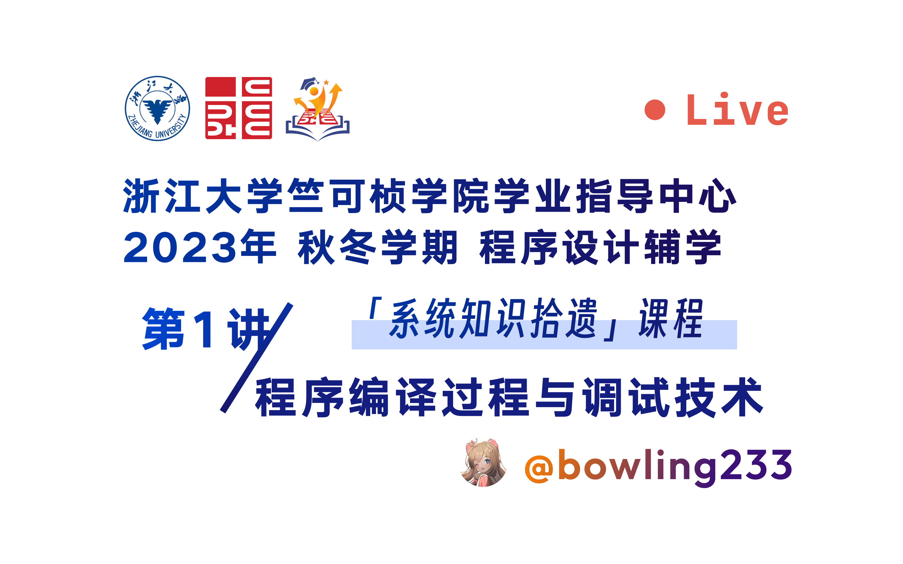

# 程设辅学课程 系统知识拾遗

欢迎来到竺院程设辅学系统知识拾遗版块 🤗。你可以在左侧导航栏中详细浏览本模块的内容。

<!-- prettier-ignore-start -->
!!! tip "本期课程"

    
<!-- prettier-ignore-end -->

## 课程简介

程序设计与算法基础课程讲述的内容局限于语言本身，较为表象。然而，C 语言实质上是一门很难的编程语言，不懂编译原理、操作系统和计算机体系结构无法获得深入的理解，而这些也是学习计算机专业的同学应当尽早了解的知识。

本辅学课程将结合计算机系统方面的知识，为同学们提供深入理解 C 语言的视角。我们的目的是解答程序设计中较为底层的问题：

-   编译时我的代码经历了什么？操作系统如何运行我的程序？如何使用调试器快速定位错误？
-   指针究竟是什么？内存中的数据是如何组织的？
-   C 标准库中的 I/O 函数如何与操作系统交互？
-   C 标准库是如何编写的？怎样写出具有工业强度的健壮代码？
-   如何使用数据结构与算法解决实际问题？

希望这些内容能够为你开启从 C 语言到计算机科学与技术的真正的大门。如果对课程内容有任何疑问和建议，欢迎你联系我们。你可以在仓库中发起 issue 或发送邮件到 `zhubaolin228@gmail.com`。

## 课程安排

2023-2024 学年，程设辅学系统知识拾遗课题组同学有：

-   朱宝林 混合 2205
-   李英琦 图灵 2201
-   谢集 混合 2206
-   胡育玮 混合 2206
-   苏煜程 图灵 2201
-   孙兆江 混合 2204

课程安排如下：

| 节次 | 内容                   | 主讲         | 时间 | 地点 | 课前资料                                    | PPT 与讲义                   |
| :--- | :--------------------- | :----------- | :--- | :--- | :------------------------------------------ | :--------------------------- |
| 1    | 程序编译过程与调试技术 | 朱宝林       | 10.14 下午 2:30-4:30 |      | [准备开发与调试环境](lecture1/pre_class.md) | [讲义](lecture1/lecture1.md) |
| 2    | 类型系统与内存模型     | 李英琦       | 【暂定】10.21     |      |                                             |                              |
| 3    | I/O 与文件             | 胡育玮       | 【暂定】11.18     |      |                                             |                              |
| 4    | C 标准库               | 李英琦       | 【暂定】11.25     |      |                                             |                              |
| 5    | 数据结构与算法         | 谢集 苏煜程 | 【暂定】12.15    |      |                                             |                              |
