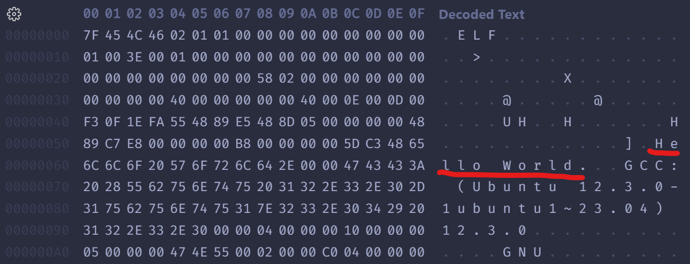

# 讲义：程序编译过程与调试技术

<style>
    code {
      white-space : pre-wrap !important;
    }
</style>

???+ info "直播回放"

    [Bilibili](https://www.bilibili.com/video/BV1Pu411T7GT/)

???+ abstract "内容提要"

    - C 语言程序基本结构
    - 编译过程：从源代码到可执行文件
    - 编译器和开发套件：`gcc`、`clang` 和 `llvm` 究竟是什么？
    - 调试器：如何使用 `gdb` 或 `lldb` 设置断点、找到段错误的根源？

???+ tip "如何食用本讲义"

    作为在线讲义，我会尽量写得详细一些，为同学们提供复习和进一步扩展的指引。因为时间有限，在课上我无法覆盖讲义中所有的内容。同学们可以根据自己的习惯选择在课前课后浏览本讲义～

    本次课的核心内容从「程序的编译过程」开始。前面的内容作为预备知识，在课上将会快速带过。

## 课程导言

Hi，欢迎各位同学来到竺院程设辅学「系统知识拾遗」的第一节课。

在前几周的程序设计课程中，老师们应该已经为同学们讲解了 C 语言的基础语法等知识。但是同学们或许会有下面这些疑问：

- 计算机是如何读懂我写的代码的？
- 我的程序总是出问题，我该如何快速找到错误的根源？

辅学课程的目的就是帮助同学们解决这些进一步的问题。实质上 C 语言是一门很难的编程语言，不懂编译原理、操作系统和计算机体系结构无法获得深入的理解。我们希望通过线下授课，为同学们提供语言之外的进一步的知识扩展和技能训练。让同学们在计算机（而非算法题）的语境下理解 C 语言，理解程序设计。

那么在本节课，我们将为大家系统讲解程序编译过程与调试技术，为后续的课程做铺垫。接下来，让我们一起进入计算机的世界吧！

## 基础知识

首先，我们来了解一下我们学习的对象——计算机的基本知识。它是如何工作的？我们如何与它交流？

### 计算机能做什么？

现代计算机由多种部件构成，比如中央处理单元（Central Processing Unit，CPU）、随机存取内存（Random Access Memory，RAM）、硬盘（Hard Disk）等。其中 CPU 负责处理程序。

::cards:: cols=2

[
  {
    "title": "RISC CPU",
    "content": "这是一个非常简单的 CPU 的电路，它能够执行你用 0 和 1 编写的机器指令。",
    "image": "graph/risc_cpu.png"
  },
  {
    "title": "CPU 基本结构",
    "content": "CPU 主要由控制单元、算术逻辑单元和寄存器组成。控制单元中有程序计数器和指令寄存器。",
    "image": "graph/cpu.png"
  },

]

::/cards::

- CPU 能读懂什么？

CPU 无法直接读懂你写的 C 语言代码，它是由数字电路构成的。**数字电路只能处理 0 和 1，因此计算机中的任何数据都必须使用二进制表示，程序也是如此。**

在计算机刚刚诞生的阶段，工程师们不得不使用 0 和 1 构成的指令序列和计算机打交道，这就是**机器语言**。因为具体电路设计不同，每种 CPU 所能理解的指令有限，这些指令的集合叫做**指令集**。

- CPU 都做些什么？

CPU 的工作非常简单：从内存中读取并执行一条指令，再从内存中读取并执行下一条指令……1 GHz 的 CPU 每秒能重复这一操作约十亿次。

这些指令都相当具体，比如把一个数字从一个位置移动到另一个位置，把两个数字相加并把结果存储再某个地方。是的，你的 CPU 也在疯狂做着这些事情。但是**通过精巧的设计，这些简单的指令就能构建起程序的控制逻辑，实现复杂的功能**。

CPU 还有自己的小工作区——由若干寄存器（Register）组成的寄存器组。每个寄存器能存储一个数字。

### 从机器语言、汇编语言到高级语言

现代计算机的结构与 70 年前并没有本质上的不同，但是程序设计语言取得了很大的发展，产生了汇编语言和高级语言。我们仍然不能直接对 CPU 说：为我计算 $1 + 1$，但我们可以用高级语言简洁的表达它，让**编译器（compiler）和汇编器（assembler）**将其翻译成 `0101` 的机器语言。下图展示了程序设计语言的发展历史，编译过程其实就是这一历史的反向。

::cards::

[
  {
    "title": "机器语言 <br> Machine Code",
    "content": "这是**第一代编程语言**，也是计算机唯一能识别的语言。上图展示了世界上第一个计算机程序，它用来找出一个数最大的因数。",
    "image": "graph/machine_code.png"
  },
  {
    "title": "汇编语言 <br> Assembly Language",
    "content": "这是**第二代编程语言**，其实就是机器语言的助记符。它使得程序员不用再直接与 0 和 1 打交道，程序的可读性也更强了。上图显示了将两个整数相加的汇编代码。",
    "image": "graph/assembly.png"
  },
  {
    "title": "高级语言 <br> High-level Language",
    "content": "这是**第三代编程语言**，它让程序员们不用再关注计算机结构上的细节，而是将注意力转移到要解决的问题上来。",
    "image": "graph/high_level_language.png"
  },

]

::/cards::

下面三行代码分别是用 C 语言、汇编语言和机器语言（十六进制）描述的同一件事：

=== "简单的例子"

    ```c
    c = a + b;
    ```

    ```asm
    add $t0, $t1, $t2
    ```

    ```
    01 2a 40 20
    ```
=== "复杂的例子"

    ```c
    void multstore(long x, long y, long *dest) {
        long t = mult2(x, y);
        *dest = t;
    }
    ```

    ```asm
    multstore:
        pushq   %rbx
        movq    %rdx, %rbx
        call    mult2
        movq    %rax, (%rbx)
        popq    %rbx
        ret
    ```

    ```
    53 48 89 d3 48 83 ec 08 e8 00 00 00 00 48 89 03 5b c3
    ```

???+ question "为什么需要高级语言？"

    1. 机器语言和汇编语言都是非常底层的语言，程序员需要关注计算机的细节，这使得程序的**可读性很差**。使用高级语言，程序员能**将注意力转移到要解决的问题上来**。
    2. 机器语言和汇编语言都是与具体 CPU 相关的，程序员需要为不同的 CPU 编写不同的程序，**可移植性差**。使用高级语言，程序员只需要写一次程序，再使用编译器就能将其翻译成能在特定 CPU 的机器语言。

???+ info "前瞻：第四代和第五代编程语言"

    编程语言仍在发展演化。目前已经有了第四代和第五代编程语言的概念。第三代的编程语言虽然是用语句编程而不直接用指令编程，但语句也分为输入、输出、基本运算、测试分支和循环等几种，和指令有直接的对应关系。而第四代以后的编程语言更多是描述要做什么（Declarative）而不描述具体一步一步怎么做（Imperative），具体一步一步怎么做完全由编译器或解释器决定，例如SQL语言（SQL，Structured Query Language，结构化查询语言）就是这样的例子。

???+ info "对机器语言有兴趣？"

    [这里](https://eng.libretexts.org/Bookshelves/Computer_Science/Programming_Languages/Introduction_To_MIPS_Assembly_Language_Programming_(Kann)/04%3A_Translating_Assembly_Language_into_Machine_Code)提供了一些将汇编语言转换为 MIPS 指令集机器语言的基础例子，有兴趣可以了解一下。

## 程序的基本语法结构

经过了 2-3 周课程的学习，相信同学们多少都写过了一些代码，对语言有了一些基本认识。本节将系统地梳理程序的语法和结构知识，帮助大家理清思路，为后续理解程序编译过程和调试技术作铺垫。

### 写程序的目标是什么？

从根本上说，计算机是由数字电路组成的运算机器，只能对数字做运算，程序之所以能做符号运算，是因为符号在计算机内部也是用数字表示的。此外，程序还可以处理声音和图像，声音和图像在计算机内部必然也是用数字表示的，这些数字经过专门的硬件设备转换成人可以听到、看到的声音和图像。

程序由一系列指令（Instruction）组成，指令是指示计算机做某种运算的命令，通常包括以下几类：

- 输入（Input）：从键盘、文件或者其它设备获取数据。
- 输出（Output）：把数据显示到屏幕，或者存入一个文件，或者发送到其它设备。
- 基本运算：执行最基本的数学运算（加减乘除）和数据存取。
- 测试和分支：测试某个条件，然后根据不同的测试结果执行不同的后续指令。
- 循环：重复执行一系列操作。

对于程序来说，有上面这几类指令就足够了。你曾用过的任何一个程序，不管它有多么复杂，都是由这几类指令组成的。**程序是那么的复杂，而编写程序可以用的指令却只有这么简单的几种，这中间巨大的落差就要由程序员去填了，所以编写程序理应是一件相当复杂的工作。编写程序可以说就是这样一个过程：把复杂的任务分解成子任务，把子任务再分解成更简单的任务，层层分解，直到最后简单得可以用以上指令来完成。**

### 词法和语法规则

词法（Lexical）和语法（Syntax）是编程语言的两个基本概念。词法规则定义了编程语言中的基本符号，语法规则定义了这些符号如何组成合法的表达式、语句和程序。

???+ note "C 的词法规则：贪心法"

    术语 **token** （符号）是语言的基本表意单元。字符组成符号。例子: `->`、`file` 都是符号。同一组字符序列在**不同上下文**中可能属于不同符号。
    
    如果该字符可能组成符号，那么再读入下一个字符，直到读入的字符串已经不可能再组成一个有意义的符号。

???+ example "词法练习：请思考下面这些表达式的行为"

    点击「+」号展开答案。

    ```c linenums="1"
    a---b /*(1)!*/
    a -- - b /*(2)!*/
    a - -- b /*(3)!*/

    //下面的 p 指向除数。
    y = x/*p     
    /*(4)!*/
    y = x / *p /*(5)!*/

    n-->0 /*(6)!*/
    n-- >0 /*(7)!*/
    n- -> 0 /*(8)!*/

    a+++++b /*(9)!*/
    ```
    
    1. 等价于 `(a--) - b`。按照贪心法，编译器读入两个连续的 `-` 号后，已经不可能再组成一个有意义的符号，因此这个符号被确定为后缀递减运算符。接着读取下一个符号。
    2. 等价于 `(a--) - b`
    3. 等价于 `a - (--b)`
    4. 等价于 `y = x`。`/*` 被贪心法解释为注释的开头。
    5. 等价于 `y = x / (*p)`
    6. 等价于 `(n--) > 0`
    7. 等价于 `(n--) > 0`
    8. 等价于 `(n-) -> 0`。这是一个无效的语句，`n-` 本身不是一个合法的表达式，也无法用作 `->` 的操作数。
    9. 等价于 `((a++)++) + b`。请思考一下，这个语句有效吗？

???+ note "语法：标识符、表达式和语句"

    为了便于初学者理解，我们采用一套简化的语法规则：

    -   标识符（Identifier）：就是「名字」，用于指代各种实体，比如：对象、类型、函数、标签、宏等等。

    ???+ warning "对象的不同含义"
    
        在这里，对象（Object）的含义与 C++ 中不同。这里的对象指数据存储的一个区域，其内容可以表示*值*。比如下面的语句创建了一个对象：

        ```
        int a;
        ```

        创建一个对象的意思就是分配了一块存储空间。标识符 `a` 用于指代这个对象。每个对象都有大小、生存期、存储器、值等属性，我们将在下节课详细展开。

    -   表达式（Expression）：由运算符（`+-*/%` 等等）和操作数（常量、变量、函数返回值......）组成的式子，可以计算出一个值。
    -   语句（Statement）：C 标准确定了五种语句类型。除了复合语句，其它语句都以分号 `;` 结尾。下面是语句的定义，你可以发现**语句是递归定义的**。

        -   复合语句：由花括号包围的一组语句。

            ```c
            { 语句或声明 }
            ```

        -   表达式语句：表达式加上分号就是表达式语句。C 程序中大部分语句都是表达式语句。空语句也算作表达式语句。

            ```c
            表达式;
            ```

            例子：

            ```c
            puts("hello"); // 表达式语句
            char *s;
            while (*s++ != '\0')
              ; // 空语句
            ```

        -   选择语句：

            ```c
            if(表达式) 语句
            if(表达式) 语句 else 语句
            switch(表达式) 语句
            ```

        -   循环语句：

            ```c
            while(表达式) 语句
            do 语句 while(表达式);
            for(初始化子句;表达式;表达式) 语句
            ```

        -   跳转语句：
    
            ```c
            goto 标识符;
            continue;
            break;
            return 表达式;
            ```

    完整的 C 语法规则请参考：
    
    -   [CPPReference：标识符](https://zh.cppreference.com/w/c/language/identifier)
    -   [CPPReference：表达式](https://zh.cppreference.com/w/c/language/expressions)
    -   [CPPReference: 语句](https://zh.cppreference.com/w/c/language/statements)

语法将在后续课程中作深入讲解（第 2 讲涉及类型相关的语法，第 4 讲涉及函数指针）。

### 函数：C 程序的基本模块

「指令」是第一、二代编程语言的基本结构。C 语言是面向过程的高级语言，它的基本模块是**函数（Function）**。

???+ note "关键概念：函数"

    **从外面看**，函数就像一个黑盒子，只能看到函数的三大要素：

    - 函数名：函数的名字，用来调用函数。
        - 函数名与变量名的命名规则相同。
    - 参数：函数的输入，可以有**多个**。
    - 返回值：函数的输出，只能有**一个**。

    下面这行语句被称为函数签名（Function Signature）或函数原型（Function Prototype）。它给出了函数对外的一切信息：

    ```c
    int MyFunc(int a, int b);
    ```

    **从里面看**，函数是一组指令的集合，它们按照一定的顺序执行，完成某个特定的功能。

当我们调用一个函数时，我们应当按照函数签名中的要求传入参数，并可以获得它的返回值。在函数签名的语境下，`void` 表示空，即不存在。下面的这个函数没有参数，也没有返回值。

```c
void MyFunc(void);
```

因为我们比较关心函数返回值的类型，有时会把函数的返回值类型称为这个函数的“类型”，比如会说 `MyFunc` 这个函数是一个 `void` 函数。

???+ note "关于 `void`"

    Q：`void` 到底有哪些含义？
    
    A: 下面是 `void` 的一般用法

    - `void` 作为函数参数，表示函数不接受参数。
    - `void` 作为函数返回值，表示函数不返回值。
    - `void*` 是一种指针类型，表示不知道指向的类型是什么。

    从这些用法来看，似乎 `void` 是一种类型，但这会引起下面问题中的矛盾。另一种看待方式是：上面的用法都是特殊的语法，不过是恰好用了同一个关键字 `void` 罢了。

    Q：所以 `void` 是一种类型吗？
    
    A：C 标准从概念上将 `void` 作为一种类型。但是 `void` 类型的变量是不存在的，因为它没有大小，编译器也不允许你写下 `void a;`。这会引起一些困惑。

函数有两个功能：

- 返回值：函数调用本身就是一个表达式，它的值就是函数的返回值。
- 副作用：除了返回值以外的功能统称为副作用。

一些例子：

| 函数签名                               | 返回值的含义 | 副作用               |
| -------------------------------------- | ------------ | -------------------- |
| `int printf(const char *format, ...);` | 打印的字符数 | 打印字符串到标准输出 |
| `int scanf(const char *format, ...);`  | 读取的字符数 | 从标准输入读取字符串 |
| `int rand(void);`                      | 生成的随机数 | 无                   |
| `void exit(int status);`               | 无           | 退出程序             |

每个 C 语言程序都必须包含一个 `main` 函数，它是程序的入口。`main` 的函数签名一般是这样的：

```c
int main(void);
int main(int argc, char *argv[]); //以后学命令行参数就会用到这种形式
```

`main` 的调用者是操作系统。操作系统看到 `main` 的签名中说返回值为 `int`，因此系统会等待 `main` 返回一个整数。这个整数一般被用于告知操作系统程序的执行状态，`0` 表示正常结束，其他值可以传递其他信息。这就是为什么 `main` 的末尾应当写 `return 0`。如果 `main` 函数中没有 `return` 语句，有些编译器会为你补全（其他函数不会）。**但请记得写上，这是你的责任。**

没有返回值的函数也可以使用 `return` 语句，此时它没有返回值的作用，而是结束当前函数的执行并返回。例子：

```c
void print_logarithm(double x)
{
 if (x <= 0.0) {
  printf("Positive numbers only, please.\n");
  return;
 }
 printf("The log of x is %f", log(x));
}
```

??? info "其他建议"

    每个函数都应该设计得尽可能简单，简单的函数才容易维护。应遵循以下原则：

    1. 实现一个函数只是为了做好一件事情，不要把函数设计成用途广泛、面面俱到的，这样的函数肯定会超长，而且往往不可重用，维护困难。

    2. 函数内部的缩进层次不宜过多，一般以少于 4 层为宜。如果缩进层次太多就说明设计得太复杂了，应考虑分割成更小的函数（Helper Function）来调用。

    3. 函数不要写得太长，建议在 24 行的标准终端上不超过两屏，太长会造成阅读困难，如果一个函数超过两屏就应该考虑分割函数了。[CodingStyle]中特别说明，如果一个函数在概念上是简单的，只是长度很长，这倒没关系。例如函数由一个大的 `switch` 组成，其中有非常多的 `case`，这是可以的，因为各 `case` 分支互不影响，整个函数的复杂度只等于其中一个 `case` 的复杂度，这种情况很常见，例如 TCP 协议的状态机实现。

    4. 执行函数就是执行一个动作，函数名通常应包含动词，例如 `get_current`、`radix_tree_insert`。

    5. 比较重要的函数定义上侧必须加注释，说明此函数的功能、参数、返回值、错误码等。

    6. 另一种度量函数复杂度的办法是看有多少个局部变量，5 到 10 个局部变量已经很多了，再多就很难维护了，应该考虑分割成多个函数。

??? note "扩展：编译和解释"

    简单了解一下就好。

    将高级语言编写的**源代码**转化成机器语言的**目标程序**的过程统称为翻译（Translation）。翻译的方式有两种：编译（Compile）和解释（Interpret）。编译将整个程序翻译成机器语言，解释则是边翻译边执行。

    C 语言是典型的编译型语言，源代码需要经过编译后才能运行，而编译阶段并不会执行程序。Python 则是典型的解释型语言，逐句执行源代码，不需要产生可执行文件。

    这些描述的都是一种语言的典型用法。事实上 C 语言也开发出了相应的解释器，Python 也开发出了相应的编译器。两种翻译方式各有优劣。

### 现在你是编译器

接下来我们将化身 C 语言编译器，解读一些代码。相信经过下面的训练，你对代码和程序执行的理解会更加深入。

???+ example "例子：语法树"

    ```c
    printf("%d:%d is %d minutes after 00:00\n", hour, minute, hour * 60 + minute);
    ```

    编译器在翻译这条语句时，首先根据上述语法规则把这个语句解析成下图所示的语法树，然后再根据语法树生成相应的指令。语法树的末端的是一个个Token，每一步展开利用一条语法规则。

     

    理解组合（Composition）规则是理解语法规则的关键所在，正因为可以根据语法规则任意组合，我们才可以用简单的常量、变量、表达式、语句搭建出任意复杂的程序，以后我们学习新的语法规则时会进一步体会到这一点。从上面的例子可以看出，表达式不宜过度组合，否则会给阅读和调试带来困难。

???+ note "表达式不宜过度组合"

    这涉及代码可读性问题。看看下面这段代码：

    ```c
    double distance(double x1, double y1, double x2, double y2)
    {
      return sqrt((x2-x1) * (x2-x1) + (y2-y1) * (y2-y1));
    }
    ```

    这样写很简洁，但如果写错了呢？只知道是这一长串表达式有错，根本不知道错在哪，而且整个函数就一个语句，插printf都没地方插。所以用临时变量有它的好处，使程序更清晰，调试更方便，而且有时候可以避免不必要的计算，例如上面这一行表达式要把(x2-x1)计算两遍，如果算完(x2-x1)把结果存在一个临时变量dx里，就不需要再算第二遍了（虽然这些优化现代编译器都会替你自动完成）。下面这个版本是可读性高的代码：

    ```c
    double distance(double x1, double y1, double x2, double y2)
    {
     double dx = x2 - x1;
     double dy = y2 - y1;
     double dsquared = dx * dx + dy * dy;
     double result = sqrt(dsquared);

     return result;
    }
    ```

    码风不是死的，请同学们视情况切换码风。

## Lap：关于做题目

如果想做题的话，有基础的同学可以早点开始做[历年卷](../../programming/index.md#历年卷)，了解一下程设考试都考些啥。

简单提一些 Tips：

- 考试是全英文。如果平常不太看英文文档/没怎么学/英语很差的同学，至少你考前做历年卷的时候要把生词全部抄下来记一遍。
- 一定一定一定要做历年卷。**不要以为自己会写点代码就能应付考试了**，其实考试和你写代码水平并不呈正相关。考试的题目都是很细节的，很多都是你平常不会注意到的，所以一定要做历年卷，做完了还要看看答案，看看自己哪里做错了，哪里没注意到。这里展示一个去年 C 小考试干碎一片人的选择题：

???+ example "干碎一片人的选择题"

    Suppose `T` is a type name and `t` is a variable of type `T`. Which of the following is **NOT** a valid expression?

    <div style="display: flex">
    <div style="width: 100%">A. `sizeof(T)`</div>
    <div style="width: 100%">B. `sizeof(t)`</div>
    <div style="width: 100%">C. `sizeof T`</div>
    <div style="width: 100%">D. `sizeof t`</div>
    </div>

    ??? note "答案"
    
        答案是 C，不知道你猜对了吗？

        大家一般写代码 `sizeof` 后面都会加括号的对吧，但你知道为什么吗？想要知道为什么，需要回顾前面学习的语法知识。

        `sizeof` 是一个运算符，它有两种使用方式：

        ```c
        sizeof(类型)
        sizeof 表达式
        ```

        我们知道，`t` 是表达式，`(t)` 也是表达式。`sizeof(T)` 的使用符合规范。因此 A、B、D 都是正确的。为什么不规定 `sizeof 类型` 的用法呢？因为这可能引起歧义，有些类型名就携带空格，比如：`short int`、`struct node` 等等。了解了这些知识，你能说说下面的语句是否合法吗？如果合法，你能解释它的含义吗？如果不规定类型必须带括号，可能会产生哪些二义性？

        ```c
        sizeof int***p
        sizeof(int)*p
        sizeof int * + 1
        ```

如果你想的话，可以再来两道：

??? example "C 大 16 年选择题"

    In the following notations, _____ can express a character constant( 字符常量 ) correctly.

    <div style="display: flex">
    <div style="width: 100%">A. `'\x100'`</div>
    <div style="width: 100%">B. `125`</div>
    <div style="width: 100%">C. `'\08'`</div>
    <div style="width: 100%">D. `'\'`</div>
    </div>

    ??? note "答案"

        B

## 程序的编译过程

接下来，我们将了解编译器和汇编器是如何一步步把你的程序编译成机器码的。我们以最经典的 C 语言编译系统 GCC 为例。

???+ note "什么是 GCC？"

    简单地说，GNU 项目旨在开发一个完全自由的操作系统以及配套的软件。GCC 最早是 GNU C Compiler 的简称，现在**代表 GNU Compiler Collection**。这表明它不是单个程序，而是一系列编译工具的集合，包括了 C、C++、Objective-C、Fortran、Ada、Go、D 等语言的前端，以及汇编器、链接器等后端，和这些语言的库文件。

当我们使用命令 `gcc -o test test.c` 编译一个 C 语言程序时，GCC 会调用一系列的程序将源代码翻译成汇编语言、再翻译成机器语言，最后经过链接产生可执行文件。下图展示了这个过程。


1. 预处理：由 C 预处理器（C Preprocessor）完成，它将源代码中的宏定义展开，将头文件中的内容插入到源代码中，删除注释等。预处理后的代码文件以 `.i` 为后缀。
2. 编译：由 C 编译器（C Compiler）完成，它将预处理后的文件翻译成汇编语言。编译后得到的汇编代码文件以 `.s` 为后缀。
3. 汇编：由汇编器（Assembler）完成，它将汇编代码翻译成机器语言。汇编后得到的机器代码文件以 `.o` 为后缀。
4. 链接：由链接器（Linker）完成，它将多个目标文件链接成一个可执行文件。链接后得到的可执行文件以 `.exe` 为后缀。

### 解读 `gcc` 显示的详细信息

下面这些文本是 `gcc -v -o prog main.c sum.c` 命令的输出结果。

???+ info "gcc 的输出信息"

    点击文本中带圆圈的 `+` 号可以展开详细信息，高亮的行是运行某个编译工具的具体命令。

    ```html hl_lines="12 33 36 57 62"
    <!--(1)!-->Using built-in specs.
    COLLECT_GCC=gcc
    COLLECT_LTO_WRAPPER=/usr/lib/gcc/x86_64-linux-gnu/12/lto-wrapper
    OFFLOAD_TARGET_NAMES=nvptx-none:amdgcn-amdhsa
    OFFLOAD_TARGET_DEFAULT=1
    Target: x86_64-linux-gnu
    Configured with: ../src/configure -v --with-pkgversion='Ubuntu 12.3.0-1ubuntu1~23.04' --with-bugurl=file:///usr/share/doc/gcc-12/README.Bugs --enable-languages=c,ada,c++,go,d,fortran,objc,obj-c++,m2 --prefix=/usr --with-gcc-major-version-only --program-suffix=-12 --program-prefix=x86_64-linux-gnu- --enable-shared --enable-linker-build-id --libexecdir=/usr/lib --without-included-gettext --enable-threads=posix --libdir=/usr/lib --enable-nls --enable-clocale=gnu --enable-libstdcxx-debug --enable-libstdcxx-time=yes --with-default-libstdcxx-abi=new --enable-gnu-unique-object --disable-vtable-verify --enable-plugin --enable-default-pie --with-system-zlib --enable-libphobos-checking=release --with-target-system-zlib=auto --enable-objc-gc=auto --enable-multiarch --disable-werror --enable-cet --with-arch-32=i686 --with-abi=m64 --with-multilib-list=m32,m64,mx32 --enable-multilib --with-tune=generic --enable-offload-targets=nvptx-none=/build/gcc-12-DAPbBt/gcc-12-12.3.0/debian/tmp-nvptx/usr,amdgcn-amdhsa=/build/gcc-12-DAPbBt/gcc-12-12.3.0/debian/tmp-gcn/usr --enable-offload-defaulted --without-cuda-driver --enable-checking=release --build=x86_64-linux-gnu --host=x86_64-linux-gnu --target=x86_64-linux-gnu
    Thread model: posix
    Supported LTO compression algorithms: zlib zstd
    gcc version 12.3.0 (Ubuntu 12.3.0-1ubuntu1~23.04) 
    COLLECT_GCC_OPTIONS='-v' '-o' 'prog' '-mtune=generic' '-march=x86-64' '-dumpdir' 'prog-'
    <!--(2)!--> /usr/lib/gcc/x86_64-linux-gnu/12/cc1 -quiet -v -imultiarch x86_64-linux-gnu main.c -quiet -dumpdir prog- -dumpbase main.c -dumpbase-ext .c -mtune=generic -march=x86-64 -version -fasynchronous-unwind-tables -fstack-protector-strong -Wformat -Wformat-security -fstack-clash-protection -fcf-protection -o /tmp/ccClT5M4.s
    GNU C17 (Ubuntu 12.3.0-1ubuntu1~23.04) version 12.3.0 (x86_64-linux-gnu)
     compiled by GNU C version 12.3.0, GMP version 6.2.1, MPFR version 4.2.0, MPC version 1.3.1, isl version isl-0.25-GMP

    GGC heuristics: --param ggc-min-expand=100 --param ggc-min-heapsize=131072
    ignoring nonexistent directory "/usr/local/include/x86_64-linux-gnu"
    ignoring nonexistent directory "/usr/lib/gcc/x86_64-linux-gnu/12/include-fixed"
    ignoring nonexistent directory "/usr/lib/gcc/x86_64-linux-gnu/12/../../../../x86_64-linux-gnu/include"
    <!--(3)!-->#include "..." search starts here:
    #include <...> search starts here:
     /usr/lib/gcc/x86_64-linux-gnu/12/include
     /usr/local/include
     /usr/include/x86_64-linux-gnu
     /usr/include
    End of search list.
    GNU C17 (Ubuntu 12.3.0-1ubuntu1~23.04) version 12.3.0 (x86_64-linux-gnu)
     compiled by GNU C version 12.3.0, GMP version 6.2.1, MPFR version 4.2.0, MPC version 1.3.1, isl version isl-0.25-GMP

    GGC heuristics: --param ggc-min-expand=100 --param ggc-min-heapsize=131072
    Compiler executable checksum: d9353c3f0a32d3e91a16ba312e2a9024
    COLLECT_GCC_OPTIONS='-v' '-o' 'prog' '-mtune=generic' '-march=x86-64' '-dumpdir' 'prog-'
    <!--(4)!--> as -v --64 -o /tmp/ccEgqpgY.o /tmp/ccClT5M4.s
    GNU assembler version 2.40 (x86_64-linux-gnu) using BFD version (GNU Binutils for Ubuntu) 2.40
    COLLECT_GCC_OPTIONS='-v' '-o' 'prog' '-mtune=generic' '-march=x86-64' '-dumpdir' 'prog-'
    <!--(5)!--> /usr/lib/gcc/x86_64-linux-gnu/12/cc1 -quiet -v -imultiarch x86_64-linux-gnu sum.c -quiet -dumpdir prog- -dumpbase sum.c -dumpbase-ext .c -mtune=generic -march=x86-64 -version -fasynchronous-unwind-tables -fstack-protector-strong -Wformat -Wformat-security -fstack-clash-protection -fcf-protection -o /tmp/ccClT5M4.s
    GNU C17 (Ubuntu 12.3.0-1ubuntu1~23.04) version 12.3.0 (x86_64-linux-gnu)
     compiled by GNU C version 12.3.0, GMP version 6.2.1, MPFR version 4.2.0, MPC version 1.3.1, isl version isl-0.25-GMP

    GGC heuristics: --param ggc-min-expand=100 --param ggc-min-heapsize=131072
    ignoring nonexistent directory "/usr/local/include/x86_64-linux-gnu"
    ignoring nonexistent directory "/usr/lib/gcc/x86_64-linux-gnu/12/include-fixed"
    ignoring nonexistent directory "/usr/lib/gcc/x86_64-linux-gnu/12/../../../../x86_64-linux-gnu/include"
    #include "..." search starts here:
    #include <...> search starts here:
     /usr/lib/gcc/x86_64-linux-gnu/12/include
     /usr/local/include
     /usr/include/x86_64-linux-gnu
     /usr/include
    End of search list.
    GNU C17 (Ubuntu 12.3.0-1ubuntu1~23.04) version 12.3.0 (x86_64-linux-gnu)
     compiled by GNU C version 12.3.0, GMP version 6.2.1, MPFR version 4.2.0, MPC version 1.3.1, isl version isl-0.25-GMP

    GGC heuristics: --param ggc-min-expand=100 --param ggc-min-heapsize=131072
    Compiler executable checksum: d9353c3f0a32d3e91a16ba312e2a9024
    COLLECT_GCC_OPTIONS='-v' '-o' 'prog' '-mtune=generic' '-march=x86-64' '-dumpdir' 'prog-'
     as -v --64 -o /tmp/ccxMA26W.o /tmp/ccClT5M4.s
    GNU assembler version 2.40 (x86_64-linux-gnu) using BFD version (GNU Binutils for Ubuntu) 2.40
    COMPILER_PATH=/usr/lib/gcc/x86_64-linux-gnu/12/:/usr/lib/gcc/x86_64-linux-gnu/12/:/usr/lib/gcc/x86_64-linux-gnu/:/usr/lib/gcc/x86_64-linux-gnu/12/:/usr/lib/gcc/x86_64-linux-gnu/
    LIBRARY_PATH=/usr/lib/gcc/x86_64-linux-gnu/12/:/usr/lib/gcc/x86_64-linux-gnu/12/../../../x86_64-linux-gnu/:/usr/lib/gcc/x86_64-linux-gnu/12/../../../../lib/:/lib/x86_64-linux-gnu/:/lib/../lib/:/usr/lib/x86_64-linux-gnu/:/usr/lib/../lib/:/usr/lib/gcc/x86_64-linux-gnu/12/../../../:/lib/:/usr/lib/
    COLLECT_GCC_OPTIONS='-v' '-o' 'prog' '-mtune=generic' '-march=x86-64' '-dumpdir' 'prog.'
    <!--(6)!--> /usr/lib/gcc/x86_64-linux-gnu/12/collect2 -plugin /usr/lib/gcc/x86_64-linux-gnu/12/liblto_plugin.so -plugin-opt=/usr/lib/gcc/x86_64-linux-gnu/12/lto-wrapper -plugin-opt=-fresolution=/tmp/ccyzC2ZB.res -plugin-opt=-pass-through=-lgcc -plugin-opt=-pass-through=-lgcc_s -plugin-opt=-pass-through=-lc -plugin-opt=-pass-through=-lgcc -plugin-opt=-pass-through=-lgcc_s --build-id --eh-frame-hdr -m elf_x86_64 --hash-style=gnu --as-needed -dynamic-linker /lib64/ld-linux-x86-64.so.2 -pie -z now -z relro -o prog /usr/lib/gcc/x86_64-linux-gnu/12/../../../x86_64-linux-gnu/Scrt1.o /usr/lib/gcc/x86_64-linux-gnu/12/../../../x86_64-linux-gnu/crti.o /usr/lib/gcc/x86_64-linux-gnu/12/crtbeginS.o -L/usr/lib/gcc/x86_64-linux-gnu/12 -L/usr/lib/gcc/x86_64-linux-gnu/12/../../../x86_64-linux-gnu -L/usr/lib/gcc/x86_64-linux-gnu/12/../../../../lib -L/lib/x86_64-linux-gnu -L/lib/../lib -L/usr/lib/x86_64-linux-gnu -L/usr/lib/../lib -L/usr/lib/gcc/x86_64-linux-gnu/12/../../.. /tmp/ccEgqpgY.o /tmp/ccxMA26W.o -lgcc --push-state --as-needed -lgcc_s --pop-state -lc -lgcc --push-state --as-needed -lgcc_s --pop-state /usr/lib/gcc/x86_64-linux-gnu/12/crtendS.o /usr/lib/gcc/x86_64-linux-gnu/12/../../../x86_64-linux-gnu/crtn.o
    COLLECT_GCC_OPTIONS='-v' '-o' 'prog' '-mtune=generic' '-march=x86-64' '-dumpdir' 'prog.'
    ```

    1.  最开头是 `gcc` 的相关信息，包括它运行的平台、配置的选项等。
    2.  这里调用了 `cc1` 完成预处理和编译阶段，将源代码文件 `main.c` 编译成了 ASCII 编码的汇编文件 `/tmp/ccCWi0p2.s`。
    3.  这里显示了头文件搜索路径，如果你编译时报错缺少头文件，可以检查一下这里有没有包含对应的路径。
    4.  这里调用了 `as` 完成汇编阶段，将汇编文件 `/tmp/ccCWi0p2.s` 翻译成了机器语言文件 `/tmp/ccAnKDEo.o`。
    5.  接下来又对 `sum.c` 重复预处理、编译和汇编的过程，得到了 `/tmp/ccgMFTqK.o`。
    6.  最后调用 `collect2` （这是 `ld` 的包装程序）完成链接阶段，将两个源代码生成的目标文件 `/tmp/ccAnKDEo.o` 和 `/tmp/ccgMFTqK.o` 与其他很多目标文件链接成了可执行文件 `prog`。这就是你能在操作系统上运行的程序。

???+ question "为什么没有看见预处理器 `cpp` 的执行呢？"

    某些版本的 `gcc` 会将预处理器 `cpp` 和编译器 `gcc` 合并成一个指令，比如上面的 `cc1`，这样就不用单独调用 `cpp` 了。

接下来，我们详解其中的每一个阶段以及可能会发生的问题。

### 预处理

执行以下命令，查看预处理后的文件 `hello.i`：

```bash
cpp hello.c > hello.i
```

你会发现，原来 `hello.c` 中 `#include` 预处理指令的地方被替换为完整的 `stdio.h` 文件内容，这些内容包括 `printf` 等函数的原型。其他预处理指令（在后续课程会学习到）比如 `#define` 也会在这一阶段生效。至于为什么只插入了函数原型而没有定义，接下来的链接阶段会解答。

预处理阶段最经常产生的问题是**找不到头文件**。C 语言头文件搜索规则如下：

- 用双引号 `#include "..."` 包含的头文件，编译器会先在当前目录下查找，再在系统目录下查找。
- 用尖括号 `#include <...>` 包含的头文件，编译器只会在系统目录下查找。

如果你的头文件不在当前目录下，那么你需要使用 `-I` 选项告诉编译器头文件的位置。比如你的头文件在 `include` 目录下：

```text
.
├── hello.c
└── include
    └── header.h
```

你可以使用以下命令编译：

```bash
gcc -Iinclude -o hello hello.c
```

路径可以是相对路径或绝对路径，比如：

```bash
gcc -I../include -o hello hello.c
gcc -I/home/user/include -o hello hello.c
```

另一种方式是设置环境变量 `CPATH` 指定搜索路径。

```bash
export CPATH="$HOME/.local:$CPATH"
```

设置后，你应当能在编译器的输出信息中看到新增的路径。

```text
#include <...> search starts here:
 /home/bowling/.local
```

### 编译

执行以下命令，查看编译后的文件 `hello.s`：

```bash
gcc -S hello.i
```

所有高级语言层面的类型、控制结构等，都被与特定 CPU 指令集相关的汇编指令代替。在汇编语言中，所有数据都是字节块，没有类型的概念。

在这个阶段，编译器会检查一些问题，并抛出不同等级的信息：

- 错误（Error）：编译器无法继续进行编译。比如：提供的参数列表不匹配、使用了未定义的变量、函数等。

```text
error.c: In function ‘main’:
error.c:9:5: error: too many arguments to function ‘my_print’
    9 |     my_print(1);
      |     ^~~~~~~~
error.c:4:6: note: declared here
    4 | void my_print(void)
      |      ^~~~~~~~
```

- 警告（Warning）：违反了语法，但能够继续编译，编译出来的程序运行结果很可能与你想象的不一样。比如：转义字符与数据类型不匹配、发生了隐式转换等。

```text
warning.c: In function ‘main’:
warning.c:8:18: warning: format ‘%d’ expects argument of type ‘int’, but argument 2 has type ‘double’ [-Wformat=]
    8 |     printf("a = %d\n", a);
      |                 ~^     ~
      |                  |     |
      |                  int   double
      |                 %f
```

大部分警告信息默认不会输出，使用 `-Wall` 和 `-Wextra` 选项可以打开更多的警告信息。你也可以使用 `-Werror` 选项将警告信息视为错误，这样编译器就会停止编译。在编译时带上这些参数是一个好习惯。

```bash
gcc -Wall -Wextra -Werror -o hello hello.c
```

### 汇编

执行以下命令，汇编器将汇编指令翻译为机器码，产生**可重定位目标文件** `hello.o`：

```bash
as -o hello.o hello.s
```

???+ note "目标文件"

    目标文件中包含计算机能读懂的机器代码和数据，有三种形式：

    | 形式 | 由谁产生 | 有什么用 |
    | ---- | -------- | -------- |
    | 可重定位目标文件 | 编译器或汇编器 | 只包含编译器为你编写的代码翻译的机器语言代码，需要与其他目标文件链接合并为可执行目标文件 |
    | 可执行目标文件 | 链接器 | 包含你编写的程序中使用的库函数和启动代码的机器代码，能够被操作系统正确运行 |
    | 共享目标文件 | 编译器或汇编器 | 给其他程序用的代码，可以在程序加载或运行时链接 |

`hello.o` 中包含了 `hello.c` 中的 C 语言代码翻译成的**二进制代码以及一些数据**，比如字符串 `Hello, world.\n`。如果使用文本编辑器打开 `hello.o`，你会看见一堆乱码，其中夹杂着一些字符。因为字符在源文件和内存中都是用 ASCII 编码的，所以 ASCII 字符仍能被文本编辑器识别，但其他的机器指令和数据只会被解读为乱码。



如果运行 `./hello.o`，终端会告诉你这个文件**不能被操作系统执行**。

```text
exec: Failed to execute process: './hello.o' the file could not be run by the operating system.
```

它还缺少一些东西，如：

- 启动代码：启动程序时，操作系统会将控制权交给程序的入口点，但这个入口点不是 `main` 函数，而是一些启动代码。启动代码在执行 `main` 前进行一些初始化工作，并在退出 `main` 后做一些扫尾工作。

???+ note "一个不带启动代码的例子"

    Linux 程序的入口点一般是 `_start`，它完成一些内存初始化的工作，然后跳转到 `main` 函数。我们在链接阶段不带上含有启动代码的目标文件，看看在缺少 `_start` 的情况下会发生什么。

    ```text
    $ ld hello.o -o hello -lc --dynamic-linker /lib64/ld-linux-x86-64.so.2
    ld: warning: cannot find entry symbol _start; defaulting to 0000000000401030
    $ ./hello
    Hello World.
    fish: Job 1, './hello' terminated by signal SIGSEGV (Address boundary error)
    ```

    这个程序源代码正常，为什么会出现段错误呢？

    在链接阶段，`ld` 的输出表明找不到入口点 `_start`，因此把入口点默认放在了 `0000000000401030` 处的函数。这个函数是 `main` 函数。因此，当程序执行到 `main` 函数的最后一条指令时，会继续往下执行，但此时栈已经被清空，因此会发生段错误。

    使用 `gdb` 查看错误位置：

    ```text
    Program received signal SIGSEGV, Segmentation fault.
    0x0000000000000001 in ?? ()
    ```

    证实了上面的分析。

    `crt` 是 C Runtime 的缩写。C 语言相关启动代码在这些目标文件中：

    - `crt1.o`：负责启动，包含 `_start` 和未定义的 `__libc_start_main` 和 `main`。
    - `crti.o`：初始化
    - `crtbegin.o`：构造（C++ 依赖）
    - `crtend.o`：析构（C++ 依赖）
    - `crtn.o`：结束

    Linux 平台下，它们的链接顺序为：

    ```bash
    ld crt1.o crti.o [user_objects] [system_libraries] crtn.o
    ```

- 库函数：几乎所有 C 程序都会用到标准库中的函数，比如 `printf`。标准库中的代码已经被预编译成目标文件，附在编译器的安装目录下。

在接下来的链接步骤，我们将这些目标文件链接到我们的程序中，生成可以执行的程序。

### 链接

链接有两种类型：静态链接和动态链接。

???+ note "静态链接"

    如果你的程序与静态库链接，那么链接器会将静态库中的代码复制到你的程序中。这样，你的程序就不再依赖静态库了，可以在任何地方运行。但是，如果静态库中的代码发生了变化，你的程序并不会自动更新，你需要重新编译你的程序。

    在 Linux 系统上，静态库的文件名以 `.a` 结尾，比如 `libm.a`。在 Window 上，静态库的文件名以 `.lib` 结尾，比如 `libm.lib`。静态库可以使用 `ar` （archive program）工具创建。

???+ note "动态链接"

    当你的程序与动态库链接时，程序中创建了一个表。在程序运行前，操作系统将需要的外部函数的机器码加载到内存中，这就是**动态链接过程**。

    与静态链接相比，动态链接使程序文件更小，因为一个动态库可以被多个程序共享，节省磁盘空间。部分操作系统还允许动态库代码在内存中的共享，还能够节省内存。动态库升级时，也不需要重写编译你的程序。

    在 Linux 系统上，动态库的文件名以 `.so` 结尾，比如 `libm.so`。在 Window 上，动态库的文件名以 `.dll` 结尾，比如 `libm.dll`。

动态链接具有上面描述的优点，因此 GCC 尽可能地执行动态链接。

链接相关的问题可能出现在链接时（静态链接）、程序运行前和运行中（动态链接）。下面时一些常见的问题。

::cards::

[
  {
    "title": "未定义的引用",
    "content": "当同学们开始使用其他库构建大型项目时，这或许会成为最头疼的问题。首先应当阅读库的使用说明，接下来搜索缺失的符号可能位于哪些库文件中。",
    "image": "graph/undefined_reference.png"
  },
  {
    "title": "缺失 `.dll`",
    "content": "常用 Windows 的同学多多少少见过这个报错，可以去网上搜索相应 `.dll` 文件放置到正确的目录。",
    "image": "graph/lose_dll.png"
  },
  {
    "title": "缺失 `.so`",
    "content": "Linux 上的动态库一般通过 `apt` 管理，[搜索相应的包](https://fostips.com/tell-package-name-contains-specific-file-ubuntu-linux-mint/)并安装即可。",
    "image": "graph/missing_library.webp"
  },
]

::/cards::

下面这行命令在我的系统上完成了 `hello` 程序的正确链接，不一定能在你的系统上运行。你可以尝试查找库文件的路径，让它成功运行。

```bash
ld --output hello --dynamic-linker /lib64/ld-linux-x86-64.so.2  /usr/lib/gcc/x86_64-linux-gnu/12/../../../x86_64-linux-gnu/Scrt1.o /usr/lib/gcc/x86_64-linux-gnu/12/../../../x86_64-linux-gnu/crti.o -lc hello.o /usr/lib/gcc/x86_64-linux-gnu/12/../../../x86_64-linux-gnu/crtn.o
```

#### 动态链接过程

如果一个可执行文件依赖于动态库，那么程序运行前，动态链接器（interpreter）会被先加载运行。它将寻找需要的动态库，加载到内存中，然后将控制权交给程序的入口点。

`ld` 的选项 `--dynamic-linker` 就指定了动态链接器的路径。目前 Linux 系统使用的动态链接器一般是 `/lib64/ld-linux-x86-64.so.2`。它也是一个可以直接运行的程序，你可以试试运行它：

```text
$ /lib64/ld-linux-x86-64.so.2 --help
You have invoked 'ld.so', the program interpreter for dynamically-linked ELF programs.  Usually, the program interpreter is invoked automatically when a dynamically-linked executable is started.

You may invoke the program interpreter program directly from the command line to load and run an ELF executable file; this is like executing that file itself, but always uses the program interpreter you invoked, instead of the program interpreter specified in the executable file you run.  Invoking the program interpreter directly provides access to additional diagnostics, and changing the dynamic linker behavior without setting environment variables (which would be inherited by subprocesses).
```

该选项将会在可执行目标文件前面加上对动态链接器的请求。使用 readelf 可以查看 ELF 格式可执行目标文件的头部信息。

```text hl_lines="14"
$ readelf -l /usr/bin/ls | head -20

Elf file type is DYN (Shared object file)
Entry point 0x6b10
There are 13 program headers, starting at offset 64

Program Headers:
  Type           Offset             VirtAddr           PhysAddr
                 FileSiz            MemSiz              Flags  Align
  PHDR           0x0000000000000040 0x0000000000000040 0x0000000000000040
                 0x00000000000002d8 0x00000000000002d8  R      0x8
  INTERP         0x0000000000000318 0x0000000000000318 0x0000000000000318
                 0x000000000000001c 0x000000000000001c  R      0x1
      [Requesting program interpreter: /lib64/ld-linux-x86-64.so.2]
  LOAD           0x0000000000000000 0x0000000000000000 0x0000000000000000
                 0x0000000000003510 0x0000000000003510  R      0x1000
  LOAD           0x0000000000004000 0x0000000000004000 0x0000000000004000
                 0x0000000000013111 0x0000000000013111  R E    0x1000
  LOAD           0x0000000000018000 0x0000000000018000 0x0000000000018000
                 0x0000000000007530 0x0000000000007530  R      0x1000
  LOAD           0x000000000001ff70 0x0000000000020f70 0x0000000000020f70
```

#### 静态链接过程

进行静态链接时需要注意命令行中文件的顺序。

- 如果是目标文件，链接器将记录其中的符号定义和引用。
- 如果是库文件，链接器将尝试匹配前面记录的未解析的符号定义和引用。解析完成后，该库中没有被使用的符号将被丢弃。

看看下面的命令行发生了什么？

```text
$ gcc -static ./libvector.a main2.c
/tmp/cc9XH6Rp.o: In function `main':
main2.c:(.text+0x1a): undefined reference to `vector_add'
```

链接器检查 `libvector.a` 库文件时，还没有记录任何符号定义和引用，因此它被整个丢弃了。当链接器开始检查 `main2.c` 时，不会再回去找 `libvector.a` 了。

总而言之，静态链接时，库文件一般放在末尾。如果库文件之间有相互依赖，也需要对它们进行排序。

## 程序调试技术

???+ info "杂谈：Bug 的典故"

    编程是一件复杂的工作，因为是人做的事情，所以难免经常出错。据说有这样一个典故：早期的计算机体积都很大，有一次一台计算机不能正常工作，工程师们找了半天原因最后发现是一只臭虫钻进计算机中造成的。从此以后，程序中的错误被叫做臭虫（Bug），而找到这些Bug并加以纠正的过程就叫做调试（Debug）。有时候调试是一件非常复杂的工作，要求程序员概念明确、逻辑清晰、性格沉稳，还需要一点运气。

### Bug 的类型

调试的技能我们在后续的学习中慢慢培养，但首先我们要区分清楚程序中的 Bug 分为哪几类。

#### 编译时错误

编译器只能翻译语法正确的程序，否则将导致编译失败，无法生成可执行文件。对于自然语言来说，一点语法错误不是很严重的问题，因为我们仍然可以读懂句子。而编译器就没那么宽容了，只要有哪怕一个很小的语法错误，编译器就会输出一条错误提示信息然后罢工，你就得不到你想要的结果。虽然大部分情况下编译器给出的错误提示信息就是你出错的代码行，但也有个别时候编译器给出的错误提示信息帮助不大，甚至会误导你。在开始学习编程的前几个星期，你可能会花大量的时间来纠正语法错误。等到有了一些经验之后，还是会犯这样的错误，不过会少得多，而且你能更快地发现错误原因。等到经验更丰富之后你就会觉得，语法错误是最简单最低级的错误，编译器的错误提示也就那么几种，即使错误提示是有误导的也能够立刻找出真正的错误原因是什么。相比下面两种错误，语法错误解决起来要容易得多。

#### 运行时错误

编译器检查不出这类错误，仍然可以生成可执行文件，但在运行时会出错而导致程序崩溃。对于我们接下来的几章将编写的简单程序来说，运行时错误很少见，到了后面的章节你会遇到越来越多的运行时错误。读者在以后的学习中要时刻*注意区分编译时和运行时（Run-time）这两个概念*，不仅在调试时需要区分这两个概念，在学习 C 语言的很多语法时都需要区分这两个概念，有些事情在编译时做，有些事情则在运行时做。

#### 逻辑错误和语义错误

第三类错误是逻辑错误和语义错误。如果程序里有逻辑错误，编译和运行都会很顺利，看上去也不产生任何错误信息，但是程序没有干它该干的事情，而是干了别的事情。当然不管怎么样，计算机只会按你写的程序去做，问题在于你写的程序不是你真正想要的，这意味着程序的意思（即语义）是错的。找到逻辑错误在哪需要十分清醒的头脑，要通过观察程序的输出回过头来判断它到底在做什么。

通过本节你将掌握的最重要的技巧就是调试。调试的过程可能会让你感到一些沮丧，但**调试也是编程中最需要动脑的、最有挑战和乐趣的部分**。从某种角度看调试就像侦探工作，根据掌握的线索来推断是什么原因和过程导致了你所看到的结果。调试也像是一门实验科学，每次想到哪里可能有错，就修改程序然后再试一次。如果假设是对的，就能得到预期的正确结果，就可以接着调试下一个 Bug，一步一步逼近正确的程序；如果假设错误，只好另外再找思路再做假设。“当你把不可能的全部剔除，剩下的——即使看起来再怎么不可能——就一定是事实。”（即使你没看过福尔摩斯也该看过柯南吧）。

也有一种观点认为，编程和调试是一回事，编程的过程就是逐步调试直到获得期望的结果为止。你应该总是从一个能正确运行的小规模程序开始，每做一步小的改动就立刻进行调试，这样的好处是总有一个正确的程序做参考：如果正确就继续编程，如果不正确，那么一定是刚才的小改动出了问题。例如，Linux 操作系统包含了成千上万行代码，但它也不是一开始就规划好了内存管理、设备管理、文件系统、网络等等大的模块，一开始它仅仅是 Linus Torvalds 用来琢磨 Intel 80386 芯片而写的小程序。据 Larry Greenfield 说，“Linus 的早期工程之一是编写一个交替打印 AAAA 和 BBBB 的程序，这玩意儿后来进化成了 Linux。”（引自 *The Linux User's Guide Beta1* 版）在后续的课程中会给出更多关于调试和编程实践的建议。

???+ note "杂谈：为什么很多同学感觉调试的过程十分煎熬？"

    或许你也会在后续的学习中亲身体会或看到，同学们被程序的 Bug（最典型的是段错误）折磨得焦头烂额。这可能有以下原因：

    - C 语言基础知识不牢：编译都过不了，不开 `-Wall` 和 `-Werror`，编译出来的程序中有很多坑，比如隐式类型转换。
    - 没有事先想好程序的逻辑：建议在动手写代码前，先想好自己程序的逻辑和步骤。边写边想的后果大概率是代码写得一坨（除非你非常熟练）。
    - 不了解基本的调试技术，不会使用调试工具：本节课我们将为大家解决这个问题。

### `fprintf(stderr)` 是你最好的朋友

虽然接下来要介绍的 `gdb` 功能强大，但大多数情况下简单地打印变量就能帮你定位问题所在。

在程序中使用 `fprintf(stderr, ...)` 打印调试信息，可以帮助你定位到程序中的错误。`fprintf` 向指定的流输出格式化字符串，`stderr` 是标准错误流，它不会被缓冲，因此你可以在程序崩溃时看到最后的调试信息（这些输入输出的知识会在后面的课程中学到）。

以一个异常终止的程序为例：

```c
#include <stdio.h>
#include <stdlib.h>

int main(void)
{
    printf("printf ");
    fprintf(stderr, "fprintf ");
    abort();
}
```

运行结果如下：

```text
$ ./debug
fprintf fish: Job 1, './debug' terminated by signal SIGABRT (Abort)
```

可以看到只有 `fprintf` 函数的输出。如果在 `printf` 语句后面加上换行符，你会发现 `printf` 的输出也被打印出来了。因为当输出缓冲区遇到 `\n` 时也会立即输出。

此外，将错误信息导向标准错误流还有另一个好处，就是你可以分别收集调试信息和正常输出。比如你可以将调试信息重定向到一个文件，而将正常输出重定向到另一个文件。

```text
./debug 2> debug.log 1> output.log
```

### 使用 gdb 调试程序

接下来，我们以被 C 标准弃用的库函数 `gets` 为例，用 `gdb` 对其进行调试：

```c title="gets.c"
char *gets(char *s)
{
    int c;
    char *dest = s;
    while((c = getchar()) != '\n' && c != EOF)
        *dest++ = c;
    if(c == EOF && dest == s)
        return NULL;
    *dest++ = '\0';
    return s;
}

void echo()
{
    char buf[8];
    gets(buf);
    puts(buf);
}
```

#### 编译时开启调试信息

在编译时，使用 `-g` 选项在可执行文件中加入源代码的信息，比如可执行文件中第几条机器指令对应源代码的第几行，但并不是把整个源文件嵌入到可执行文件中，所以在调试时必须保证 gdb 能找到源文件。这些信息可以帮助调试器定位到源代码的位置。

```bash
gcc -g -o gets gets.c
```

有时，因为 GCC 的特性，可能导致允许某些不符合 C 标准的事情发生。这时你可以使用 `-ansi -pedantic-errors` 来关闭 GCC 特性，严格遵守 ANSI C。这构成了常用的编译选项。

```bash
gcc -Wall -Werror -ansi -pedantic-errors -g prog1.c -o prog1
```

#### `gdb` 的基本使用

启动 `gdb` 程序：

```text
GNU gdb (Ubuntu 10.2-6ubuntu1) 10.2
...
Reading symbols from ./hello...
(gdb)
```

命令行的提示符从 `$` 变成了 `(gdb)`，这意味着你已经进入了 `gdb` 的交互界面。`gdb` 中常用的命令如下：

- `file <filename>`：加载可执行文件。
- `r` 或 `run [args]`：运行程序。`[args]` 是可选的命令行参数。
- `b` 或 `break <line>`：在指定行设置断点。
- `b` 或 `break <function>`：在指定函数设置断点。
- `b` 或 `break *<address>`：在指定地址设置断点。
- `info breakpoints`：查看断点信息。
- `delete breakpoints <number>`：删除指定编号的断点。
- `continue`：继续执行程序。
- `next`：执行下一行。
- `step`：执行下一行，如果遇到函数调用，进入函数内部。
- `print <variable>`：打印变量的值。
- `print <expression>`：打印表达式的值。
- `watch <expression>`：监视表达式的值，当值发生变化时，程序会停下来。
- `backtrace`：查看函数调用栈。
- `finish`：执行完当前函数后停下来。
- `q` 或 `quit`：退出 `gdb`。
- `help`：查看帮助信息。

#### 检查程序情况

Linux 系统有一个特殊的设备文件 `/dev/zero`，它能够作为输入，提供无穷无尽的 `0` 字节。我们将它作为输入，看看程序会发生什么。

```text
(gdb) file gets
Reading symbols from gets...
(gdb) run < /dev/zero
Starting program: /mnt/f/Code/_repo/study-assist/docs/programming_lecture/lecture1/code/gets < /dev/zero
[Thread debugging using libthread_db enabled]
Using host libthread_db library "/lib/x86_64-linux-gnu/libthread_db.so.1".

Program received signal SIGSEGV, Segmentation fault.
0x00005555555551b2 in gets (s=0x7fffffffd760 "") at gets.c:8
8               *dest++ = c;
```

因为程序访问了非法的地址空间，系统向程序发送信号 `SIGSEGV`，程序终止运行。`gdb` 会自动停在发生错误的位置，这里是 `gets.c` 的第 8 行。你可以使用 `backtrace` 命令查看函数调用栈。

```text
(gdb) backtrace
#0  0x00005555555551b2 in gets (s=0x7fffffffd760 "") at gets.c:8
#1  0x000055555555521b in echo () at gets.c:18
#2  0x0000000000000000 in ?? ()
```

使用 `print` 命令查看各个变量的值。`print/x` 能够指定以十六进制的形式打印变量的值。

```text
(gdb) print dest
$1 = 0x7ffffffff001 <error: Cannot access memory at address 0x7ffffffff001>
(gdb) print s
$2 = 0x7fffffffd760 ""
(gdb) print dest - s
$3 = 6305
(gdb) print c
$4 = 0
```

`gdb` 为你做了一些提示，比如 `dest` 现在所指向的地址 `0x7ffffffff001` 是程序无法访问的。检查 `dest - s` 的值我们知道此时 `dest` 指向的地址已经是 `s` 后 6305 个字节，远远超出了数组 `s` 的空间。我们也可以检查当前输入的字符 `c`，它显然是 `0`。

#### 断点调试

使用 `break <filename>:<line>` 可以在指定文件指定行设置断点。对于单文件程序，可以省略源代码文件名。`break` 还可以接收函数名和地址作为参数，还可以使用条件表达式，请使用 `help break` 查看详细用法。

我们在程序第 8 行 `*dest++=c` 处设置一个断点，然后运行程序。

```text
(gdb) b 8
Breakpoint 1 at 0x11a3: file gets.c, line 8.
(gdb) r < /dev/zero
Starting program: /mnt/f/Code/_repo/study-assist/docs/programming_lecture/lecture1/code/gets < /dev/zero

Breakpoint 1, gets (s=0x7fffffffd760 "") at gets.c:8
8               *dest++ = c;
(gdb) print dest - s
$1 = 0
```

`next` 命令将会单行执行程序，且不会进入函数内部（即把整个函数当作一行）。`step` 会进入函数内部一行一行执行。`continue` 命令将继续执行程序，直到下一个断点。

```text
(gdb) next
7               while((c = getchar()) != '\n' && c != EOF)
(gdb) next
Breakpoint 1,gets (s=0x7fffffffd760 "") at gets.c:8
8               *dest++ = c;
(gdb) print dest - s
$2 =1
(gdb) continue
Continuing.
Breakpoint 1, gets (s=0x7fffffffd760 "") at gets.c:8
8               *dest++ = c;
(gdb) print dest - s
$3 = 2
```

`next` 和 `step` 命令都可以接受一个参数，表示执行多少行，且会在断点处停下。`continue` 命令也可以接受一个参数，表示忽略接下来地多少个断点。

```
(gdb) next 20

Breakpoint 1, gets (s=0x7fffffffd760 "") at gets.c:8
8               *dest++ = c;
(gdb) print dest - s
$4 = 3
(gdb) continue 20
Will ignore next 19 crossings of breakpoint 1.  Continuing.

Breakpoint 1, gets (s=0x7fffffffd760 "") at gets.c:8
8               *dest++ = c;
(gdb) print dest - s
$5 = 23
```

???+ tip "调试技巧"

    直接按 ++enter++ 键，`gdb` 会重复上一条命令。这样就不用一直输入 `next` 或 `step` 了。

在一些更为复杂的程序中，使用 `gdb` 调试的优越性就逐渐显现出来了。你不用频繁更改源代码插入 `printf` 语句，只需要在 `gdb` 中设置断点，然后逐步执行程序，查看变量的值，就能找到错误所在。

!!! note "进一步学习"

    由于个人水平不足以及时间有限，没能写出一个体验较好的 GDB 调试实验。十分希望同学们在课后去看看这篇文章[Linux C 一站式编程：第 10 章 gdb](https://www.kancloud.cn/wizardforcel/linux-c-book/134935)，把这边的调试实例都过一遍～

## 参考资料

???+ info "参考资料"

    - [GCC and Make - A Tutorial on how to compile, link and build C/C++ applications](https://www3.ntu.edu.sg/home/ehchua/programming/cpp/gcc_make.html)
    - [Understanding GCC warnings](https://developers.redhat.com/blog/2019/03/13/understanding-gcc-warnings)
    - [The GCC warning flags every C programmer should know about](https://medium.com/@costaparas/the-gcc-warning-flags-every-c-programmer-should-know-about-8846c4a9bc94)
    - [What Is /lib64/ld-linux-x86-64.so.2?](https://www.baeldung.com/linux/dynamic-linker)
    - [GDB Tutorial: A Walkthrough with Examples](https://www.cs.umd.edu/~srhuang/teaching/cmsc212/gdb-tutorial-handout.pdf)
    - [看云：Linux C 一站式学习](https://www.kancloud.cn/wizardforcel/linux-c-book/intro.naturalformal.html)
