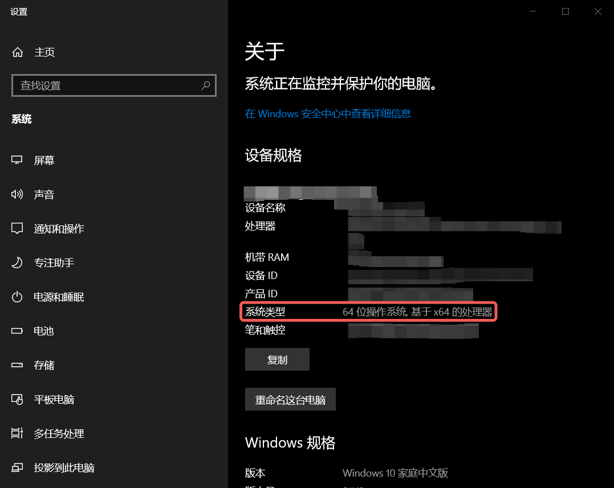
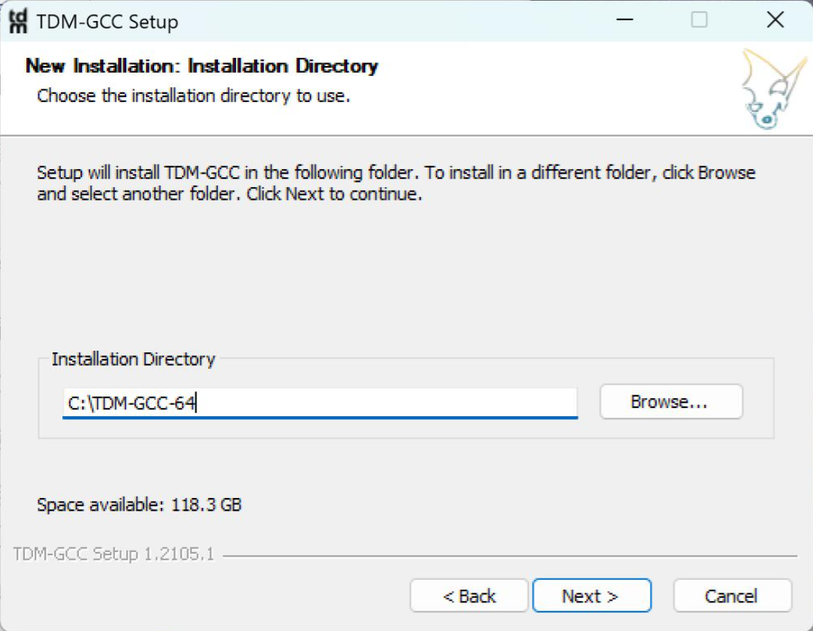
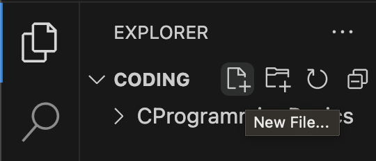
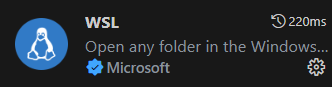

# 准备开发与调试环境

<!-- prettier-ignore-start -->
!!! danger "施工中"

    本页面正在编辑中。
<!-- prettier-ignore-end -->

在参与线下授课前，同学们最好能够安装好相关的开发环境，以便能够更好的跟随老师的讲解。我们在这里提供了一些安装指南和 Windows 上 Shell 基础的讲解，希望能够帮助到大家。

> 本文档更改自周健均学长为图灵程算课程准备的[资料](https://zhoutimemachine.github.io/2023_FPA/)，感谢周健均学长的付出。

## Windows 使用拾遗

!!! info "Mac 用户和已经对 Windows Terminal 和 WSL 比较熟练的同学可以跳过这一节"

### 运行与终端

<!-- prettier-ignore-start -->
::cards::

[
  {
    "title": "运行窗口",
    "content": "使用 Win + R 组合键，将会出现如下窗口。这就是运行窗口，可以在其中输入命令运行，即使是 Windows XP 都可以使用。",
    "image": "graph/WinR.png"
  },
  {
    "title": "命令提示符 CMD",
    "content": "在其中输入 `cmd` 后回车，就会出现**命令提示符**，如下图所示",
    "image": "graph/cmd.png"
  },
  {
    "title": "Windows Terminal",
    "content": "但是命令提示符功能有限，也不是很美观，推荐安装 **Windows Terminal**（终端）。在 Microsoft Store 中搜索 terminal，出现如下的选项，然后选择安装即可。",
    "image": "graph/windows_terminal.png"
  },


]

::/cards::
<!-- prettier-ignore-end -->

在比较新版本的 Windows 中，Win 键打开菜单之后输入字符能够搜索到对应程序，除了常用的应用程序以外，启动 cmd.exe 和 sysdm.cpl 也可以这样进行，效果和 Win + R 相同。

### WSL 安装简单引导（可选）

> 推荐装一装，如果主力机是 Windows 在以后将对 WSL 有较大需求

WSL，全称 Windows Subsystem for Linux（适用于 Linux 的 Windows 子系统），是一项允许开发者不依靠单独的虚拟机或双启动 (dual booting) 而在 Windows 上运行 Linux 环境的功能。

#### 安装：以 Ubuntu 为例

在这里以在 Windows11 上安装 WSL2 Ubuntu 为例介绍最简单的安装流程，详细的信息可以参考[官方文档 Install Linux on Windows with WSL](https://learn.microsoft.com/en-us/windows/wsl/install) 或者它的[中文版](https://learn.microsoft.com/zh-cn/windows/wsl/install)。

> Ubuntu 是 Linux 的一种发行版本，在这里就不对 Linux 的众多发行版本进行介绍和评价了。有能力和想法的同学可以自己对照教程安装其他发行版，比如在终端输入 `wsl --list --online` 可以看到所有可以选择的 Linux 发行版

注意安装 WSL 的先决条件：Windows 版本**不低于** Windows 10 20H2（Build 19042）或者 Windows 11。如果版本太老，请更新到最新版本，如果无法更新可以考虑重装系统。

!!! info "可以使用 `winver` 命令查询 Windows 版本，Win + R 输入 `winver` 或者在 Win 键出现的菜单栏中直接输入 `winver` 都可以启动。新买的电脑可能 Windows 11 居多，如果是 Windows 10 的电脑版本显示可能是 21H2（操作系统内部版本 19044.3086），这样也是符合先决条件的。"

直接使用如下命令自动安装：

```
wsl --install
```

中途可能会弹出两个窗口，显示正在修改什么东西，统统选择“是”。安装完成后，将出现如下界面


- 设置一个用户名，建议全英文无空格
    - 若有空格，将会只取第一个空格前面的内容作为你的用户名
- 输入密码，注意你输入的字符不会在屏幕上显示，需要盲打
    - 如果打了乱七八糟的字符不要慌，确认密码时故意打错会重新让你设置密码
    - 确认密码与输入密码一致才会设置成功

这样就完成了 WSL2 Ubuntu 的安装。

#### 简单的设置

> 上面已经完成了安装，这里是为了方便未来的使用而进行的一些说明

Linux 的发行版本默认安装在 C 盘，推荐将其导出到其他数据盘，避免占用 C 盘太多空间。例如完成了 Ubuntu 的安装，可以在 D 盘建立目录 `D:\wsl\ubuntu`（按个人喜好定义目录），随后在命令提示符/终端执行：
```
wsl --export Ubuntu D:\wsl\ubuntu\ubuntu.tar
```

将导出 ubuntu.tar，随后进行注销：
```
wsl --unregister Ubuntu
```

最后重新导入。
```
wsl --import Ubuntu D:\wsl\ubuntu D:\wsl\ubuntu\ubuntu.tar
```

以上操作完成后，登录 Ubuntu 将会默认以 root 用户打开。但是 root 用户具有最高权限，胡乱操作容易出问题，以及 root 用户的颜色是白色的，不是特别好看，因此可以修改默认的登录用户。首先**在 WSL 外**输入以下指令以停止 WSL：

```
wsl --shutdown
```

然后对 Ubuntu 进行默认用户配置的修改，假设你设定的用户名为 zhou：
```
Ubuntu config --default-user zhou
```

使用终端的一大好处是方便打开 WSL。如下图所示，点击 Ubuntu 22.04.2 LTS 或者使用 Ctrl + Shift + 5 组合键就可以方便地打开 Ubuntu 22.04。当然这是因为我安装的是 `Ubuntu 22.04` 的缘故，在你们的电脑中显示的应该就是 `Ubuntu`。

<div style="text-align:center;">

</div>

其他 WSL 的使用方法留待你们慢慢探索了，在此不再赘述。

## 安装 C 语言编译器

!!! info "本篇相对比较复杂，如果在本篇配置遇到难以解决的困难，而作业/实验截止日期快要到了，可以跳过本篇安装 Dev-C++ 进行临时开发。"

写完了 C 语言代码，我们需要让它变成能跑的程序，这就需要准备 C 语言的编译器支持。以下主要介绍 Windows 系统的配置。

### 就决定是你了，gcc！

> 自由软件 (free software)，根据自由软件基金会对其的定义，是一类可以不受限制地自由使用、复制、研究、修改和分发的，尊重用户自由的软件。——维基百科

gcc，全称 GNU Compiler Collection，著名的自由软件，被许多现代类 Unix 操作系统采用为标准编译器，但是 Windows 上并不直接支持。我们想要在 Windows 系统上使用，一般得依赖 MinGW 的 gcc，tdm-gcc 也是基于 MinGW 的 gcc 来的。

!!! info "有能力的同学推荐在 Windows 上开启 WSL，使用 WSL 进行 C 语言开发。WSL 可以理解为在 Windows 的电脑中模拟一个 Linux 的小系统，从而能方便地控制环境。"

### Windows 小白教程之 tdm-gcc

> 前面选择了 WSL 的同学可以自行配置，然后再看[第 3 节](#gcc_1)。Mac 用户可以直接看[第 3 节](#gcc_1)。

可以按照老师的视频教程下载 [tdm-gcc](https://jmeubank.github.io/tdm-gcc/download/)，目前最新版为 gcc 10.3.0。

需要判断自己的 Windows 是 64 位系统还是 32 位系统（现在一般都是 64 位系统）。

=== "Windows 11"

    点击 Win 键，输入“关于”，如下图所示。打开“关于你的电脑”后就可以看到电脑是不是 64 位了，新电脑一般都是 64 位。
    
    <div style="text-align:center;">
        
    </div>

=== "Windows 10"

    桌面找到“此电脑”，右键属性
    
    <div style="text-align:center;">
        
    </div>
    
    可以看到是 64 位系统还是 32 位系统。
    
    <div style="text-align:center;">
        
    </div>

64 位系统直接下载 tdm64-gcc-10.3.0-2.exe 安装即可，32 位则选择 tdm-gcc-10.3.0.exe。

准备安装。对于零基础的同学，电脑里应该还没装过 tdm-gcc，选择 create 即可。
<div style="text-align:center;">
    
</div>
接下来就是根据 64/32 位系统选择对应的版本

<div style="text-align:center;">
    
</div>
选择安装路径，推荐零基础同学选择默认路径（如 64 位的 `C:\TDM-GCC-64`）

<div style="text-align:center;">
    
</div>

接下来是要认真考虑的页面。

- 可选的安装项
    - 可以全选。如果确定不需要一些东西可以不选，比如确定自己不会再需要调试 32 位程序的话可以不选 gdb32。
- Start Menu items
    - 看个人意愿，可以不选
- Add to PATH
    - **建议选上**。如果不选或者忘选了，将会需要自己配置 tdm-gcc 的环境变量路径。

<div style="text-align:center;">
    
</div>

> 如果希望用更新版本的 gcc 可以使用 [winlibs 编译的 mingw-gcc](https://winlibs.com/)，或者你可以自己选择。

### 测试 gcc 是否正确安装

=== "Windows"
    在命令提示符/终端中输入 `gcc`，应当出现如下信息：
    ```
    gcc: fatal error: no input files
    compilation terminated.
    ```

    如果没有，可能是你还没有安装 gcc，或者你前一步 `Add to PATH` 没有正常进行，可能需要参照 [Windows 修改环境变量](#windows)进行环境变量的检查。
    
    命令提示符/终端中输入 `gcc --version`，应当出现类似如下的信息。
    ```
    gcc.exe (tdm64-1) 9.2.0
    Copyright (C) 2019 Free Software Foundation, Inc.
    This is free software; see the source for copying conditions.  There is NO
    warranty; not even for MERCHANTABILITY or FITNESS FOR A PARTICULAR PURPOSE.
    ```
    
    我的版本显示是 `9.2.0`，是因为装了旧版本的 tdm-gcc，你们的显示将会是 `10.3.0`。

=== "WSL"
    如下命令安装 `gcc`。如果错误，尝试 `sudo apt-get update` 后再重新执行下面的命令。
    ```
    sudo apt install gcc
    ```

    终端中输入 `gcc`，应当出现如下信息：
    ```
    gcc: fatal error: no input files
    compilation terminated.
    ```

    终端中输入 `gcc --version`，可能会出现类似如下的信息：
    ```
    gcc (Ubuntu 11.2.0-19ubuntu1) 11.2.0
    Copyright (C) 2021 Free Software Foundation, Inc.
    This is free software; see the source for copying conditions.  There is NO
    warranty; not even for MERCHANTABILITY or FITNESS FOR A PARTICULAR PURPOSE.
    ```

=== "macOS"
    Mac 用户直接使用 `gcc -v` （或者 `xcode-select --install`）会提示你安装开发者工具，然后就会自动安装 XCode 在内的一系列开发支持，最后告诉你你安装的 gcc 其实是 clang，本质上是它将 gcc 作为 clang 的别名 (alias) 了。

    成功安装后，终端输入 gcc 会出现如下信息：
    ```
    clang: error: no input files
    ```
    
    使用 `gcc --version` 可能出现以下信息：
    ```
    Apple clang version 14.0.3 (clang-1403.0.22.14.1)
    Target: x86_64-apple-darwin22.6.0
    Thread model: posix
    InstalledDir: /Library/Developer/CommandLineTools/usr/bin
    ```
    
    gcc 和 clang 都是 C 语言编译器，只是特性上存在差异。在作业和实验中，一个好的遵从标准的 C 代码，由不同的编译器编译后不应当产生不同的运行结果。因此如果你使用 clang 编译 C 代码运行不符合预期，代码出问题的概率比 clang 特性出问题的概率大很多。
### Windows 修改环境变量

> Windows 用户环境变量配置出现问题了才需要看这一小节

检查一下环境变量，Win + R 键输入 `sysdm.cpl` 后回车，会出现 “系统属性” 界面，选择 “高级”，如下图所示：

<div style="text-align:center;">

</div>

打开环境变量，在 “系统变量” 或者 “用户变量” 中找到 PATH 变量，在其中增加一项 tdm-gcc 的路径。例如你如果默认安装 tdm-gcc，那么路径可能就是 `C:\TDM-GCC-64\bin`。

## VSCode 安装与配置

> VSCode 的全称是 Visual Studio Code，注意它和 Visual Studio 完全是两个东西

!!! warning "**不建议**安装 Visual Studio，除非你清楚你安装它是为了什么"

在这里仅介绍 Visual Studio Code 的安装。除了老师的视频之外，大家安装配置时还可以参考 [GZTime 的教程](https://blog.gztime.cc/posts/2020/6b9b4626/)，对于初学者来说还不错。

### 安装

VSCode 直接从[官网](https://code.visualstudio.com/)选择自己平台对应的安装包下载就行

=== "Windows"
    Windows 的 exe 安装可以全选默认选项一路 Next，比较熟悉的同学可以自定义选项：

    - 安装目录
        - 推荐默认 C 盘，可能运行速度更快，也可以避免一些权限问题
    - 将 “通过 Code 打开” 操作添加到 Windows 资源管理器文件/目录上下文菜单
        - 选中该项后，选中文件或者文件夹，右键菜单中会出现 `通过 Code 打开` 的选项
        - 如果希望右键菜单不那么臃肿的话可以不选这一项
        - 本人没有选择该选项，可以自行思考选择
    - 将 Code 注册为受支持的文件类型的编辑器（推荐）
        - 打开受支持的文件类型时，VSCode 将会成为可选项
    - 添加到 PATH（推荐）
        - 在命令行窗口/终端可以用 `code` 命令打开 VSCode

=== "Mac"
    Mac 的包下载下来之后拖入 `Application` 文件夹可以直接运行

    - 添加到 PATH：如果需要在命令行窗口/终端用 `code` 命令打开 VSCode，那么需要如下操作
        - 打开 VSCode 界面
        - 使用 Shift + Command + P 打开命令面板
        - 输入 `shell command`，选择 `Shell Command: Install ‘code’ command in PATH` 回车执行

### 插件安装

打开 VSCode 后，在左侧竖栏寻找下面这个图标：

<div style="text-align:center;">

</div>

点击这个图标就进入了插件管理。建议可以安装下面两个插件：

- C/C++: 微软自家的插件，可用于**语法识别、代码高亮**

<div style="text-align:center;">

</div>

- Chinese(Simplified): 界面汉化插件（可选）

<div style="text-align:center;">

</div>

安装汉化插件后可能需要你手动切换显示语言。Ctrl + Shift + P，出现的搜索框中输入 Configure，选择 Configure Display Language。

<div style="text-align:center;">
    
</div>

随后再选择“中文(简体)”就可以完成界面汉化了。

<div style="text-align:center;">
    
</div>

> 英语基础不太好的同学有困难可以使用，英语基础比较好以及想要在日常实践中学习英语的同学建议跳过这一步。

!!! info "这里只提供最基本的插件和使用示例，复杂的配置与使用大家可以参考 [GZTime 的教程](https://blog.gztime.cc/posts/2020/6b9b4626/)"

### VSCode 使用的一个简单示例

这里为想要尽快上手的同学提供一个简单的使用示例。打开 VSCode（打开时没有指定工作目录），将会出现如下的窗口：


> 工作目录，指某个专门存放你用于某个目的的文件的文件夹。例如你可能会建立一个文件夹，专门存放所有与第一次作业相关的代码、文档、配置文件等，在你为完成第一次作业而工作时，这个文件夹就是你的工作目录

点击左侧的 `Open Folder`，选择一个目录作为你的工作目录，一般会把你这个窗口所要处理的所有文件放置在这里。顶栏 Terminal > New Terminal（或终端 > 新建终端）打开 VSCode 的内部终端，功能大致与命令提示符/终端相同。


下图就是打开了工作目录并新建了终端的界面状态。


鼠标移动到工作区，按 `New File` 键可以新建文件，旁边有新建文件夹按键。当然，直接在左侧工作目录右键也可以新建文件/文件夹。

<div style="text-align:center;">

</div>

创建 `test.c`，输入 Hello World 的代码并**保存文件**。然后在终端输入以下命令并执行：
```
gcc test.c
```

在不同的系统将会生成不同的编译产物。

=== "Windows"
    将会在和 `test.c` 同目录下生成 `a.exe`，随后在终端输入以下命令进行执行
    ```
    ./a.exe
    ```

=== "WSL/macOS"
    将会在和 `test.c` 同目录下生成 `a.out`，随后在终端输入以下命令进行执行
    ```
    ./a.out
    ```

以下展示在 macOS 上的执行结果：


这里有几个注意点：

- 记得保存文件后再 gcc 编译，可以考虑开启自动保存
    - 如下图所示，找到左下角的齿轮点击后选择 Setting 或者设置，出现的设置页面中搜索 `auto` 可以找到如图所示的 `Auto Save` 设置项，设置为 afterDelay 即可
    - afterDelay 是对文件做出修改就实时保存，如果嫌保存频率过高可以选择 onFocusChange 或者 onWindowsChange
    - 我本人使用的是 onFocusChange，这样移动到终端准备编译运行时源代码文件就会自动保存，既自动保存又不会保存太频繁


- 建议工作目录和文件名全英文，给出以下几个**反面案例**：
    - 文件名 `作业.c`
    - 工作目录 `编程`
    - 工作目录叫 `Coding`，但是绝对路径是 `D:/学习资料/Coding`
- 可以指定编译生成的文件名，比如你想要输出文件名为 `hello.exe`，就可以执行
```
gcc test.c -o hello.exe
```
- 更多的 gcc 选项和 VSCode 扩展功能留待你们探索

### VSCode + WSL（可选）
> 前面选择安装了 WSL 的使用 Windows 主力机的同学可以参考一下，非常有用的功能

以下引导主要按照 [Microsoft 的官方文档](https://learn.microsoft.com/en-us/windows/wsl/tutorials/wsl-vscode)，也可以参考其[中文版](https://learn.microsoft.com/zh-cn/windows/wsl/tutorials/wsl-vscode)。

#### 从 VSCode 连接到 WSL

安装 WSL 插件，如下图所示：

<div style="text-align:center;">

</div>

或者你也可以像官方文档那样，直接安装整个 Remote Development 扩展包：

<div style="text-align:center;">

</div>

其中不仅有 WSL，还包括另外三个非常有用的远程开发插件。


- Ctrl + Shift + P，在出现的命令框中输入 WSL，选择 `WSL: Connect to WSL in New Window`（或 `WSL: 在新窗口中连接到 WSL`）
- 将打开一个新的 VSCode 窗口，里面已经连接到默认的 WSL 环境

> 如果需要在本窗口连接到 WSL，或连接到非默认的 WSL 所安装的其他 Linux 发行版，可以选择其他 WSL 的命令


注意上图左下角所显示的状态，表明已经连接到 WSL 所安装的 Ubuntu-22.04，接下来的开发操作和[上一节](#vscode_1)就区别不大了。

#### 从 WSL 启动 VSCode

**确保你已经将 VSCode 添加到 PATH 环境变量中**。如果已经添加，那么直接在 WSL 的命令行中你所希望作为工作目录的位置执行
```
code .
```

就可以打开 VSCode，连接到 WSL 并且打开该目录作为工作目录。`.` 在这里表示当前目录即 `pwd`，如果将它替换成其他目录的路径也是可以将其打开作为工作目录的。

如果你还未将 VSCode 添加到 PATH 环境变量中，那该功能将无法使用，需要你手动添加 VSCode 到 PATH 环境变量。例如你的 Windows 用户名是 ZTM，并把 VSCode 安装在默认目录，那么需要将 `C:\Users\ZTM\AppData\Local\Programs\Microsoft VS Code\bin` 加入到 PATH 环境变量，参考 Windows 修改环境变量章节。
