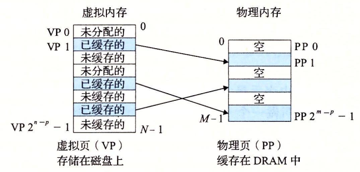

# 课后拓展：程序和数据在计算机中是如何存储的？

<!-- prettier-ignore-start -->
!!! danger "施工中"

    本页面正在施工中，内容可能不完整。

!!! abstract "内容摘要"

    本节内容对应 CSAPP 第 6 章「存储器层次结构」与第 9 章「虚拟内存」。
<!-- prettier-ignore-end -->

## 存储器层次结构

<!-- prettier-ignore-start -->
!!! danger "待完善"
<!-- prettier-ignore-end -->

## 虚拟内存

系统中的进程间共享 CPU 和主存资源。然而，共享主存会造成许多问题，比如一个进程不小心写入了另一个进程使用的内存。

<!-- prettier-ignore-start -->
!!! note inline end "Linux 进程的虚拟地址空间"

    
<!-- prettier-ignore-end -->

为了更加有效地管理内存并减少出错，现代操作系统将主存抽象为**虚拟内存（Vitrual Memory）**。右图展示了 Linux 系统中进程的虚拟地址空间设计。

- 它让每个进程都**以为**自己在独占地使用主存。
- 每个进程看到的内存都是一致的，称为**虚拟地址空间**。
    - 一致性指的是**地址空间**的一致。比如右图中，地址空间最上面的区域保留给操作系统中的代码和数据，底部区域存放用户进程的代码和数据，这些对所有进程来说都是一致的。

虚拟内存需要硬件异常、硬件地址翻译、主存、磁盘文件和内核软件共同交互实现。接下来我们一步步了解虚拟内存的细节。

### 虚拟内存的基本思想

一个进程虚拟内存的内容存储在磁盘上，然后用主存作为磁盘的高速缓存。

磁盘上的数据被分割成**虚拟页（Virtual Page）**，主存被分割成**物理页（Physical Page）**。虚拟页和物理页的大小相同，通常为 4KB。这些页是磁盘和主存之间的传输单元。

{width=40% align=right}

任意时刻，虚拟页面可能处于以下三种状态之中：

- 未分配：未分配，不占用任何磁盘空间
- 缓存的：已分配，已经缓存在物理内存中
- 未缓存的：已分配，未缓存在物理内存中

### 虚拟地址空间的结构

下面介绍的是 Linux 系统中进程的虚拟地址空间结构。不同的操作系统可能有不同的设计。从最低的地址开始向上，依次是：

- 程序代码和数据（只读）
    - 对所有的进程来说，代码从某个固定的地址开始。
    - 这个区域是直接按照可执行目标文件的内容初始化的。
    - 进程一开始运行时就指定了大小。
- 堆
    - 调用 `malloc` 和 `free` 等标准库函数时，堆可以在运行时动态地扩展和收缩。
- 共享库
    - 存放 C 标准库和数学库等共享库的代码和数据。
- 栈
    - 处于用户地址空间的顶部。
    - 编译器用它来实现函数调用。
    - 栈可以动态地扩展和收缩。每次调用函数时，栈的大小都会增加；每次返回时，栈的大小都会减少。
- 内核虚拟内存
    - 不允许应用程序读写这个区域，也不能调用其中的代码。
    - 程序只能调用内核对这块区域执行操作。

虚拟地址空间的大小由**表示最大地址所需要的位数决定**。现代系统通常支持 32 或 64 位。比如 32 位操作系统支持的虚拟地址空间大小为  2^32 = 4GB。

### 虚拟内存的工作原理

#### 虚拟寻址

{width=40% align=right}

CPU 不会直接使用物理地址（Physical Address）访问主存，而是使用虚拟地址（Virtual Address）。

- 主存中存放了一个查询表，用于动态地翻译虚拟地址。该表由操作系统管理。
- CPU 芯片上的内存管理单元（Memory Management Unit）负责使用查询表翻译虚拟地址。

