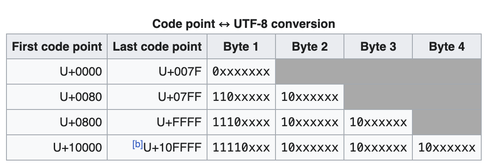

# I/O 与文件

<!-- prettier-ignore-start -->
!!! danger "施工中"

    本页面正在编辑中。
<!-- prettier-ignore-end -->

<!-- prettier-ignore-start -->
!!! abstract "内容提要"

    - C 的输入输出模型：缓冲与流的概念
    - C 标准 I/O 函数
    - 文件编码与文件输入输出
<!-- prettier-ignore-end -->

## C 的输入输出模型

### 缓冲

广义的缓冲区是内存空间的一部分，在内存中预留了一定的存储空间，用来暂时保存输入和输出等I/O操作的一些数据，这些预留的空间就叫做缓冲区；而buffer缓冲区和Cache缓存区都属于缓冲区的一种。

<!-- prettier-ignore-start -->
!!! note "buffer缓冲区和cache缓存区"

    - buffer缓冲区存储速度不同步的设备或者优先级不同的设备之间的传输数据，比如键盘、鼠标等；此外，buffer一般是用在写入磁盘的；
    - Cache缓存区是位于CPU和主内存之间的容量较小但速度很快的存储器，Cache保存着CPU刚用过的数据或循环使用的数据；Cache缓存区的运用一般是在I/O的请求上

<!-- prettier-ignore-start -->

C语言中，用户输入的字符被收集并储存在缓冲区（buffer）中，**按下 ++enter++ 键后**程序才能使用用户输入的字符。

- 完全缓冲：仅缓冲区填满时刷新缓冲区（将内容发送至目的地），通常用于**文件输入**。缓冲区的大小取决于系统，常见大小为512bits和4096bits。
- 行缓冲：出现换行符时刷新缓冲区，通常用于**键盘输入**。所以在按下 ++enter++ 键后程序才能使用用户输入的字符。

与之对应地，无缓冲输入的程序能够立即使用用户输入的内容。

<!-- prettier-ignore-start -->
!!! note "stdin,stdout,stderr的缓冲类型"

    Unix约定stdin与stdout若与终端关联则为行缓冲，而stderr为无缓冲。

<!-- prettier-ignore-start -->

<!-- prettier-ignore-start -->
!!! tip "为什么要有缓冲区？"

    - 系统层面，减少CPU对磁盘的读写次数：CPU读取磁盘中的数据并不是直接读取磁盘，而是先将磁盘的内容读入到内存，也就是Cache，然后CPU对Cache进行读取，进而操作数据；计算机对Cache的操作时间远远小于对磁盘的操作时间，大大的加快了运行速度，提高CPU的使用效率。

    - 在C语言输入中，把若干字符作为一个块进行传输比逐个发送这些字符节省时间，打错字符可以直接通过键盘修正错误。

<!-- prettier-ignore-start -->

虽然缓冲输入好处很多，但是某些交互式程序也需要无缓冲输入。例如在游戏中，玩家的输入需要立即反应在屏幕上，而不是等待用户按下 ++enter++ 键。

C 标准规定：**输入是缓冲的**。你能解释为什么C 标准要规定输入是缓冲的吗？

<!-- prettier-ignore-start -->
??? tip "为什么C标准规定输入是缓冲的？"

    一些计算机不允许无缓冲输入。ANSI没有提供调用无缓冲输入的标准方式，这意味着是否能进行无缓冲输入取决于计算机系统。

    如果你的计算机允许无缓冲输入，那么你所用的C编译器很可能会提供一个无缓冲输入的选项。例如，许多IBM PC兼容机的编译器都为支持无缓冲输入提供一系列特殊函数，其原型在`conio.h`中。在Unix系统中，可以使用`iotcl()`函数指定待输入的类型，然后使用`getchar()`执行相应操作。在ANSI C中，用`setbuf()`和`setbufv()`控制缓冲，但是这两个函数可能不起作用。

<!-- prettier-ignore-end -->

<!-- prettier-ignore-start -->
??? info "我可以更改输入方式吗？"

    UNIX 库中有 `ioctl()` 函数用于指定待输入的类型，但这不属于 C 标准。

    ANSI C 中，可以使用 `setbuf()` 和 `setvbuf()` 控制缓冲，但受限于系统的设置。

<!-- prettier-ignore-end -->

### 流

C 库提供的输入输出方式称为**标准 I/O**，它们是建立在操作系统提供的**底层 I/O** 上的。底层 I/O 之间常常会有一些差异：

<!-- prettier-ignore-start -->
!!! note "各个系统的文件差异"

    | 差异 | UNIX | Windows | MacOS |
    | - | - | - | - |
    | 换行符 | `\n`<br /> LF | `\r\n` <br />CRLF | `\n` (较早的 MacOS 使用 `\r`)<br />LF |
    | 文件结束符 | `^D` | `^Z` | `^D` |

    注：如 `^Z` 代表 `Ctrl+Z`，你可以使用该组合键结束键盘输入。

    文件结尾也不一定由文件结束符标记。事实上，UNIX 系统储存文件大小信息，依据文件大小信息决定文件末尾。
<!-- prettier-ignore-end -->

从概念上看，C 处理的是**流**而不是文件。不同属性和不同种类的输入，由属性更统一的**流**来表示。流告诉我们，我们可以用处理文件的方式来处理键盘输入。

C语言中I/O流由`File`类型的对象表示，该对象只能通过`FILE*`类型的指针访问及操作。每个流都与外部的物理设备相关联。

<!-- prettier-ignore-start -->
!!! note "流"

    流就是一系列连续的字节。

    打开文件的过程就是把**流与文件相关联**，读写都通过流来完成。
<!-- prettier-ignore-end -->

`getchar()` 和 `scanf()` 等函数读取到文件结尾时会返回一个特殊的值 `EOF`，在 `stdio.h` 中定义了：

```C 
#define EOF (-1) 
```

<!-- prettier-ignore-start -->
??? tip "你能解释为什么要把它定为 `-1` 吗？"

    The value of `EOF` is -1 because it has to be different from any return value from `getchar` that is an actual character. So `getchar` returns any character value as an unsigned char, converted to int, which will therefore be non-negative.

<!-- prettier-ignore-end -->

因此，如果你在终端中进行输入，可以使用`Ctrl+Z(Windows)`或者`Ctrl+D(unix-style systems)`作为`EOF`结束输入。

由以上两部分，我们可以知道在C的键盘输入中，我们可以用**Enter**处理缓冲区中的内容，用**Ctrl+Z**或者**Ctrl+D**结束输入。

### 标准流

在标准头文件`<stidio.h>`中，定义了三个**文本**流.

```C
#define stdin  /* 由实现定义 */
#define stdout /* 由实现定义 */
#define stderr /* 由实现定义 */
```

这三个文本流是预定义的。这些流在程序启动时隐式打开，且为**无取向**的。

1. 与标准输入流关联，用于读取传统的输入。程序启动时，当且仅当能确定流不引用交互式设备时该流为完全缓冲。
2. 与标准输出流关联，用于写入传统的输出。程序启动时，当且仅当能确定流不引用交互式设备时该流为完全缓冲。
3. 与标准错误流关联，用于写入诊断输出。程序启动时，该流不为完全缓冲。

## 字符输入输出

### 重定向

在开始介绍字符输入输出前，先介绍系统的重定向。

重定向是指改变标准输入输出的目的地。在UNIX系统中，可以使用`>`和`<`来重定向输入输出。

> 例如，`ls > ls.txt` 将`ls`的输出重定向到`ls.txt`文件中，`cat < ls.txt`将`ls.txt`文件的内容重定向到`cat`命令中。

在使用两个重定向运算符时，要遵循一下原则：

- 重定向运算符不能读取多个文件的输入，也不能把输出定向至多个文件。
  > 例如，不能使用`ls > ls.txt > echo.txt`
- 在一条命令中，输入文件名和输出文件名不能相同
  > 例如，不能使用`ls < ls.txt > ls.txt`

重定向的目的地可以是文件，也可以是其他程序。

> 例如，`ls | cat`将`ls`的输出重定向到`cat`命令中。

### 无格式输入/输出

在字符I/O中，我们常使用以下函数来处理字符，这些函数位于`<stdio.h>`头文件中。`<wchar.h>` 头文件提供了具有宽字符输入/输出功能的函数。

<!-- prettier-ignore-start -->
!!! info "e.g."

    ```C title="echo_eof.c"
    /* echo_eof.c -- repeats input to end of file */
    #include <stdio.h>
    int main(void)
    {
        int ch;

        while ((ch = getchar()) != EOF)
        putchar(ch);

        return 0;
    }
    ```

    结合重定向运算符，我们可以使用`echo_eof < echo_eof.c`来测试该程序。

    ```bash
    $ echo_eof < echo_eof.c
    $ echo_eof < echo_eof.c > echo_eof.txt
    $ echo_eof < echo_eof.c | cat
    ```
<!-- prettier-ignore-end -->

窄字符无格式输入输出函数，定义于 `<stdio.h>` 头文件中：

| 功能 | 函数 | 失败返回值 |
| - | - | - |
| `int getchar(void)`<br /> `int getc(FILE *stream)` <br /> `int fgetc(FILE *stream)` | 单字符输入 | EOF |
| `char *fgets(char *s, int size, FILE *stream)` <br /> `char *gets_s( char *str, rsize_t n)`| 字符串输入 | NULL |
| `int ungetc(int c, FILE *stream)` | 放回文件流 | EOF |
| `int putchar(int c)`<br /> `int putc(int c, FILE *stream)` <br /> `int fputc(int c, FILE *stream)` | 单字符输出 | EOF |
| `int puts(const char *s)`<br /> `int fputs(const char *s, FILE *stream)` | 字符串输出 | EOF |

<!-- prettier-ignore-start -->

!!! note "注意"
    - 以上函数都将字符从缓冲区中的 `unsigned char` 类型转换为 `int` 类型。

    - `getchar()`它的返回值是 `int` 类型而非 `char` 类型，值得注意。所以为什么可以使用`char c = getchar()`?
<!-- prettier-ignore-end -->

<!-- prettier-ignore-start -->
??? tip "那么这是否会造成 EOF 不能被识别，而是被看作字符呢？"

    ```C 
    #define EOF (-1) // unsigned char转换成int后，值都大于等于0
    ```

<!-- prettier-ignore-end -->

宽字符输入输出定义于 `<wchar.h>` 头文件中，区别在于其一个字符的长度不同。C语言中有一种类型`wchar_t`,其长度取决于编译器：

- 在msvc中，`wchar_t`为16位，即`unsigned short`类型。
- 在gcc/Clang中，`wchar_t`为32位，即`unsigned int`类型。

在使用宽字符前，需要在字符和字符串前加上`L`前缀，例如`L'c'`和`L"string"`，未加前缀的字符和字符串为窄字符。
对于宽字符/字符串读写函数，其使用方法与窄字符类似。

| 功能 | 函数 | 失败返回值 |
| - | - | - |
| `int getwchar(void)`<br /> `int getwc(FILE *stream)` <br /> `int fgetwc(FILE *stream)` | 单字符输入 | EOF |
| `char *fgetws(char *s, int size, FILE *stream)`| 字符串输入 | NULL |
| `int ungetwc(int c, FILE *stream)` | 放回文件流 | EOF |
| `int putwchar(int c)`<br /> int fputwc(int c, FILE *stream)` | 单字符输出 | EOF |
|`int fputws(const char *s, FILE *stream)` | 字符串输出 | EOF |

### 格式化输入输出

在标头`<stdio.h>`和`<wchar.h>`中，定义了一系列格式化输入输出函数，这些函数可以用于读写格式化的数据。

#### [格式字符串](https://zh.cppreference.com/w/c/io/fprintf)

格式字符串`const char *format`由普通多字节字符（除了%）和转换指示构成，前者被复制到输出流而无更改。每个转换指示拥有下列格式：

- 引入的 % 字符
- (可选)一或多个修改转换行为的标签：
    - \- : 转换结果在域内左校正（默认为右校正）
    - +:有符号转换的符号始终前置于转换结果（默认结果前置负号仅当它为负）
    - 空格：若有符号转换的结果不以符号开始，或为空，则前置空格于结果。若存在 + 标签则忽略空格。
    - \# ：进行替用形式的转换。准确的效果见下表，其他情况下行为未定义。
    - 0 ：对于整数和浮点数转换，使用前导零代替空格字符填充域。对于整数，若显式指定精度，则忽略此标签。对于其他转换，使用此标签导致未定义行为。若存在 - 标签则忽略 0 。
- (可选)指定最小域宽的整数值或 `*` 。若有要求，则结果会以空格字符（默认情况）填充，在右校正时于左，左校正时于右。使用 `*` 的情况下，以一个额外的`int`类型参数指定宽度。若参数值为负数，则它导致指定 - 标签和正域宽。（注意：这是最小宽度：决不被截断值）。
- (可选)后随整数或 * 或两者皆无的 `.` 指示转换的精度。在使用 `*` 的情况下，精度由额外的 int 类型参数指定。若此参数的值为负数，则它被忽略。若既不使用数字亦不使用 `*` ，则精度采用零。精度的准确效果见下表。
- (可选)指定参数大小的长度修饰符
- 转换格式指示符


#### `printf()`中转换说明的意义

转换说明实际上是在将以二进制存存储在计算机中的值转换成一些列字符便于显示。转换实际上是一种翻译说明。

> 例如：`d`：将一个有符号的十进制整数转换成十进制数。

下面讨论几种转换说明的情况：

1. 转换不匹配

    转换说明与待打印的值不匹配可能导致数据错误或者出现未定义的行为。

    <!-- prettier-ignore-start -->
    !!! info "e.g."

        ```C title="wrong_cnv.c"
        #include <stdio.h>
        #define num 336
        #define b 65618
        int main(void)
        {
            printf("num as short and unsigned short:  %hd %hu\n", num,num);
            printf("-num as short and unsigned short: %hd %hu\n", -mnum,-mnum);
            printf("num as int and char: %d %c\n", num, num);
            printf("b as int, short, and char: %d %hd %c\n",b, b, b);

            float n1 = 3.0;
            double n2 = 3.0;
            long n3 = 2000000000;
            long n4 = 1234567890;
            printf("%.1e %.1e %.1e %.1e\n", n1, n2, n3, n4);
            printf("%ld %ld\n", n3, n4);
            printf("%ld %ld %ld %ld\n", n1, n2, n3, n4);
            return 0;
        }
        ```
        该程序的输出结果为(**由于实现是未定义的，部分结果因系统和编译器而异**)：
        ```bash
            num as short and unsigned short:  336 336
            -num as short and unsigned short: -336 65200
            num as int and char: 336 P
            b as int, short, and char: 65618 336 R
            3.0e+00 3.0e+00 2.0e+09 1.2e+09
            2000000000 1234567890
            0 1074266112 0 1074266112
        ```
        你能解释为什么使用%ld输出long类型的值时，也会出现错误吗？
    <!-- prettier-ignore-end -->

2. `printf()`的返回值

    `printf()`函数返回打印的字符数，若出现错误则返回负值。

3. 打印长的字符串

    不能在双引号括起来的字符串中间断行。

    <!-- prettier-ignore-start -->
    !!! info "e.g."

        ```C title="longstrg.c"
        #include <stdio.h>
        int main(void)
        {
            printf("Here's one way to print a ");
            printf("long string.\n");
            printf("Here's another way to print a \
            long string.\n");
            printf("Here's the newest way to print a "
            "long string.\n"); /* ANSI C */
            /*
            printf("Here's wrong way to print a
            long string.\n");
            */
            return 0;
        }
        ```
    <!-- prettier-ignore-end -->

#### `scanf()`

在前面我们介绍了`printf()`中的格式化字符串和转换说明，`scanf()`中也有类似的格式化字符串和转换说明。

复杂的使用方法请查阅[scanf](https://zh.cppreference.com/w/c/io/fscanf)。

下面介绍一些`scanf()`的特性：

1. `scanf()`要将读取的内容存储到对应变量地址中，而不是变量名。因此，`scanf()`的参数应该是变量的地址。

    <!-- prettier-ignore-start -->
    !!! info "e.g."

        ```C title="scanf.c"
        #include <stdio.h>
        int main(void)
        {
            int age;
            float assets;
            char pet[30];

            printf("Enter your age, assets, and favorite pet.\n");
            scanf("%d %f", &age, &assets); // 读取整数和浮点数
            scanf("%s", pet); // 读取字符串
            printf("%d $%.2f %s\n", age, assets, pet);
            return 0;
        }
        ```
    <!-- prettier-ignore-end -->

2. `scanf()` 函数，除了 `%c` 以外的转换说明，都不会读取空白字符（空格、制表符和回车）。

    **典型问题：换行符问题**
    <!-- prettier-ignore-start -->
    !!! info "e.g."

        ```C title="confusing_scanf.c"
        #include <stdio.h>
        int main(void)
        {
            char c[100] = {0};
            scanf("%s\n",&c);
            printf("%s",c);
        }
        ```
    <!-- prettier-ignore-end -->

3. `scanf()`中的输入过程
    
    假设`scanf()`根据`%d`转换读取一个整数,`scanf()`函数每次读取一个字符，跳过所有的空白字符，直到遇到第一个非空白字符才开始读取。`scanf()`希望找到一个数字字符或者一个符号，若找到，则会继续寻找下一个数字字符或者符号，直到遇到一个非数字字符，此时`scanf()`会将读取的字符放回输入流中，然后将读取的字符转换成整数。

    如果第一个非空白字符不是数字或者正负号，`scanf()`会停在那里，并把字符放回输入中，不会把值赋给相应变量。C语言规定了在第1个出错的地方停止读取输入。

    如果使用`%s`转换说明，`scanf()`会跳过空白开始读取除空白以外的所有字符，直到遇到空白字符之后将空白符重新放回输入后结束。

4. 格式字符串中的普通字符
    
    `scanf()`中格式化字符串中的空白意味着跳过下一个输入项前的所有空白。

    除了`%c`其他转换说明都会自动跳过待输入值前面的所有空白。

    <!-- prettier-ignore-start -->
    !!! tip "以下代码有什么区别？"

        ```C
        scanf("%d %d", &n,&m);
        scanf("%d%d", &n,&m);

        scanf("%c", &c);
        scanf(" %c", &c);
        ```
    <!-- prettier-ignore-end -->

5. `scanf()`的返回值

    读取成功则返回读取的项数。没有读取任何项则返回0。当`scanf()`读取到文件末尾则返回`EOF`。

### 实例

#### 安全的输入函数
<!-- prettier-ignore-start -->
!!! note "写一个安全的输入函数"

    众所周知，C语言的`gets`函数是一个非常不安全的函数(请参考系统知识拾遗1)，在C11中被弃用，转为`gets_s()`。`gets()`极有可能造成缓冲区溢出，所以我们需要写一个安全的输入函数。

    ```C title="s_gets.c"
    char * s_gets(char* st, int n)
    {
        char * ret_val;
        int i = 0;

        ret_val = fgets(st, n, stdin);
        if (ret_val)
        {
            while (st[i] != '\n' && st[i] != '\0)
                i++;
            if (st[i] == '\n')
                st[i] = '\0';
            else //must have words[i] == '\0'
                while (getchar() != '\n')
                    continue;
        }
        return ret_val;
    }
    ```

    这个函数来自《C Primer Plus》，也是书中 13 章以后一直使用的输入函数。这个函数示范了如何使用安全的 `fgets()` 函数，并**将输入统一**，并处理剩余的字符。

    在涉及行的输入时，一定要注意统一行结尾的形式。这对于换行符，特别是**文件结尾处薛定谔的换行符**，有很大作用。
<!-- prettier-ignore-end -->

#### 检查输入

可以使用`scanf()` 的返回值来检查输入是否正确。

## 文件编码与文件输入输出

### 基础概念

#### 什么是文件？

简单的说，文件是在硬盘上的一段已命名的储存区。

对操作系统而言，文件更加复杂。文件是具有符号名的，在逻辑上具有完整意义的一组相关信息项的序列。文件还包括了一些额外数据，便于操作系统确定文件的种类。

    ```bash
    $ file c_file.c
    $ file c_file.o
    $ file c_file
    $ objdump -h -s -d c_file.o
    $ objdump -h -s c_file
    ```

对于C语言来说，C把文件看作连续的字节，每个字节都能被单独读取。这与UNIX环境中的文件结构相对应。便于其他操作系统，C提供两种文件模式：文本模式和二进制模式。

#### 文件编码

字符编码是把字符集中的字符编码为指定集合中某一对象（例如：bit流），以便文本在计算机中存储和通过通信网络的传递。

常见的文件编码：

- ASCII编码：
    8bit（一个字节），能表示的最大的整数就是255（2^8-1=255），而ASCII编码，占用0 - 127用来表示大小写英文字母、数字和一些符号，这个编码表被称为ASCII编码，比如大写字母A的编码是65，小写字母z的编码是122。 还对一些如'\n'，'\t'，'#'，'@'等字符进行了编码。
- GB2312编码：
    16bit（2个字节），适用于汉字处理、汉字通信等系统之间的信息交换，通行于中国大陆。中国大陆几乎所有的中文系统和国际化的软件都支持GB2312。
- GBK编码：
    16bit（2个字节），兼容GB2312，收录21003 个汉字，共有 23940 个码位，与Unicode组织的Unicode编码完全兼容。
- Unicode 编码：
    通常16bit（2个字节），为了统一所有文字的编码，Unicode应运而生，这是一种所有符号的编码。
- UTF-8：
    Unicode Transformation Format，可变长度编码，通常使用1~4字节为每个字符编码，兼容ASCII编码，这是一种Unicode的一种转换格式。



现在在内存中通常以UTF-16来储存，保存到文件中替换为UTF-8等格式，可以压缩空间。

#### 文本模式和二进制模式

所有文件的内容都以二进制形式存储。但是，如果文件最初使用二进制编码的字符(例如ASCII码)表示文本，该文件就是文本文件，其中包含文本内容。如果文件中的二进制值代表及其语言代码或数值数据，该文件是二进制文件，其中包含二进制内容。

Unix使用同一种文件格式处理文本文件和二进制文件的内容。Unix目录中有一个统计文件大小的计数，程序可以根据该计数确定是否读到文件尾。

C语言提供两种访问文件的途径：二进制模式和文本模式。在二进制模式中，程序可以访问文件的每个字节，而在文本模式中，程序所见的内容和文件的实际内容不同。程序以文本模式读取文件时，把本地环境表示的行末尾或文件结尾映射成C模式。


这告诉我们文本和二进制模式不能随意混用，否则可能会出现正确性上的问题。

<!-- prettier-ignore-start -->
??? note "I/O级别"

    事实上我们除了选择处理文件的模式，还能够选择I/O的级别。底层I/O使用操作系统提供的I/O服务。标准高级I/O使用C库的标准包和`stdio.h`头文件定义。标准高级I/O使用底层I/O服务，但是它们提供了更高级别的接口。因为无法保证所有的操作系统都适用相同的底层I/O模型，C标准只支持标准I/O包。
<!-- prettier-ignore-end -->

<!-- prettier-ignore-start -->
??? note "标准文件"

    C程序会自动打开3个文件，它们被称为标准输入（standard input）、标准输出（standard output）和标准错误输出（standard error output）。在默认情况下，标准输入是系统的普通输入设备，通常为键盘；标准输出和标准错误输出是系统的普通输出设备，通常为显示屏。

    通常，标准输入为程序提供输入，它是 `getchar()`和 `scanf()`使用的文件。程序通常输出到标准输出，它是`putchar()`、`puts()`和`printf()`使用的文件。前文提到的重定向把其他文件视为标准输入或标准输出。标准错误输出提供了一个逻辑上不同的地方来发送错误消息。例如，如果使用重定向把输出发送给文件而不是屏幕，那么发送至标准错误输出的内容仍然会被发送到屏幕上。这样很好，因为如果把错误消息发送至文件，就只能打开文件才能看到。

    理解：标准I/O中用FILE（流）表示一个打开的文件
<!-- prettier-ignore-end -->

### 流和文件

C 标准是这样描述两种流的：

- 文本流：组成文本行的有序字符序列，每一行由零个或多个字符加上标志结束的换行符组成。
    - 实现定义：最后一行是否需要换行符、换行符正前面的空格是否在读取时出现等。
- 二进制流：字符的有序序列。

关于文件动作：

- 打开文件：流打开一个文件，就是与该文件**关联**。
    - 创建文件会丢弃内容。
    - 和流相关的文件定位符定位在文件起始位置。
    - 附加模式下定位位置由实现决定。
- 关闭文件：关闭文件会释放与该文件相关的资源。

### 类型和宏

在 `<stdio.h>` 中有如下与文件相关的类型和宏：

- `FILE` 对象类型，记录控制**流**所需要的所有信息，包括：文件定位符、指向相关缓冲的指针、错误指示符和文件结束符。
    - 不要试图探索 `FILE *` 数据对象的内部，即使实现给出了某些可见域。不要修改对象、不要拷贝对象并代替使用，因为**实现假定知道流数据对象的所有地址**。
- `fpos_t` 对象类型，含有唯一指定文件中每个位置所需的所有信息。
- `stderr`, `stdin`, `stdout` 都是 `FILE*` 类型的表达式。
- `EOF` 展开为一个负的整值常量。
- `NULL`
- `SEEK_CUR` 文件当前位置
- `SEEK_END` 文件结束位置
- `SEEK_SET` 文件开始位置

### 函数

#### 文件操作：

- `int remove (const char *filename)`
- `int rename (const char *old, const char *new)`
- `FILE *tmpfile(void)`
- `char * tmpnam(char *s)`

#### 文件访问：

- `int fclose(FILE *stream)` 
    - 关闭文件，清空流（清空流就是传递缓冲数据），释放缓冲。
- `int fflush(FILE *stream)`
    - 立即写入（要求上一次操作是输出）。
- `FILE *fopen(const char *filename, const char *mode)`
    - 打开文件，返回文件流指针。
- `FILE *freopen(const char *filename, const char *mode, FILE *stream)`
- `void setbuf(FILE *stream, char *buf)`
    - 定义流 stream 应如何缓冲。该函数应在与流 stream 相关的文件被打开时，且还未发生任何输入或输出操作之前被调用一次
- `int setvbuf(FILE *stream, char *buf, int mode, size_t size)`
    - 创建供标准I/O函数替换使用的缓冲区

#### mode 字符串的含义：

| flag | meaning |
| - | - |
| r | read |
| w | write (new or cut) |
| a | append (new or append) |
| b | binary |
| + | update |

注意上面词语的含义，update 和 append 能写入的范围应该是不同的。

- append 模式下**所有写操作**强制加到文件结束处。
- update 模式下，若不调用文件定位函数，输入输出不一定相互紧跟。

对于 UNIX 这种只有一种文件类型的系统，带 `b` 与否的模式是相同的。
C11 中新增了 `x`，带该字母的写模式打开存在文件会失败（相当于加了保护），且允许独占。

#### 格式化输入/输出

`fprintf`,`fscanf`,`vfprintf`,`vprintf`,`vsprintf`

#### 字符输入/输出

`fgetc`,`fgets`,`fputc`,`fputs`,`getc`,`getchar`,`gets_s`/`(gets)`,`putc`,`putchar`,`puts`,`ungetc`

其中，`fgetc()` 与 `getc()` 这类函数的不同是后者可能被实现为宏。

#### 直接 I/O

- `size_t fread(void *ptr, size_t size, size_t nmemb, FILE *stream)`
- `size_t fwrite(const void *ptr, size_t size, size_t nmemb, FILE *stream)`

#### 文件定位

- `int fseek(FILE *stream, long int offset, int whence)`
    - `whence` 可以是 `SEEK_SET`、`SEEK_CUR`、`SEEK_END`
    - 第二个参数表示偏移量
    - 将文件类比为数组，单位是字节数
- `long int ftell(FILE *stream)`
    - 距文件开始处的字节数
- `void rewind(FILE *stream)`

#### 其他

以下两个函数用于处理更大型的文件（`long` 无法表示的偏移值）

- `int fgetpos(FILE *stream, fpos_t *pos)`
- `int fsetpos(FILE *stream, const fpos_t *pos)`