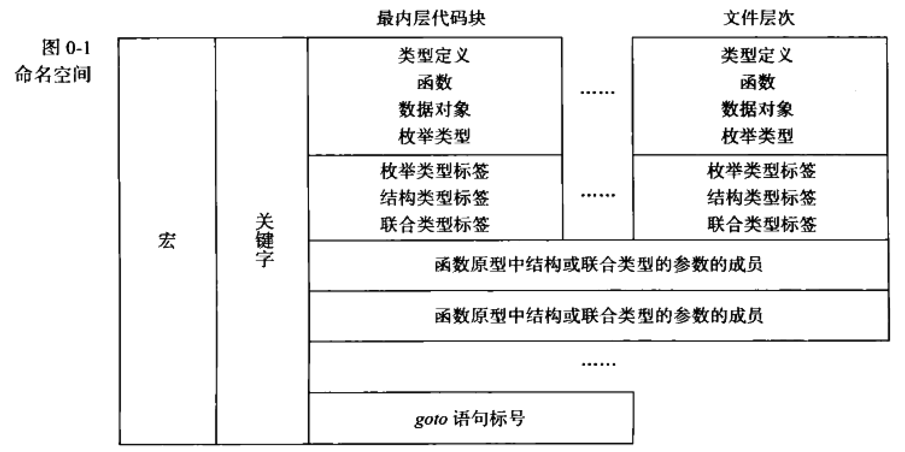

# 课后扩展：C 标准库的实现

<!-- prettier-ignore-start -->
!!! danger "施工中"

    本页面正在编辑中。
<!-- prettier-ignore-end -->

## 后半：C 标准库的实现

<!-- prettier-ignore-start -->
!!! info "杂谈：为什么要学习 C 标准库？"

    理论上，学习完任何编程语言的基本语法后，我们就可以用它来编程解决任何实际问题了。但是，语言所衍生出的任何能提高生产力的库，其重要性往往会远远超过该语言本身。学习一门语言并学习其库的实现，这样才能熟练地驾驭语言工具，了解库所提供的功能和局限性，进而在特定的应用要求下扩展库。

    尽管 C 语言及其所附带的标准库中隐藏着太多的晦涩陷阱，但我们不得不花大力气“过分钻研”它。学习 C 标准库本身的实现，就是学习 C 语言最好的教材，因为其实现过程将会把使用 C 语言编写具有工业强度的健壮代码所需的技巧展现得淋漓尽致。

    C 标准库可以分为 3 组。如何正确和熟练地使用它们，可以相应地区分出 3 种层次的 C 程序员：

    -   合格程序员：
        ```text
        <ctype.h> <stdio.h> <stdlib.h> <string.h>
        ```
    -   熟练程序员：
        ```text
        <assert.h> <limits.h> <stddef.h> <time.h>
        ```
    -   优秀程序员：
        ```text
        <float.h> <math.h> <error.h> <locale.h> <setjmp.h> <signal.h> <stdarg.h>
        ```
    
    可以看到，C 程序设计这门课程对大家的要求就是「合格程序员」。我们在课程中的极少部分代码会看见 `<assert.h>` 和 `<time.h>`，这两个库也会对你的编程有所帮助，优秀的同学可以以「熟练程序员」来要求自己。今后大多数同学或许都会转向学习 C++，大概只有做安全、系统、嵌入式之类的同学会需要做到「优秀程序员」的地步。

!!! tip "学习 C 标准库前你应该具备的知识"

    -   字符串、数组、指针等操作
    -   命名空间：库中定义了 200 个以上的名字，你应当知道 C 中各种名字会如何被解析。

    
<!-- prettier-ignore-end -->

学习 C 标准库时，我们会接触到很多 C 标准中的规范性的严谨地语句，初读时可能让你觉得非常拗口和难以理解，让我们来读几条。

### 杂项：C 标准对库的实现要求

在使用时不必在意，但需要知道的一个点是：标准库中的某些函数可能被作为宏实现了。但无论如何，标准库一定会提供一个函数版本的实现。

<!-- prettier-ignore-start -->
!!! question "如果一个函数既提供了宏版本又提供了函数版本，你知道如何使用指定的版本吗？"

    例如，对于以下两种版本，你知道你在使用的是宏还是函数吗？
    
    ```c
    #define isalnum(c) ...
    int isalnum(int c);
    ```
<!-- prettier-ignore-end -->

标准库中的一些函数，可能同时提供了宏和函数的版本。

-   一个实现必须为每一个库函数提供一个实际的函数，即使它已经为该函数提供了一个宏。
-   一个函数的任何宏定义都可以通过用括号把函数的名字括住来局部地抑制它。因为这个名字后面没有跟着指示一个宏函数名展开地左括号。
-   用来移除任何宏定义的 `#undef` 预处理指令的使用也可以保证实际函数的引用。

<!-- prettier-ignore-start -->
!!! example "`atoi()` 的使用方式"

    1.  可能生成一个宏函数：
        ```c
        #include <stdlib.h>
        const char *str;
        i = atoi(str);
        ```
    2.  生成一个实际函数引用：
        ```c
        #include <stdlib.h>
        #undef atoi
        const char *str;
        i = atoi(str);
        ```
        或者
        ```c
        #include <stdlib.h>
        const char *str;
        i = (atoi)(str);
        ```
<!-- prettier-ignore-end -->


## `<stdio.h>` 的实现：系统调用与内核编程

在我个人看来，`<stdio.h>` 的实现最具挑战性。你需要对实现对应的操作系统有一定的了解，才能编写出完善的代码。

<!-- prettier-ignore-start -->
!!! tip "本节以 UNIX 和 POSIX 规范的系统调用为准。"
??? info "一些历史的背景：文件、设备和 `ioctl`"

    1. 混乱的磁盘文件系统

    或许你很难想象，UNIX 之前的磁盘文件系统为文件赋予了很多类型上的概念和、作了很多区分，而不是我们现在所广泛接受的「文件就是一系列连续的字节」的概念。这边有一段描述，你可以看看：

    > Typically source code was a distinguished type, different from data. Compilers could read source, compiled programs could read and write 'data.' Thus the creation and inspection of Fortran programs was often walled off from the creation and inspection of other files, with completely different ways to edit and print them. This ruled out the use of programs to generate (or even simply copy) Fortran programs.

    2. 不统一的文本表示和设备交互

    早期程序的输入输出无法独立于设备。比如，在上个世纪 60 年代的 FORTRAN IV 中，在磁带机上需要用 `READ INPUT TAPE 5`，读取磁盘上需要用 `READ INPUT DISK 1`。这样的代码在不同的设备上需要修改，非常不方便。UNIX 将这些混乱的设备交互封装在**设备处理程序**中。在 UNIX 系统看来，外围设备有三种类型：字符设备（Character devices）、块设备（Block devices）和网络设备（Network devices）。这三种设备都被抽象为文件，使用统一的文件操作接口。

    在 Ken Thompson 为 UNIX 设计统一的内部文本形式前，文本表示也是十分混乱的。结束一行是使用回车还是回车加换行，还是换行符，还是更神奇的字符？终端能不能识别和展开制表符？怎样用键盘标志文件结束？这些问题的答案和终端的生产厂商一样多。UNIX 使用系统调用 `ioctl` 来设置一个设备的各种参数，负责对内部换行约定和各种终端之间的需要转换的字符进行处理。

    > [UNIX Devices Drivers](https://www.oreilly.com/library/view/linux-device-drivers/0596000081/ch01s03.html)
!!! note "预备知识：UNIX 系统调用"

    
<!-- prettier-ignore-end -->