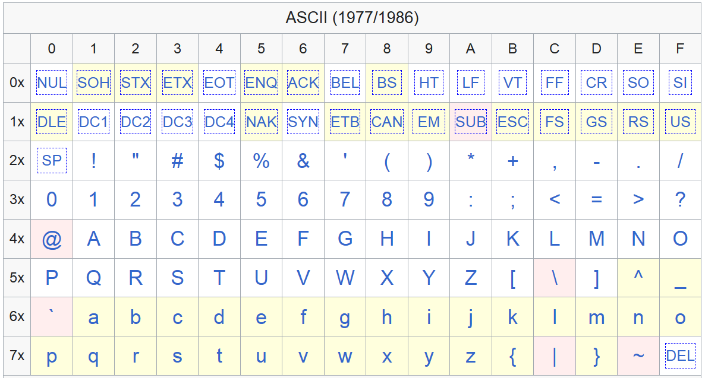

# 简明 C 标准库

<style>
    code {
      white-space : pre-wrap !important;
    }
</style>

<!-- prettier-ignore-start -->
!!! abstract "摘要"

    考虑到课程教学进度，本节课不再讲解 C 标准库的实现。
    
    本次辅学的目的是：
    
    -   按照考试要求，把标准库中大家应该知道的内容介绍一遍。
    -   结合一些应用的例子，串讲一下之前的语法重点。

    从历年卷来看，对标准库的考察内容仅限于下面的这些库，本节课也仅叙述下面这些库：

    -   `ctype.h`
    -   `stdio.h`
    -   `string.h`
    -   `stdlib.h`
    -   `math.h`
<!-- prettier-ignore-end -->

## 导引：C 标准库，学些什么？

### 为什么要学标准库？

有一个粗浅的理由，就是图方便。假设有下面这个声明在 `main` 函数中数组：

```c
int a[100];
```

我们知道，这个数组不会被初始化。如果想要把这个数组全部置为 0，你会怎么写呢？

首先会有的想法肯定是：

```c
for (int i = 0; i < 100; ++i)
    a[i] = 0;
```

其实标准库提供了一个函数 `memset`，用来设置一段内存的值：

```c
memset(a, 0, sizeof(a));
```

是不是很方便呢？

再来一个例子，把输入中所有的小写字母转换成大写字母。假设输入已经存储在 `char` 数组 `str` 中，根据现有的知识，你会不会这样写：

```c
for(int i = 0; i < strlen(str); ++i)
    if ('a' <= str[i] && str[i] <= 'z')
        str[i] -= 'a' - 'A';
```

其实标准库提供了判断字符大小写的函数，也提供了转换大小写的函数：

```c
for(int i = 0; i < strlen(str); ++i)
    if (islower(str[i]))
        str[i] = toupper(str[i]);
```

下面的这段代码，是不是比上面的代码简洁，并且一眼看过去就能明白意思呢？

<!-- prettier-ignore-start -->
!!! note "总而言之，C 标准库功能强大，它的重要性和语言本身一样。学会使用标准库，让你少造轮子，提高代码的可读性、简洁性和正确性。"
<!-- prettier-ignore-end -->

### 标准库里有什么？

<!-- prettier-ignore-start -->
!!! question "💡在你的印象中，标准库是什么样的？里面有什么东西？"
<!-- prettier-ignore-end -->

每一个标准库会定义这些内容：

-   类型定义
-   宏
-   函数

<!-- prettier-ignore-start -->
!!! example "几个耳熟能详的例子，你能说说它们是什么吗？"

    - `NULL`、`EOF`
    - `printf`、`scanf`
    - `FILE`
<!-- prettier-ignore-end -->

接下来的每一节是一个标准库，会分为**背景、内容、使用**三个部分。其中「背景」部分会介绍一些前置知识，「内容」部分会介绍标准库中的内容，「使用」部分会介绍一些使用的例子。「内容」 模块中代码段内被注释掉的内容，表示不作要求。

### 背景知识

为了能跟上接下来的内容，确认一下大家都有的知识：

-   会阅读函数原型/函数声明/函数签名（它们说的是一个东西）：
    ```c
    int main(void);
    ```
-   [指针](../../programming/topic/pointers.md) 的概念
    -   内存、内存地址、对象
    -   指针也是一个对象，它的值是一个内存地址
    -   指针具有类型信息，决定了指针的运算方式
    -   数组与指针
    -   多维数组比较复杂，等正文讲完还有时间再回来讲

## `<ctype.h>`

头文件 `<ctype.h>` 声明了几个可以用于**识别和转换字符**的函数。

### 背景：ASCII 字符集

ASCII 字符集中的数字和字母大家应该都很熟了，这边再对两类大家接触比较少的字符分类简单做个介绍。

-   打印字符：`0x20` ~ `0x7E`
-   控制字符：`0x00` ~ `0x1F` 和 `0x7F`



<!-- prettier-ignore-start -->
!!! tip "小提示"

    你真的需要去记这些字符的编码吗？

    选择填空之类的题目可能会考到，但也是有技巧的。你最多需要记忆的是大小写字母之间相差 32，但只要题目不是让你必须填数字，你就可以用 `'a' - 'A'` 来代替。
<!-- prettier-ignore-end -->

### 内容

这个头文件中只有函数，没有特别的类型和宏。

这些函数的意义和用法非常显然，因此我也不做注释。

-   字符判断函数
    ```c
    int isalnum(int c);
    int isalpha(int c);
    // int iscntrl(int c);
    int isdigit(int c);
    // int isgraph(int c);
    int islower(int c);
    // int isprint(int c);
    // int ispunct(int c);
    int isspace(int c);
    int isupper(int c);
    // int isxdigit(int c);
    ```
-   字符转换函数
    ```c
    int tolower(int c);
    int toupper(int c);
    ```

### 使用

`<ctype.h>` 中的函数对 ASCII 字符大致作了如下划分：

<!-- prettier-ignore-start -->
!!! note ""

    
<!-- prettier-ignore-end -->

控制字符那些不用管，不要求的函数不用管。只要记得 `isspace` 和 `isblank` 的区别就行了。

<!-- prettier-ignore-start -->
!!! note "`isspace` 和 `isblank` 的区别"

    - **空格**字符：`isblank` 仅判断空格 ` ` 和水平制表符 `\t`。
    - **空白**字符：`isspace` 判断空格 ` `、水平制表符 `\t`、换行符 `\n`、回车符 `\r`、换页符 `\f`、垂直制表符 `\v`。
<!-- prettier-ignore-end -->

### `<ctype.h>` 的实现：宏与位运算

<!-- prettier-ignore-start -->
!!! tip "阅读本节需要具备的知识"

    -   位运算
    
    知道可以用位来标志某些状态。与或非等位运算的概念。

    -   宏

    知道宏函数是怎么展开的。

    ??? note "不知道？速通一下！"

        首先你应该对二进制有一定概念。假如我们有 4 个二进制位 `0000`，我们就可以用它来标记 4 种状态。我们不妨设：

        -  第一位表示是否是数字
        -  第二位表示是否是小写字母
        -  第三位表示是否是大写字母
        -  第四位表示是否是字母

        （注意，最右侧的位是最低位，最左侧的位是最高位。）

        那么对于字符 `c`，我们可以用二进制串 `1010` 来表示它的属性。
        
        使用位运算和**掩码**可以判断属性。比如，我们要判断一个字符是否是数字，把它的串与掩码 `0001` 进行与运算。因为 `0001` 中前三位都是 `0`，结果肯定也是 `0`。而最后一位是 `1`，结果将由参与运算的串决定。掩码中的前三位好像把那些无关的位“掩盖”掉了。最后结果如果是零，那么就说明不具有该属性；如果非零，就说明具有该属性。

        接下来是宏。宏是纯粹的字符替换。如果宏使用了圆括号，那么它就是一个函数宏：

        ```c
        #define MEAN(X, Y) (((X) + (Y)) / 2)
        ```

        那么只要编译器看到代码中有 `MEAN` 后跟一个圆括号，就会开始匹配和替换。比如，`MEAN(1, 2)` 将被替换为 `(((1) + (2)) / 2)`、`MEAN(a, b)` 将被替换为 `(((a) + (b)) / 2)`。

!!! question "🤚停一停，先别看下面的内容。思考一下，你会怎么实现上面的那些函数？"

    你会不会在想这样的代码：

    ```c
    int isalnum(int c)
        { /* test for alphanumeric character */
        return (('0' <= c && c <= '9') ||
                ('a' <= c && c <= 'z') ||
                ('A' <= c && c <= 'Z'));
        }
    ```
<!-- prettier-ignore-end -->

`<ctype.h>` 中的函数通常使用宏来实现。使用宏实现时需要注意以下因素：

-   虽然宏可能比函数快，但是它们通常会产生更大的代码。如果在很多地方扩展，这个程序可能大到让你无法想象。
-   宏的参数可能会被求值多次，具有副作用的宏参数会导致意外。
    <!-- prettier-ignore-start -->
    !!! example "举个例子"

        ```c
        #define SQUARE(X) ((X) * (X))
        SQUARE(x++); // x++ * x++        
        ```

        使用者以为它只会让 `x` 自增一次，但是实际上它会让 `x` 自增两次。

    !!! warning "会产生不安全行为的宏"

        标准库中，只有 `getc` 和 `putc` 可能会产生这种不安全行为。
    <!-- prettier-ignore-end -->

`<ctype.h>` 中定义了一个查找表 `_Ctype`，两个映射表 `_Tolower` 和 `_Toupper`。每个字符都被编入查找表中，使用位运算就能判断出字符的类型。

```c title="ctype.h"
#define _DI 0x20 /* '0'-'9' */
#define _LO 0x10 /* 'a'-'z' */
#define _UP 0x02 /* 'A'-'Z' */
#define _XA 0x200 /* 'a'-'z', 'A'-'Z' */
extern const short *_Ctype, *_Tolower, *_Toupper;
#define isalnum(c) (_Ctype[(int)(c)] & (_DI|_LO|_UP|_XA))
#define tolower(c) _ToLower[(int)(c)]
```

<!-- prettier-ignore-start -->
!!! question "读一下上面的代码，想象一下 `_Ctype` 这个查找表的样子。"
!!! question "考考你，对于 ASCII 字符集，这个查找表有多大？"
!!! question "你能想一想映射表的实现吗？"
<!-- prettier-ignore-end -->

同样，给出函数版本的实现：

```c title="isalnum.c"
#include <ctype.h>

int isalnum(int c)
    { /* test for alphanumeric character */
    return (_Ctype[c] & (_DI|_LO|_UP|_XA));
    }
```

下面两幅图分别展示了 `_Ctype` 和 `_Toupper` 的样子：

<!-- prettier-ignore-start -->
::cards:: cols=2

[
  {
    "title": "`_Ctype`",
    "image": "graph/ctype.png"
  },
  {
    "title": "`_Toupper`",
    "image": "graph/toupper.png"
  }
]

::/cards::
<!-- prettier-ignore-end -->

非常地简单，对吧？这可比 `'a' <= c && c <= 'z'` 这样的判断要快得多。

## `<math.h>`

### 背景知识：函数的定义域与值域

<!-- prettier-ignore-start -->
!!! question "还记得 `double` 表示的范围吗？"

    

    从上图你可以看到，浮点数所能表示的数值，实际上是数轴上的一个个点。毕竟只有 64 个 bit 嘛，只能编码有限个点。

    `double` 类型（8 字节 IEEE 浮点数）所能表示的极限值为：

    -   最大正值：$1.7976931348623157 \times 10^{308}$
    -   最小正值：$2.2250738585072014 \times 10^{-307}$
<!-- prettier-ignore-end -->

我们都知道数学函数有定义域和值域，`<math.h>` 中的函数也有，只是大家平常使用的时候可能不太关注罢了。

-   如果函数的输入参数位于定义域外（比如 `asin` 输入了不在 $[-1, 1]$ 的值），会发生定义域错误。
-   如果结果不能被表示为 `double` 值，发生值域错误。上溢返回 `HUGE_VAL`，下溢返回 `0`。

<!-- prettier-ignore-start -->
!!! info "因为我们没有学 C 的错误处理，所以我们不知道怎么捕获这些错误。有兴趣的同学可以学习 `<error.h>` 中的内容。"
<!-- prettier-ignore-end -->
### 内容

-   宏
    ```c
    HUGE_VAL
    ```
<!-- prettier-ignore-start -->
!!! danger "GCC 定义的宏"
    
    ```c
    INFINITY
    NAN
    ```

    上面这两个宏起初不在标准库中，由 GCC 定义。
    
    > 据说在 C99 以后，`INFINITY` 被标准库纳入，我没有查证。
<!-- prettier-ignore-end -->
-   函数（仅举一些常用的
    ```c
    double acos(double x);
    double asin(double x);
    double atan(double x);
    double cos(double x);
    double sin(double x);
    double tan(double x);
    double exp(double x);
    double log(double x);
    double log10(double x);
    double pow(double x, double y);
    double sqrt(double x);
    double ceil(double x);
    double fabs(double x);
    double floor(double x);
    ```

### 使用

-   输入输出全都是 `double` 类型（注意隐式类型转换带来的影响）。
-   三角函数均为弧度制。角度到弧度的转换公式为：$\theta = \frac{\pi}{180} \times \alpha$。
-   没有 `PI` 这个宏。
    -   可以使用 `atan(1)*4` 代替。
    -   GCC 定义了一些数值宏，它们都以 `M_` 开头，比如 `M_PI`。它们默认为 `double` 类型。如果你需要其他精度，可以添加 `l` 后缀，比如 `M_PIl`。

## `<string.h>`

### 背景知识：字符串

**字符串**和**字符数组**一定要区别开来。字符串是以空字符 `\0` 结尾的字符数组。

```c
char name[13] = "StudyTonight";        
char name[10] = {'c','o','d','e','\0'}; 
```

<!-- prettier-ignore-start -->
!!! danger "`<string.h>` 的函数只负责操作字符串，不负责操作字符数组！"

    还记得数组传入函数的时候会退化成指针吗？函数无法获知数组的长度，因此空字符是帮助函数判断字符串结束、避免越界的**唯一方法**。

    当然，`strn` 系列函数提供了指定长度的参数。

!!! question "你能想起哪些东西是字符串吗？"

    -   用双引号引起的字符序列是字符串。编译器会自动添加空字符。
    -   `scanf` 使用 `%s` 读取的字符序列是字符串。`scanf` 会自动添加空字符。
    -   ......
<!-- prettier-ignore-end -->

### 内容

-   类型
    ```c
    size_t
    ```
-   宏
    ```c
    NULL
    ```
-   函数
    -   复制函数
        ```c
        void *memcpy(void *dest, const void *src, size_t n);
        void *memmove(void *dest, const void *src, size_t n);
        char *strcpy(char *dest, const char *src);
        char *strncpy(char *dest, const char *src, size_t n);
        ```
    -   连接函数
        ```c
        char *strcat(char *dest, const char *src);
        char *strncat(char *dest, const char *src, size_t n);
        ```
    -   比较函数
        ```c
        int memcmp(const void *s1, const void *s2, size_t n);
        int strcmp(const char *s1, const char *s2);
        int strncmp(const char *s1, const char *s2, size_t n);
        ```
    -   查找函数
        ```c
        void *memchr(const void *s, int c, size_t n);
        char *strchr(const char *s, int c);
        // size_t strcspn(const char *s1, const char *s2);
        // char *strpbrk(const char *s1, const char *s2);
        // char *strrchr(const char *s, int c);
        // size_t strspn(const char *s1, const char *s2);
        char *strstr(const char *s1, const char *s2);
        // char *strtok(char *s1, const char *s2);
        ```
    -   其他函数
        ```c
        void *memset(void *s, int c, size_t n);
        // char *strerror(int errnum);
        size_t strlen(const char *s);
        ```

### 使用

<!-- prettier-ignore-start -->
!!! warning "使用前，自己计算字符串长度和剩余空间，这是编程者的责任。或者使用带 `n` 的函数。"
<!-- prettier-ignore-end -->

-   有些函数可能返回空指针，记得测试返回的指针。

## `<stdlib.h>`

头文件 `<stdlib.h>` 是一个大杂烩，为了定义和声明那些没有明显归属的宏和函数。我们仅介绍常用的部分：整形数学、算法、文本转换、环境接口和存储分配。

### 背景：指针的概念

请看[指针笔记](../../programming/topic/pointers.md)。

这里再强调一下声明和 `malloc` 的区别：

<!-- prettier-ignore-start -->
!!! question "你能解释一下声明的时候内存发生了什么变动吗？"

    下面的代码段，每一行执行时，发生了什么？有内存被分配吗？

    ```c
    int p;
    int *q;
    q = &p;
    q = (int *)malloc(sizeof(int));
    ```
!!! question "有一位同学写出了下面这样错误的代码，你能指出错误吗？"

    ```c
    // 一个错误的链表头插入函数
    struct Node* create_linked_list() {
        struct Node* head = NULL;
        struct Node* current = (struct Node*)malloc(sizeof(struct Node));
        while (1) {
            int data;
            printf("请输入节点值（输入-1退出）：");
            scanf("%d", &data);
            if (data == -1) {
                break;
            }
            current->data = data;
            current->next = NULL;
            if (head == NULL) {
                head = current;
            } else {
                head->next = current;
            }
        }
        return head;
    }
    ```
<!-- prettier-ignore-end -->

### 内容

-   宏
    ```c
    RAND_MAX
    EXIT_FAILURE
    EXIT_SUCCESS
    ```
-   函数
    -   伪随机序列产生函数
    ```c
    int rand(void);
    void srand(unsigned int seed);
    ```
    -   整数算术函数
    ```c
    int abs(int n);
    div_t div(int numer, int denom);
    long labs(long n);
    ldiv_t ldiv(long numer, long denom);
    ```
    -   查找和排序函数
    ```c
    void *bsearch(const void *key, const void *base, size_t n, size_t size, int (*compar)(const void *, const void *));
    void qsort(void *base, size_t n, size_t size, int (*compar)(const void *, const void *));
    ```
    -   文本转换（好用的）
    ```c
    double atof(const char *str);
    int atoi(const char *str);
    long atol(const char *str);
    double strtod(const char *str, char **endptr);
    long strtol(const char *str, char **endptr, int base);
    unsigned long strtoul(const char *str, char **endptr, int base);
    ```
    -   环境通信（不介绍）
    ```c
    // void abort(void);
    // int atexit(void (*func)(void));
    // void exit(int status);
    // char *getenv(const char *name);
    // int system(const char *string);
    ```
    -   内存管理（重难点）
    ```c
    void *calloc(size_t nobj, size_t size);
    void free(void *ptr);
    void *malloc(size_t size);
    void *realloc(void *ptr, size_t size);
    ```
<!-- prettier-ignore-start -->
!!! danger "注意，内存拷贝函数却在 `<string.h>` 中。"
<!-- prettier-ignore-end -->
-   类型
    ```c
    div_t // int quot, rem;
    ldiv_t // long quot, rem;
    ```

### 使用

-   `rand` 和 `srand` 用于产生伪随机数。`srand` 用于设置随机数种子，`rand` 用于产生随机数。`rand` 产生的随机数范围是 $[0, RAND\_MAX]$。
-   `abs` 和 `labs` 用于求绝对值。`div` 和 `ldiv` 用于求商和余数。
-   `qsort` 的用例：
    ```c
    int cmpfunc (const void * a, const void * b) {
        return ( *(int*)a - *(int*)b );
    }
    qsort(values, 5, sizeof(int), cmpfunc);
    ```
-   文本转换函数非常好用。你再也不用写这样的代码了（当然 `atoi` 函数的具体实现要比这复杂得多）：
    ```c
    int atoi(char *str) {
        int res = 0;
        for (int i = 0; str[i] != '\0'; ++i)
            res = res * 10 + str[i] - '0';
        return res;
    }
    ```
-   `malloc` 记得参数是**字节数**，千万记得乘上 `sizeof`。为了防止自己忘记，也可以坚持使用 `calloc`。且它会自动初始化内存为 0。
-   `realloc` 相当于结合了 `malloc`、`memcpy` 和 `free` 的功能。

## `<stdio.h>`

<!-- prettier-ignore-start -->
!!! warning "关于文件输入输出......"

    这边列出了文件输入输出的内容，给大家复习的时候参考用。咱们这节课不讲。
<!-- prettier-ignore-end -->

### 背景知识：流

<!-- prettier-ignore-start -->
??? info "背景故事：早期计算机混乱的输入输出模型"

    早期程序的**输入输出无法独立于设备**。比如，在上个世纪 60 年代的 FORTRAN IV 中，在磁带机上需要用 `READ INPUT TAPE 5`，读取磁盘上需要用 `READ INPUT DISK 1`。这样的**代码在不同的设备上需要修改**，非常不方便。UNIX 系统将这些**混乱的设备交互封装**在设备处理程序中。在 UNIX 系统看来，外围设备有三种类型：字符设备（Character devices）、块设备（Block devices）和网络设备（Network devices）。这三种设备都被抽象为**文件**，使用统一的文件操作接口。

    在 Ken Thompson 为 UNIX 设计统一的内部文本形式前，文本表示也是十分混乱的。结束一行是使用回车还是回车加换行，还是换行符，还是更神奇的字符？终端能不能识别和展开制表符？怎样用键盘标志文件结束？**这些问题的答案和终端的生产厂商一样多**。UNIX 使用系统调用 `ioctl` 来设置一个设备的各种参数，负责**对内部换行约定和各种终端之间的需要转换的字符进行处理**。
<!-- prettier-ignore-end -->

#### 流的概念

各种输入输出设备实在是太多了（终端、磁带驱动器、结构化存储设备......）。为了统一概念，C 语言中的输入和输出设备全都和逻辑数据**流**相对应。

<!-- prettier-ignore-start -->
!!! note "流就是字符序列。"

    不管系统、硬件是怎么实现的。输入输出到了 C 程序这里，就统一为逻辑上的**流**了。
<!-- prettier-ignore-end -->

**流**关联到一个特定的文件。

#### 操作系统中的文件

计算机系统中的文件可以分为两类：

-   文本文件：如果一个文件中的二进制值都是用来表示字符的，那么这个文件就是文本文件。
-   二进制文件：如果一个文件中的二进制值代表其他数据，比如机器语言代码或者数值数据、图片或音乐，这个文件就是二进制文件。

二进制文件存储的内容比较复杂，操作系统不敢随意变动。但文本文件内容简单，各类操作系统早就有了自己的处理方式。

即使到今天，不同操作系统处理文本文件的方式仍然具有差异。

| 差异 | UNIX | Windows | MacOS |
| - | - | - | - |
| 换行符 | `\n`<br /> LF | `\r\n` <br />CRLF | `\n` (较早的 MacOS 使用 `\r`)<br />LF |
| 文件结束符 | `^D`<br />++ctrl+d++ | `^Z`<br />++ctrl+z++ | `^D`<br />++ctrl+d++ |

<!-- prettier-ignore-start -->
!!! danger "都是历史的锅！"

    甚至有的操作系统这样处理文本文件：

    -   要求文本文件中每一行的长度相同，否则用空白字符填充。
    -   在每行开始标出行的长度。
<!-- prettier-ignore-end -->

#### 流的类型

C 语言提供两种流：文本流和二进制流。

-   文本流：程序所见的内容可能和实际内容不同。如果将文件以文本模式打开，那么在读取文件时，会把本地环境表示的换行符或文件结尾映射为 C 语言中的 `\n` 和 `EOF`。
-   二进制流：程序所见的内容和实际内容一致。如果将文件以二进制模式打开，那么在读取文件时，会把文件中的每一个字节都映射为 C 语言中的 `char`。

<!-- prettier-ignore-start -->
!!! example "举个例子"

    这是一个 MS-DOS 上的文本文件。如果作为二进制流打开，程序会看见以下字节：

    ```text
    Rebecca clutched the\r\n
    jewel-encrusted scarab\r\n
    to her heaving bosom.\r\n
    ^Z
    ```

    如果作为文本流打开，程序会看见以下字节：
    
    ```text
    Rebecca clutched the\n
    jewel-encrusted scarab\n
    to her heaving bosom.\n
    ```
<!-- prettier-ignore-end -->


### 内容

-   类型
    ```c
    size_t
    FILE
    fpos_t
    ```
-   宏
    ```c
    stderr
    stdin
    stdout
    NULL
    EOF
    SEEK_CUR
    SEEK_END
    SEEK_SET
    // BUFSIZ
    // FOPEN_MAX
    // FILENAME_MAX
    ```
-   函数
    -   文件操作函数（不做要求）
    ```c
    // int remove(const char *filename);
    // int rename(const char *old, const char *new);
    // FILE *tmpfile(void);
    ```
    -   文件访问函数
    ```c
    int fclose(FILE *stream);
    // int fflush(FILE *stream);
    FILE *fopen(const char *filename, const char *mode);
    FILE *freopen(const char *filename, const char *mode, FILE *stream);
    // void setbuf(FILE *stream, char *buf);
    // int setvbuf(FILE *stream, char *buf, int mode, size_t size);
    ```
    -   格式化的输入输出函数
    ```c
    int fprintf(FILE *stream, const char *format, ...);
    int fscanf(FILE *stream, const char *format, ...);
    int printf(const char *format, ...);
    int scanf(const char *format, ...);
    int sprintf(char *str, const char *format, ...);
    int sscanf(const char *str, const char *format, ...);
    // int vfprintf(FILE *stream, const char *format, va_list arg);
    ```
    -   字符输入输出函数
    ```c
    // int fgetc(FILE *stream);
    // char *fgets(char *str, int n, FILE *stream);
    // int fputc(int c, FILE *stream);
    int fputs(const char *str, FILE *stream);
    // int getc(FILE *stream);
    int getchar(void);
    // char *gets(char *str);
    // int putc(int c, FILE *stream);
    int putchar(int c);
    int puts(const char *str);
    // int ungetc(int c, FILE *stream);
    ```
    -   直接输入输出函数（考试不管）
    ```c
    size_t fread(void *ptr, size_t size, size_t nobj, FILE *stream);
    size_t fwrite(const void *ptr, size_t size, size_t nobj, FILE *stream);
    ```
    -   文件定位函数（考试不管）
    ```c
    //int fgetpos(FILE *stream, fpos_t *pos);
    int fseek(FILE *stream, long offset, int origin);
    //int fsetpos(FILE *stream, const fpos_t *pos);
    long ftell(FILE *stream);
    void rewind(FILE *stream);
    ```
    -   错误处理函数（不做要求）
    ```c
    // void clearerr(FILE *stream);
    // int feof(FILE *stream);
    // int ferror(FILE *stream);
    // void perror(const char *str);
    ```

### 使用

以下是课内内容，仅列出，不做详细介绍：

-   `printf`/`scanf` 这几个格式化输入/输出函数的使用。
-   `%d`、`%p` 等转换说明的使用。
-   `\n`、`\r` 等常见转义序列的使用。
-   基本的打开、关闭文件 `fopen`、`fclose` 的使用。
-   `r`、`w`、`a` 等模式的使用。
-   在一个 `FILE` 中用 `fscanf`、`fprintf` 读写数据。
    -   `fread` 和 `fwrite` 课上应该会讲，但是编程也不会要求的。

下面对几个知识点作一点规范介绍：

<!-- prettier-ignore-start -->
!!! note "转换说明"

    规范的说明请看这里：
    
    -   [`printf`](https://zh.cppreference.com/w/c/io/fprintf)
    -   [`scanf`](https://zh.cppreference.com/w/c/io/fscanf)

    ??? note "`printf` 的转换说明"

        转换说明中，`%` 后面要跟 4 个组成部分。除了最后一个部分，其他都是可选的：

        ```c
        %[标志][最小字段宽度][.精度][h/l/L]指定转换类型的字符
        ```

        -   零或更多个**标志**，说明转换中的变化。

            | char | meaning |
            | :--: | :-----: |
            | `-`  | 左对齐（右侧填充空白） |
            | `+`  | 总是打印符号（包括正号） |
            | ` `  | 如果无符号，打印空格 |
            | `0`  | 用 0 填充 |
        -   一个可选的**最小字段宽度**：一个星号或者一个十进制整数。
        -   一个可选的**精度**：小数点后跟一个星号或一个十进制整数。
            -   如果是整数，表示最小数字位数。
            -   如果是浮点数，表示小数点后的最大位数。

        !!! example "举个例子"
        
    ??? note "`scanf` 的转换说明"

!!! tip "普遍误区"

    针对同学们普遍的误区做几点强调说明：

    -   `scanf`
        -   `%s` 只读取非空白字符，遇到空白字符就结束。
        -   `%c` 只读取一个字符，遇到空白字符也会读取。
        !!! note "还记得上面 `<ctype.h>` 刚刚讲的空白字符吗？"
        -   如果转换与字符匹配失败，**这个输入字符会留在输入流中**。在你下一次读取字符时，它可能会捣乱！
        -   这个函数的参数是什么类型？什么时候该加取值符 `&`？


!!! note "输入输出函数的返回值"

    大家平常使用可能不太关注。但还是有考察的可能：

    -   `printf`、`fprintf`、`sprintf`、`snprintf`
        -   正常：返回传输的字符数
        -   异常：返回负数
    -   `scanf`、`fscanf`、`sscanf`
        -   正常：返回成功匹配并赋值的输入项数
        -   异常：返回 `EOF`


??? note "文件定位（不做介绍）"

    - 三种修改文件定位符的可能：
        - `ungetc` 将字符退回流中（不要在 PTA 等 OJ 系统上使用！不要在生产环境中使用！）。总之，就是不建议碰这个东西。
        - `fseek`、`ftell`、`rewind`：较老的传统的文件定位函数
        - `fgetpos`、`fsetpos`、`rewind`：任意大小、结构的文件，使用 `fpos_t` 类型，它不能进行任何计算。
<!-- prettier-ignore-end -->