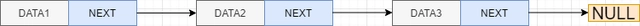

# 指针及链表相关知识点复习

<!-- prettier-ignore-start -->
!!! abstract "摘要"

    考虑到本次辅学时间已近期末，原先安排的介绍数据结构与算法的内容已经不太合适，因此本次辅学时间将主要介绍期末考试的部分重点知识，以讲解指针与链表为主。

    本次辅学的主要内容：

    - 结合历年卷复习指针的使用
    - 链表相关知识的复习

    其中我们辅学学长写的专题笔记 —— [专题笔记-指针概览](https://ckc-agc.bowling233.top/programming/topic/pointers/) 已经对指针进行了详细的介绍。本次辅学不会深挖指针的内存模型等细节，主要是针对历年卷题目，以及辅学群中同学们所问的指针相关的问题，进行以备考为目的的复习。
<!-- prettier-ignore-end -->

## 指针的基本操作

### 指针的声明

声明一个指针：

```c
VariableType *pointerName;
```

其中 `VariableType` 为指针指向的变量类型，`pointerName` 为指针的名称。

例如：`int *p;` 声明了一个指向 `int` 类型变量的指针，指针的名称为 `p`。

<!-- prettier-ignore-start -->
!!! info "注意"

    - `VariableType` 代表类型说明符，如 `int`、`char` 或者自己定义的 `struct` 等。
    - `*` 在指针声明中代表声明指针类型。注意：**`*` 在指针声明和指针使用中代表的含义不相同！！！！！**
    - `pointerName` 代表指针的名称，需要符合[标识符命名规范](https://zh.cppreference.com/w/c/language/identifier)。
<!-- prettier-ignore-end -->

<!-- prettier-ignore-start -->
!!! note "限定符对指针的限定"

    限定符在 C 语言中用于限定变量的类型，最常用的为 `const` 限定符。

    在指针声明中，限定符出现的位置决定了限定符是对指针本身的限定，还是对指针指向的变量的限定。

    ```c
    int n;
    const int * pc = &n; // pc 是指向 const int 的非 const 指针
    // *pc = 2; // 错误：不能通过不带转型的 pc 修改 n
    pc = NULL; // OK：pc 自身可修改
    
    int * const cp = &n; // cp 是一个指向非 const 的 int 的 const 指针
    *cp = 2; // OK：通过 cp 修改 n
    // cp = NULL; // 错误：cp 自身不能修改
    ```

    大体只需要记住：限定符会对紧随其后的对象进行限定即可。

    进阶一点的例子：

    ```c
    int * const * pcp = &cp; // 指向指向非 const 的 int 的 const 指针的非 const 指针
    ```
<!-- prettier-ignore-end -->

#### 多级指针的声明

对多级指针的声明，可以用递归的方式理解。

对于指向 `int` 类型的一级指针，其 `VariableType` 为 `int`；对于二级指针 `int **p`，即指向指向 `int` 类型的指针的指针，其 `VariableType` 为 `int *`。

<!-- prettier-ignore-start -->
!!! example "例"

    ```c
    int var = 1;
    int *p1 = &var;
    int **p = &p;
    ```

    他们的指向关系是：

    ```text
    (int **)p -> (int *)p1 -> (int)var
    ```
<!-- prettier-ignore-end -->

#### 指针数组与数组指针

很容易搞混，需要技巧来识别。

比如下面两条声明：

```c
char *p[10]; // 大小为 10 的数组，数组元素是指向 char 类型的指针

char (*p)[10]; // 指针，指向大小为 10 的 char 数组
```

牢记顺时针螺旋法则（Clockwise/Spiral Rule）（详见辅学群群文件中的“浅谈 C 语言的数据类型.pdf”）。

于是，上面的两条声明就可以公式化地解释：

- `char *p[10];`: p is an array 10 of pointers to char.
- `char (*p)[10];`: p is a pointer to an array 10 of char.

上一节的多级指针声明同样可以用这个法则进行解释。

### 指针的使用

#### 指针的解引用

解引用运算符 `*` 的一般形式为：

```c
* 指针表达式
```

结果为指代被指向对象的左值表达式，即可以被赋值。

记住 `a[b]` 等价于 `*(a + b)`。这个 trick 在一些题目中很有用。

<!-- prettier-ignore-start -->
!!! example "例题"

    Given the declaration: `int a[3][3]={1,2,3,4,5,6,7,8,9};` , the value of `a[-1][5]` is _____.

    ??? answer

        *解答来自：xg —— 程序设计辅学常问题目及解析v1.1.pdf*

        `a[-1]` 等价于 `*(a - 1)`，`a - 1` 会以 3 个 `int` 为单位向左移动，即

        ```text
            0 0 0 1 2 3 4 5 6 7 8 9
            ^
            |
        p = *(a - 1)
        ```

        令 `p = *(a - 1)`，则要求的值变为 `p[5]`，等价于 `*(p + 5)`。将上述指针右移 5 个 `int` 单位，得到 3。
<!-- prettier-ignore-end -->

<!-- prettier-ignore-start -->
!!! warning "野指针"

    当指针声明时未初始化，且还未被赋值，则这个指针指向无法确定，被称为 **野指针**。

    野指针可能指向任意内存，对其进行访问可能会导致非法内存访问，产生段错误。

    在考题中，尝试访问野指针是错误的操作。在自己写代码时也绝不能出现野指针访问。

    !!! example "例题"

        For the declarations: `char *s, str[10];` , statement _____ is completely correct.

        A. `strcpy(s, "hello");`

        B. `str="hello"+1`

        C. `s=*&(str+1)`

        D. `s=str+1`

        选项 A 就是经典的野指针访问。
<!-- prettier-ignore-end -->


#### 取址操作

取址运算符 `&` 早在大家学习输入输出的时候就已经接触过了。在使用 `scanf` 对 `int` 等类型的变量进行读入的时候，使用的是如下形式：

```c
int a;
scanf("%d", &a);
```

这里的 `&` 对 `a` 进行取址操作，对 `a` 的地址而不是 `a` 的值进行读入。

一般地，取址运算符有如下几种形式：

- `& <function>`：取函数的地址。这个不做要求。
- `& 左值表达式`：取左值表达式的地址。结果为指向左值表达式的指针。

    !!! info "左值表达式"
        左值，简单来说可以看作是在内存中有对应存储空间的表达式，如变量、数组元素、结构体成员等。

        相反，若表达式在内存中没有对应存储空间，则不能取址，比如 `&a`、`1+2` 等。

- `& * 表达式`：`&` 和 `*` 彼此抵消，均不求值。这个仅作了解。
- `& 表达式 [表达式]`：等价于 `& *(表达式 + 表达式)` 等价于 `表达式 + 表达式`。这个仅作了解。

<!-- prettier-ignore-start -->
!!! example "解引用与取址操作的应用"

    输入一个 64 位无符号整数 `x`，求 `x` 的二进制表示的 01 串所表示的 `double` 类型变量的值。

    ??? answer

        ```c
        unsigned long long x;
        scanf("%llu", &x);
        printf("%lf\n", *((double *)&x));
        ```

#### 通过指针进行成员访问

对于结构体类型的指针，C 语言提供了一个运算符 `->`，用于通过指针访问结构体成员。

```c
struct Point { int x, y; }; // 定义结构体 Point
struct Point point = { 1, 2 }; // 定义结构体变量 point

struct Point *p = &point; // p 指向 point 结构体
p->x = 3; // 通过指针 p 访问结构体成员 x
// 等价于 (*p).x = 3;
```

#### 数组到指针的隐式转换

<!-- https://zh.cppreference.com/w/c/language/conversion -->

<!-- prettier-ignore-start -->
!!! info "隐式转换"
    **数组到指针转换**
    
    任何数组类型的左值表达式，在用于异于下列语境时
    
    - 作为取址运算符的操作数
    - 作为 `sizeof` 的操作数
    - 作为 `typeof` 和 `typeof_unqual` 的操作数
    - 作为用于数组初始化的字符串字面量
     
    会经历到指向其首元素的非左值指针的转换。
    
    —— [cppreference-隐式转换](https://zh.cppreference.com/w/c/language/conversion)
<!-- prettier-ignore-end -->

简单来说：牢记数组名 **不等于** 指向数组首元素的指针，当数组名被取址运算符 `&` 作用，或者作为 `sizeof` 的操作数时，不会发生隐式转换。

这里要注意的一点是，将数组作为参数传给函数时，函数的形参只能是指针，而不能是数组，此时数组名会发生隐式转换。

<!-- prettier-ignore-start -->
!!! info "数组类型用于函数形参"

    当数组类型用于函数形参列表时，它会转换成对应的指针类型：`int f(int a[2])`、`int f(int a[])`、`int f(int *a)` 声明同一个函数。
    
    因为函数实际参数类型为指针类型，使用数组实参的函数调用会进行一个数组到指针转换；被调用函数无法获得实参数组的大小，必须显式传递。

    见 [每日一题-29](https://ckc-agc.bowling233.top/programming/daily/2023/#29-soyo-size)。

    <!-- prettier-ignore-start -->
    !!! warning

        只有数组类型用于函数形参列表时，`a[]` 和 `*a` 才是等价的。

        比如使用字符串常量初始化字符串：

        创建指向字符串常量的指针，内容不能更改，

        ```c
        char *s = "hello"; // s 类型为 char * ，指向字符串常量
        s = "he11o"; // OK
        ```

        创建 char 数组，内容被字符串常量初始化，内容可以更改，

        ```c
        char s[] = "hello"; // s 类型为 char [6] ，数组内容是 "hello\0" 的拷贝
        // s[] = "he11o"; // wrong
        ```
    <!-- prettier-ignore-end -->
<!-- prettier-ignore-end -->

<!-- prettier-ignore-start -->
!!! question
    下列代码的 `val_x` 和 `val_y` 的类型一样吗？

    ```c
    int a[10], *p = a;
    Type1 val_x = &a;
    Type2 val_y = &p;
    ```
<!-- prettier-ignore-end -->

<!-- prettier-ignore-start -->
!!! question
    下列代码的 `size_x` 和 `size_y` 大小一样吗？

    ```c
    int a[10], *p = a;
    size_t size_x = sizeof a;
    size_t size_y = sizeof p;
    ```
<!-- prettier-ignore-end -->

### 指针的值与指针的地址

<!-- 指针之间的比较。指针本质是数据类型，可以取址 -->

指针的值，又称为指针所指向的内存区。

在计算机中，内存中的所有字节都拥有一个唯一编号，也即内存地址。指针指向某一数据的地址，即指针变量存储了这个数据的内存地址的编号。

<!-- prettier-ignore-start -->
!!! info "指针所占的字节数"

    现在一般的计算机基本都是 64 位系统，使用 64 位长的内存地址，即内存地址的编号是一个 64 位整数。在 64 位系统中使用 `sizeof` 运算符求指针的大小时，得到的结果为 8。
<!-- prettier-ignore-end -->

注意，一般来说无法预测地址的值，因为内存地址取决于系统的内存分配情况。但部分情况下可以确定内存地址的相对位置，比如同一数组中元素在内存中连续。

此外，指针同样也是一个在内存中有对应存储空间的变量，也有自己的内存地址。在指针的内存地址中，存储的内容是其指向的内容的内存地址。

<!-- prettier-ignore-start -->
!!! info "类比理解"

    假如有一个很长的数组，存储了一些数据，我们可以使用数组下标去访问数据。将数组下标当作数据存储在数组中，那么我们就可以从数组中的某一位置去访问其存储的数组下标的位置的数据，这就可以看作是简单的指针。

    ```text
    下标    31       32       33       34      ...     X
    arr   data0    data1    data2    data3    ....    32
                     ^                                |
                     +--------------------------------+
    ```
<!-- prettier-ignore-end -->

<!-- prettier-ignore-start -->
!!! question

    那么就有同学问了：既然指针的值是 64 位整数，那能用关系运算符比较大小吗？

    答案是：部分情况下可以。

    ??? info "关系运算符进行指针比较"

        根据 [cppreference-比较运算符](https://zh.cppreference.com/w/c/language/operator_comparison)，当进行指针比较的时候，有以下要求：

        两指针必须是兼容类型的指针。且满足以下条件之一：

        - 两个指针指向同一对象，或指向同一数组的尾后一位置，则相等。
        - 两个指针指向同一数组中的不同元素，则指向有较大下标的元素的指针比较大。（同一数组中，指向数组尾后一位置的指针最大）
        - 两个指针指向同一结构体的成员，则指向结构体声明中较后声明的成员的指针更大。
        - 指向同一联合体成员的指针比较相等。这个不做要求。

        除此之外，指针的比较结果是未定义的。
<!-- prettier-ignore-end -->

!!! info "指针的计算"

    涉及指针的加减只有两种情况：

    - 指针类型 +/- 整数类型 `p + a` 或 `p - a`

        结果为指针 `p` 右移/左移 `a` 个单位，单位由指针的类型决定。

        比如读入数组时可以使用：`scanf("%d", arr + i)`。

    - 相同类型的指针相减

        结果为两指针之间差了多少单位距离，而不是指针的值相减。

    <!-- prettier-ignore-start -->
    !!! question "例题"

        以下代码的输出为 _____。

        ```c
        int a[] = {1, 2, 3, 4, 5};
        int *p = a, *q = &a[2];
        printf("%lu\n", q - p);
        ```
    <!-- prettier-ignore-end -->
<!-- prettier-ignore-end -->

### 一些题目

<!-- prettier-ignore-start -->
!!! question "题目 1"

    The following code fragment will output _____.

    ```c
    char *week[]={"Mon", "Tue", "Wed", "Thu", "Fri", "Sat", "Sun"}, **pw=week;
    char c1, c2;
    c1 = (*++pw)[1];
    c2 = *++pw[1];
    printf("%c#%c#", c1, c2);
    ```

    <!-- prettier-ignore-start -->
    ??? answer

        ```text
               "Mon\0"   "Tue\0"   "Wed\0"   "Thu\0"   "Fri\0"   "Sat\0"   "Sun\0"
                ^         ^         ^         ^         ^         ^         ^
                |         |         |         |         |         |         |
        week: week[0]   week[1]   week[2]   week[3]   week[4]   week[5]   week[6]
                ^
                |
               pw
        ```
    <!-- prettier-ignore-end -->
<!-- prettier-ignore-end -->

<!-- prettier-ignore-start -->
!!! question "题目 2"

    For definitions:
    
    ```c
    char s[2][3] = {"ab", "cd"}, *p = (char *)s;
    ```

    the expression _____ is correct and its value is equivalent to the element `s[1][1]`.

    A. `*(s + 3)`

    B. `*s + 2`

    C. `p[1][1]`

    D. `*++p + 2`

    <!-- prettier-ignore-start -->
    ??? answer

        ```text
        s:    "ab\0"     "cd\0"
              ^
              |
        s(隐式转换)(char *[3])

        s:    "ab\0"     "cd\0"
               ^
               |
          p = (char *)s
        ```
    <!-- prettier-ignore-end -->
<!-- prettier-ignore-end -->

## 链表

### 基础知识和总结

链表是一种常用的数据结构，它通过节点的形式存储数据。每个节点包含数据部分和指向下一个节点的指针。链表可以是单向的也可以是双向的，我们先看看单向链表：

!!! example "单向链表的一种定义方式"
    ```c
    typedef struct Node {
        int data;
        struct Node* next;
    } Node;
    ```

好了，我们已经把链表给定义出来了。但是你会好奇，我们不是只定义出了节点吗？怎么已经定义完了？事实上，这几乎就已经是链表的完整结构了——因为链表就是简单的**链表节点的串联**。

大家都已经知道了链表的结构，是类似于下面这样的：



所以，链表其实就是以下的东西的结合：

- 一个指向头结点的**指针** `head` ，告诉我们从哪里开始遍历整个链表。
- 头节点指向的下一个节点 `head->next` 。注意这也是一个**指针**。
- 头节点指向的下一个节点的下一个节点 `head->next->next`。
- ...
- 最后一个节点。

我们怎么知道最后一个节点是什么呢？我们规定，最后一个节点指向的位置就是 `NULL`，也就是 `0`。这样，只要判断节点的 `.next` 是否是 `NULL`，就可以知道这个节点是不是尾节点了。好了，所以我们只需要若干个 `Node`，然后将他们串联——也就是通过 `next` 连接，就得到了一个完整的链表。

接下来让我们回忆一下链表的各种操作的实现吧！不过大家在平时做题的时候应该都感觉到了，链表有很多很多难以琢磨的细节和特殊情况！怎么办呢？冷静下来总结，无非就是这几种：

- 特殊情况 $1$：如果头指针指向的是`NULL`，也就是链表本身就为空了。
- 特殊情况 $2$：如果当前操作在头节点进行。
- 特殊情况 $3$：如果当前操作在尾节点进行。

这些情况如果没有考虑清楚，很可能在写代码的过程中出现 `segmentation fault`，也就是段错误。这极大概率是因为，你**访问了 `NULL` 位置的一些信息**。比如当前节点指针 `p` 指向了 `NULL`，但是你却访问了 `p->data` 或者 `p->next`，就会报错了。

### 单向链表的各种经典操作

!!! example "创建一个节点 `p`，其权值为 `w`，并返回这个节点的指针"
    
    只需要使用 `malloc` 即可。

    ```c
    Node *create(int w){
        Node* newNode = (Node*)malloc(sizeof(Node));
        newNode->next = NULL;
        newNode->data = w;
        return newNode;
    }
    ```

    !!! note "一个细节"
    
        注意，`malloc` 函数内部需要开的节点大小是 `sizeof(Node)` 而不是 `sizeof(Node*)*`，想想为什么？


!!! example "在链表的头部/尾部插入一个节点 `p`，并返回新链表的头部"

    先看头部插入。
    
    首先，特殊情况 $1$，原先链表是空的，那肯定是把 `head` 赋值为新节点嘛。
    
    发现只剩下特殊情况 $2$，那 `head` 也要赋值为新节点，然后新节点连向老 `head` 。
    
    ```c
    Node *insertAtHead(Node* head, Node* p) {
        if (!head) return p;
        p->Next = head;
        return p;
    }
    ```
    
    !!! question "一个细节"
        为什么 `if` 里是 `!head`？
    
    然后是尾部插入。首先还是特殊情况 $1$，处理完以后只剩下特殊情况 $3$ ，那么我们只需要找到尾节点，就可以直接插入了，最后返回的也只是原本的 `head`。

    ```c
    Node *insertAtEnd(Node* head, Node* p) {
        if (!head == NULL) return p;
        Node* last = head;
        while (last->next) {
            last = last->next;
        }
        last->next = p;
        return head;
    }
    ```

!!! example "删除权值为 `w` 的节点，如果有多个，则删除最靠近开头的，没有则不删除，返回新链表的头部"

    最繁琐最复杂的一个操作，也是新手的噩梦。不过按照三步走就好了。
    
    先处理一下特殊情况 $1$ 。
    
    ```c
    Node *deleteNode(Node* head, int key) {
        if (!head) return NULL;
    }
    ```
    
    然后情况 $2$ 呢，头结点会发生变化。
    
    ```c
    Node *deleteNode(Node* head, int key) {
        if (!head) return NULL;
        if (head->data == key){
            node* tmp = head->next; //这么做是因为 free 以后，head->next 就不能获取了。
            free(head);
            return tmp;
        }
    }
    ```
    
    剩下情况 $3$ 还要特殊判断。我们先找到要删除的位置。回忆一下删除的过程，我们需要记录当前需要被删除的节点的指针 `prev`：
    
    
    
    ```c
    Node *deleteNode(Node* head, int key) {
        if (!head) return NULL;
        if (head->data == key){
            node* temp = head->next; //这么做是因为 free 以后，head->next 就不能获取了。
            free(head);
            return tmp;
        }
        node* temp = head;
        while (temp && temp->data != key) {
            prev = temp;
            temp = temp->next;
        }
        if (!temp) return head;
        prev->next = temp->next; //事实上直接删除就好了，不需要关系情况 3 了，不过特判一下也不错。
        free(temp);
        return head;
    }
    ```

!!! info "注意！"

    理论考试写代码的时候，**一定不要忘记 `free` 被删除的节点！！！小心扣分！！！**
    
    上机不 free 倒是没关系（指还能通过），但还是建议养成良好的习惯，防止内存泄漏！

### 双向链表

其实没什么可以讲的，也就是在 `struct` 的定义中加入了 `prev`，可以让我们方便的获取上一个节点的指针，这样删除过程中就不需要单独开变量记录了。


!!! example "双向链表的一种定义方式"
    ```c
    typedef struct Node {
        int data;
        struct Node* prev, next;
    } Node;
    ```

特别的，头结点的 `prev` 是 `NULL`。

看一个简单的例题吧~

!!! question "题目 3"

    To delete `p` from a **doubly linked list**, we must do:

    A. `p->prev=p->prev->prev; p->prev->next=p;`
    
    B. `p->next->prev=p; p->next=p->next->next;`
    
    C. `p->prev->next=p->next; p->next->prev=p->prev;`
     
    D. `p->next=p->prev->prev; p->prev=p->next->next;`

    ??? answer

        C.

## 栈和队列

这一部分的内容相信大家在课上已经有很好的理解了，但是会出一些和链表结合的有难度的理论题和编程题，所以简单带过一下：

通常题目会使用**单向链表**来实现栈和队列。不过很多题目其实会不告诉你，链表哪一段表示栈顶，哪一段表示队头，哪一段表示队尾。

!!! question "一个问题"

    如果是双向链表其实没有这么多烦恼，但是现在是单向的。怎么判断链表的头代表栈/队列的哪个部分呢？
    
    栈顶其实很简单，我们只需要记录一下链表的头指针 `head`，在上面操作，可以直接完成对栈的模拟，所以链表的头代表栈顶。
    
    那队列呢？我们不妨试一下，假设链表头部代表队尾，那么队列的入队操作很好实现，但是，出队需要在链表尾部进行操作。有一个很直观的方法就是同时记录并维护链表的尾指针 `tail`，但是，删除的话，我们需要知道尾指针的前驱节点...

所以一些题目的实现，默认了**链表的头部代表队头**。看一下这个题目：


!!! question "题目 4"

    Represent a queue by a singly linked list. Given the current status of the linked list as `1->2->3` where `x->y` means `y` is linked after `x`. Now if `4` is enqueued and then a dequeue is done, the resulting status must be:
    
    A. `1->2->3`
    
    B. `2->3->4`
    
    C. `4->1->2`
    
    D. the solution is not unique

    ??? answer

        B.

这里需要额外提一个叫做**循环队列**的东西。它是队列的一种变体，通常使用数组来实现，用来节约队列的空间。 循环队列是把顺序队列首尾相连，把存储队列元素的表从逻辑上看成一个环。通常用两个变量代表当前循环队列存储的空间：一个是尾 `rear`，一个是头` front`。不过这个是开区间还是闭区间呢，还得看具体实现方式和题干要求，大家最好翻翻老师的 PPT，看看上课是怎么实现的，万一题目没有给出实现方式就按照老师讲的为主吧。

!!! question "题目 5"

    Suppose that an array of size 6 is used to store a circular queue, and the values of front and rear are 0 and 4, respectively. Now after 2 dequeues and 2 enqueues, what will the values of front and rear be?
    
    A. `2 and 0`
    
    B. `2 and 2`
    
    C. `2 and 4`
    
    D. `2 and 6`
    
    ??? answer

        A.


关于编程部分，我们来看一下这个[每日一题](https://ckc-agc.bowling233.top/programming/daily/2023/#5-monotonic-stacks)。
